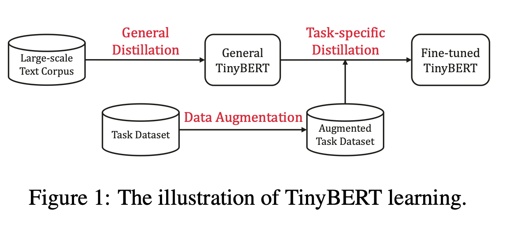
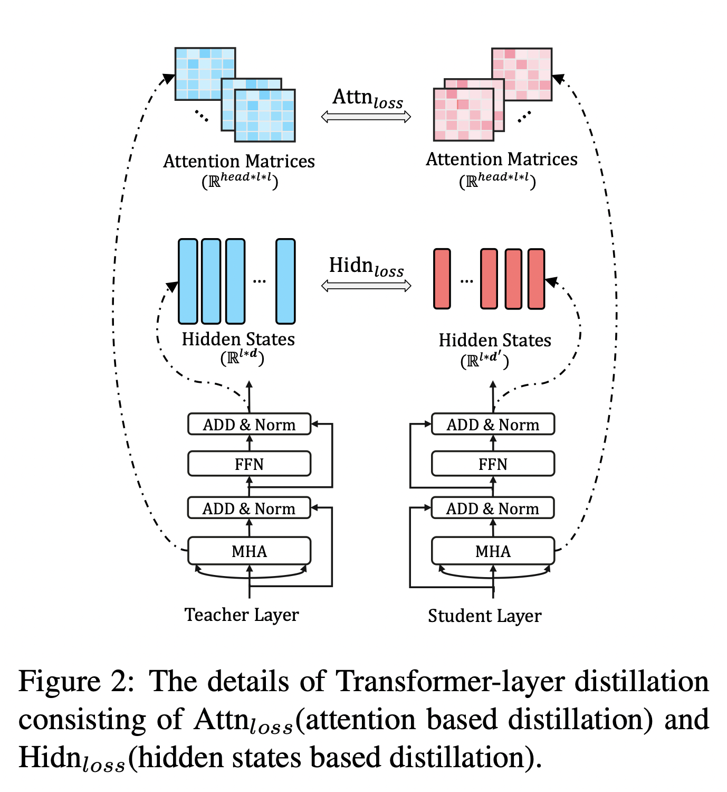
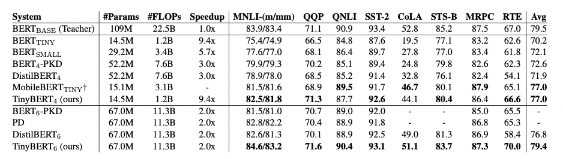

# TinyBERT

## 1. TinyBERT 简介

论文地址：[TinyBERT: Distilling BERT for Natural Language Understanding
](https://arxiv.org/pdf/1909.10351.pdf)

预训练模型的提出，比如BERT，显著的提升了很多自然语言处理任务的表现，它的强大是毫无疑问的。但是他们普遍存在参数过多、模型庞大、推理时间过长、计算昂贵等问题，因此很难落地到实际的产业应用中。TinyBERT是由华中科技大学和华为诺亚方舟实验室联合提出的一种针对transformer-based模型的知识蒸馏方法，以BERT为例对大型预训练模型进行研究。四层结构的 $TinyBERT_{4}$ 在 GLUE benchmark 上可以达到 $BERT_{base}$ 96.8%及以上的性能表现，同时模型缩小7.5倍，推理速度提升9.4倍。六层结构的 $TinyBERT_{6}$ 可以达到和 $BERT_{base}$ 同样的性能表现。

图1: TinyBERT learning
  

TinyBERT主要做了以下两点创新：

1. 提供一种新的针对 transformer-based 模型进行蒸馏的方法，使得BERT中具有的语言知识可以迁移到TinyBERT中去。
2. 提出一个两阶段学习框架，在预训练阶段和fine-tuning阶段都进行蒸馏，确保TinyBERT可以充分的从BERT中学习到一般领域和特定任务两部分的知识。

## 2. 模型实现

### 知识蒸馏

知识蒸馏的目的在于将一个大型的教师网络 $T$ 学习到的知识迁移到小型的学生网络 $S$ 中。学生网络通过训练来模仿教师网络的行为。$f^S$ 和 $f^T$ 代表教师网络和学生网络的behavior functions。这个行为函数的目的是将网络的输入转化为信息性表示，并且它可被定义为网络中任何层的输出。在基于transformer的模型的蒸馏中，MHA（multi-head attention）层或FFN（fully connected feed-forward network）层的输出或一些中间表示，比如注意力矩阵 $A$ 都可被作为行为函数使用。

$$
L_{KD} = \sum_{x \in X}L(f^S(x), f^T(x))
$$

其中 $L(\cdot)$ 是一个用于评估教师网络和学生网络之间差异的损失函数，$x$ 是输入文本，$X$ 代表训练数据集。因此，蒸馏的关键问题在于如何定义行为函数和损失函数。

### Transformer Distillation

假设TinyBert有M层transformer layer，teacher BERT有N层transformer layer，则需要从teacher BERT的N层中抽取M层用于transformer层的蒸馏。$n = g(m)$ 定义了一个从学生网络到教师网络的映射关系，表示学生网络中第m层网络信息是从教师网络的第g(m)层学习到的，也就是教师网络的第n层。TinyBERT嵌入层和预测层也是从BERT的相应层学习知识的，其中嵌入层对应的指数为0，预测层对应的指数为M + 1，对应的层映射定义为 $0 = g(0)$ 和 $N + 1 = g(M + 1)$。在形式上，学生模型可以通过最小化以下的目标函数来获取教师模型的知识：

$$
L_{model} = \sum_{x \in X}\sum^{M+1}_{m=0}\lambda_m L_{layer}(f^S_m(x), f^T_{g(m)}(x))
$$

其中 $L_{layer}$ 是给定的模型层的损失函数（比如transformer层或嵌入层），$f_m$ 代表第m层引起的行为函数，$\lambda_{m}$ 表示第m层蒸馏的重要程度。

TinyBERT的蒸馏分为以下三个部分：transformer-layer distillation、embedding-layer distillation、prediction-layer distillation。

**Transformer-layer Distillation**

Transformer-layer的蒸馏由attention based蒸馏和hidden states based蒸馏两部分组成。

图2: Transformer-layer distillation
  

其中，attention based蒸馏是受到论文[Clack et al., 2019](https://arxiv.org/pdf/1906.04341.pdf)的启发，这篇论文中提到，BERT学习的注意力权重可以捕获丰富的语言知识，这些语言知识包括对自然语言理解非常重要的语法和共指信息。因此，TinyBERT提出attention based蒸馏，其目的是使学生网络很好地从教师网络处学习到这些语言知识。具体到模型中，就是让TinyBERT网络学习拟合BERT网络中的多头注意力矩阵，目标函数定义如下：

$$
L_{attn} = \frac{1}{h}\sum^{h}_{i=1}MSE(A^S_i, A^T_i)
$$

其中，$h$ 代表注意力头数，$A_i \in \mathbb{R}^{l\times l}$ 代表学生或教师的第 $i$ 个注意力头对应的注意力矩阵，$l$ 代表输入文本的长度。论文中提到，使用注意力矩阵 $A$ 而不是 $softmax(A)$ 是因为实验结果显示这样可以得到更快的收敛速度和更好的性能表现。

hidden states based蒸馏是对transformer层输出的知识进行了蒸馏处理，目标函数定义为：

$$
L_{hidn} = MSE(H^SW_h, H^T)
$$

其中，$H^S \in \mathbb{R}^{l \times d^{'}},\quad H^T \in \mathbb{R}^{l \times d}$ 分别代表学生网络和教师网络的隐状态，是FFN的输出。$d$ 和 $d^{'}$ 代表教师网络和学生网络的隐藏状态大小，且 $d^{'} < d$，因为学生网络总是小于教师网络。$W_h \in \mathbb{R}^{d^{'} \times d}$ 是一个可训练的线性变换矩阵，将学生网络的隐藏状态投影到教师网络隐藏状态所在的空间。

**Embedding-layer Distillation**

$$
L_{embd} = MSE(E^SW_e, E^T)
$$

Embedding loss和hidden states loss同理，其中 $E^S,\quad E^T$ 代表学生网络和教师网络的嵌入，他呢和隐藏状态矩阵的形状相同，同时 $W_e$ 和 $W_h$ 的作用也相同。

**Prediction-layer Distillation**

$$
L_{pred} = CE(z^T/t, z^S/t)
$$

其中，$z^S, \quad z^T$ 分别是学生网络和教师网络预测的logits向量，$CE$ 代表交叉熵损失，$t$ 是temperature value，当 $t = 1$时，表现良好。

对上述三个部分的loss函数进行整合，则可以得到教师网络和学生网络之间对应层的蒸馏损失如下：

$$
\begin{equation}
L_{layer} = 
\left\{
			\begin{array}{lr}
			L_{embd}, & m=0 \\
			L_{hidn} + L_{attn}, & M \geq m > 0 \\
			L_{pred}, & m = M + 1
			\end{array}
\right.
\end{equation}
$$

## 3. 实验结果

图3: Results evaluated on GLUE benchmark
  

作者在GLUE基准上评估了TinyBERT的性能，模型大小、推理时间速度和准确率如图3所示。实验结果表明，TinyBERT在所有GLUE任务上都优于 $BERT_{TINY}$，并在平均性能上获得6.8%的提升。这表明论文中提出的知识整理学习框架可以有效的提升小模型在下游任务中的性能。同时，$TinyBERT_4$ 以~4%的幅度显著的提升了KD SOTA基准线（比如，BERT-PKD和DistilBERT），参数缩小至~28%，推理速度提升3.1倍。与teacher $BERT_{base}$ 相比，TinyBERT在保持良好性能的同时，模型缩小7.5倍，速度提升9.4倍。

