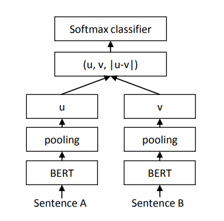
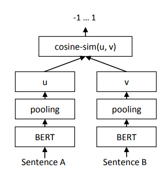
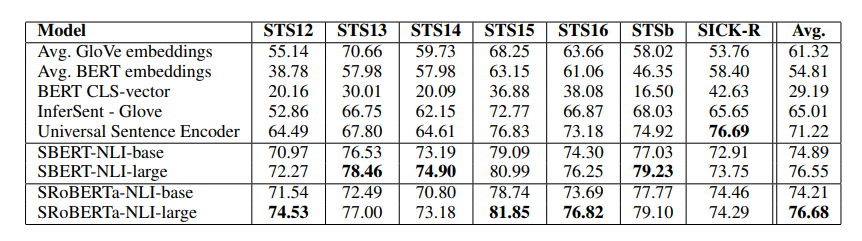
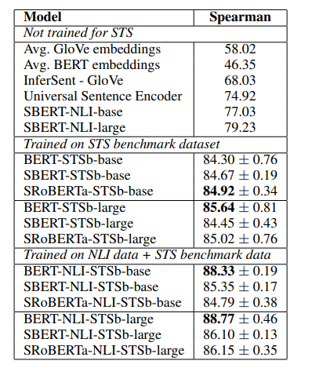
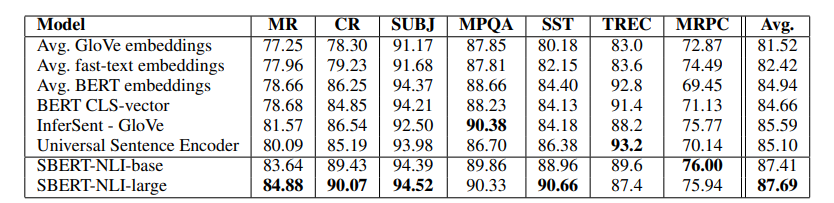
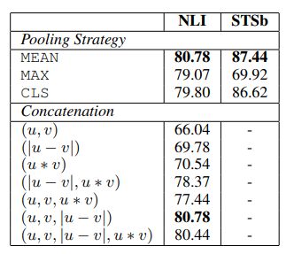

# Sentence-BERT
## 1介绍
[Bert模型](https://paddlepedia.readthedocs.io/en/latest/tutorials/pretrain_model/bert.html#)已经在NLP各大任务中都展现出了强者的姿态。在语义相似度计算（semantic textual similarity）任务上也不例外，但是，由于bert模型规定，在计算语义相似度时，需要将两个句子同时进入模型，进行信息交互，这造成大量的计算开销,使得它既不适合语义相似度搜索，也不适合非监督任务，比如聚类。

例如，有10000个句子，我们想要找出最相似的句子对，需要计算（10000*9999/2）次，需要大约65个小时。

而Sentence-BERT网络结构可以解决bert模型的不足。简单通俗地讲，就是借鉴孪生网络模型的框架，将不同的句子输入到两个bert模型中（但这两个Bert模型是参数共享的，也可以理解为是同一个Bert模型），获取到每个句子的句子表征向量；最终获得的句子表征向量，可以用于语义相似度计算，也可以用于无监督的聚类任务。

对于同样的10000个句子，我们想要找出最相似的句子对，只需要计算10000次，需要大约5秒就可计算完全。

## 2模型
Sentence-BERT网络结构中定义了三种通过bert模型求句子向量的策略，分别是CLS向量，平均池化和最大值池化。
- CLS向量策略，就是将bert模型中，模型输出起始标记[CLS]的字向量，作为整句话的句向量。
- 平均池化策略，就是将句子通过bert模型得到的句子中所有的字向量进行求均值操作，最终将均值向量作为整句话的句向量。
- 最大值池化策略，就是将句子通过bert模型得到的句子中所有的字向量进行求最大值操作，最终将最大值向量作为整句话的句向量。

并且在对bert模型进行微调时，设置了三个目标函数，用于不同任务的训练优化，具体如下：

### 2.1分类目标函数（Classification Objective Function）
如下图所示，分别获得两句话的句子向量$u$和$v$，并将$u$、$v$和二者按位求差向量$|u-v|$进行拼接，再将拼接好的向量乘上一个可训练的权重 $|W_{t} \in R^{3n * k}|$，其中，$n$为句子向量的维度，$k$为分类的类别个数，目标函数如下：

$o=softmax(W_{t}(u,v,|u-v|))$

### 2.2回归目标函数（Regression Objective Function）
如下图所示，目标函数是，直接对两句话的句子向量$u$和$v$计算余弦相似度。

### 2.3三元目标函数（Triplet Objective Function）

在这个目标函数下，将模型框架进行修改，将原来的两个输入，变成三个句子输入。给定一个锚定句（anchor sentence）$a$，一个肯定句(positive sentence)$p$和一个否定句(negative sentence)$n$，模型通过使$a到p$的距离小于$a到n$的距离，来优化模型。使其目标函数$o$最小，即

$$o=max(||s_{a}-s_{p}||-||s_{a}-s_{n}||+\varepsilon,0)$$

其中，$s_{a}$、$s_{p}$和$s_{n}$分别表示句子$a$、$p$和$n$的向量，$||·||$表示距离度量，$\varepsilon$表示边距。在论文中，距离度量为欧式距离，边距大小为1。

### 2.4训练参数
模型训练过程中，批次大小为16，学习率为2e-5，采用Adam优化器进行优化，并且默认的池化策略为平均池化。

## 3结果
### 3.1文本相似度任务
文本相似度任务评估，分别包含无监督测试和有监督测试。无监督测试，即不使用下游任务中的数据对模型进行微调，结果如下图所示，相较于GloVe句向量或原始BERT的句向量，均取得了更好地效果。

有监督测试，即使用下游任务中的数据对模型进行微调，结果如下图所示，可以发现有监督效果更好，并且采用Roberta模型初始化参数的模型，比BERT模型要好。

## 3.2文本分类任务
为了验证模型输出结果作为词嵌入的好还，将其在分类任务上进行测试，即将模型当作词嵌入，并训练分类任务时，不对Sentence-Bert模型参数进行训练，只训练全连接分类参数。结果如下图所示，相较于GloVe句向量或原始BERT的句向量，均取得了更好地效果。

### 3.3参数比较
比较了不同池化策略以及向量拼接的效果，如下图所示，发现平均池化的效果最好，并在训练时将将$u$、$v$和二者按位求差向量$|u-v|$进行拼接的效果最好。

## 4总结
Sentence-Bert做了大量的实验，比较三种求句子向量策略的好坏，认为平均池化策略最优，并且在多个数据集上进行了效果验证。虽然效果没有bert输入两句话的效果好，但是比其他方法还是要好的，并且速度很快，对于工业界很有实用价值。

## 5参考
- [Sentence-BERT: Sentence Embeddings using Siamese BERT-Networks](https://arxiv.org/pdf/1908.10084.pdf)