# SimCSE

**句向量表征技术**一直都是NLP领域的热门话题，在BERT前时代，一般都采用word2vec训练出的word-embedding结合pooling策略进行句向量表征，或者在有训练数据情况下，采用TextCNN/BiLSTM结合Siamese network策略进行句向量表征。在BERT时代，人们借助预训练语言模型的固有优势，一般采用BERT模型的[CLS]向量（即句子的起始字符向量）作为句向量表征；**SimCSE**采用对比学习的方法，进行句向量表征，在BERT模型上获取更好的句向量表征，详细介绍如下：

## 1.介绍
SimCSE（simple contrastive
sentence embedding framework），即**简单的对比句向量表征框架**。SimCSE共包含了无监督和有监督的两种方法。**无监督方法**，采用[dropout技术](https://paddlepedia.readthedocs.io/en/latest/tutorials/deep_learning/model_tuning/regularization/dropout.html)，对原始文本进行数据增强，从而构造出正样本，用于后续对比学习训练；**监督学习方法**，借助于文本蕴含（自然语言推理）数据集，将蕴涵-pair作为正例，矛盾-pair作为难负例，用于后续对比学习训练。并且通过对比学习解决了预训练Embedding的各向异性问题，使其空间分布更均匀，当有监督数据可用时，可以使正样本直接更紧密。模型结构如下图所示：
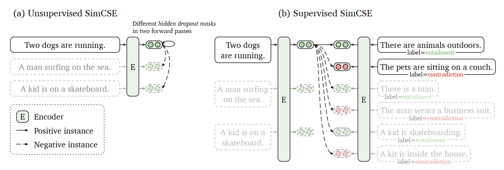

其中，图a为无监督SimCSE，图b为有监督SimCSE，详细模型介绍见第3节和第4节。
下面将从对比学习背景、无监督SimCSE、有监督SimCSE、各向异性问题、实验细节五个方面进行详细介绍。

## 2.对比学习背景
### 2.1定义
对比学习就是**以拉近相似数据，推开不相似数据为目标，有效地学习数据表征**。给定一个pair对样本集合$D=\{(x_{i}, x_{i}^{+})\}^{m}_{i=1}$，其中$x_{i}$和$x_{i}^{+}$为相似样本，优化目标一般采用通过批内负样本(in-batch negatives)交叉熵损失函数，如下，
$l_{i}=-\log\frac{e^{sim(h_{i},h_{i}^{+})/\tau}}{\sum_{j=1}^{N} e^{sim(h_{i},h_{j}^{+})/\tau}}$
其中，$h_{i}$和$h_{i}^{+}$为$x_{i}$和$x_{i}^{+}$的句向量表示，$N$为训练过程中batch的大小，$sim(h_{i},h_{i}^{+})$为向量$h_{i}$和$h_{i}^{+}$余弦相似度，$\tau$为温度超参。

在SimCSE论文中，采用BERT模型对句子进行句向量表征，即$h=f_{\theta}(x)$，其中，$f_{\theta}$为BERT模型参数，并通过对比学习损失优化网络全部参数。
### 2.2构造正样本
对比学习中的一个关键问题是**如何构建$(x_{i}, x_{i}^{+})$数据对**。在计算机视觉中，通过对一张图片进行简单地裁剪，翻转，扭曲和旋转就可以获取质量很高的$x_{i}^{+}$；而在自然语言处理中，构造$x_{i}^{+}$的方法与图像类似，一般对原始句子进行转译、重排，或对部分词语删除、插入、替换等；但是由于离散性，导致NLP中的数据扩充往往会引入大量的负面噪声，使得$x_{i}^{+}$的质量难以保证。

在SimCSE论文中，提出**使用标准dropout操作构造高质量$x_{i}^{+}$**，并达到比上述数据扩充更好的效果。
### 2.3对齐性和均匀性
在对比学习中，通常使用对齐性（alignment）和均匀性（uniformity）来衡量表征质量的好坏。

**alignment**是计算$(x_{i}, x_{i}^{+})$数据对向量表征之间的距离，表示数据之前的紧密程度，
$l_{align} \triangleq \mathop{E}\limits_{(x_{i}, x_{i}^{+})~p_{pos}} ||f(x)-f(x^+)||^2$
**uniformity**是计算$x_{i}$向量表征在整体特征分布上的均匀程度，
$l_{uniform} \triangleq log \mathop{E}\limits_{x,y \mathop{\sim}\limits^{i.i.d.} p_{data}} e^{-2||f(x)-f(y)||^2}$
其中，$p_{data}$表示数据分布。

这两个指标与对比学习的目标是一致的：正例之间应该保持紧密，而任意向量的语义特征应该尽可能地分散在超球体上。

## 3.无监督SimCSE
无监督SimCSE的思想非常简单，给定一个句子集合$\{x_i\}_{i=1}^{m}$，将$x_{i}$分别输入到编码器中两次，分别得到向量$z_{i}$的正例和$z_{i}^{’}$；由于随机dropout masks机制存在于模型的fully-connected layers和attention probabilities上，因此相同的输入，经过模型后会得到不同的结果；将$z_{i}^{’}$向量作为$z_{i}$的正例，其他向量作为负例，SimCSE的训练目标变成：
$l_{i}=-\log\frac{e^{sim(h_{i}^{z_i},h_{i}^{^{z_i^{’}}})/\tau}}{\sum_{j=1}^{N} e^{sim(h_{i}^{z_i},h_{j}^{z_j^{’}})/\tau}}$
注意：$z$为Transformers中的标准dropout mask，在无监督SimCSE没有额外增加任何dropout。
### 3.1Dropout数据增强与其他的比较
通过dropout masks机制进行数据增强构造正例的方法，可以视为一种最小形式的数据扩充，正例与原始样本之间采用完全相同的句子，只有在向量表征过程中的dropout mask有所不同。

在STS-B的开发集上，比较该方法与其他数据增强方法的差异。在英文维基上随机抽取$10^6$个句子进行训练，学习速率=3e-5，批次大小为64。并训练过程中没有使用STS训练集。

- 裁剪，删除和替换等数据增强方法，效果均不如dropout masks机制，即使删除一个词也会损害性能，详细如下表所示，
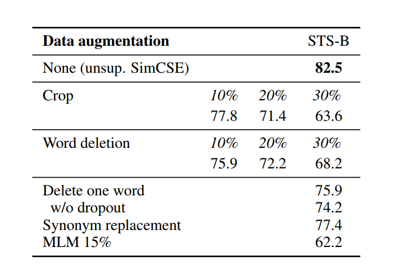
- 使用下一句作为目标训练，或者采用两个独立的编码器进行编码的效果，不如采用一个编码器的dropout masks机制，详细如下表所示，
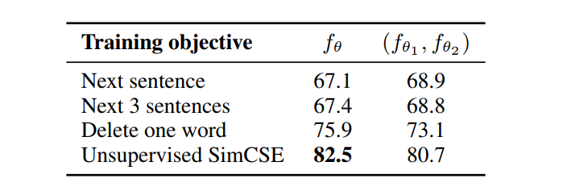

### 3.2为什么该方法可以work？
- 为了进一步理解dropout噪声在无监督SimCSE中的作用，论文尝试了不同的dropout率，如下表所示，
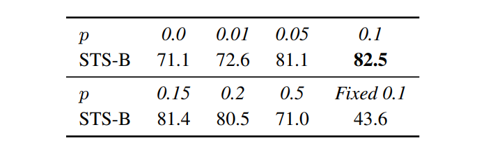

可以发现仅在默认dropout概率p=0.1时效果最优，并且当dropout概率p=0，或者相同输入有同样的dropout mask时，效果显著下降。

- 在训练过程中，每隔10步检查一次模型，并可视化alignment和uniformity在训练过程中的变化，如下图所示，
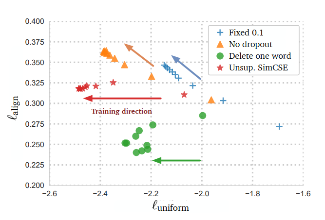

可以发现，在训练过程中，所有模型的均匀性都在提高，但是对于no-dropout和fixed-0.1模型来说对齐性急剧下降，而无监督SimCSE和delete-one-word模型进本持平。虽然delete-one-word模型的对齐性好于无监督SimCSE，但是均匀性相差较多，因此在整体效果上，无监督SimCSE更胜一筹。

## 4.有监督SimCSE
对比学习的关键是如何构建$(x_{i}, x_{i}^{+})$数据对，在无监督SimCSE中，借助dropout mask机制，构造高质量$x_{i}^{+}$数据，已经获得了较好的句向量表征；在有监督SimCSE中，如何通过监督数据，进一步提高句向量表征，具体如下：
### 4.1监督数据的选择
共存在四种数据集，适合构造对比学习$(x_{i}, x_{i}^{+})$数据对，分别是：
- QQP：Quora问题对；

相似的问题对为正样本，如下：
```
正样本
How can I improve my communication and verbal skills? 
What should we do to improve communication skills?
```
不相似的问题对为负样本，如下：
```
负样本
Why are you so sexy? 
How sexy are you?
```
- Flickr30k：每个图像都有5个人进行描述，可以认为同一图像的任意两个描述为一对$(x_{i}, x_{i}^{+})$数据对；
以下图为例：


对图片中的人物的5段描述，如下：
```
人物描述
Gray haired man in black suit and yellow tie working in a financial environment.
A graying man in a suit is perplexed at a business meeting.
A businessman in a yellow tie gives a frustrated look.
A man in a yellow tie is rubbing the back of his neck.
A man with a yellow tie looks concerned.
```
- ParaNMT：大规模的回译数据集；

针对原数据进行机器翻译，获得回译数据，如下：
```
原数据：so, what’s half an hour?
回译数据：half an hour won’t kill you.
```
- NLI datasets：自然语言推理数据集，包括：SNLI和MNLI。

自然语言推理数据集，包含蕴含、矛盾和中立；蕴含表示第二句话可以推理出第一句话；矛盾表示第二句话不能推理出第一句话；中立表示两句话无关；举例如下：
```
蕴含样本
well you see that on television also 
You can see that on television, as well.
```
```
矛盾样本
but that takes too much planning 
It doesn't take much planning.
```
```
中立样本
Conceptually cream skimming has two basic dimensions - product and geography. 
Product and geography are what make cream skimming work.
```

在四种数据集上,直接使用$(x_{i}, x_{i}^{+})$数据对进行训练的结果如下表所示，
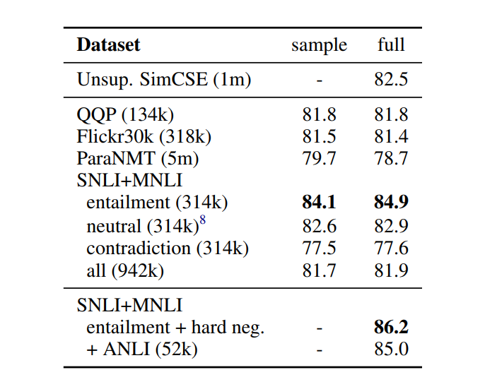

可以发现，NLI数据集上，采用语义蕴含对作为$(x_{i}, x_{i}^{+})$数据对的效果最好；并且统计发现，语义蕴含对(SNLI + MNLI)的词汇重叠仅占比39%，而QQP和ParaNMT数据集占比60%和55%。最终，选择NLI数据集进行监督学习。
### 4.2难负例的使用
NLI数据集中，一个前提假设文本，具有对应的蕴含文本和矛盾文本，将矛盾文本作为难负例；即，$(x_{i}, x_{i}^{+})$数据对变成$(x_{i}, x_{i}^{+}, x_{i}^{-})$数据组，其中，$x_{i}^{+}$为蕴含文本，$x_{i}^{-}$为矛盾文本；监督学习SimCSE的训练目标变成：
$l_{i}=-\log\frac{e^{sim(h_{i},h_{i}^{+})/\tau}}{\sum_{j=1}^{N} (e^{sim(h_{i},h_{j}^{+})/\tau} +e^{sim(h_{i},h_{j}^{-})/\tau})}$
通过上表可以发现，增加矛盾文本作为难负例后，效果有所提高。
直观上，区分难负例（矛盾文本）和Batch内其他负例可能是有益的，将监督学习SimCSE的训练目标变成：
$l_{i}=-\log\frac{e^{sim(h_{i},h_{i}^{+})/\tau}}{\sum_{j=1}^{N} (e^{sim(h_{i},h_{j}^{+})/\tau} + \alpha^{1_{i}^{j}}  e^{sim(h_{i},h_{j}^{-})/\tau})}$
用不同的α值训练SimCSE模型，并在STS-B开发集上对训练的模型进行评价，发现当α为1时效果最优，并且中性数据不会带来更多的收益，如下表所示，
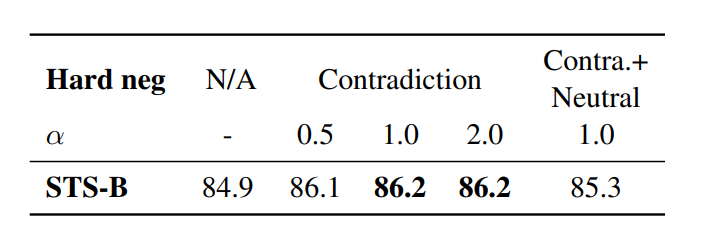

## 5.各向异性问题
最近的研究发现了语言表征中的各向异性问题，即训练后的embeddings仅占据在向量空间中狭窄的部分，严重限制了向量的表现力。
缓解这个问题的一个简单方法是后处理，可以消除主要的主成分或将embeddings映射到各向同性分布。另一种常见的解决方案是在训练过程中添加正则项。
而对比学习的优化目标可以改善缓解各向异性问题，当负例数趋近于无穷大时，对比学习目标的渐近表示为:
$- \frac{1}{\tau}\mathop{E}\limits_{(x_{i}, x_{i}^{+}) \sim p_{pos}}[f(x)^{T}f(x^+)] + \mathop{E}\limits_{x \sim p_{data}}[\log \mathop{E}\limits_{x^- \sim p_{data}}[e^{f(x)^{T}f(x^-)/ \tau}]]$
其中，第一项使正例之间更相似，第二项使将负例之间分开。而第二项在优化过程中，会压平向量空间的奇异谱，因此对比学习有望缓解表征退化问题，提高句向量表征的均匀性。并通过下图，可以发现，
- 虽然预训练embeddings具有良好的对齐性，但其均匀性较差;
- 后处理方法，大大改善均匀性，但也使其对齐性变差;
- 无监督SimCSE有效地提高了预训练embeddings的均匀性，同时保持了良好的对齐性;
- 有监督SimCSE，可以进一步提高对齐性。
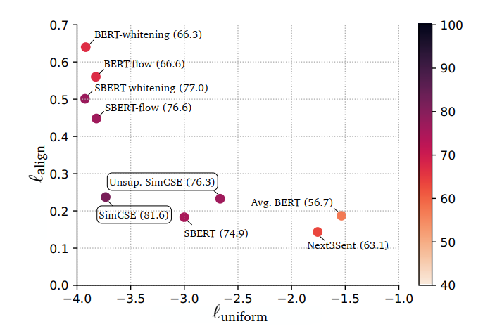
## 6.实验细节
对7个语义文本相似度(STS)任务进行了实验，将无监督和有监督的SimCSE与STS任务中的最先进的句子嵌入方法进行了比较，可以发现，无监督和有监督的SimCSE均取得了sota的效果，具体如下表所示，
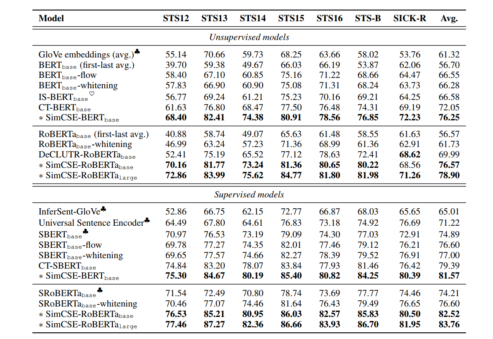
### 6.1训练参数
对于有监督的SimCSE，对模型进行3个轮的训练，在STS-B的开发集上每训练250步进行一次模型验证，并保存测试集上最优效果的节点。对于无监督的SimCSE与有监督的SimCSE操作一致，但仅训练一个epoch。并对批次大小和学习率进行网格搜索，找寻最优参数，如下图所示，
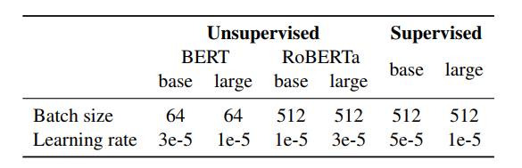
实验发现，只要相应地调整学习速率，SimCSE对批量大小并不敏感，这与对比学习需要大批次的发现相矛盾。可能原因为所有SimCSE模型都是在原有预训练模型基础上继续训练的，已经提供了较好的初始化参数。
### 6.2MLP Layer
对于无监督和有监督的SimCSE，训练过程均采用在带有一个MLP层的[CLS]向量作为句向量表征。但，对于无监督的SimCSE，在测试中丢弃了MLP层，仅使用[CLS]向量作为句向量表征，详细实验如下表所示，
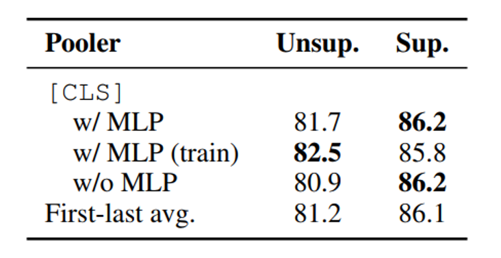
### 6.3MLM
在训练过程中引入masked language modeling变量，可以提到模型的迁移效果，如下表所示，
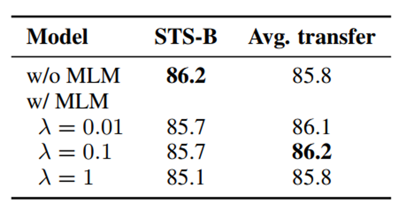

但值得注意的是，迁移性的提高，会造成原始任务上的效果下降。
### 6.4温度
温度主要用于调整softmax函数的平滑程度，在训练过程中，温度为0.05时，效果最佳。
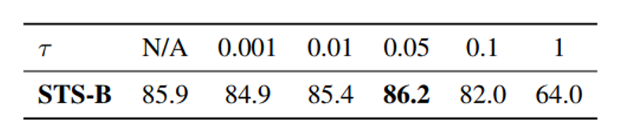

## 7.总结
SimCSE论文，在无监督句向量表征上，通过简单的dropout方式，构造了对比学习的正例，达到堪比监督学习效果，堪称大道至简。并且在监督学习上，对比学习框架效果也取得了SOTA。

## 8.参考文献
- [SimCSE: Simple Contrastive Learning of Sentence Embeddings](https://aclanthology.org/2021.emnlp-main.552.pdf)


