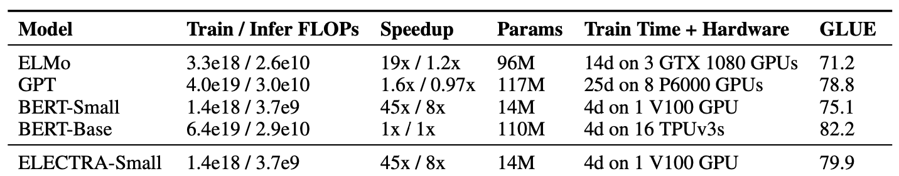

# ELECTRA
## 1.介绍

掩码语言模型(masked langauge model, MLM)，类似BERT通过预训练方法使用[MASK]来替换文本中一些字符，破坏了文本的原始输入，然后训练模型来重建原始文本。尽管它们在下游NLP任务中产生了良好的结果，但是它们通常需要大量计算才有效。作为替代方案，作者提出了一种更有效的预训练任务，称为Replaced Token Detection(RTD)，字符替换探测。RTD方法不是掩盖输入，而是通过使用生成网络来生成一些合理替换字符来达到破坏输入的目的。然后，我们训练一个判别器模型，该模型可以预测当前字符是否被语言模型替换过。实验结果表明，这种新的预训练任务比MLM更有效，因为该任务是定义在所有文本输入上，而不是仅仅被掩盖的一小部分，在模型大小，数据和计算力相同的情况下，RTD方法所学习的上下文表示远远优于BERT所学习的上下文表示。

上图中，左边的图是右边的放大版，纵轴是dev GLUE分数，横轴是FLOPs(floating point operations)，Tensorflow中提供的浮点数计算量统计。从上图可以看到，同量级的ELECTRA是一直碾压BERT，而且在训练更长的步长步数，达到了当时的SOTA模型RoBERTa的效果。从左边的曲线图上可以看到，ELECTRA效果还有继续上升的空间。

## 2.模型结构

ELECTRA最大的贡献是提出了新的预训练任务和框架，在上述简介中也提到了。将生成式的MLM预训练任务改成了判别式的RTD任务，再判断当前token是否被替换过。那么问题来了，假设，我随机替换一些输入中的字词，再让BERT去预测是否替换过，这样可行吗？有一些人做过实验，但效果并不太好，因为随机替换太简单了。

作者使用一个MLM的G-BERT来对输入句子进行改造，然后丢给D-BERT去判断哪个字被修改过，如下：

### 2.1 Replaced Token Detection

但上述结构有个问题，输入句子经过生成器，输出改写过的句子，因为句子的字词是离散的，所以梯度无法反向传播，判别器的梯度无法传给生成器，于是生成器的目标还是MLM，判别器的目标是序列标注（判断每个字符是真是假），两者同时训练，但是判别器的梯度不会传给生成器，目标函数如下：

$$min_{\theta_{G},\theta_{D}} \sum_{x \in X} L_{MLM}(x,\theta_{G})+\lambda L_{Disc}(x,\theta_{D})$$

因为判别器的任务相对来说简单些，RTD损失相对MLM损失会很小，因此加上一个系数，论文中使用了50。经过预训练，在下游任务的使用中，作者直接给出生成器，在判别器进行微调。

另外，在优化判别器时计算了所有token上的损失，而以往计算BERT的MLM loss时会忽略没被mask的token。作者在后来的实验中也验证了在所有token上进行损失计算会提升效率和效果。

事实上，ELECTRA使用的生成-判别架构与GAN还是有不少差别，作者列出了如下几点：

||ELECTRA|GAN|
|----|----|----|
|输入|真实文本|随机噪声|
|目标|生成器学习语言模型，判别器学习区分真假文本|生成器尽可能欺骗判别器，判别器尽量区分真假图片|
|反向传播|梯度无法从D传到G|梯度可以从D传到G|
|特殊情况|生成出了真实文本，则标记为正例|生成的都是负例（假图片）|

### 2.2 权重共享

生成器和判别器权重共享是否可以提升效果呢？作者设置了同样大小的生成器和判别器。在不共享权重下的效果为83.6，只共享token embedding层的效果是84.3，共享所有权重的效果是84.4。作者认为生成器对embedding 有更好的学习能力，这是由于判别器只更新由生成器采样生成的token，而softmax是建立在所有vocab上的，之后反向传播时生成器会更新所有的embedding，最后作者只使用了embedding sharing。

### 2.3 更小的生成器

从权重共享的实验中看到，生成器和判别器只需要共享embedding 的权重就足够了。那这样的话是否可以缩小生成器的尺寸进行训练效率的提升呢？作者在保持原有的hidden size的设置下减少了层数，得到了下图所示的关系图：

可以看到，生成器的大小在判别器的1/4到1/2之间的效果是最好的。作者认为原因是过强的生成器会增加判别器的难度。

## 3.训练策略

除了MLM损失，作者也尝试了另外两种训练策略：

1. Adversarial Contrastive Estimation：ELECTRA因为上述一些问题无法使用GAN，但也可以以一种对抗学习的思想来训练。作者将生成器的目标函数由最小化MLM损失换成了最大化判别器在被替换token上RTD损失。但还有一个问题，就是新的生成器无法用梯度上升更新生成器，于是作者使用强化学习Policy Gradient思想，最终优化下来生成器在MLM 任务上可以达到54%的准确率，而之前MLE优化下可达到65%。

2. Two-stage training：即先训练生成器，然后freeze掉，用生成器的权重初始化判别器，再接着训练相同步数的判别器。

对比三种训练策略，得到下图：

可见“隔离式”的训练策略效果还是最好的，而两段式的训练弱一些，作者猜测是生成器太强了导致判别任务难度增大。不过两段式最终效果也比BERT本身要强，进一步证明了判别式预训练的效果。

## 4. 实验

作者的目的是提升预训练效率，于是做了GPU单卡就可以训练ELECTRA-Small和BERT-Small，接着和层数不变的ELMo、GPT等进行对比。结果如下：

表现十分亮眼，仅用14M参数数量，以前13%的体积，在提升训练速度的同时还提升了效果。

大ELECTRA模型的各项表现如下：

上面是各个模型在GLUE dev/text上的表现，可以看到ELECTRA仅用了1/4的计算量就达到了RoBERTa的效果。而且作者使用的是XLNet的语料，大约是126G，但RoBERTa用了160G。由于时间和精力问题，作者没有把ELECTRA训练更久（应该会有提升），也没有使用各种Trick。

## 5.分析

BERT的loss只计算被替换的15%个token，而ELECTRA是全部都计算，所以作者又做了几个对比实验，探究哪种方式更好一些：

1. ELECTRA 15%：让判别器只计算15% token上的损失；
2. Replace MLM：训练BERT MLM，输入不用[MASK]进行替换，而是其他生成器。这样可以消除pretrain-finetune之间的差别；
3. All-Tokens MLM :接着用Replace MLM，只不过BERT的目标函数变为预测所有的token，比较接近ELECTRA。

|Model|ELECTRA|All-Tokens MLM|Replace MLM|ELECTRA 15%|BERT|
|----|----|----|----|----|----|
|GLUE score|85.0|84.3|82.4|82.4|82.2|

对比ELECTRA和ECLECTRA15%：在所有token上计算loss确实能提升效果;对比Replace MLM 和BERT：[MASK]标志确实会对BERT产生影响，而且BERT目前还有一个trick，就是被替换的10%情况下使用原token或其他token，如果没有这个trick估计效果会差一些;对比All-Tokens MLM和BERT：如果BERT预测所有token的话，效果会接近ELECTRA。

作者还发现，ELECTRA体积越小，相比于BERT就提升的越明显，说明fully trained的ELECTRA效果会更好。另外作者推断，由于ELECTRA是判别式任务，不用对整个数据分布建模，所以更parameter-efficient。

## 6. 总结
BERT虽然对上下文有很强的编码能力，却缺乏细粒度语义的表示。下图可以明显体现出上述问题：

这是把token编码降维后的效果，可以看到sky和sea，明明是天与海的区别，却因为上下文一样而得到了极为相似的编码。细粒度表示能力的缺失会对真实任务造成很大影响，如果被针对性攻击的话更是无力，所以当时就想办法加上更细粒度的任务让BERT去区分每个token，不过同句内随机替换的效果并不好， 需要进一步挖掘。

ELECTRA的RTD任务比MLM的预训练任务好，推出了一种十分适用于NLP的类GAN框架，不再像之前的BERT+模型一样，可以用“more data+parameters+steps+GPU+MONEY”简单概括。

## 7. 参考文献

[Electra: Pre-training text encoders as discriminators rather than generators](https://arxiv.org/abs/2003.10555)

