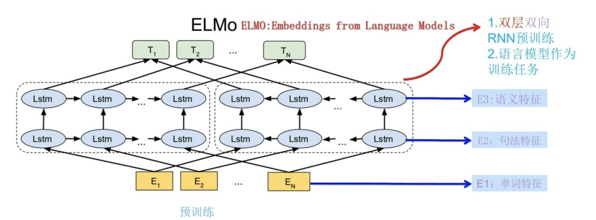

# ELMo
## 1.介绍
Deep contextualized word representations获得了NAACL 2018的outstanding paper award，其方法有很大的启发意义。近几年来，预训练的word representation在NLP任务中表现出了很好的性能，已经是很多NLP任务不可或缺的一部分，论文作者认为一个好的word representation需要能建模以下两部分信息：单词的特征，如语义，语法；单词在不同语境下的变化，即一词多义。基于这样的动机，作者提出了ELMo模型，下面的章节会详细介绍ELMo。

### 1.1从Word Embedding到ELMo

Word Embedding：词嵌入。最简单粗劣的理解就是：将词进行向量化表示，实体的抽象成了数学描述，就可以进行建模，应用到很多任务中。之前用语言模型做Word Embedding比较火的是word2vec和glove。使用Word2Vec或者Glove，通过做语言模型任务，就可以获得每个单词的Word Embedding，但是Word Embedding无法解决多义词的问题，同一个词在不同的上下文中表示不同的意思，但是在Word Embedding中一个词只有一个表示，这导致两种不同的上下文信息都会编码到相同的word embedding空间里去。如何根据句子上下文来进行单词的Word Embedding表示。ELMO提供了解决方案。

我们有以下两个句子：

+ I read the book yesterday.

+ Can you read the letter now?

花些时间考虑下这两个句子的区别，第一个句子中的动词“read”是过去式，而第二个句子中的“read”却是现在式，这是一种一词多义现象。

传统的词嵌入会对两个句子中的词“read”生成同样的向量，所以这些架构无法区别多义词，它们无法识别词的上下文。

与之相反，ELMo的词向量能够很好地解决这种问题。ELMo模型将整个句子输入方程式中来计算词嵌入。因此，上例中两个句子的“read”会有不同的ELMo向量。

## 2.ELMo原理
在此之前的Word Embedding本质上是个静态的方式，所谓静态指的是训练好之后每个单词的表达就固定住了，以后使用的时候，不论新句子上下文单词是什么，这个单词的Word Embedding不会跟着上下文场景的变化而改变，所以对于比如Bank这个词，它事先学好的Word Embedding中混合了几种语义 ，在应用中来了个新句子，即使从上下文中（比如句子包含money等词）明显可以看出它代表的是“银行”的含义，但是对应的Word Embedding内容也不会变，它还是混合了多种语义。这是为何说它是静态的，这也是问题所在。

ELMO的本质思想是：我事先用语言模型学好一个单词的Word Embedding，此时多义词无法区分，不过这没关系。在我实际使用Word Embedding的时候，单词已经具备了特定的上下文了，这个时候我可以根据上下文单词的语义去调整单词的Word Embedding表示，这样经过调整后的Word Embedding更能表达在这个上下文中的具体含义，自然也就解决了多义词的问题了。所以ELMO本身是个根据当前上下文对Word Embedding动态调整的思路。

ELMo表征是“深”的，就是说它们是BiLM的所有层的内部表征的函数。这样做的好处是能够产生丰富的词语表征。高层的LSTM的状态可以捕捉词语以一种和语境相关的特征（比如可以应用在语义消歧），而低层的LSTM可以找到语法方面的特征（比如可以做词性标注）。如果把它们结合在一起，会在下游的NLP任务中显出优势。

### 2.1 模型结构

ELMO 基于语言模型的，确切的来说是一个 Bidirectional language models，也是一个 Bidirectional LSTM结构。我们要做的是给定一个含有N个tokens的序列。分为以下三步：

1. 第一步：得到word embedding，即上图的E。所谓word embedding就是一个n*1维的列向量，其中n表示embedding向量的大小；
2. 第二步：送入双向LSTM模型中，即上图中的Lstm；
3. 第三步：将LSTM的输出$h_{k}$，与上下文矩阵$W'$相乘，再将该列向量经过Softmax归一化。其中，假定数据集有V个单词，$W'$是$|V|*m$的矩阵，$h_{k}$是$m*1$的列向量，于是最终结果是$|V|*1$的归一化后向量，即从输入单词得到的针对每个单词的概率。

### 2.2 公式解析
前向表示：

$$p(t_{1},t_{2},...,t_{N})=\prod_{k=1}^{N}p(t_{k}|t_{1},t_{2},...,t_{k-1})$$

后向表示:

$$p(t_{1},t_{2},...,t_{N})=\prod_{k=1}^{N}p(t_{k}|t_{k+1},t_{k+2},...,t_{N})$$

Bi-LM训练过程中的目标就是最大化:

$$\sum_{k=1}^N (log p(t_{k}|t_{1},...,t_{k-1};\Theta_{x},\overrightarrow\Theta_{LSTM},\Theta_{s})+log p(t_{k}|t_{k+1},...,t_{N};\overleftarrow\Theta_{LSTM},\Theta_{s}))$$

两个网络里都出现了$\Theta_{x}$和$\Theta_{s}$，两个网络共享的参数。

其中$\Theta_{x}$表示映射层的共享，表示第一步中，将单词映射为word embedding的共享，就是说同一个单词，映射为同一个word embedding。

$\Theta_{s}$表示第三步中的上下文矩阵的参数，这个参数在前向和后向lstm中是相同的。

ELMo对于每个token $t_{k}$, 通过一个L层的biLM计算2L+1个表征（representations），这是输入第二阶段的初始值:

$$R_{k}=\{ x_{k}^{LM},\overrightarrow h^{LM}_{k,j},\overleftarrow h^{LM}_{k,j}|j=1,...,L\}$$
$$=\{h_{k,j}^{LM}|j=0,...,L\}$$

其中k 表示单词位置，j 表示所在层，j=0 表示输入层。故整体可用右侧的 h 表示。$h_{k,0}^{LM}$是对token进行直接编码的结果(这里是字符通过CNN编码)， $h_{k,j}^{LM}=[\overrightarrow h^{LM}_{k,j};\overleftarrow h^{LM}_{k,j}]$是每个biLSTM层输出的结果。在实验中还发现不同层的biLM的输出的token表示对于不同的任务效果不同.最上面一层的输出是用softmax来预测下面一个单词

应用中将ELMo中所有层的输出R压缩为单个向量, $ELMo_{k}=E(R_{k};\Theta_{\epsilon})$，最简单的压缩方法是取最上层的结果做为token的表示:$E(R_{k})=h_{k,L}^{LM}$, 更通用的做法是通过一些参数来联合所有层的信息:

$$ELMo_{k}^{task}=E(R_{k};\Theta^{task})$$

$$=\gamma^{task}\sum_{j=0}^{L}s_{j}^{task}h_{k,j}^{LM}$$

其中$s_{j}$是softmax标准化权重，$\gamma$是缩放系数，允许任务模型去缩放整个ELMO向量。文中提到γ在不同任务中取不同的值效果会有较大的差异， 需要注意， 在SQuAD中设置为0.01取得的效果要好于设置为1时。

文章中提到的Pre-trained的language model是用了两层的biLM, 对token进行上下文无关的编码是通过CNN对字符进行编码, 然后将三层的输出scale到1024维, 最后对每个token输出3个1024维的向量表示.

## 3.ELMo 训练

### 3.1 第一阶段 语言模型进行预训练

ELMo采用了典型的两阶段过程，第一个阶段是利用语言模型进行预训练；第二个阶段是在做下游任务时，从预训练网络中提取对应单词的网络各层的Word Embedding作为新特征补充到下游任务中。图展示的是其预训练过程：

它的网络结构采用了双层双向LSTM，目前语言模型训练的任务目标是根据单词$W_{i}$的上下文去正确预测单词$W_{i}$,$W_{i}$之前的单词序列Context-before称为上文，之后的单词序列Context-after称为下文。图中左端的前向双层LSTM代表正方向编码器，输入的是从左到右顺序的除了预测单词外$W_{i}$的上文Context-before；右端的逆向双层LSTM代表反方向编码器，输入的是从右到左的逆序的句子下文Context-after；每个编码器的深度都是两层LSTM叠加。这个网络结构其实在NLP中是很常用的。

使用这个网络结构利用大量语料做语言模型任务就能预先训练好这个网络，如果训练好这个网络后，输入一个新句子$S_{new}$，句子中每个单词都能得到对应的三个Embedding:最底层是单词的Word Embedding，往上走是第一层双向LSTM中对应单词位置的Embedding，这层编码单词的句法信息更多一些；再往上走是第二层LSTM中对应单词位置的Embedding，这层编码单词的语义信息更多一些。也就是说，ELMO的预训练过程不仅仅学会单词的Word Embedding，还学会了一个双层双向的LSTM网络结构，而这两者后面都有用。

### 3.2第二阶段 接入下游NLP任务

ELMO的第一阶段：预训练阶段。那么预训练好网络结构后，如何给下游任务使用呢？下图展示了下游任务的使用过程，比如我们的下游任务仍然是QA问题，此时对于问句X，我们可以先将句子X作为预训练好的ELMo网络的输入，这样句子X中每个单词在ELMO网络中都能获得对应的三个Embedding，之后给予这三个Embedding中的每一个Embedding一个权重a，这个权重可以学习得来，根据各自权重累加求和，将三个Embedding整合成一个。然后将整合后的这个Embedding作为X句在自己任务的那个网络结构中对应单词的输入，以此作为补充的新特征给下游任务使用。对于下图所示下游任务QA中的回答句子Y来说也是如此处理。因为ELMO给下游提供的是每个单词的特征形式，所以这一类预训练的方法被称为“Feature-based Pre-Training”。

最后，作者发现给ELMo模型增加一定数量的Dropout，在某些情况下给损失函数加入正则项$\lambda ||w||^2_{2}$，这等于给ELMo模型加了一个归纳偏置，使得权重接近BiLM所有层的平均权重。

## 4. ELMo使用步骤

ELMO的使用主要有三步：

1. 在大的语料库上预训练 biLM 模型。模型由两层biLSTM 组成，模型之间用残差连接起来。而且作者认为低层的biLSTM层能提取语料中的句法信息，高层的biLSTM能提取语料中的语义信息。
2. 在我们的训练语料（去除标签），fine-tuning 预训练好的biLM 模型。这一步可以看作是biLM的domain transfer。
3. 利用ELMo产生的word embedding来作为任务的输入，有时也可以即在输入时加入，也在输出时加入。

## 5. 优缺点

### 优点

+ 考虑上下文，针对不同的上下文生成不同的词向量。表达不同的语法或语义信息。如“活动”一词，既可以是名词，也可以是动词，既可以做主语，也可以做谓语等。针对这种情况，ELMo能够根据不同的语法或语义信息生成不同的词向量。
+ 6 个 NLP 任务中性能都有幅度不同的提升，最高的提升达到 25% 左右，而且这 6 个任务的覆盖范围比较广，包含句子语义关系判断，分类任务，阅读理解等多个领域，这说明其适用范围是非常广的，普适性强，这是一个非常好的优点。

### 缺点
+ 使用LSTM提取特征，而LSTM提取特征的能力弱于Transformer
+ 使用向量拼接方式融合上下文特征，这种方式获取的上下文信息效果不如想象中好
+ 训练时间长，这也是RNN的本质导致的，和上面特征提取缺点差不多；

## 6. 参考文献

[Deep contextualized word representations](https://arxiv.org/abs/1802.05365)
