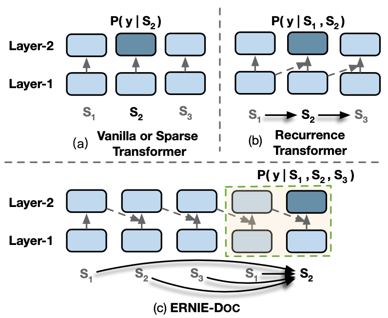
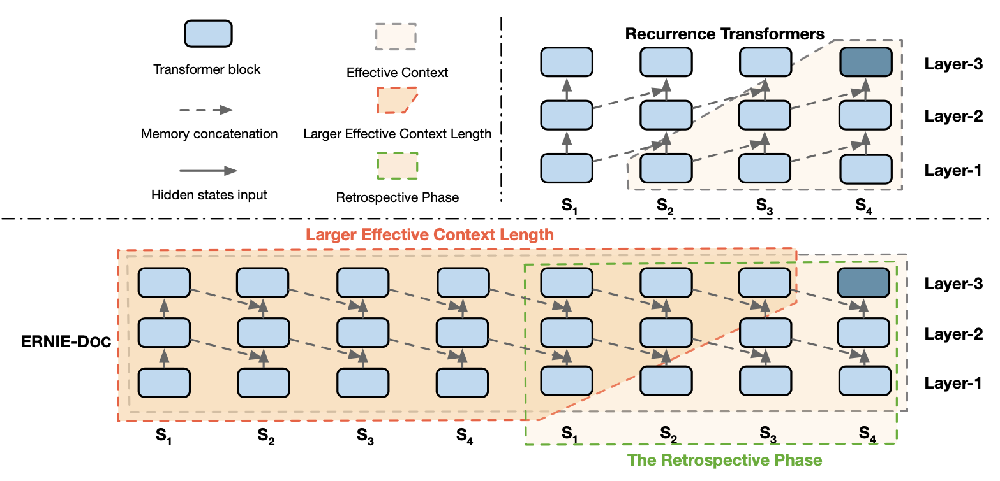
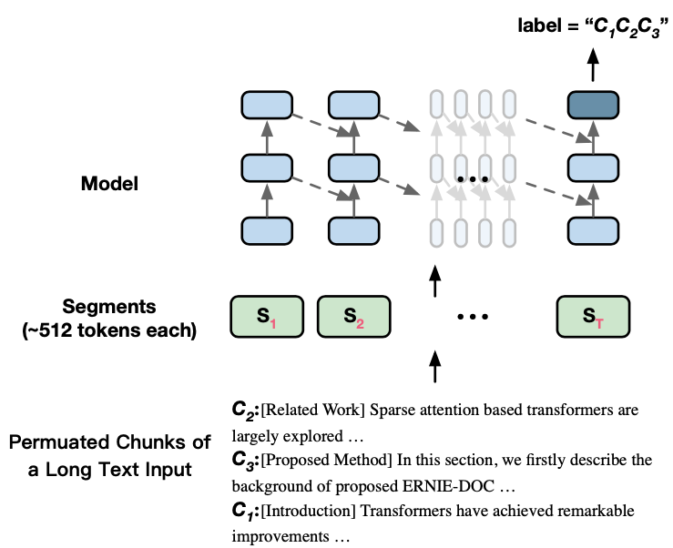

# ERNIE-Doc: A Retrospective Long-Document Modeling Transformer

## 1. ERNIE-Doc的由来

经典的Transformer在处理数据时，会将文本数据按照固定长度进行截断，这个看起来比较"武断"的操作会造成**上下文碎片化**以及无法建模**更长的序列依赖关系**。基于此项考虑，ERNIE-Doc提出了一种**文档层级**的预训练语言模型方法：ERNIE-Doc在训练某一个Segment时，允许该segment能够获得整个Doc的信息。

如图1所示，假设一篇完整的文档被分割成3个Segment：$S_1, S_2, S_3$，在编码segment $S_2$时，经典的Transformer依赖的只是$S_2$本身：$P(y|S_2)$， Recurrence Transformer (例如 Transformer-XL)依赖的是$S_1, S_2$：$P(y|S_1,S_2)$，这两种方法均没有使Segment $S_2$获得完整的文档信息$S_1, S_2, S_3$。

图1 ERNIE-Doc的建模方式图

但是ERNIE-Doc在建模过程中，使得每个Segment均能获得完整的文档信息：$P(y|S_1, S_2,S_3)$，其中建模长序列的关键点如下：

- Retrospective feed mechanism: 将文本两次传入模型获得文本序列的representation，第一次将获得完整的文本序列表示，然后该序列的representation继续参与第二次的编码过程，这样该文本序列在第二次编码过程中，每个token位置便能获得序列完整的双向信息。
- Enhanced recurrence mechanism: 使用了一种增强的Segment循环机制进行建模。
- Segment-reordering objective: 对一篇文档中的各个segment随机打乱，获得多个乱序文档，然后要求模型预测这些文档中哪个是正常语序的文档。

## 2. 经典/Recurrence Transformer的计算

在正式介绍正式ERNIE-DOC之前，我们先来回顾一下经典和Recurrence Transformer模型的计算。假设当前存在一个长文档$D$​被划分为这样几个Segment：$D=\{S_1, S_2, ..., S_T\}$​​，其中每个Segment包含$L$​个token：$S_\tau = \{x_{\tau,1}, x_{\tau, 2}, ..., x_{\tau,L}\}$​​。另外约定$h_\tau^{n} \in \mathbb{R}^{L \times d}$为Transformer第$n$层第$\tau$​​个Segment的编码向量。对于第$\tau+1$​个Segment $S_{\tau+1}$​，Transformer第$n$层对其相应的编码计算方式为：

$$
\begin{align}
& \tilde{h}_{\tau+1}^{n-1} = \left\{ \begin{matrix} h_{\tau+1}^{n-1}, \qquad \text{Vanilla Transformers}  \\ \left[ \text{SG}(h_{\tau}^{n-1}) \; \circ \;h_{\tau+1}^{n-1} \right], \qquad \text{Recurrence Transformers} \end{matrix} \right. \\
& q_{\tau+1}^{n}, \; k_{\tau+1}^n, \; v_{\tau+1}^n = h_{\tau+1}^{n-1}W_{q}^{\mathrm{ T }}, \; \tilde{h}_{\tau+1}^{n-1}W_{k}^{\mathrm{ T }}, \; \tilde{h}_{\tau+1}^{n-1}W_{v}^{\mathrm{ T }} \\
& h_{\tau+1}^n = \text{Transformer-Layer}(q_{\tau+1}^{n}, \; k_{\tau+1}^n, \; v_{\tau+1}^n)
\end{align}
$$

如上述讨论，这两种方式均不能使得每个Segment获得Doc的完整信息。

## 3. Retrospective feed mechanism

ERNIE-Doc借鉴了人类阅读的行为习惯，在人类阅读时会分为两个阶段：首先会快速略读一下文档内容，然后回过头来仔细阅读。ERNIE-Doc基于此设计了Retrospective feed mechanism，该机制同样包含两个阶段：Skimming phase 和 Retrospective phase。

具体来讲，一篇文档会传入模型两次，第一次被称为Skimming phase，在该阶段将会获得改文档的完整序列表示。第二次被称为 Retrospective phase，在该阶段将会融入Skimming phase获得的完整文档表示，开始进一步的编码计算，从而保证在第二次计算每个Segment编码时能够获得完整的文档信息。Retrospective phase的计算方式如下：

$$
\begin{align}
\hat{H} &= \left[  \hat{H}_{1:T}^{1} \circ \hat{H}_{1:T}^{2} \cdot \cdot \cdot \circ \; \hat{H}_{1:T}^N \right], \quad \text{(skimming phase)} \\
\hat{H}_{1:T}^{i} &= \left[ \hat{h}_1^i \circ \hat{h}_2^i \cdot \cdot \cdot \circ \;\hat{h}_T^i \right] , \quad \text{(skimming phase)}  \\
\tilde{h}_{\tau+1}^{n-1} &= \left[{SG}(\hat{H }\circ h_{\tau}^{n-1}) \circ h_{\tau+1}^{n-1}   \right], \quad \text{(retrospective phase)}
\end{align}
$$

其中以上公式各个参数解释如下：

- $T$​：一篇文档的Segment数量； $N$：Transformer模型层的数量；$L$​：每个Segment中的最大token数量。
- $\hat{H} \in \mathbb{R}^{(L \times T \times N) \times d}$​​​​​：一篇文档在所有层中输出的编码向量。
- $\hat{H}_{1:T}^i \in \mathbb{R}^{(L \times T) \times d} $: 一篇文档在第$i$​层产生的编码向量。
- $\hat{h}_\tau^i$：第$\tau$个Segment在第$i$层产生的编码向量。

从以上公式可以看到，在retrospective 阶段，当计算每个Segment时，会引入完整文档的表示$\hat{H}$​，这样就保证了编码时，每个token能够获得完整文档的信息。

## 4. Enhanced Recurrence Mechanism

ERNIE-Doc通过使用Retrospective feed mechanism和Enhanced Recurrence Mechanism两种方式，增大了计算每个segment时的有效上下文长度。但是第3节引入的公式计算复杂度是很高，因此 Enhanced Recurrence Mechanism期望前一个Segment便能获得完整的文档信息，然后直接融入前一个Segment便能使得当前Segment计算融入完整的文档信息。

如图2所示，ERNIE-Doc通过将前一个Segment的同层编码表示，引入了当前Segment的计算中，这个做法同时也有利于上层信息反补下层的编码表示，具体公式为：

$$
\tilde{h}_{\tau+1}^{n-1} = \left[{SG}(h_\tau^n) \circ h_{\tau+1}^{n-1}  \right]
$$

图2 ERNIE的Segment连接方式

## 5. Segment-Reordering Objective

在预训练阶段，ERNIE-Doc使用了两个预训练任务：MLM和Segment-Reordering Objective。我们先来讨论Segment-Reordering Objective，其旨在帮助模型显式地建模Segment之间的关系，其会将一篇长文档进行划分为若干部分，然后将这些部分进行随机打乱，最后让模型进行预测原始的语序，这是一个$K$​分类问题：$K=\sum_{i=1}^m i!$​，其中$m$​​是最大的划分数量。

如图3所示，假设存在一篇文档$D$被划分为3部分：$D=\{C_1, C_2, C_3\}$，ERNIE-Doc通过打乱这些部分得到$\hat{D}=\{C_2, C_3, C_1\}$，然后在最后一个Segment $S_\tau$的位置进行预测原始的文档顺序$C_1, C_2, C_3$。

图3 预训练任务Segment-Reordering Objective

另外，在获得$\hat{D}=\{C_2, C_3, C_1\}$后，ERNIE-Doc会对$\hat{D}$进行划分Segment：$\hat{D} = \{S_1,S_2,...,S_T \}$​​​​，并且会对这些Segment中的某些Token 进行Mask，从而构造MLM任务，要求模型根据破坏的Segment $\hat{S}_\tau$恢复成原始的$S_\tau$​。结合MLM和Segment-Reordering Objective总的预训练目标为：

$$
\underset {\theta}{\text{max}} \; \text{log} \; p_\theta(S_\tau|\hat{S}_\tau) + \mathbb{1}_{\tau=T}\; \text{log}\;p_\theta(D|\hat{D})
$$

其中，$\mathbb{1}_{\tau=T}$表示Segment-Reordering Objective仅仅在最后一个Semgnet $S_T$位置被执行，以优化模型。

## 6. 相关资料

1. [ERNIE-Doc: A Retrospective Long-Document Modeling Transformer](https://arxiv.org/pdf/2012.15688.pdf)
2. [ERNIE-Doc Github](https://github.com/PaddlePaddle/ERNIE/tree/develop/ernie-doc)
