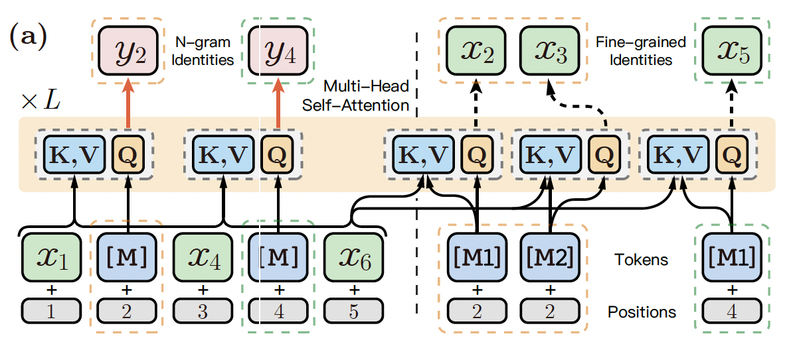
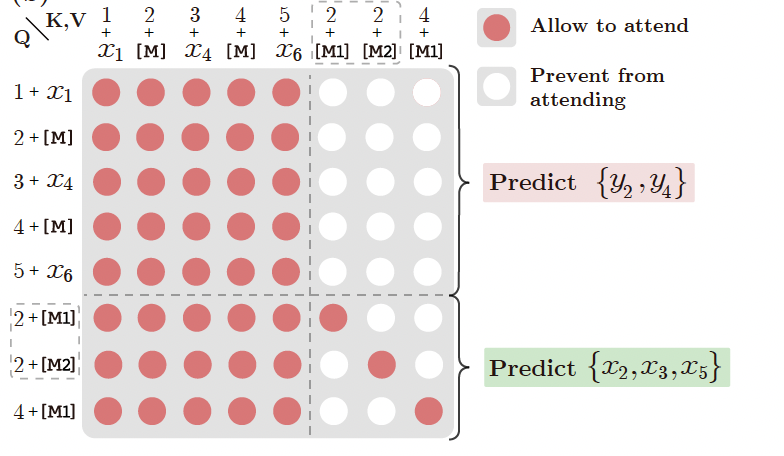
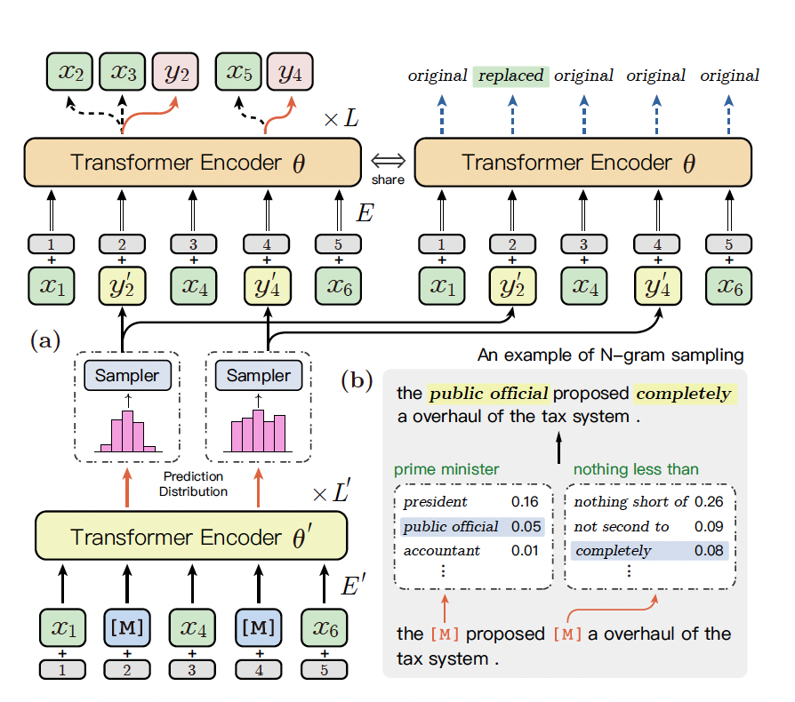
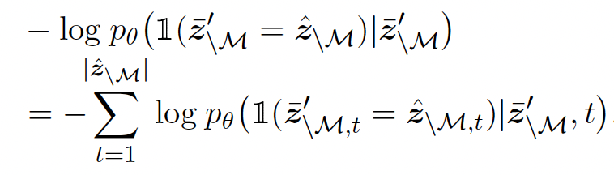
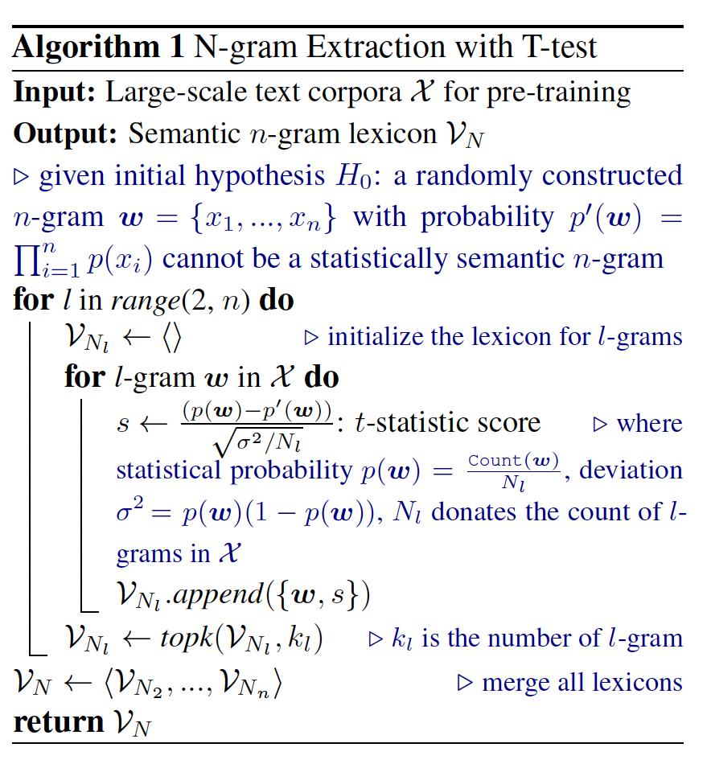

# ERINE-Gram

## 介绍

粗粒度的语言信息，如命名实体或短语，有助于在预训练时进行充分的表征学习。以前的工作主要集中在扩展BERT的掩码语言建模(MLM)目标，从屏蔽单个标记到n个连续序列的标记。

连续掩码方法忽略了粗粒度语言信息的内在依赖和相互关系的建模。作为替代方案，我们提出了ERNIE-gram，一种显式的n-gram掩蔽方法，以增强粗粒度信息集成到预训练。

在ERNIE-Gram中，n-gram直接使用n-gram标识来屏蔽和预测，而不是使用n个连续标记序列。此外，ERNIE-Gram采用一个生成器模型来采样似然的n-gram标识，作为可选的n- gram 掩码并以粗粒度和细粒度方式预测它们，以实现综合的n-gram预测和关系建模。

ERNIE-Gram进行了英语和汉语文本语料库的预训练，并对19个下游任务进行了微调。实验结果表明，ERNIE-Gram的表现明显优于以往的预训练模型如XLNet和RoBERTa。

## 贡献

1. MLM的改进：提出显示的n-gram掩码；

2. 训练阶段通过生成器模型采样n-gram标识，实现综合的n-gram预测和关系建模。

## 方法

### 连续的掩码

给定输入序列$x={x_{1},...,x_{|x|}}, x \in V_{F}$, n-gram的开始界限 $b={b_{1},...,b_{|b|}}$，令$z={z_{1},...,z_{|b|-1}}$为n-gram序列，其中$z_{i}=x_{[b_{i}:b_{i+1})}$，MLM从掩码的n-gram中采样15%的开始边界，用M表示采样的开始边界的索引，$z_{M}$作为连续的掩码token， $z_{\hat M}$作为掩码后的序列。

如图a，$b={1,2,4,5,6,7}$, $z={x_{1},x_{[2:4)},x_{4},x_{5},x_{6}}$, $M=\{2,4\}$, $z_{M}={x_{[2:4)},x_{5}}$和$z_{\hat M}={x_{1},[M],[M],x_{4},[M],x_{6}}$.

连续MLM的损失函数为：

$$-log p_{\theta}(z_{M}|z_{\hat M})=-\sum_{z \in z_{M}}\sum_{x \in z}log p_{\theta}(x|z_{\backslash M})$$

<!---->

### 显式的n-gram MLM
和连续的MLM不一样，我们利用显式的n-gram标记作为预训练的目标，这可以减少n-gram的预测空间。令$y={y_{1},...,y_{|b|-1}},y \in <V_{F},V_{N}>$，y表示显式的n-gram标记的序列，$y_{M}$为目标n-gram标记，$\overline{z}_{\backslash M}$表示。

其中$y_{M}={y_{2},y_{4}}$和$\overline z_{\backslash M}={x_{1},[M],x_{4},[M],x_{6}}$，对于掩盖的n-gram $x_{[2:4)}$，预测空间从$R^{|V_{F}|^2}$减少到了$R^{|<V_{F},V_{N}>|}$。显式的n-gram MLM的损失函数为:

$$-log p_{\theta}(y_{M}|\overline z_{\backslash M})=-\sum_{y \in y_{M}}log p_{\theta}(y|\overline z_{\backslash M})$$

### 综合的n-gram预测

同时从粗粒度和细粒度来预测n-gram，对应一个符号[M]，这有助于全方位的提取n-gram的语义。综合的n-gram MLM的损失函数为：

$$-logp_{\theta}(y_{M},z_{M}|\overline z_{\backslash M})=-\sum_{y \in y_{M}}log p_{\theta}(y|\overline z_{\backslash M})-\sum_{z \in z_{M}}\sum_{x \in z}log p_{\theta}(x|z_{\backslash M})$$

其中显式的n-gram预测$y_{M}$，细粒度的token$x_{M}$都以来相同的上下文序列$\overline z_{\backslash M}$

### 增强N-gram关系建模
为了显式的学习n-gram之间的语义关系，我们对一个小的生成器模型$\theta^{'}$和显式的MLM目标进行联合预训练，这用于采样n-gram。之后我们利用生成的n-gram来掩码，训练标准的模型$\theta$，来从粗粒度和细粒度的方式来预测原来的n-gram的真假。

原理图如上图a，他能高效的对n-gram之间的相关关系进行建模。生成器$\theta^{'}$不会用于微调阶段，生成器的隐藏层$H_{\theta^{'}}$是$H_{\theta}$的1/3，这是经验值。另外，模型还引入了RTD，RTD出自ELECTRA模型。RTD的损失函数为：

图3(b)，可以根据预测的分布$\theta^{'}$来采样不同长度的n-gram，以来掩盖原来的n-gram，这样更灵活，相比于以前的同义词的掩盖方法构造n-gram对更高效，因为同义词掩盖的方法需要与原来单词相同长度的同义词。另外，模型还引入了RTD，RTD出自ELECTRA模型，

### N-gram抽取

n-grams统计使用了T-test算法，算法的描述如算法1。

首先计算所有n-grams的t统计量，t统计量越高，其n-gram的语义就越完整。接着选择前$k_{l}$的t统计量的l-gram作为最终词典的n-gram，词典用$V_{N}$表示。

### N-gram编辑抽取

为了把n-gram的信息融入到MLM目标中，n-gram边界指的是预训练里面的整个n-gram。给定输入序列$x={x_{1},...,x_{|x|}}$，使用最大匹配算法来遍历合法的n-gram路径$B={b_{1},...b_{|B|}}$，选择最短的路径作为最终n-gram的边界b，其中$|b|<=|b_{i}|, \forall i=1,...,|B|$

## 参考文献
[ERNIE-Gram: Pre-Training with Explicitly N-Gram Masked Language
Modeling for Natural Language Understanding](https://aclanthology.org/2021.naacl-main.136/)
