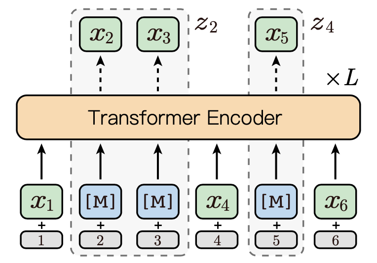
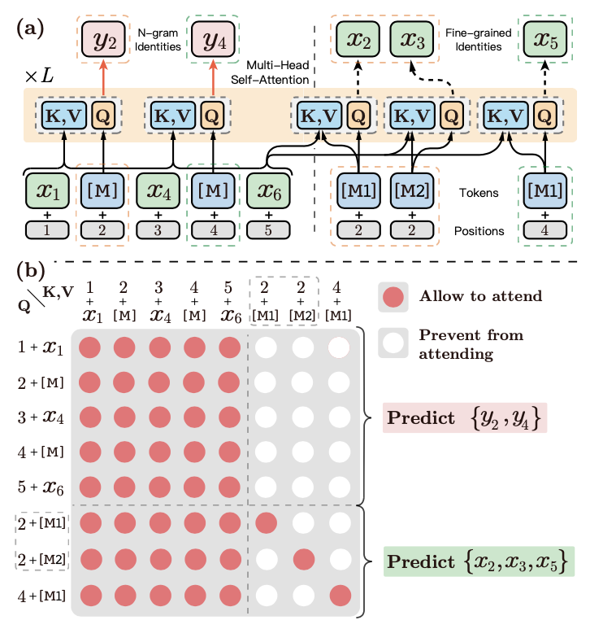
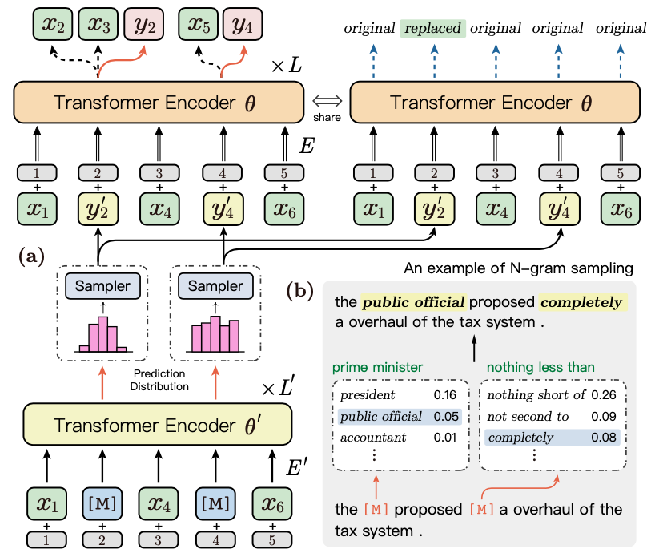

# ERNIE-Gram: Pre-training with Explicitly N-Gram Masked language Modeling for Natural Language Understanding

## 1. ERNIE-Gram的由来

在经典预训练模型BERT中，主要是通过Masked Language Modeling（MLM）预训练任务学习语言知识。在BERT中MLM会随机Masking一些位置的token，然后让模型去预测这些token。这些Masking的token在中文中便是**字**，在英文中便是**sub-word**，这样的预测也许不能让模型获取更加直观的语言知识，所以后续又出现了一些模型，比如ERNIE, SpanBERT等，其从Masking单个字转变成了Masking一系列连续的token，例如Masking实体词，Masking短语等，即从细粒度的Masking转向粗粒度的Masking。

ERNIE-Gram指出一种观点：这种连续的粗粒度Masking策略会忽略信息内部的相互依赖以及不同信息之间的关联。因此，基于这种想法进行改进，提出了一种显式建模n-gram词的方法，即直接去预测一个n-gram词，而不是预测一系列连续的token，从而保证n-gram词的语义完整性。

另外，ERNIE-Gram在预训练阶段借鉴ELECTRA想法，通过引入一个生成器来显式地对不同n-gram词进行建模。具体来讲，其应用生成器模型去采样合理的n-gram词，并用这些词去mask原始的语句，然后让模型去预测这些位置原始的单词。同时还使用了RTD预训练任务，来识别每个token是否是生成的。

## 2. ERNIE和N-Gram的融入方式

上边我们提到了，不同于连续多个token的预测，ERNIE-GRAM采用了一种显式的n-gram方式进行建模，在本节我们将展开讨论ERNIE和显式的n-gram融合建模的方式。ERNIE-Gram主要提出了两种融合方式：Explictly N-gram MLM 和 Comprehensive N-gram Prediction。

在正式介绍之前，我们先回顾一下经典的连续token的建模方式：Contiguously MLM，然后再正式介绍以上ERNIE-Gram提出的两种方式。

### 2.1 Contiguously MLM

给定一串序列$x=\{x_1, x_2, ..., x_{|x|}\}$ 和 n-gram起始边界序列（starting boundaries）$b=\{b_1, b_2, ..., b_{|b|}\}$​，根据$x$和$b$​进行如下约定：

- $z=\{z_1, z_2,..., z_{|b|-1}\}$：由$x$转换成的n-gram序列。
- $M=\{\}$​：从起始边界$b$​​​中随机选择15%的准备Masking的index，组成$M$​​
- $z_M$：由$M$​​选择出的相应的token集
- $z_{\text{\\}M}$: 表示将$x$​​进行Masking后的序列

图1展示了一个Contiguously MLM的例子，给定的序列为$x=\{x_1,x_2,x_3,x_4,x_5,x_6\}$​​​​, 起始边界序列为$b=\{1,2,4,5,6,7\}$​​​, 假设从起始边界序列$b$​​的随机选择的索引为$M=\{2,4\}$​​​, 则

- $z=\{x_1, x_{[2:4)}, x_4, x_5, x_6\}$​​

- $z_M = \{x_{[2:4)}, x_5\}$

- $z_{\text{\\}M}=\{x_1,\text{[M]} , \text{[M]}, x_4, \text{[M]}, x_6\}$

  

Contiguously MLM 可通过如下方式进行优化:

$$
-\text{log} p_{\theta}(z_M|z_{\text{\\}M}) = -\sum_{z \in z_M} \sum_{x \in z} \text{log}\; p_{\theta}(x|z_{\text{\\}M})
$$

图1 contiguously MLM

在讨论完连续的token Masking策略之后，下面我们将继续讨论ERNIE-Gram中提出的两种显式n-gram的建模方式。

### 2.2 Explicitly N-gram Masked Language Modeling

在连续token预测中， 需要预测多次，每次预测一个token，直到完成这一段连续token的所有预测，才表示完成了一个实体词或者短语。不同于连续token预测， 显式的N-gram预测直接去预测一个n-gram词，即站在一种粗粒度的角度上进行预测。

如图2为所示，假设$y=\{y_1,y_3, ..., y_{|b|-1}\}$为显式的n-gram序列，$y_M=\{y_2, y_4\}$为随机选择的Masking token， 则Masking后的完整序列为$\bar {z}_{\text{\\M}}=\{x_1, \text{[M]}, x_4,  \text{[M]}, x_6\}$。

Explicitly N-gram Masked Language Modeling可通过如下方式进行优化：

$$
-\text{log}p_{\theta}(y_M|z_{\text{\\}M}) = -\sum_{y \in y_M} \text{log} \; p_{\theta}(y|\bar{z}_{\text{\\}M})
$$

图2 Explicitly N-gram MLM

### 2.3 Comprehensive N-gram Prediction

通过以上讨论可知，Contiguously MLM是从细粒度角度进行预测连续token，  Explicitly N-gram MLM是从粗粒度角度进行预测n-gram token， 而本节介绍的Comprehensive N-gram是一种融合细粒度和粗粒度的预测方式，其将更加全面地进行建模。其优化的目标函数为以上两种方式的融合，这里需要注意这两种方式是基于统一的上下文$\bar{z}_{\text{\\}M}$进行预测：

$$
-\text{log} \; p_{\theta}(y_M, z_M|\bar{z}_{\text{\\}M}) = -\sum_{y \in y_M} \text{log} \; p_{\theta}(y|\bar{z}_{\text{\\}M})-\sum_{z \in z_M} \sum_{x \in z} \text{log}\; p_{\theta}(x|\bar{z}_{\text{\\}M})
$$

图3a展示了细粒度和粗粒度预测的详细融合方式，其将细粒度的预测位置直接拼接到了序列的末尾，图中以**虚线**分割。其中虚线以左是Explictly N-gram的粗粒度预测，虚线以右是Contiguously MLM的细粒度预测。以$y_2$​​位置为例，由于其包含两个token，所以细粒度预测需要预测2次（论文中这两个位置使用了$M_1$​​和$M_2$​​​这两个不同的token进行Masking）。

此时，整个文本序列为：$[x_1, \text{[M]}, x_4, \text{[M]}, x_6, \text{[M1]}, \text{[M2]}, \text{[M1]}]$​​​​,  为了在Self-Attention时不造成信息的混乱，ERNIE-Gram约定：

- 虚线以左的 Explicitly N-gram MLM 粗粒度预测，即在预测$y_2$和$y_4$​时，只能看见虚线以左的token。
- 虚线以后的Contiguously MLM细粒度预测，即在预测$x_2,x_3$和$x_5$​​时，只能看见自己以及虚线以左的token。

图3b展示了其计算时的Attention矩阵，其中红色点表示相互能够看见，在Self-Attention计算时，相互的信息需要融入。

图3 Comprehensive N-gram Prediction

## 3.  使用生成器显式建模N-gram Relation

为了更加显式地建模不同n-gram之间的关系，在预训练阶段，ERNIE-Gram借鉴了Electra的思路，使用一个生成器去生成一个位置的n-gram词，并且用这个n-gram词去mask该位置的n-gram token。

如图4所示，Transformer Encoder ${\theta}^{'}$​​​​​便是生成器，图4b展示了使用生成的n-gram token去mask原始句子token的一个样例，ERNIE-Gram根据数据Masking位置的词分布采样了public official和completely去替换了原始语句词，即

- 原始语句：the **prime minister** proposed **nothing less than** a overhaul of the tax system.
- Masking语句：the **public official** proposed **completely** a overhaul of the tax system.

然后将Masking语句传入Transformer Encoder $\theta$​中进行训练。

图4 Enhanced N-gram Relation Modeling

假设$y_M^{'} = \{ y_2^{'}, y_4^{'}\}$表示生成的n-gram项， $\bar{z}^{'}_{\text{\\}M}  = \{x_1, y_2^{'}, x_4, y_4^{'},x_6\}$表示用生成n-gram项Masking后的序列，则联合的预训练目标函数为：

$$
-\text{log} \; p_{\theta^{'}}(y_M|\bar{z}_{\text{\\}M ^{'}} ) - \text{log}\; p_{\theta}(y_M, z_M|\bar{z}_{\text{\\}M ^{'}} )
$$

另外，ERNIE-Gram融入了the replaced token detection (RTD)任务，用于识别这些token是否是被生成器替换的token。假设$\hat{z}^{'}_{\text{\\}M }  = \{x_1, y_2, x_4, y_4,x_6\}$​为真实目标n-gram词替换后的序列，则RTD的目标函数为：

$$
\begin{align}
&-\text{log} \; p_{\theta}(\mathbb{1}(\bar{z}^{'}_{\text{\\}M} = \hat{z}_{\text{\\}M} |\bar{z}^{'}_{\text{\\}M}) \\
&= - \sum_{t=1}^{|\hat{z}_{\text{\\}M}|} \text{log}\; p_{\theta}(\mathbb{1}(\bar{z}^{'}_{\text{\\}M,t} = \hat{z}_{\text{\\}M,t} |\bar{z}^{'}_{\text{\\}M,t})
\end{align}
$$

## 4. 相关资料

1. [ERNIE-Gram: Pre-training with Explicitly N-Gram Masked language Modeling for Natural Language Understanding](https://arxiv.org/pdf/2010.12148.pdf)
2. [ERNIE-Gram github](https://github.com/PaddlePaddle/ERNIE/tree/develop/ernie-gram)

