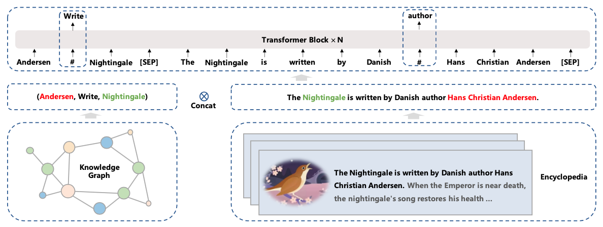

# ERNIE 3.0: Large-scale Knowledge Enhanced Pre-training for Language Understanding and Generation

## 1. ERNIE 3.0的设计思路

**自回归模型（Autoregressive Model, AR）**，通过估计一串文本序列的生成概率分布进行建模。一般而言，AR模型通过要么从前到后计算文本序列概率，要么从后向前计算文本序列概率，但不论哪种方式的建模，都是单向的。即**在预测一个单词的时候无法同时看到该单词位置两边的信息**。假设给定的文本序列$x=(x_1, x_2, ..., x_n)$，其从左到右的序列生成概率为：

$$
p(x)=\prod_{t=1}^n p(x_t|x_{<t})
$$

**自编码模型（Autoencoding Model, AE）**, 通过从破坏的输入文本序列中重建原始数据进行建模。例如BERT通过预测【mask】位置的词重建原始序列。它的**优点**在于在预测单词的时候能够同时捕获该单词位置前后双向的信息；它的**缺点**是预训练过程中采用了mask单词的策略，然而微调阶段并没有，因此导致了预训练阶段和微调阶段的的**GAP**，另外在训练过程中，对不同mask单词的预测是相互独立的。假设序列中被mask的词为$w\in W_m$，未被mask的词为$w\in W_n$，则其相应的计算概率为：

$$
p(x) = \prod_{w\in Wm} p(w|W_n)
$$

一般而言，自回归模型在文本生成任务上表现更好，自编码模型在语言理解任务上表现更好。ERNIE 3.0借鉴此想法，在如下方面进行了改进：

1. ERNIE 3.0同时结合了将自回归和自编码网络，从而模型在文本生成和语言理解任务表现均很好。
2. ERNiE 3.0在预训练阶段中引入了知识图谱数据。

## 2. ERNIE 3.0的模型结构

图1 ERNIE 3.0模型结构

### 2.1 ERNIE 3.0的网络结构

延续ERNIE 2.0的语言学习思路，ERNIE 3.0同样期望通过设置多种预任务的方式辅助模型学习语言的各方面知识，比如词法、句法、和语义信息。这些预训练任务包括自然语言生成、自然语言理解和关系抽取等范畴。ERNIE 3.0期望能够在这三种任务模式（task paradigm）中均能获得比较好的效果，因此提出了一个通用的多模式预训练框架，这就是ERNIE 3.0，如图1所示。

ERNIE 3.0认为不同的任务模式依赖的自然语言的底层特征是相同的，比如词法和句法信息，然而不同的任务模式需要的上层具体的特征是不同的。自然语言理解的任务往往倾向于学习语义连贯性，然而自然语义生成任务却期望能够看见更长的上下文信息。

因此，ERNIE 3.0设计了上下两层网络结构：Universal Representation Module 和 Task-specific Representation Module。其中各个模式的任务共享Universal Representation Module，期望其能够捕获一些通用的基础特征； Task-specific Representation Module将去具体适配不同模式的任务（生成和理解），去抽取不同的特征。

前边提到，自回归模型在文本生成任务上表现更好，自编码模型在语言理解任务上表现更好。因此，ERNIE 3.0在上层使用了两个网络，一个用于聚焦自然语言理解，一个用于聚焦自然语言生成任务。这样做主要有两个好处：

1. 不同任务适配更合适的网络，能够提高模型在相应任务上的表现。
2. 在fune-tuning阶段，可以固定Universal Representation Module，只微调Task-specific Representation Module参数，提高训练效率。

### 2.2 Universal Representation Module

此部分使用Transformer-XL作为骨干网络，Transformer-XL允许模型使用**记忆循环机制**建模更长的文本序列依赖。在实验中，Universal Representation Module设置了比较多的层数和参数，用以加强捕获期望的词法和句法底层语言特征能力。

这里需要注意的一点是，记忆循环机制只有在自然语言生成任务上会使用。

### 2.3  Task-specific Representation Module

此部分同样使用了Transformer-XL作为骨干网络，Task-specific Representation Module将用于根据不同模式的任务去学习task-specific的高层语义特征。

在ERNIE 3.0的设置中，Universal Representation Module采用了Base版的Transformer-XL，其层数会比Universal Representation Module少。

另外，ERNIE 3.0采用了两种任务模式的Representation Module，一个是NLU-specific Representation Module，另一个是NLG-specific Representation Module，其中前者是一个双向编码网络，后者是个单向编码网络。

## 3. 不同类型的预训练任务

### 3.1 Word-aware Pre-training Task

#### 1. Knowledge Masked Language Modeling

Knowledge Masking策略包含三个级别：`token级别(Basic-Level)`、`短语级别(Phrase-Level)` 和 `实体级别(Entity-Level)`。通过对这三个级别的对象进行
Masking，提高模型对字词、短语的知识理解。

**图2**展示了这三个级别的Masking策略和BERT Masking的对比，显然，Basic-Level Masking 同BERT的Masking一样，随机地对某些单词(如 written)进行Masking，在预训练过程中，让模型去预测这些被Mask后的单词；Phrase-Level Masking 是对语句中的短语进行masking，如 a series of；Entity-Level Masking是对语句中的实体词进行Masking，如人名 J. K. Rowling。

 图2 ERNIE和BERT的Masking策略对比 

#### 2. Document Language Modeling

ERNIE 3.0 选择使用传统的语言模型作为预训练任务，期望减小模型的语言困惑度。同时采用了ERNIE-Doc中提出的记忆循环机制，以建模更长的序列依赖。

### 3.2 Structure-aware Pre-training Tasks

#### 1. Sentence **Reordering** Task

将给定的文档依次划分为1-m段，然后打乱这些段，让模型对这些段进行排序，是个k分类问题，这能够帮助模型学习语句之间的关系。

将文档划分为2段，那么排列组合后将有 $2!$ 个可能；将文档划分为3段，那么排列组合后将有 3! 个可能；依次类推，将文档划分为 n 段，那么排列组合后将有 n! 个可能。因此ERNIE将这个任务建模成了一个 k 分类问题，这里 $k=\sum_{n=1}^m n!$。

#### 2. Sentence Distance Task

预测两个句子之间的距离，是个3分类任务。对应的Label依次是0、1和2。其中0代表两个句子在同一篇文章中，并且他们是相邻的；1代表两个句子在同一篇文章中，但他们不是相邻的；2代表两个句子不在同一篇文章中。

### 3.3 Knowledge-aware Pre-training Tasks

为了向预训练模型中引入知识，ERNIE 3.0 尝试在预训练阶段引入了universal knowledge-text prediction（UKTP）任务，如图3所示。

给定一个三元组<head, relation, tail>和一个句子，ERNIE 3.0会mask掉三元组中的实体关系relation，或者句子中的单词word，然后让模型去预测这些内容。当预测实体关系的时候，模型不仅需要考虑三元组中head和tail实体信息，同时也需要根据句子的上下文信息来决定head和tail的关系，从而帮助模型来理解知识。

> 这个操作基于远程监督的假设：如果一个句子中同时出现head和tail两个实体，则这个句子能够表达这两个实体的关系。

另外，当预测句子中的单词word时，模型不仅需要考虑句子中的上下文信息，同时还可以参考三元组<head, relation, tail>的实体关系。

图3 universal knowledge-text prediction

## 4. 相关资料

1. [ERNIE 3.0: LARGE-SCALE KNOWLEDGE ENHANCED PRE-TRAINING FOR LANGUAGE UNDERSTANDING AND GENERATION](https://arxiv.org/pdf/2107.02137.pdf)
2. [ERNIE-DOC: A Retrospective Long-Document Modeling Transformer](https://arxiv.org/pdf/2012.15688.pdf)
