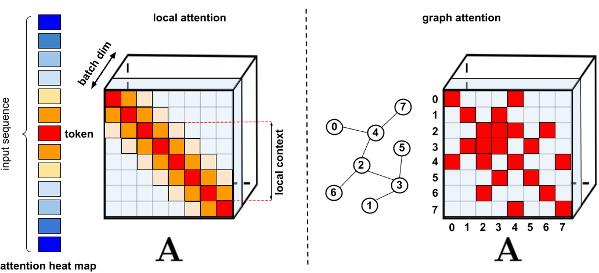
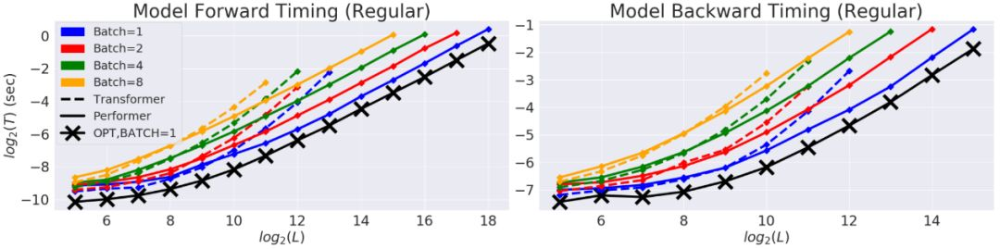

# Performer
## 1. 介绍

基于Transformer模型在众多领域已取得卓越成果，包括自然语言、图像甚至是音乐。然而，Transformer架构一直以来为人所诟病的是其注意力模块的低效，即长度二次依赖限制问题。随着输入序列长度的增加，注意力模块的问题也越来越突出，算力和内存消耗是输入序列长度的平方。

### 1.1 基于Transformer模型应对长输入序列
比较早期的是从内存方面入手，Transformer-XL和内存压缩的Transformer。另一种方法是各种稀疏注意力机制。稀疏注意力机制不再暴力地计算所有token之间的注意力，而仅仅计算出有限token对之间的相似度得分。这些需要重点attend的稀疏注意力项可以是人工指定，也可以是通过优化方法找到的，还可以是通过学习学到的，甚至可以是随机的。

由于稀疏矩阵也可以用图和边来表示，所以稀疏化方法也是由图神经网络文献所启发的，具体关系在图注意力网络中概述。这种基于稀疏性的架构通常需要额外的层来隐含产生完整的注意力机制。

标准的稀疏化技术。左：稀疏模式的例子，其中tokens只关注其他附近的tokens。右：在图注意力网络中，tokens只关注图中的邻居，这些邻居应该比其他节点有更高的相关性。

目前的这些稀疏注意力方法仍然有以下局限：

+ 需要高效的稀疏矩阵乘法运算，而这些运算并不是所有加速器都能提供。比如Longformer的实现采用TVM技术将计算自注意力的代码编译为CUDA核。
+ 通常缺乏严格的理论保证。这点Big Bird是有的。
+ 主要针对Transformer模型和生成式预训练进行优化。
+ 通常需要堆叠更多的注意力层来补偿稀疏表征，这使得它们很难与其他预训练模型一起使用，因此需要进行再训练，这就很费时费力。

除了上述这些缺点之外，稀疏注意机制往往还无法解决常规注意方法所应用的全部问题，比如如 Pointer Networks。此外，还有一些操作是无法进行稀疏化的，比如softmax操作。

为了解决这些问题，Performer提出了一个具有线性复杂度的注意力，其注意力机制可线性扩展，从而实现更快的训练，同时允许模型处理较长的长度，这对于某些图像数据集（如ImageNet64）和文本数据集（如PG-19）是必需的。Performer 使用一个高效的（线性）广义注意力框架（generalized attention framework），允许基于不同相似性度量（核）的一类广泛的注意力机制。该框架通过谷歌的新算法 FAVOR+（ Fast Attention Via Positive Orthogonal Random Features）来实现，后者能够提供注意力机制的可扩展低方差、无偏估计，这可以通过随机特征图分解（常规 softmax-attention）来表达。该方法在保持线性空间和时间复杂度的同时准确率也很有保证，也可以应用到独立的 softmax 运算。此外，该方法还可以和可逆层等其他技术进行互操作。

## 2. 两种常规的注意力机制回顾
用L表示输入的token序列的长度，常规的点乘注意力就是一个映射，把矩阵Q，K，$V \in \mathbb{R}^{L \times d}$作为输入，其中d代表的是隐含维度。矩阵Q,K,V是输入的中间表示，他们的行分别表示为连续字典数据结构的queries，keys，values。双向的点乘注意力有如下的形式，其中$A\in \mathbb{R}^{L \times L}$ 叫做注意力矩阵：

$$ Att_{\longleftrightarrow}(Q,K,V)=D^{-1}AV $$

$$A=exp(\frac{QK^T}{\sqrt{d}})$$

$$D=diag(A1_{L})$$

其中这里的$exp(\cdot)$ 是元素级别的，$1_{L}$长度为L的全1向量，$diag(\cdot)$是对角矩阵。时间复杂度为$O(L^2d)$，空间复杂度为$ O(L^2+Ld) $，因为A需要显式的存储。原则上，点乘注意力的类型和端到端的长序列处理是不相容的。在Seq2Seq结构的encoder自注意力和encoder-decoder注意力应用的是双向注意力。

另一种重要的注意力类型是无向点积注意力有着如下的形式：

$$Att_{\longleftrightarrow}(Q,K,V)=\tilde{D}^{-1}\tilde{A}V $$

$$\tilde{A}=tril(A)$$

$$\tilde{D}=diag(\tilde{A}1_{L})$$

其中$tril(\cdot)$返回参数矩阵的下三角部分，包括对角线。无向的注意力用于自回归生成式模型，例如生成式Transformers中的自注意力，和Seq2Seq Transformers中的decoder部分。

## 3. 广义注意力

在以往的注意力机制中，分别对应矩阵行与列的 query 和 key 输入相乘，通过 softmax 计算形成一个注意力矩阵，以存储相似度系数。值得注意的是，这种方法不能将 query-key 生成结果传递给非线性 softmax 计算之后，再将其分解为原始的 query 和 key。然而，将注意力矩阵分解为原始 query 和 key 的随机非线性函数的乘积是可以的，即所谓的随机特征（random feature），这样就可以更加高效地对相似度信息进行编码。

LHS：标准注意力矩阵，由 query(表示为q) 和 key(表示为k) 上的softmax计算组成，表示两两之间的相似得分。RHS：标准注意力矩阵可以通过低阶随机化矩阵Q′和K′来近似，行编码由随机化非线性函对原始query/key进行编码而得到。对于常规的softmax-attention，变换非常紧凑，涉及指数函数以及随机高斯影。

常规的 softmax 注意力可以看作是由指数函数和高斯投影定义的非线性函数的一个特例。在这里我们也可以反向推理，首先实现一些更广义的非线性函数，隐式定义 query-key 结果中其他类型的相似性度量或核函数。研究者基于早期的核方法（kernel method），将其定义为广义注意力（generalized attention）。尽管对于大多核函数来说，闭式解并不存在，但这一机制仍然可以应用，因为它并不依赖于闭式解。

## 4. FAVOR+：通过矩阵相关性实现快速注意力

上文描述的分解允许我们以线性而非二次内存复杂度的方式存储隐式注意力矩阵。我们还可以通过分解获得一个线性时间注意力机制。虽然在分解注意力矩阵之后，原始注意力机制与具有值输入的存储注意力矩阵相乘以获得最终结果，我们可以重新排列矩阵乘法以近似常规注意力机制的结果，并且不需要显式地构建二次方大小的注意力矩阵。最终生成了新算法 FAVOR+。

### 4.1 FAVOR+理论

FAVOR+使用矩阵$A \in  \mathbb{R}^{L \times L} $，$A(i,j)=K(q_{i}^T,k_{j}^T)$，其中$q_{i}/k_{j}$代表的是Q/K中第$i^{th}/j^{th}$ 的query/key 行向量，核K：$\mathbb{d}^d \times \mathbb{d}^d \rightarrow R_{+}$ 定义为映射$\phi$:$\mathbb{R}^d \rightarrow \mathbb{R}^r_{+}$，公式为：

$$K(x,y)=\mathbb{E}[(\phi(x)^T \phi(y))]$$

我们把$\phi(u)$是一个随机特征图（random feature map），其中$u \in \mathbb{R}^d$。$Q^{'},K^{'} \in \mathbb{R}^{L \times r}$，行分别用$\phi(q_{i}^T)^T$和$\phi(k_{i}^T)^T$表示，上述核函数直接促成了高效注意力机制：

$$\widehat{Att\longleftrightarrow}(Q,K,V)=\widehat{D}^{-1}(Q^{'}((K^{'})^{T}V))$$
$$\widehat{D}=diag(Q^{'}((K^{'})1_{L}))$$

$\widehat{Att\longleftrightarrow}$表示的是近似注意力，括号表示的是计算的顺序。很容易得到这个机制的空间复杂度为$O(Lr+Ld+rd)$，时间复杂度为$O(Lrd)$，而常规的注意力机制的空间复杂度为$O(L^2+Ld)$，时间复杂度为$O(L^2d)$

### 4.2 双向注意力近似

左：标准注意力模块计算，其中通过执行带有矩阵 A 和值张量 V 的矩阵乘法来计算最终的预期结果；右：通过解耦低秩分解 A 中使用的矩阵 Q′和 K′以及按照虚线框中指示的顺序执行矩阵乘法，研究者获得了一个线性注意力矩阵，同时不用显式地构建 A 或其近似。

### 4.3 单向注意力近似

上述分析与双向注意力（即非因果注意力）相关，其中没有过去和未来的概念。对于输入序列中没有注意前后 token 的单向（即因果）注意力而言，研究者稍微修改方法以使用前缀和计算（prefix-sum computation），它们只存储矩阵计算的运行总数，而不存储显式的下三角常规注意力矩阵。

左：标准单向注意力需要 mask 注意力矩阵以获得其下三角部分；右：LHS 上的无偏近似可以通过前缀和获得，其中用于 key 和值向量的随机特征图的外积（outer-product）前缀和实现动态构建，并通过 query 随机特征向量进行左乘计算，以在最终矩阵中获得新行。

### 4.4 softmax-kernels近似softmax
把$\phi$用下面的形式表示，函数为$f_{1},...f_{l}:\mathbb{R} \rightarrow \mathbb{R}$， 函数$g:\mathbb{R}^d \rightarrow \mathbb{R}$和

$$
\phi(x)=\frac{h(x)}{\sqrt(m)}(f_{1}(w_{1}^Tx),...,f_{1}(w_{m}^Tx),...,f_{l}(w_{m}^Tx))
$$
这可以对大多数的核方法进行建模。大多数情况下，D各向同性的，通常是高斯分布。例如

$$h(x)=1,l=1, D=N(0,I_{d})$$
可以得到PNG核，配置：

$$
h(x)=1,l=2,f_{1}=sin,f_{2}=cos
$$

对应的是平移不变性核，特别地

$$
D=N(0,I_{d})
$$

就变成了高斯核 $K_{gauss}$。常规的注意力矩阵的softmax-kernel如下：

$$
SM(x,y)=exp(x^Ty)
$$

不失一般性，省去了$\sqrt{d}$，因为我们可以对keys核queries进行规范化。

$$SM(x,y)=exp(\frac{||y||^2}{2})K_{gauss}(x,y)exp(\frac{||y||^2}{2})$$

通过使用三角函数，我们得到了$SM(x,y)$随机特征图无偏近似：

$$
h(x)=exp(\frac{||x||^2}{2}),l=2,f_{1}=sin,f_{2}=cos
$$

我们把它叫做$\hat{SM}_{m}^{trig}(x,y)$，后面还有一堆理论的分析，有兴趣的可以翻翻论文。

### 4.5 正交随机特征（ORF）

上面的部分组成了FAVOR+的R+部分，还差O部分要解释。为了进一步减少估计的反差，我们引入了不通的随机样本$w_{1},...,w_{m}$是正交的(orthogonal)。ORF是一个众所周知的方法，但事实证明它是有效的，特别是我们为softmax引入的PRF，我们的第一个理论实验结果表明ORFs可以应用于任何维数d的softmax/高斯核估计的方差的降低，而不仅仅是对足够大的d的渐近估计，这导致了大偏差上的第一个指数小界限严格小于非正交方法的概率。随机特征的正性在这些界限中起着关键作用。

## 5. 实验结果

对 Performer 的空间和时间复杂度进行基准测试，实验结果表明，注意力机制的加速比和内存减少在实证的角度上近乎最优，也就是说，这非常接近在模型中根本不使用注意力机制的情况。

在以时间(T)和长度(L)为度量的双对数坐标轴中，常规 Transformer 模型的双向 timing。行方向的终点是GPU内存的极限。黑线(X)表示使用;注意力块时可能的最大内存压缩和加速，它基本上绕过了注意力计算，代表着模型可能的最大效率。Performer模型在注意力部分几乎能够达到这种最佳性能。

文章进一步证明使用无偏 softmax 近似的Performer 模型，在微调之后可以向后兼容预训练 Transformer 模型，从而在提升推理速度的同时降低能耗，且无需完全重新训练已有的模型。

使用 One Billion Word Benchmark（LM1B）数据集，将原始预训练的Transformer权重直接迁移到Performer模型中，这个初始结果的精度是0.07（橙色虚线）。经过微调，Performer 的精度在很少的梯度步数之后就迅速恢复了。

## 6. 案例：蛋白质序列建模

蛋白质是具有复杂三维结构和特定功能的大分子，对生命来说至关重要。与单词一样，蛋白质被指定为线性序列，其中每个字符是20个氨基酸构建块中的一个。

将 Transformers 应用于大型未标记的蛋白质序列产生的模型可用于对折叠的功能性大分子进行准确的预测。

Performer-ReLU (使用基于 relu 的注意力，这是一个不同于 softmax 的广义注意力)在蛋白质序列数据建模方面有很强的表现，而 Performer-Softmax 与 Transformer 的性能相匹配，正如理论所预测的结果那样。

下面，我们可视化一个蛋白质Performer模型，使用基于 relu 的近似注意力机制进行训练，使用 Performer 来估计氨基酸之间的相似性，从序列比对中分析进化替换模式得到的替换矩阵中恢复类似的结构。

更一般地说，我们发现局部和全局注意力机制与用蛋白质数据训练的Transformer模型一致。Dense Attention的近似Performer有可能捕捉跨越多个蛋白质序列的全局相互作用。

作为概念的验证，对长串联蛋白质序列进行模型训练，会使得常规 Transformer 模型的内存过载，但 Performer模型的内存不会过载，因为它的空间利用很高效。

## 7. 总结

Google AI的这项工作有助于改进基于非稀疏的方法和基于Kernel的Transformer，这种方法也可以与其他技术互操作，研究人员甚至还将 FAVOR 与Reformer的代码集成在一起。同时研究人员还提供了论文、 Performer的代码和蛋白质语言模型的代码链接。

该研究首次证明了，任意注意力矩阵都可以通过随机特征在下游 Transformer 应用中实现有效地近似。实现这一点的的新机制是使用正随机特征，即原始 query 和 key 的正直非线性函数，这对于避免训练过程中的不稳定性至关重要，并实现了对常规 softmax 注意力的更准确近似。Performer的研究开辟了一种关于Attention、Transformer架构甚至Kernel的全新的思维方式，对于进一步的改进有巨大的启示作用。

## 参考文献

[Rethinking attention with performers](https://arxiv.org/abs/2009.14794)
