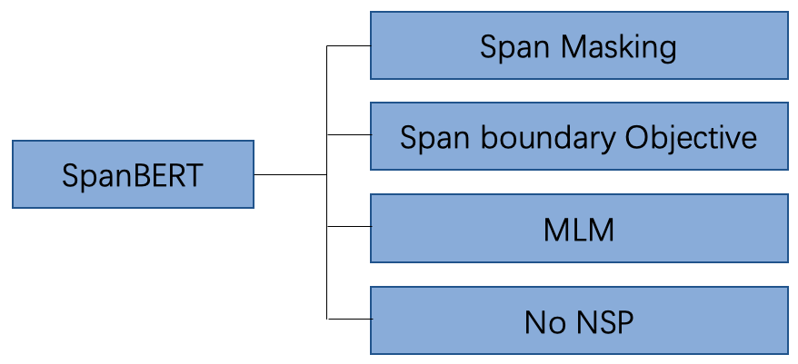
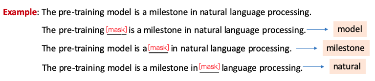
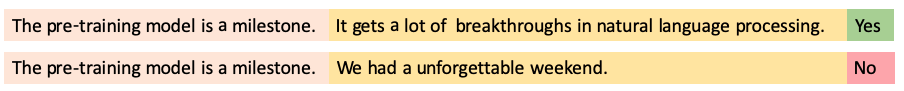
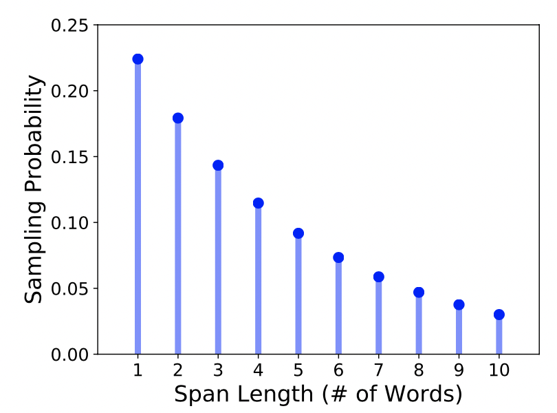

# SpanBERT: Improving Pre-training by Representing and Predicting Spans

## 1. SpanBERT的技术改进点

相比于BERT，SpanBERT主要是在预训练阶段进行了调整，如图1所示，具体包含以下几部分：

- 随机地Masking一段连续的token
- 增加了一项新的预训练任务：Span boundary Objective (SBO)
- 去掉了NSP任务

图1 SpanBERT改进点汇总图

在接下来的内容中，我们将对这些预训练任务进行详细探讨，特别是前两个改进点。但是在正式讨论之前，我们先来回顾一下经典的BERT模型中的预训练任务。

## 2. BERT模型中的预训练任务

在BERT模型预训练阶段，主要使用了两项预训练任务Masking Language Model (MLM)以及Next Word Prediction (NSP)。

### 2.1 Masking Language Model (MLM)

在训练语料中，会选择一批token替换为Mask token，MLM任务旨在利用语句的上下文双向信息，恢复语句中被Mask的token，以帮助模型学习语言知识。图2给出了关于MLM任务一个示例，其中在预测单词model的时候，模型将会利用model前后的信息进行推断被Masking的单词，特别是在看到pre-training和natural language processing等信息时，比较容易能够推断出这个单词就是model。

图2 MLM样例图

在BERT模型预训练阶段，总共Masking掉语料中15%的token，但是这里存在一个问题：在fine-tune阶段以及预测时的输入文本中并不包含Mask token，这样就造成了预训练阶段和fine-tune/预测阶段的GAP。所以BERT在这批被Mask的token中采用了不同的Masking策略，具体如下：

- 80%的token被替换为Mask token
- 10%的token被随机替换为其他词
- 10%的token保持不变

### 2.2 Next Word Prediction (NSP)

在BERT的训练语料中，部分输入文本是由无关的两段语句进行拼接而成，部分输入文本是由本来就前后相邻的两段语句拼接而成。NSP任务旨在去识别一个输入文本是否是相邻的两句话拼接而成。图3给出了关于NSP的一个语料文本示例。

图3 NSP样例图

## 3. SpanBERT的预训练任务

### 3.1 Span Masking

在BERT的Masking策略中，每个被mask的token被随机选择，所以被选择的这些token是比较分散的。然而Span Masking则是需要随机地Mask连续的多个token。

具体来讲，首先SpanBERT根据几何分布$Geo(p)$采样一个Span的长度$l$，该几何分布倾向于选择短Span。然后在文本中随机选择起始点，即从起始点开始的$l$长度token将会被Mask。图4展示了Span采样长度图。

这里需要注意一点，SpanBERT在采样时，选择的是完整的word序列，而不是subword序列。

图4 Span采样长度图

### 3.2 Span Boundary Object (SBO)

SpanBERT期望Span边界的token能够尽可能多地汇总Span内部的信息，所以引入了SBO预训练目标。如图5所示，masking的连续token为""an American football game"，SBO任务期望使用Span的边界token$x_4$和$x_9$​​来预测Span内容。

图5 SBO样例图

具体来讲，给定一串序列$\text{X}=\{x_1, x_2, ..., x_n\}$​，假设Mask的连续token为$(x_s,...,x_e)$​, $x_s$​和$x_e$​代表起始token和末端token。SpanBERT将使用边界token $x_{s-1}$​和$x_{e+1}$​​来计算Span内部的每个token。

$$
y_i = f(x_{s-1}, x_{e+1}, P_{i-s+1})
$$

其中，$P_{i-s+1}$代表Span内部的token$x_i$相对于边界token$x_{s-1}$​的相对位置编码。以上公式具体是这么计算的。

$$
\begin{align}
h_0 &= [x_{s-1};x_{e+1};P_{i-s+1}] \\
h_1 &= \text{LayerNorm}(\text{GeLU}(W_1h_0))\\
y_i &= \text{LayerNorm}(\text{GeLU}(W_2h_1))
\end{align}
$$

### 3.3 MLM与SBO融合计算

如上图所示， 在预测单词football的时候，即使用了MLM任务去预测单词football，同时又使用了SBO任务去预测football，最终将二者进行相加。相应公式为：

$$
\begin{align}
L(x_i) &= L_{\text{MLM}}(x_i)+L_{\text{SBO}}(x_i) \\
& = -\text{log}P(x_i|\text{x}_i) - \text{log}P(x_i|y_i)
\end{align}
$$

### 3.4 去掉NSP任务

SpanBERT去掉了NSP任务，即输入文本是一个比较长的句子，大部分情况下这样的设置，实验效果会更好。

## 4. 相关资料

1. [SpanBERT: Improving Pre-training by Representing and Predicting Spans](https://arxiv.org/pdf/1907.10529.pdf)

2. [SpanBERT Github](https://github.com/facebookresearch/SpanBERT)
