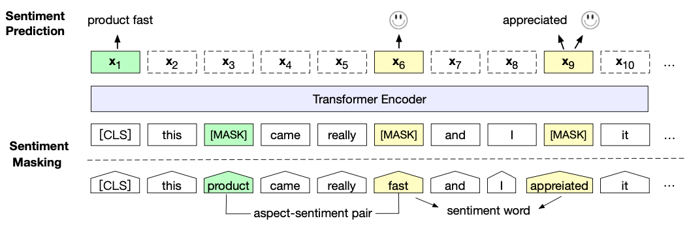

# SKEP: Sentiment Knowledge Enhanced Pre-training for Sentiment Analysis

## 1. SKEP的设计思路

近年来，NLP领域的预训练模型发展如火如荼，各种基于transformer结构的改进模型被相继提出。然而这些模型绝大部分都是在训练一种通用的模型，期望这种通用模型能够学习到足够多的语言知识，以应对各种语言相关的任务。然而，SKEP则是期望训练一个专注于情感分析方面的通用模型，希望能够利用这个模型提高情感分析方面的各项任务，比如语句级别的情感分析（Sentiment-Level）、目标级的文本分类（Aspect-Level）、情感信息提取（Opinion Extraction）等等。

更具体地，SKEP采用了类似MLM Masking的策略，在模型预训练任务中执行了Sentiment Masking策略，其将用来Masking和感情相关的一些token。并且SKEP基于情感词（Sentiment Word）、词的极性（Word Polarity）和目标感情词对（Aspect Sentiment Pair）三个方面分别构造了对应的预训练目标函数，用于提高SKEP模型对情感信息建模能力。

## 2. SKEP的实现概况

图1 SKEP的实现概况图

前边我们提到，SKEP将情感信息注入到了模型的预训练过程中。SKEP汇总了三种类别的情感信息：情感词（Sentiment Word, SW）、词的极性（Word Polarity, WP）和目标感情词对（Aspect Sentiment Pair, AP）。在图1中，情感词便是fast和appreciated；目标感情词对是个词组，一般由一个名词和一个描述该名词的感情词组成，如product fast；词的极性表示这个词的感情色彩是正向的还是负向的。

SKEP在模型实现中主要包含两个方面：Sentiment Masking和三个Sentiment Pre-training Objectives。其中Sentiment Masking是指在识别一个句子$X=\{x_1, x_2, ..., x_n\}$中的情感相关词后，将这些词进行Masking，产生一个"破坏"版本的句子$\tilde{X} = \{\tilde{x_1}, \tilde{x_2}, ..., \tilde{x_n}\}$，然后要求模型从这些被"破坏" 的句子重建原始的完整句子，这个方式和MLM策略是类似的。

另外，SKEP根据上边提到的三类情感信息，分别设计对应的预训练目标函数，以帮助模型学习情感信息知识，重建被"破坏"的语句。包括情感词预测，情感词极性预测，目标级情感词对预测等。如图1所示，在appreciated位置进行了情感词预测，在fast位置进行了情感词极性预测，在CLS位置进行了目标级情感词对预测。

## 3. 无监督情感知识挖掘

前边我们提到，SKEP需要识别一个句子中的情感词，然后再对其进行Masking操作。这里有个问题，SKEP如何去识别一个词是否是情感词？论文中，SKEP使用了一种经典的、简单有效的方法：Mutual Information，简称PMI。SKEP利用PMI方法从大量无监督的语料中去挖掘情感信息，最终构造成一个情感信息知识库，利用该知识库进行识别一个词是否是情感词。

PMI方法仅仅需要少量带有情感极性的词进行算法初始化，这些词被称为seed word。PMI的计算流程大概分为以下三个步骤：

1. 构建一批候选词对，其中每个词对包含一个seed word。
2. 根据词对中这两个词的共现关系计算PMI：$\text{PMI}(w_1, w_2) = log\;\frac{p(w_1, w_2)}{p(w_1)p(w_2)} $
3. 最终，一个词的情感极性由该词和所有正向seed words和负向seed words的PMI分数计算得到：$\text{WP}(w) = \sum_{\text{wp}(s)=+} \text{PMI}(w,s) - \sum_{\text{wp}(s)=-} \text{PMI}(w,s)$

在经过以上方式的计算之后，便可以获得一个情感信息知识库，其包括大量带有情感性的情感词，以及相应的目标级情感词对。

## 4. Sentiment Masking

本小节将详细讨论一下Sentiment Masking的实现策略，其主要包含两个阶段：利用知识库检测情感信息和对情感信息进行Masking。下面我们来进一步讨论这两个事情。

### 4.1 利用知识库检测情感信息

这一步主要是利用知识库去检测情感词 Sentiment Word和目标即情感词对 Aspect-Sentiment Pair。对于Sentiment Word检测来说，直接判断语句中的单词是否在情感知识库中便可，如果在知识库中，则其是一个Sentiment Word；对于Aspect-Sentiment Pair检测来说，首先需要判断一个单词是否情感词，如果其是情感词，则在该词附近查找最近的名词，从而组成一个Aspect-Sentiment Pair，这里情感词和名词之间的距离被控制在3个单词。

### 4.2 对情感信息进行Masking

根据以上的情感信息划分，语句中存在三种类型的Token：Sentiment Word, Aspect-Sentiment Pair 和 Common Token。那如何对这三种Token进行掩码呢？

对于Sentiment Word Token来讲，句子中的Sentiment Word被随机选择进行Masking，被Masking的Token总量不超过10%。

对于Aspect-Sentiment Pair Token来讲，一句话中最多2个词对被选择进行Masking，每个词对中的两个单词需要被同时Masking。这种处理方式有利于帮助模型提高捕获目标级情感词对的能力。

对于Common Token来讲，如果Masking后的Sentiment Word Token数量少于10%，则由Common Token进行补充。

## 5. Sentiment Pre-training Objectives

第3节提到SKEP共设计了三种类型的预训练目标函数，分别是：Sentiment Word (SW) Prediction $L_{sw}$，Word polarity (WP) Prediction $L_{wp}$以及Aspect-Sentiment Pair (AP) Prediction $L_{ap}$，这三种训练目标将以联合训练的形式进行训练，如下所示：

$$
L=L_{sw}+L_{wp}+L_{ap}
$$

### 5.1 Sentiment Word (SW) Prediction

假设第$i$个位置的模型输出向量为$\tilde{x_i}$，然后可以根据如下公式进行预测该位置的输出单词，然后累计所有预测单词的损失：

$$
\hat{y} = \text{softmax}(\tilde{x_i}W+b) \\
L_{sw} = -\sum_{i=1}^{i=n} m_i \times y_i \; log\; \hat{y}_i
$$

如果一个序列中，第$i$个Token为被Masking，则$m_i=1$，否则$m_i=0$。

### 5.2 Word polarity (WP) Prediction 

一个单词的极性是很重要的情感信息，在建模过程中，应当把这部分信息融入进来。因此在训练过程中，SKEP引入了该目标函数，要求模型去判断Sentiment Word的情感极性，以此提高模型对情感信息的建模能力。

### 5.3 Aspect-Sentiment Pair (AP) Prediction

在一个语句中，挖掘出的Aspect-Sentiment Pair两个词，往往是并不是互斥的。因此SKEP使用CLS位置的输出向量，通过多标签分类的方式去预测Aspect-Sentiment Pair中的两个词。相关公式如下：

$$
\hat{y}_a = \text{sigmoid}(\tilde{x}_{\text{cls}} W_{ap} + b_{ap}) \\
L_{ap} = -\sum_{a=1}^{a=A} y_a \; log \; \hat{y}_a
$$

其中，$\tilde{x}_{\text{cls}}$表示CLS Token的输出向量， $A$表示输入的语句中Aspect-Sentiment Pair的数量，$\hat{y}_a$经过sigmoid函数后的单词概率分布，$y_a$表示稀疏的Aspect-Sentiment Pair表示。

## 6. 相关资料

1. [SKEP: Sentiment Knowledge Enhanced Pre-training for Sentiment Analysis](https://arxiv.org/abs/2005.05635)
2. [SKEP Github](https://github.com/baidu/Senta.)
