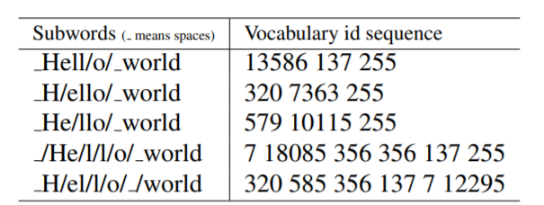
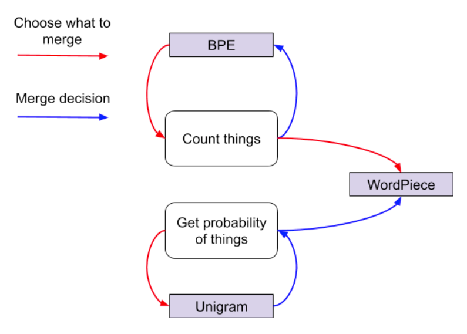

# Subword

## 1. Subword介绍

### 分词器是做什么的？
机器无法理解文本。当我们将句子序列送入模型时，模型仅仅能看到一串字节，它无法知道一个词从哪里开始，到哪里结束，所以也不知道一个词是怎么组成的。所以，为了帮助机器理解文本，我们需要

1. 将文本分成一个个小片段
2. 然后将这些片段表示为一个向量作为模型的输入
3. 同时，我们需要将一个个小片段（token) 表示为向量，作为词嵌入矩阵， 通过在语料库上训练来优化token的表示，使其蕴含更多有用的信息，用于之后的任务。

### 为什么需要分词？

在NLP任务中，神经网络模型的训练和预测都需要借助词表来对句子进行表示。 传统构造词表的方法，是先对各个句子进行分词，然后再统计并选出频数最高的前N个词组成词表。通常训练集中包含了大量的词汇，以英语为例，总的单词数量在17万到100万左右。 出于计算效率的考虑，通常N的选取无法包含训练集中的所有词。 因而，这种方法构造的词表存在着如下的问题：


+ 实际应用中，模型预测的词汇是开放的，对于未在词表中出现的词(Out Of Vocabulary, OOV)，模型将无法处理及生成；

+ 词表中的低频词/稀疏词在模型训练过程中无法得到充分训练，进而模型不能充分理解这些词的语义；

+ 一个单词因为不同的形态会产生不同的词，如由”look”衍生出的”looks”, “looking”, “looked”，显然这些词具有相近的意思，但是在词表中这些词会被当作不同的词处理，一方面增加了训练冗余，另一方面也造成了大词汇量问题。

一种解决思路是使用字符粒度来表示词表，虽然能够解决OOV问题，但单词被拆分成字符后，一方面丢失了词的语义信息，另一方面，模型输入会变得很长，这使得模型的训练更加复杂难以收敛。

### 分词方法
分词的方法有很多，主要包括基于空格的分词方法，基于字母的分词方法和基于子词的分词方法，也可以自己设定一些分隔符号或者规则进行分词等等。基于子词的分词方法包括Byte Pair Encoding (BPE), WordPiece和Unigram Language Model。下面的章节会详细介绍这几种方法。

## 2. 基于空格的分词方法

一个句子，使用不同的规则，将有许多种不同的分词结果。我们之前常用的分词方法将空格作为分词的边界。也就是图中的第三种方法。但是，这种方法存在问题，即只有在训练语料中出现的token才能被训练器学习到，而那些没有出现的token将会被$<UNK>$等特殊标记代替，这样将影响模型的表现。如果我们将词典做得足够大，使其能容纳所有的单词。那么词典将非常庞大，产生很大的开销。同时对于出现次数很少的词，学习其token的向量表示也非常困难。除去这些原因，有很多语言不用空格进行分词，也就无法使用基于空格分词的方法。综上，我们需要新的分词方法来解决这些问题。

## 3. 基于字母的分词方法

将每个字符看作一个词。

### 优点

不用担心未知词汇，可以为每一个单词生成词嵌入向量表示。

### 缺点

+ 字母本身就没有任何的内在含义，得到的词嵌入向量缺乏含义。
+ 计算复杂度提升（字母的数目远大于token的数目）
+ 输出序列的长度将变大，对于Bert、CNN等限制最大长度的模型将很容易达到最大值。

## 4. 基于子词的分词方法

为了改进分词方法，在$<UNK>$数目和词向量含义丰富性之间达到平衡，提出了Subword Tokenization方法。这种方法的目的是通过一个有限的单词列表来解决所有单词的分词问题，同时将结果中token的数目降到最低。例如，可以用更小的词片段来组成更大的词：

```
“unfortunately” = “un” + “for” + “tun” + “ate” + “ly”
```
它的划分粒度介于词与字符之间，比如可以将”looking”划分为”look”和”ing”两个子词，而划分出来的”look”，”ing”又能够用来构造其它词，如”look”和”ed”子词可组成单词”looked”，因而Subword方法能够大大降低词典的大小，同时对相近词能更好地处理。


## 4.1 Byte Pair Encoding (BPE)

BPE最早是一种数据压缩算法，由Sennrich等人于2015年引入到NLP领域并很快得到推广。该算法简单有效，因而目前它是最流行的方法。GPT-2和RoBERTa使用的Subword算法都是BPE。在信号压缩领域中BPE过程可视化如下：


BPE获得Subword的步骤如下：

1. 准备足够大的训练语料，并确定期望的Subword词表大小；
2. 将单词拆分为成最小单元。比如英文中26个字母加上各种符号，这些作为初始词表；
3. 在语料上统计单词内相邻单元对的频数，选取频数最高的单元对合并成新的Subword单元；
4. 重复第3步直到达到第1步设定的Subword词表大小或下一个最高频数为1。

### 例子
下面以一个例子来说明。假设有语料集经过统计后表示为：
{‘low’:5,’lower’:2,’newest’:6,’widest’:3}，其中数字代表的是对应单词在语料中的频数。

1）拆分单词成最小单元，并初始化词表。这里，最小单元为字符，因而，可得到

|语料|词表|
|----|----|
|'low\</w>':5 'lower\</w>':2 'newest\</w>':6 'widest\</w>':3|l,o,w,e,r,n,s,t,i,d,\</w>|

需要注意的是，在将单词拆分成最小单元时，要在单词序列后加上”\</w>”(具体实现上可以使用其它符号)来表示中止符。在子词解码时，中止符可以区分单词边界。

2）在语料上统计相邻单元的频数。这里，最高频连续子词对”e”和”s”出现了6+3=9次，将其合并成”es”，有

|语料|词表|
|----|----|
|'low\</w>':5 'lower\</w>':2 'newest\</w>':6 'widest\</w>':3|l,o,w,e,r,n,t,i,d,\</w>,'es'|

由于语料中不存在’s’子词了，因此将其从词表中删除，但是预料中还存在‘e’的子词，所以e还不能删除。同时加入新的子词’es’。一增一减，词表大小保持不变。

3）继续统计相邻子词的频数。此时，最高频连续子词对”es”和”t”出现了6+3=9次, 将其合并成”est”，有

|语料|词表|
|----|----|
|'low\</w>':5 'lower\</w>':2 'newest\</w>':6 'widest\</w>':3|l,o,w,e,r,n,i,d,\</w>,est|

接着，最高频连续子词对为”est”和”\</w>”，有

|语料|词表|
|----|----|
|'low\</w>':5 'lower\</w>':2 'newest\</w>':6 'widest\</w>':3|l,o,w,e,r,n,i,d,est\</w>|
继续上述迭代直到达到预设的Subword词表大小或下一个最高频的字节对出现频率为1。

从上面的示例可以知道，每次合并后词表大小可能出现3种变化：

+ +1，表明加入合并后的新子词，同时原来的2个子词还保留（2个子词分开出现在语料中）。
+ +0，表明加入合并后的新子词，同时原来的2个子词中一个保留，一个被消解（一个子词完全随着另一个子词的出现而紧跟着出现）。
+ -1，表明加入合并后的新子词，同时原来的2个子词都被消解（2个子词同时连续出现）。

实际上，随着合并的次数增加，词表大小通常先增加后减小。

在得到Subword词表后，针对每一个单词，我们可以采用如下的方式来进行编码：

1. 将词典中的所有子词按照长度由大到小进行排序；
2. 对于单词w，依次遍历排好序的词典。查看当前子词是否是该单词的子字符串，如果是，则输出当前子词，并对剩余单词字符串继续匹配。
3. 如果遍历完字典后，仍然有子字符串没有匹配，则将剩余字符串替换为特殊符号输出，如”<unk>”。
4. 单词的表示即为上述所有输出子词。

解码过程比较简单，如果相邻子词间没有中止符，则将两子词直接拼接，否则两子词之间添加分隔符。

### 优点
可以很有效地平衡词典尺寸和编码步骤数(将句子编码所需要的token数量)

### 缺点


+ 对于同一个句子, 例如Hello world，如图所示，可能会有不同的Subword序列。不同的Subword序列会产生完全不同的id序列表示，这种歧义可能在解码阶段无法解决。在翻译任务中，不同的id序列可能翻译出不同的句子，这显然是错误的。
+ 在训练任务中，如果能对不同的Subword进行训练的话，将增加模型的健壮性，能够容忍更多的噪声，而BPE的贪心算法无法对随机分布进行学习。

## 4.2 WordPiece

Google的Bert模型在分词的时候使用的是WordPiece算法。与BPE算法类似，WordPiece算法也是每次从词表中选出两个子词合并成新的子词。与BPE的最大区别在于，如何选择两个子词进行合并：BPE选择频数最高的相邻子词合并，而WordPiece选择能够提升语言模型概率最大的相邻子词加入词表。

假设句子$S=(t_{1},t_{2},...,t_{n})$由n个子词组成，$t_{i}$表示子词，且假设各个子词之间是独立存在的，则句子S的语言模型似然值等价于所有子词概率的乘积：

$$log P(S)=\sum_{i=1}^n logP(t_{i})$$

假设把相邻位置的x和y两个子词进行合并，合并后产生的子词记为z，此时句子似然值的变化可表示为：

$$logP(t_{z})-(logP(t_{x})+logP(t_{y}))=log(\frac{P(t_{z})}{P(t_{x})P(t_{y})})$$

从上面的公式，很容易发现，似然值的变化就是两个子词之间的互信息。简而言之，WordPiece每次选择合并的两个子词，他们具有最大的互信息值，也就是两子词在语言模型上具有较强的关联性，它们经常在语料中以相邻方式同时出现。


## 4.3 Unigram Language Model (ULM)

Unigram模型是Kudo.在论文“Subword Regularization: Improving Neural Network Translation Models with Multiple Subword Candidates”中提出的。当时主要是为了解决机器翻译中分词的问题。作者使用一种叫做marginalized likelihood的方法来建模翻译问题，考虑到不同分词结果对最终翻译结果的影响，引入了分词概率。

与WordPiece一样，Unigram Language Model(ULM)同样使用语言模型来挑选子词。不同之处在于，BPE和WordPiece算法的词表大小都是从小到大变化，属于增量法。而Unigram Language Model则是减量法,即先初始化一个大词表，根据评估准则不断丢弃词表，直到满足限定条件。ULM算法考虑了句子的不同分词可能，因而能够输出带概率的多个子词分段。

对于句子S,$\vec x=(x_{1},x_{2},...,x_{m})$为句子的一个分词结果，由m个子词组成。所以，当前分词下句子S的似然值可以表示为：

$$P(\vec x)=\prod_{i=1}^m{P(x_{i})}$$

对于句子S，挑选似然值最大的作为分词结果，则可以表示为

$$x^{*}=arg max_{x \in U(x)} P(\vec x)$$

其中$U(x)$包含了句子的所有分词结果。在实际应用中，词表大小有上万个，直接罗列所有可能的分词组合不具有操作性。针对这个问题，可通过维特比算法得到$x^*$来解决。

那怎么求解每个子词的概率$P(x_{i})$呢？ULM通过EM算法来估计。假设当前词表V, 则M步最大化的对象是如下似然函数：

$$L=\sum_{s=1}^{|D|}log(P(X^{(s)}))=\sum_{s=1}^{|D|}log(\sum_{x \in U(X^{(s)})}P(x))$$

其中，$|D|$是语料库中语料数量。上述公式的一个直观理解是，将语料库中所有句子的所有分词组合形成的概率相加。

但是，初始时，词表V并不存在。因而，ULM算法采用不断迭代的方法来构造词表以及求解分词概率：

1. 初始时，建立一个足够大的词表。一般，可用语料中的所有字符加上常见的子字符串初始化词表，也可以通过BPE算法初始化。
2. 针对当前词表，用EM算法求解每个子词在语料上的概率。
3. 对于每个子词，计算当该子词被从词表中移除时，总的loss降低了多少，记为该子词的loss。
4. 将子词按照loss大小进行排序，丢弃一定比例loss最小的子词(比如20%)，保留下来的子词生成新的词表。这里需要注意的是，单字符不能被丢弃，这是为了避免OOV情况。
5. 重复步骤2到4，直到词表大小减少到设定范围。

可以看出，ULM会保留那些以较高频率出现在很多句子的分词结果中的子词，因为这些子词如果被丢弃，其损失会很大。

### 优点

+ 使用的训练算法可以利用所有可能的分词结果，这是通过data sampling算法实现的。
+ 提出一种基于语言模型的分词算法，这种语言模型可以给多种分词结果赋予概率，从而可以学到其中的噪声。


## 三种子词分词器的关系


