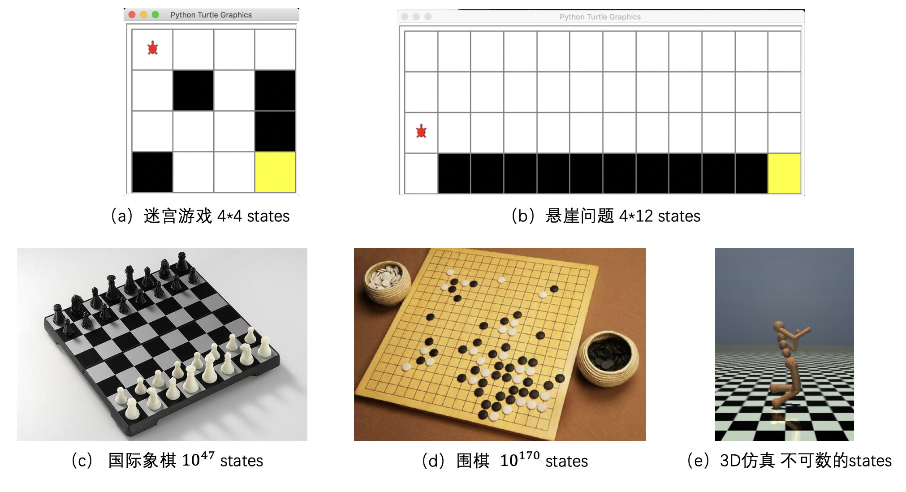

# DQN

## 1. 网络概述及其创新点

在之前的内容中，我们讲解了Q-learning和Sarsa算法。在这两个算法中，需要用一个Q表格来记录不同状态动作对应的价值，即一个大小为 $[状态个数，动作个数]$ 的二维数组。在一些简单的强化学习环境中，比如迷宫游戏中（图1a），迷宫大小为4*4，因此该游戏存在16个state；而悬崖问题（图1b）的地图大小为 4\*12，因此在该问题中状态数量为48，这些都属于数量较少的状态，所以可以用Q表格来记录对应的状态动作价值。但当我们需要应用强化学习来解决实际问题时，比如解决国际象棋问题或围棋问题，那么环境中就会包含 $10^{47}$ 个state或 $10^{170}$ 个state，如此庞大的状态数量已经很难用Q表格来进行存储，更不要说在3D仿真环境中，机器人手脚弯曲的状态是完全不可数的。由此可以看到Q表格在大状态问题和不可数状态问题时的局限性。同时，在一个强化学习环境中，不是所有的状态都会被经常访问，其中有些状态的访问次数很少或几乎为零，这就会导致价值估计并不可靠。

图1: 不同强化学习环境对应的状态量
  

为解决上述两个问题，一种解决方案即为Q表格参数化，使用深度神经网络拟合动作价值函数 $q_\pi$。参数化可以解决无限状态下的动作价值函数的存储问题，因为算法只需记住一组参数，动作价值函数的具体值可根据这一组参数算出。同时，参数化也有助于缓解因某些状态访问次数少而导致的估值不准问题。因为对于一个处在连续空间内的状态价值函数，如果要对访问次数较多的状态小临域内的状态进行价值估计，其估计结果也是有一定保障的。

但是动作价值函数的参数化也会带来一些新的问题，首先，因为相邻样本来自同一条轨迹，会导致样本间关联性过强，而集中优化关联性过强的样本会导致神经网络处理其他样本时无法取得较好的结果。举一个例子来说明这个问题，比如：假设一个agent的action有上下左右四种选择，神经网络采用一条轨迹为 $s_1 \rightarrow right \rightarrow s_2 \rightarrow right \rightarrow s_3 \rightarrow up$ 的训练样本进行训练，而当该网络处理轨迹 $s_1 \rightarrow left \rightarrow s_2 \rightarrow left \rightarrow s_3 \rightarrow down \rightarrow s_4 \rightarrow ?$ 的样本进行预测时，就不会取得很好的效果。另一个问题是，当参数 $\theta$ 被同时用来计算动作价值函数的目标值和预测的Q值时，对 $\theta$ 的更新会同时影响这两个值，使得损失函数中的优化目标变得不明确，算法收敛不稳定。

为了解决如上两个问题，Mnih 等人提出了深度Q网络 (Deep Q-Network，DQN)，其本质上是Q-learning算法，但使用深度学习网络拟合Q函数，解决了无限状态下的动作价值函数存储问题，同时采用经验重现（Experience Replay）和固定Q目标（Fixed-Q-Target）两个创新点来解决上述两个问题。
* 经验重现（Experience Replay）：使用一个经验池存储多条经验 $s, a, r, s^{'}$, 再从中随机抽取一批用于训练，很好的解决了样本关联性的问题，同时，因为经验池里的经验可以得到重复利用，也提升了利用效率。
* 固定Q目标（Fixed-Q-Target）：复制一个和原来Q网络结构一样的Target Q网络，用于计算Q目标值，这样在原来的Q网络中，target Q就是一个固定的数值，不会再产生优化目标不明确的问题。

## 2. 算法流程

在DQN算法中，智能体会在与所处环境 $environment$ 进行交互后，获得一个环境提供的状态 $s_{t}$。 接收状态后，智能体会根据深度学习网络预测出在该状态下不同行动 $action$ 对应的Q值，并给出一个行动 $a_{t}$，当行动反馈给环境后，环境会给出对应的奖励 $r_{t}$、新的状态 $s_{t+1}$，以及是否触发终止条件 $done$。每一次交互完成，DQN算法都会将 $s_{t}, a_{t}, r_{t}, s_{t+1}, done$ 作为一条经验储存在经验池中，每次会从经验池中抽取一定量的经验作为输入数据训练神经网络。

**DQN算法流程：**

>1. 初始化经验池，随机初始化Q网络；
>2. for episode = 1， M do：
>   1. 重置环境，获得第一个状态；
>    2. for t = 1, T do：
>         1. 用 $\epsilon-greedy$ 策略生成一个action：其中有 $\epsilon$ 的概率会随机选择一个action，即为探索模式；其他情况下，则$a_{t} = max_{a}Q(s_{t}, a;\theta)$，选择在 $s_t$ 状态下使得Q最大的action，即为经验模式；
>       2. 根据动作与环境的交互，获得反馈的reward $r_{t}$、下一个状态 $s_{t+1}$ 和是否触发终止条件done;
>       3. 将经验 $s_{t}, a_{t}, r_{t}, s_{t+1}, done$ 存入经验池；
>       4. 从经验池中随机获取一个minibatch的经验；
>         5. $Qtarget_{t} = \left\{\begin{matrix} r_{t},\quad if{\,} done \\r_{t} + \gamma max_{a^{'}}Qtarget(s_{t+1}, a^{'}; \theta),\quad if{\,}not{\,}done \end{matrix}\right.$
>       6. 根据 $Qpred_{t}$ 和 $Qtarget_{t}$ 求loss，梯度下降法更新Q网络
>    3. end for
>    4. 每隔固定个episode，更新Qtarget网络
>3. end for

