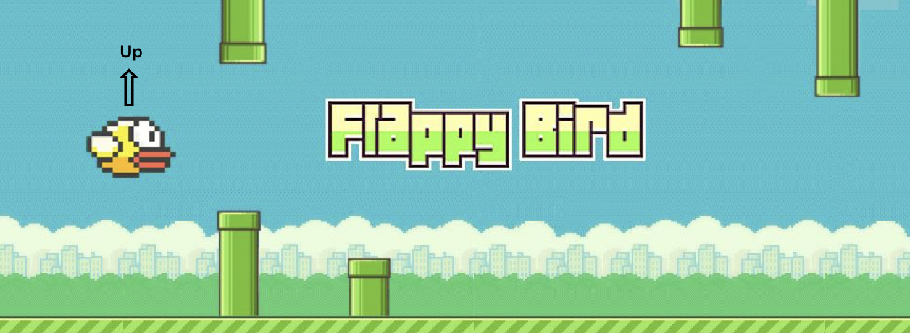

# 强化学习基础知识点

智能体（agent）：智能体是强化学习算法的主体，它能够根据经验做出主观判断并执行动作，是整个智能系统的核心。

环境（environment）：智能体以外的一切统称为环境，环境在与智能体的交互中，能被智能体所采取的动作影响，同时环境也能向智能体反馈状态和奖励。虽说智能体以外的一切都可视为环境，但在设计算法时常常会排除不相关的因素建立一个理想的环境模型来对算法功能进行模拟。

状态（state）：状态可以理解为智能体对环境的一种理解和编码，通常包含了对智能体所采取决策产生影响的信息。

动作（action）：动作是智能体对环境产生影响的方式，这里说的动作常常指概念上的动作，如果是在设计机器人时还需考虑动作的执行机构。

策略（policy）：策略是智能体在所处状态下去执行某个动作的依据，即给定一个状态，智能体可根据一个策略来选择应该采取的动作。

奖励（reward）：奖励是智能体贯式采取一系列动作后从环境获得的收益。注意奖励概念是现实中奖励和惩罚的统合，一般用正值来代表奖励，用负值代表实际惩罚。

在flappy bird游戏中，小鸟即为智能体，除小鸟以外的整个游戏环境可统称为环境，状态可以理解为在当前时间点的游戏图像。在本游戏中，智能体可以执行的动作为向上飞，或什么都不做靠重力下降。策略则指小鸟依据什么来判断是要执行向上飞的动作还是什么都不做，这个策略可能是根据值函数大小判断，也可能是依据在当前状态下执行不同动作的概率或是其他的判断方法。奖励分为奖励和惩罚两种，每当小鸟安全的飞过一个柱子都会获得一分的奖励，而如果小鸟掉到地上或者撞到柱子则或获得惩罚。

