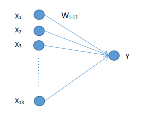
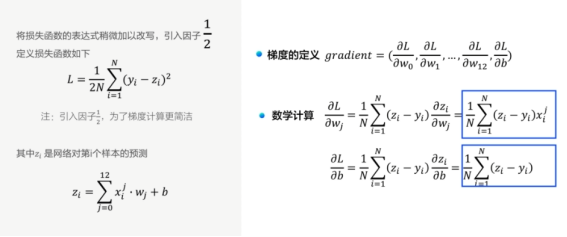

# ①深度学习发展历史
1943年，心里学家麦卡洛克和数学逻辑学家皮兹发表论文《神经活动中内在思想的逻辑演算》，提出了MP模型。MP模型是模仿神经元的结构和工作原理，构成出的一个基于神经网络的数学模型，本质上是一种“模拟人类大脑”的神经元模型。MP模型作为人工神经网络的起源，开创了人工神经网络的新时代，也奠定了神经网络模型的基础。

1949年，加拿大著名心理学家唐纳德·赫布在《行为的组织》中提出了一种基于无监督学习的规则——海布学习规则(Hebb Rule)。海布规则模仿人类认知世界的过程建立一种“网络模型”，该网络模型针对训练集进行大量的训练并提取训练集的统计特征，然后按照样本的相似程度进行分类，把相互之间联系密切的样本分为一类，这样就把样本分成了若干类。海布学习规则与“条件反射”机理一致，为以后的神经网络学习算法奠定了基础，具有重大的历史意义。

20世纪50年代末，在MP模型和海布学习规则的研究基础上，美国科学家罗森布拉特发现了一种类似于人类学习过程的学习算法——感知机学习。并于1958年，正式提出了由两层神经元组成的神经网络，称之为“感知器”。感知器本质上是一种线性模型，可以对输入的训练集数据进行二分类，且能够在训练集中自动更新权值。感知器的提出吸引了大量科学家对人工神经网络研究的兴趣，对神经网络的发展具有里程碑式的意义。

但随着研究的深入，在1969年，“AI之父”马文·明斯基和LOGO语言的创始人西蒙·派珀特共同编写了一本书籍《感知器》，在书中他们证明了单层感知器无法解决线性不可分问题（例如：异或问题）。由于这个致命的缺陷以及没有及时推广感知器到多层神经网络中，在20世纪70年代，人工神经网络进入了第一个寒冬期，人们对神经网络的研究也停滞了将近20年。

1982年，著名物理学家约翰·霍普菲尔德发明了Hopfield神经网络。Hopfield神经网络是一种结合存储系统和二元系统的循环神经网络。Hopfield网络也可以模拟人类的记忆，根据激活函数的选取不同，有连续型和离散型两种类型，分别用于优化计算和联想记忆。但由于容易陷入局部最小值的缺陷，该算法并未在当时引起很大的轰动。

直到1986年，深度学习之父杰弗里·辛顿提出了一种适用于多层感知器的反向传播算法——BP算法。BP算法在传统神经网络正向传播的基础上，增加了误差的反向传播过程。反向传播过程不断地调整神经元之间的权值和阈值，直到输出的误差达到减小到允许的范围之内，或达到预先设定的训练次数为止。BP算法完美的解决了非线性分类问题，让人工神经网络再次的引起了人们广泛的关注。

图2 深度学习之父杰弗里·辛顿
但是由于八十年代计算机的硬件水平有限，如：运算能力跟不上，这就导致当神经网络的规模增大时，再使用BP算法会出现“梯度消失”的问题。这使得BP算法的发展受到了很大的限制。再加上90年代中期，以SVM为代表的其它浅层机器学习算法被提出，并在分类、回归问题上均取得了很好的效果，其原理又明显不同于神经网络模型，所以人工神经网络的发展再次进入了瓶颈期。
机器学习算法理论在上个世纪90年代发展成熟，在许多领域都取得了成功应用。但平静的日子只延续到2010年左右，随着大数据的涌现和计算机算力提升，深度学习模型异军突起，极大改变了机器学习的应用格局。今天，多数机器学习任务都可以使用深度学习模型解决，尤其在语音、计算机视觉和自然语言处理等领域，深度学习模型的效果比传统机器学习算法有显著提升。

2006年，杰弗里·辛顿以及他的学生鲁斯兰·萨拉赫丁诺夫正式提出了深度学习的概念。他们在世界顶级学术期刊《科学》发表的一篇文章中详细的给出了“梯度消失”问题的解决方案——通过无监督的学习方法逐层训练算法，再使用有监督的反向传播算法进行调优。该深度学习方法的提出，立即在学术圈引起了巨大的反响，以斯坦福大学、多伦多大学为代表的众多世界知名高校纷纷投入巨大的人力、财力进行深度学习领域的相关研究。而后又在迅速蔓延到工业界中。

2006年，杰弗里·辛顿以及他的学生鲁斯兰·萨拉赫丁诺夫正式提出了深度学习的概念。他们在世界顶级学术期刊《科学》发表的一篇文章中详细的给出了“梯度消失”问题的解决方案——通过无监督的学习方法逐层训练算法，再使用有监督的反向传播算法进行调优。该深度学习方法的提出，立即在学术圈引起了巨大的反响，以斯坦福大学、多伦多大学为代表的众多世界知名高校纷纷投入巨大的人力、财力进行深度学习领域的相关研究。而后又在迅速蔓延到工业界中。

2012年，在著名的ImageNet图像识别大赛中，杰弗里·辛顿领导的小组采用深度学习模型AlexNet一举夺冠。AlexNet采用ReLU激活函数，从根本上解决了梯度消失问题，并采用GPU极大的提高了模型的运算速度。同年，由斯坦福大学著名的吴恩达教授和世界顶尖计算机专家Jeff Dean共同主导的深度神经网络——DNN技术在图像识别领域取得了惊人的成绩，在ImageNet评测中成功的把错误率从26％降低到了15％。深度学习算法在世界大赛的脱颖而出，也再一次吸引了学术界和工业界对于深度学习领域的关注。

随着深度学习技术的不断进步以及数据处理能力的不断提升，2014年，Facebook基于深度学习技术的DeepFace项目，在人脸识别方面的准确率已经能达到97%以上，跟人类识别的准确率几乎没有差别。这样的结果也再一次证明了深度学习算法在图像识别方面的一骑绝尘。

2016年，随着谷歌公司基于深度学习开发的AlphaGo以4:1的比分战胜了国际顶尖围棋高手李世石，深度学习的热度一时无两。后来，AlphaGo又接连和众多世界级围棋高手过招，均取得了完胜。这也证明了在围棋界，基于深度学习技术的机器人已经超越了人类。

2017年，基于强化学习算法的AlphaGo升级版AlphaGo Zero横空出世。其采用“从零开始”、“无师自通”的学习模式，以100:0的比分轻而易举打败了之前的AlphaGo。除了围棋，它还精通国际象棋等其它棋类游戏，可以说是真正的棋类“天才”。此外在这一年，深度学习的相关算法在医疗、金融、艺术、无人驾驶等多个领域均取得了显著的成果。所以，也有专家把2017年看作是深度学习甚至是人工智能发展最为突飞猛进的一年。

神经网络思想的提出已经是75年前的事情了，现今的神经网络和深度学习的设计理论是一步步趋于完善的。在这漫长的发展岁月中，一些取得关键突破的闪光时刻，值得我们这些深度学习爱好者们铭记，如 **图9** 所示。

 图9：深度学习发展历程 

  

* **1940年代**：首次提出神经元的结构，但权重是不可学的。
* **50-60年代**：提出权重学习理论，神经元结构趋于完善，开启了神经网络的第一个黄金时代。
* **1969年**：提出异或问题（人们惊讶的发现神经网络模型连简单的异或问题也无法解决，对其的期望从云端跌落到谷底），神经网络模型进入了被束之高阁的黑暗时代。
* **1986年**：新提出的多层神经网络解决了异或问题，但随着90年代后理论更完备并且实践效果更好的SVM等机器学习模型的兴起，神经网络并未得到重视。
* **2010年左右**：深度学习进入真正兴起时期。随着神经网络模型改进的技术在语音和计算机视觉任务上大放异彩，也逐渐被证明在更多的任务，如自然语言处理以及海量数据的任务上更加有效。至此，神经网络模型重新焕发生机，并有了一个更加响亮的名字：深度学习。

# ②人工智能、机器学习、深度学习的关系

近些年人工智能、机器学习和深度学习的概念十分火热，但很多从业者却很难说清它们之间的关系，外行人更是雾里看花。在研究深度学习之前，我们先从三个概念的正本清源开始。

概括来说，人工智能、机器学习和深度学习覆盖的技术范畴是逐层递减的。人工智能是最宽泛的概念。机器学习是当前比较有效的一种实现人工智能的方式。深度学习是机器学习算法中最热门的一个分支，近些年取得了显著的进展，并替代了大多数传统机器学习算法。三者的关系如 **图1** 所示，即：人工智能 > 机器学习 > 深度学习。

  

如字面含义，人工智能是研发用于模拟、延伸和扩展人的智能的理论、方法、技术及应用系统的一门新的技术科学。由于这个定义只阐述了目标，而没有限定方法，因此实现人工智能存在的诸多方法和分支，导致其变成一个“大杂烩”式的学科。

## ③神经元，单层感知机，多层感知机的基本概念

人工神经网络包括多个神经网络层，如卷积层、全连接层、LSTM等，每一层又包括很多神经元，超过三层的非线性神经网络都可以被称为深度神经网络。通俗的讲，深度学习的模型可以视为是输入到输出的映射函数，如图像到高级语义（美女）的映射，足够深的神经网络理论上可以拟合任何复杂的函数。因此神经网络非常适合学习样本数据的内在规律和表示层次，对文字、图像和语音任务有很好的适用性。因为这几个领域的任务是人工智能的基础模块，所以深度学习被称为实现人工智能的基础也就不足为奇了。

神经网络结构如 **图8** 所示。

 图8：神经网络结构示意图 

  

* **神经元：** 神经网络中每个节点称为神经元，由两部分组成：
  - 加权和：将所有输入加权求和。
  - 非线性变换（激活函数）：加权和的结果经过一个非线性函数变换，让神经元计算具备非线性的能力。
* **多层连接：** 大量这样的节点按照不同的层次排布，形成多层的结构连接起来，即称为神经网络。
* **前向计算：** 从输入计算输出的过程，顺序从网络前至后。
* **计算图：** 以图形化的方式展现神经网络的计算逻辑又称为计算图。我们也可以将神经网络的计算图以公式的方式表达，如下：
$$Y =f_3 ( f_2 ( f_1 ( w_1\cdot x_1+w_2\cdot x_2+w_3\cdot x_3+b ) + … ) … ) … )$$

单层感知机目标是将被感知数据集划分为两类的分离超平面，并计算出该超平面。单层感知机是二分类的线性分类模型，输入是被感知数据集的特征向量，输出时数据集的类别{+1,-1}。感知器的模型可以简单表示为：

$$[f(x)=sign(w.x+b)$$
多层感知机（MLP，Multilayer Perceptron）也叫人工神经网络（ANN，Artificial Neural Network），除了输入输出层，它中间可以有多个隐层，最简单的MLP只含一个隐层，即三层的结构。

## ④什么是前向传播

前向传播（Forward Propagation）的理解较为简单，从输入经过一层层隐层计算得到输出的过程即为前向过程，也称前向传播。

  

## ⑤什么是反向传播

简单来讲就是用链式求导法则，通过对loss函数求导，分别找到之前每层参数的梯度，然后将参数沿梯度方向进行更新。步长大小取决与学习率。

  

