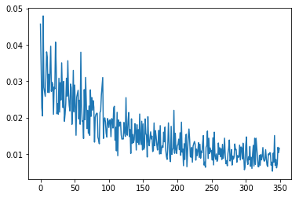

```python
# 查看当前挂载的数据集目录, 该目录下的变更重启环境后会自动还原
# View dataset directory. 
# This directory will be recovered automatically after resetting environment. 
!ls /home/aistudio/data
```

    data16317  data269


```python
!unzip -oq /home/aistudio/data/data269/房价预测.zip
```


```python
# 查看工作区文件, 该目录下的变更将会持久保存. 请及时清理不必要的文件, 避免加载过慢.
# View personal work directory. 
# All changes under this directory will be kept even after reset. 
# Please clean unnecessary files in time to speed up environment loading. 
!ls /home/aistudio/work
```


```python
# 如果需要进行持久化安装, 需要使用持久化路径, 如下方代码示例:
# If a persistence installation is required, 
# you need to use the persistence path as the following: 
!mkdir /home/aistudio/external-libraries
!pip install beautifulsoup4 -t /home/aistudio/external-libraries
```

    Looking in indexes: https://mirror.baidu.com/pypi/simple/
    Collecting beautifulsoup4
    [?25l  Downloading https://mirror.baidu.com/pypi/packages/d1/41/e6495bd7d3781cee623ce23ea6ac73282a373088fcd0ddc809a047b18eae/beautifulsoup4-4.9.3-py3-none-any.whl (115kB)
         |████████████████████████████████| 122kB 17.3MB/s eta 0:00:01
    [?25hCollecting soupsieve>1.2; python_version >= "3.0" (from beautifulsoup4)
      Downloading https://mirror.baidu.com/pypi/packages/36/69/d82d04022f02733bf9a72bc3b96332d360c0c5307096d76f6bb7489f7e57/soupsieve-2.2.1-py3-none-any.whl
    Installing collected packages: soupsieve, beautifulsoup4
    Successfully installed beautifulsoup4-4.9.3 soupsieve-2.2.1


```python
# 同时添加如下代码, 这样每次环境(kernel)启动的时候只要运行下方代码即可: 
# Also add the following code, 
# so that every time the environment (kernel) starts, 
# just run the following code: 
import sys 
sys.path.append('/home/aistudio/external-libraries')
```

请点击[此处](https://ai.baidu.com/docs#/AIStudio_Project_Notebook/a38e5576)查看本环境基本用法.  <br>
Please click [here ](https://ai.baidu.com/docs#/AIStudio_Project_Notebook/a38e5576) for more detailed instructions. 

# **（一）深度学习发展历史**
**1. 深度学习的起源阶段**

	1943年，心里学家麦卡洛克和数学逻辑学家皮兹发表论文《神经活动中内在思想的逻辑演算》，提出了MP模型。MP模型是模仿神经元的结构和工作原理，构成出的一个基于神经网络的数学模型，本质上是一种“模拟人类大脑”的神经元模型。MP模型作为人工神经网络的起源，开创了人工神经网络的新时代，也奠定了神经网络模型的基础。
    
	1949年，加拿大著名心理学家唐纳德·赫布在《行为的组织》中提出了一种基于无监督学习的规则——海布学习规则(Hebb Rule)。海布规则模仿人类认知世界的过程建立一种“网络模型”，该网络模型针对训练集进行大量的训练并提取训练集的统计特征，然后按照样本的相似程度进行分类，把相互之间联系密切的样本分为一类，这样就把样本分成了若干类。海布学习规则与“条件反射”机理一致，为以后的神经网络学习算法奠定了基础，具有重大的历史意义。
    
	20世纪50年代末，在MP模型和海布学习规则的研究基础上，美国科学家罗森布拉特发现了一种类似于人类学习过程的学习算法——感知机学习。并于1958年，正式提出了由两层神经元组成的神经网络，称之为“感知器”。感知器本质上是一种线性模型，可以对输入的训练集数据进行二分类，且能够在训练集中自动更新权值。感知器的提出吸引了大量科学家对人工神经网络研究的兴趣，对神经网络的发展具有里程碑式的意义。
    
	但随着研究的深入，在1969年，“AI之父”马文·明斯基和LOGO语言的创始人西蒙·派珀特共同编写了一本书籍《感知器》，在书中他们证明了单层感知器无法解决线性不可分问题（例如：异或问题）。由于这个致命的缺陷以及没有及时推广感知器到多层神经网络中，在20世纪70年代，人工神经网络进入了第一个寒冬期，人们对神经网络的研究也停滞了将近20年。

**2. 深度学习的发展阶段**

	1982年，著名物理学家约翰·霍普菲尔德发明了Hopfield神经网络。Hopfield神经网络是一种结合存储系统和二元系统的循环神经网络。Hopfield网络也可以模拟人类的记忆，根据激活函数的选取不同，有连续型和离散型两种类型，分别用于优化计算和联想记忆。但由于容易陷入局部最小值的缺陷，该算法并未在当时引起很大的轰动。
    
	直到1986年，深度学习之父杰弗里·辛顿提出了一种适用于多层感知器的反向传播算法——BP算法。BP算法在传统神经网络正向传播的基础上，增加了误差的反向传播过程。反向传播过程不断地调整神经元之间的权值和阈值，直到输出的误差达到减小到允许的范围之内，或达到预先设定的训练次数为止。BP算法完美的解决了非线性分类问题，让人工神经网络再次的引起了人们广泛的关注。
    
	但是由于八十年代计算机的硬件水平有限，如：运算能力跟不上，这就导致当神经网络的规模增大时，再使用BP算法会出现“梯度消失”的问题。这使得BP算法的发展受到了很大的限制。再加上90年代中期，以SVM为代表的其它浅层机器学习算法被提出，并在分类、回归问题上均取得了很好的效果，其原理又明显不同于神经网络模型，所以人工神经网络的发展再次进入了瓶颈期。

**3.深度学习的爆发阶段**

	2006年，杰弗里·辛顿以及他的学生鲁斯兰·萨拉赫丁诺夫正式提出了深度学习的概念。他们在世界顶级学术期刊《科学》发表的一篇文章中详细的给出了“梯度消失”问题的解决方案——通过无监督的学习方法逐层训练算法，再使用有监督的反向传播算法进行调优。该深度学习方法的提出，立即在学术圈引起了巨大的反响，以斯坦福大学、多伦多大学为代表的众多世界知名高校纷纷投入巨大的人力、财力进行深度学习领域的相关研究。而后又在迅速蔓延到工业界中。
    
	2006年，杰弗里·辛顿以及他的学生鲁斯兰·萨拉赫丁诺夫正式提出了深度学习的概念。他们在世界顶级学术期刊《科学》发表的一篇文章中详细的给出了“梯度消失”问题的解决方案——通过无监督的学习方法逐层训练算法，再使用有监督的反向传播算法进行调优。该深度学习方法的提出，立即在学术圈引起了巨大的反响，以斯坦福大学、多伦多大学为代表的众多世界知名高校纷纷投入巨大的人力、财力进行深度学习领域的相关研究。而后又在迅速蔓延到工业界中。
    
	2012年，在著名的ImageNet图像识别大赛中，杰弗里·辛顿领导的小组采用深度学习模型AlexNet一举夺冠。AlexNet采用ReLU激活函数，从根本上解决了梯度消失问题，并采用GPU极大的提高了模型的运算速度。同年，由斯坦福大学著名的吴恩达教授和世界顶尖计算机专家Jeff Dean共同主导的深度神经网络——DNN技术在图像识别领域取得了惊人的成绩，在ImageNet评测中成功的把错误率从26％降低到了15％。深度学习算法在世界大赛的脱颖而出，也再一次吸引了学术界和工业界对于深度学习领域的关注。
    
	随着深度学习技术的不断进步以及数据处理能力的不断提升，2014年，Facebook基于深度学习技术的DeepFace项目，在人脸识别方面的准确率已经能达到97%以上，跟人类识别的准确率几乎没有差别。这样的结果也再一次证明了深度学习算法在图像识别方面的一骑绝尘。
    
	2016年，随着谷歌公司基于深度学习开发的AlphaGo以4:1的比分战胜了国际顶尖围棋高手李世石，深度学习的热度一时无两。后来，AlphaGo又接连和众多世界级围棋高手过招，均取得了完胜。这也证明了在围棋界，基于深度学习技术的机器人已经超越了人类。
    
	2017年，基于强化学习算法的AlphaGo升级版AlphaGo Zero横空出世。其采用“从零开始”、“无师自通”的学习模式，以100:0的比分轻而易举打败了之前的AlphaGo。除了围棋，它还精通国际象棋等其它棋类游戏，可以说是真正的棋类“天才”。此外在这一年，深度学习的相关算法在医疗、金融、艺术、无人驾驶等多个领域均取得了显著的成果。所以，也有专家把2017年看作是深度学习甚至是人工智能发展最为突飞猛进的一年。

# **（二）人工智能、机器学习、和深度学习有什么区别和联系**

**区别**

人工智能：为机器赋予人的智能

机器学习：一种实现人工智能的方法

深度学习：一种实现机器学习的技术

**联系**


# **（三）神经元、单层感知机、多层感知机**

**人工神经元模型**

生物学上神经元通常由细胞体，细胞核，树突和轴突构成。

树突用来接收其他神经元传导过来的信号，一个神经元有多个树突；

细胞核是神经元中的核心模块，用来处理所有的传入信号；

轴突是输出信号的单元，它有很多个轴突末梢，可以给其它神经元的树突传递信号。

生物学神经元如下图所示：


人工神经元的模型如下图所示：


图中Xi是从其它神经元传入的输入信号，Win分别是传入信号的权重，θ表示一个阈值，或称为偏置（bias），偏置的设置是为了正确分类样本，是模型中一个重要的参数。神经元综合的输入信号和偏置相加之后产生当前神经元最终的处理信号net，该信号称为净激活或净激励（net activation），激活信号作为上图中圆圈的右半部分f（*）函数的输入，即f(net)； f称为激活函数或激励函数（Activation Function），激活函数的主要作用是加入非线性因素，解决线性模型的表达、分类能力不足的问题。上图中的yi是当前神经元的输出。


**单层感知机**


单层感知机目标是将被感知数据集划分为两类的分离超平面，并计算出该超平面。单层感知机是二分类的线性分类模型，输入是被感知数据集的特征向量，输出时数据集的类别{+1,-1}。感知器的模型可以简单表示为：

f(x)=sign(w.x+b)

该函数称为单层感知机，其中w是网络的N维权重向量，b是网络的N维偏置向量, w.x是w和x的内积，w和b的N维向量取值要求在实数域。

sign函数是感知机的早期激活函数，后面又演化出一系列的激活函数。激活函数一般采用非线性激活函数，以增强网络的表达能力。常见的激活函数有：sign, sigmoid,tanh,ReLU等。


**多层感知机**
多层感知机（MLP，Multilayer Perceptron）也叫人工神经网络（ANN，Artificial Neural Network），除了输入输出层，它中间可以有多个隐层，最简单的MLP只含一个隐层，即三层的结构，如下图：


从上图可以看到，多层感知机层与层之间是全连接的。多层感知机最底层是输入层，中间是隐藏层，最后是输出层。

隐藏层的神经元怎么得来？首先它与输入层是全连接的，假设输入层用向量X表示，则隐藏层的输出就是 f ( W 1 X + b 1 )， Wi是权重（也叫连接系数），bi是偏置，函数f可以是激活函数，比如常用的sigmoid函数或者tanh函数。


**（四）什么是前向传播**

所谓的前向传播算法就是：将上一层的输出作为下一层的输入，并计算下一层的输出，一直到运算到输出层为止。


其中layer1为输入层，layer2为隐藏层，layer3为输出层


**（五）什么是反向传播**

反向传播（back propagation, BP）算法是 "误差反向传播" 的简称，也称为backprop，允许来自代价函数的信息通过网络向后流动，以便计算梯度。

反向传播是一种与最优化方法（如梯度下降法）结合使用的，用来训练人工神经网络的常见方法。该方法对网络中所有权重计算损失函数的梯度。这个梯度会反馈给最优化方法，用来更新权值以最小化损失函数。

反向传播这个术语经常被误解为用于多层神经网络的整个学习算法。实际上，反向传播仅指用于计算梯度的方法。而另一种算法，例如随机梯度下降法，才是使用该梯度来进行学习。另外，反向传播还经常被误解为仅适用于多层神经网络，但是原则上它可以计算任何函数的到导数


（六）房价预测

线性回归中：

（1）假设函数是指，用数学的方法描述自变量和因变量之间的关系，它们之间可以是一个线性函数或非线性函数。 在本次线性回顾模型中，我们的假设函数为 Y’= wX+b ，其中，Y’表示模型的预测结果（预测房价），用来和真实的Y区分。模型要学习的参数即：w,b。

（2）损失函数是指，用数学的方法衡量假设函数预测结果与真实值之间的误差。这个差距越小预测越准确，而算法的任务就是使这个差距越来越小。 建立模型后，我们需要给模型一个优化目标，使得学到的参数能够让预测值Y’尽可能地接近真实值Y。这个实值通常用来反映模型误差的大小。不同问题场景下采用不同的损失函数。 对于线性模型来讲，最常用的损失函数就是均方误差（Mean Squared Error， MSE）。

（3）优化算法：神经网络的训练就是调整权重（参数）使得损失函数值尽可能得小，在训练过程中，将损失函数值逐渐收敛，得到一组使得神经网络拟合真实模型的权重（参数）。所以，优化算法的最终目标是找到损失函数的最小值。而这个寻找过程就是不断地微调变量w和b的值，一步一步地试出这个最小值。 常见的优化算法有随机梯度下降法（SGD）、Adam算法等等


首先导入必要的包，分别是：

paddle.fluid--->PaddlePaddle深度学习框架

numpy---------->python基本库，用于科学计算

os------------------>python的模块，可使用该模块对操作系统进行操作

matplotlib----->python绘图库，可方便绘制折线图、散点图等图形


```python
import paddle.fluid as fluid
import paddle
import numpy as np
import os
import matplotlib.pyplot as plt


def load_data():
    # 从文件导入数据
    df =  pd.read_csv("./房价预测/data/data.txt",sep=',')
    data = np.array(df)
    # 每条数据包括14项，其中前面13项是影响因素，第14项是相应的房屋价格中位数
    feature_names = [ 'mianji', 'money'] 
    feature_num = len(feature_names)
    # 将原始数据进行Reshape，变成[N, 2]这样的形状
    data = data.reshape([data.shape[0], feature_num])
    # 将原数据集拆分成训练集和测试集
    # 这里使用80%的数据做训练，20%的数据做测试
    # 测试集和训练集必须是没有交集的
    ratio = 0.8
    offset = int(data.shape[0] * ratio) 
    training_data = data[:offset]
    # 计算train数据集的最大值，最小值，平均值
    maximums, minimums, avgs = training_data.max(axis=0), training_data.min(axis=0), \
                                 training_data.sum(axis=0) / training_data.shape[0]
    # 对数据进行归一化处理
    for i in range(feature_num):
        #print(maximums[i], minimums[i], avgs[i])
        data[:, i] = (data[:, i] - avgs[i]) / (maximums[i] - minimums[i])
    # 训练集和测试集的划分比例
    training_data = data[:offset]
    test_data = data[offset:]
    return training_data, test_data


```


```python
import numpy as np
class Network(object):
    def __init__(self, num_of_weights):
        # 随机产生w的初始值
        # 为了保持程序每次运行结果的一致性，此处设置固定的随机数种子
        #np.random.seed(0)
        self.w = np.random.randn(num_of_weights, 1)
        self.b = 0.

    # 前向传播过程
    def forward(self, x):
        z = np.dot(x, self.w) + self.b
        return z
    
    # 均方差损失函数
    def loss(self, z, y):
        error = z - y
        num_samples = error.shape[0]
        cost = error * error
        cost = np.sum(cost) / num_samples
        return cost
    
    # 梯度下降法
    def gradient(self, x, y):
        z = self.forward(x)
        N = x.shape[0]
        gradient_w = 1. / N * np.sum((z-y) * x, axis=0)
        gradient_w = gradient_w[:, np.newaxis]
        gradient_b = 1. / N * np.sum(z-y)
        return gradient_w, gradient_b
    
    # 参数更新公式
    def update(self, gradient_w, gradient_b, eta = 0.01):
        self.w = self.w - eta * gradient_w
        self.b = self.b - eta * gradient_b
            
    # 训练过程            
    def train(self, training_data, num_epoches, batch_size=10, eta=0.01):
        n = len(training_data)
        losses = []
        for epoch_id in range(num_epoches):
            # 在每轮迭代开始之前，将训练数据的顺序随机的打乱，
            # 然后再按每次取batch_size条数据的方式取出
            np.random.shuffle(training_data)
            # 将训练数据进行拆分，每个mini_batch包含batch_size条的数据
            mini_batches = [training_data[k:k+batch_size] for k in range(0, n, batch_size)]
            for iter_id, mini_batch in enumerate(mini_batches):
                #print(self.w.shape)
                #print(self.b)
                x = mini_batch[:, :-1]
                y = mini_batch[:, -1:]
                a = self.forward(x)
                loss = self.loss(a, y)
                gradient_w, gradient_b = self.gradient(x, y)
                self.update(gradient_w, gradient_b, eta)
                losses.append(loss)
                print('Epoch {:3d} / iter {:3d}, loss = {:.4f}'.
                                 format(epoch_id, iter_id, loss))
        
        return losses

# 获取数据
train_data, test_data = load_data()

# 创建网络
net = Network(1)
# 启动训练
losses = net.train(train_data, num_epoches=50, batch_size=100, eta=0.1)

# 画出损失函数的变化趋势
plot_x = np.arange(len(losses))
plot_y = np.array(losses)
plt.plot(plot_x, plot_y)
plt.show()

```

    Epoch   0 / iter   0, loss = 0.0457
    Epoch   0 / iter   1, loss = 0.0349
    Epoch   0 / iter   2, loss = 0.0227
    Epoch   0 / iter   3, loss = 0.0205
    Epoch   0 / iter   4, loss = 0.0479
    Epoch   0 / iter   5, loss = 0.0283
    Epoch   0 / iter   6, loss = 0.0271
    Epoch   1 / iter   0, loss = 0.0258
    Epoch   1 / iter   1, loss = 0.0310
    Epoch   1 / iter   2, loss = 0.0381
    Epoch   1 / iter   3, loss = 0.0366
    Epoch   1 / iter   4, loss = 0.0269
    Epoch   1 / iter   5, loss = 0.0319
    Epoch   1 / iter   6, loss = 0.0269
    Epoch   2 / iter   0, loss = 0.0330
    Epoch   2 / iter   1, loss = 0.0396
    Epoch   2 / iter   2, loss = 0.0272
    Epoch   2 / iter   3, loss = 0.0297
    Epoch   2 / iter   4, loss = 0.0292
    Epoch   2 / iter   5, loss = 0.0209
    Epoch   2 / iter   6, loss = 0.0284
    Epoch   3 / iter   0, loss = 0.0279
    Epoch   3 / iter   1, loss = 0.0408
    Epoch   3 / iter   2, loss = 0.0338
    Epoch   3 / iter   3, loss = 0.0211
    Epoch   3 / iter   4, loss = 0.0238
    Epoch   3 / iter   5, loss = 0.0210
    Epoch   3 / iter   6, loss = 0.0308
    Epoch   4 / iter   0, loss = 0.0215
    Epoch   4 / iter   1, loss = 0.0296
    Epoch   4 / iter   2, loss = 0.0248
    Epoch   4 / iter   3, loss = 0.0350
    Epoch   4 / iter   4, loss = 0.0271
    Epoch   4 / iter   5, loss = 0.0227
    Epoch   4 / iter   6, loss = 0.0300
    Epoch   5 / iter   0, loss = 0.0190
    Epoch   5 / iter   1, loss = 0.0210
    Epoch   5 / iter   2, loss = 0.0239
    Epoch   5 / iter   3, loss = 0.0308
    Epoch   5 / iter   4, loss = 0.0259
    Epoch   5 / iter   5, loss = 0.0356
    Epoch   5 / iter   6, loss = 0.0267
    Epoch   6 / iter   0, loss = 0.0234
    Epoch   6 / iter   1, loss = 0.0218
    Epoch   6 / iter   2, loss = 0.0292
    Epoch   6 / iter   3, loss = 0.0282
    Epoch   6 / iter   4, loss = 0.0182
    Epoch   6 / iter   5, loss = 0.0220
    Epoch   6 / iter   6, loss = 0.0330
    Epoch   7 / iter   0, loss = 0.0216
    Epoch   7 / iter   1, loss = 0.0290
    Epoch   7 / iter   2, loss = 0.0230
    Epoch   7 / iter   3, loss = 0.0152
    Epoch   7 / iter   4, loss = 0.0256
    Epoch   7 / iter   5, loss = 0.0266
    Epoch   7 / iter   6, loss = 0.0275
    Epoch   8 / iter   0, loss = 0.0196
    Epoch   8 / iter   1, loss = 0.0248
    Epoch   8 / iter   2, loss = 0.0182
    Epoch   8 / iter   3, loss = 0.0380
    Epoch   8 / iter   4, loss = 0.0230
    Epoch   8 / iter   5, loss = 0.0190
    Epoch   8 / iter   6, loss = 0.0191
    Epoch   9 / iter   0, loss = 0.0143
    Epoch   9 / iter   1, loss = 0.0277
    Epoch   9 / iter   2, loss = 0.0195
    Epoch   9 / iter   3, loss = 0.0310
    Epoch   9 / iter   4, loss = 0.0241
    Epoch   9 / iter   5, loss = 0.0170
    Epoch   9 / iter   6, loss = 0.0220
    Epoch  10 / iter   0, loss = 0.0157
    Epoch  10 / iter   1, loss = 0.0232
    Epoch  10 / iter   2, loss = 0.0152
    Epoch  10 / iter   3, loss = 0.0276
    Epoch  10 / iter   4, loss = 0.0204
    Epoch  10 / iter   5, loss = 0.0255
    Epoch  10 / iter   6, loss = 0.0221
    Epoch  11 / iter   0, loss = 0.0247
    Epoch  11 / iter   1, loss = 0.0229
    Epoch  11 / iter   2, loss = 0.0133
    Epoch  11 / iter   3, loss = 0.0201
    Epoch  11 / iter   4, loss = 0.0209
    Epoch  11 / iter   5, loss = 0.0212
    Epoch  11 / iter   6, loss = 0.0212
    Epoch  12 / iter   0, loss = 0.0146
    Epoch  12 / iter   1, loss = 0.0139
    Epoch  12 / iter   2, loss = 0.0128
    Epoch  12 / iter   3, loss = 0.0214
    Epoch  12 / iter   4, loss = 0.0219
    Epoch  12 / iter   5, loss = 0.0262
    Epoch  12 / iter   6, loss = 0.0285
    Epoch  13 / iter   0, loss = 0.0310
    Epoch  13 / iter   1, loss = 0.0143
    Epoch  13 / iter   2, loss = 0.0192
    Epoch  13 / iter   3, loss = 0.0200
    Epoch  13 / iter   4, loss = 0.0188
    Epoch  13 / iter   5, loss = 0.0158
    Epoch  13 / iter   6, loss = 0.0147
    Epoch  14 / iter   0, loss = 0.0198
    Epoch  14 / iter   1, loss = 0.0191
    Epoch  14 / iter   2, loss = 0.0173
    Epoch  14 / iter   3, loss = 0.0193
    Epoch  14 / iter   4, loss = 0.0194
    Epoch  14 / iter   5, loss = 0.0148
    Epoch  14 / iter   6, loss = 0.0197
    Epoch  15 / iter   0, loss = 0.0196
    Epoch  15 / iter   1, loss = 0.0172
    Epoch  15 / iter   2, loss = 0.0227
    Epoch  15 / iter   3, loss = 0.0231
    Epoch  15 / iter   4, loss = 0.0138
    Epoch  15 / iter   5, loss = 0.0174
    Epoch  15 / iter   6, loss = 0.0109
    Epoch  16 / iter   0, loss = 0.0215
    Epoch  16 / iter   1, loss = 0.0096
    Epoch  16 / iter   2, loss = 0.0194
    Epoch  16 / iter   3, loss = 0.0177
    Epoch  16 / iter   4, loss = 0.0188
    Epoch  16 / iter   5, loss = 0.0188
    Epoch  16 / iter   6, loss = 0.0153
    Epoch  17 / iter   0, loss = 0.0141
    Epoch  17 / iter   1, loss = 0.0142
    Epoch  17 / iter   2, loss = 0.0141
    Epoch  17 / iter   3, loss = 0.0187
    Epoch  17 / iter   4, loss = 0.0160
    Epoch  17 / iter   5, loss = 0.0148
    Epoch  17 / iter   6, loss = 0.0255
    Epoch  18 / iter   0, loss = 0.0156
    Epoch  18 / iter   1, loss = 0.0152
    Epoch  18 / iter   2, loss = 0.0191
    Epoch  18 / iter   3, loss = 0.0214
    Epoch  18 / iter   4, loss = 0.0148
    Epoch  18 / iter   5, loss = 0.0167
    Epoch  18 / iter   6, loss = 0.0102
    Epoch  19 / iter   0, loss = 0.0197
    Epoch  19 / iter   1, loss = 0.0129
    Epoch  19 / iter   2, loss = 0.0154
    Epoch  19 / iter   3, loss = 0.0132
    Epoch  19 / iter   4, loss = 0.0140
    Epoch  19 / iter   5, loss = 0.0183
    Epoch  19 / iter   6, loss = 0.0165
    Epoch  20 / iter   0, loss = 0.0111
    Epoch  20 / iter   1, loss = 0.0181
    Epoch  20 / iter   2, loss = 0.0132
    Epoch  20 / iter   3, loss = 0.0167
    Epoch  20 / iter   4, loss = 0.0126
    Epoch  20 / iter   5, loss = 0.0210
    Epoch  20 / iter   6, loss = 0.0139
    Epoch  21 / iter   0, loss = 0.0126
    Epoch  21 / iter   1, loss = 0.0190
    Epoch  21 / iter   2, loss = 0.0111
    Epoch  21 / iter   3, loss = 0.0183
    Epoch  21 / iter   4, loss = 0.0113
    Epoch  21 / iter   5, loss = 0.0118
    Epoch  21 / iter   6, loss = 0.0196
    Epoch  22 / iter   0, loss = 0.0157
    Epoch  22 / iter   1, loss = 0.0151
    Epoch  22 / iter   2, loss = 0.0092
    Epoch  22 / iter   3, loss = 0.0203
    Epoch  22 / iter   4, loss = 0.0136
    Epoch  22 / iter   5, loss = 0.0123
    Epoch  22 / iter   6, loss = 0.0144
    Epoch  23 / iter   0, loss = 0.0161
    Epoch  23 / iter   1, loss = 0.0141
    Epoch  23 / iter   2, loss = 0.0149
    Epoch  23 / iter   3, loss = 0.0107
    Epoch  23 / iter   4, loss = 0.0111
    Epoch  23 / iter   5, loss = 0.0186
    Epoch  23 / iter   6, loss = 0.0123
    Epoch  24 / iter   0, loss = 0.0164
    Epoch  24 / iter   1, loss = 0.0148
    Epoch  24 / iter   2, loss = 0.0126
    Epoch  24 / iter   3, loss = 0.0111
    Epoch  24 / iter   4, loss = 0.0136
    Epoch  24 / iter   5, loss = 0.0165
    Epoch  24 / iter   6, loss = 0.0100
    Epoch  25 / iter   0, loss = 0.0178
    Epoch  25 / iter   1, loss = 0.0101
    Epoch  25 / iter   2, loss = 0.0115
    Epoch  25 / iter   3, loss = 0.0123
    Epoch  25 / iter   4, loss = 0.0119
    Epoch  25 / iter   5, loss = 0.0160
    Epoch  25 / iter   6, loss = 0.0134
    Epoch  26 / iter   0, loss = 0.0174
    Epoch  26 / iter   1, loss = 0.0112
    Epoch  26 / iter   2, loss = 0.0094
    Epoch  26 / iter   3, loss = 0.0086
    Epoch  26 / iter   4, loss = 0.0119
    Epoch  26 / iter   5, loss = 0.0186
    Epoch  26 / iter   6, loss = 0.0137
    Epoch  27 / iter   0, loss = 0.0088
    Epoch  27 / iter   1, loss = 0.0079
    Epoch  27 / iter   2, loss = 0.0176
    Epoch  27 / iter   3, loss = 0.0099
    Epoch  27 / iter   4, loss = 0.0113
    Epoch  27 / iter   5, loss = 0.0115
    Epoch  27 / iter   6, loss = 0.0220
    Epoch  28 / iter   0, loss = 0.0102
    Epoch  28 / iter   1, loss = 0.0157
    Epoch  28 / iter   2, loss = 0.0114
    Epoch  28 / iter   3, loss = 0.0102
    Epoch  28 / iter   4, loss = 0.0123
    Epoch  28 / iter   5, loss = 0.0127
    Epoch  28 / iter   6, loss = 0.0141
    Epoch  29 / iter   0, loss = 0.0112
    Epoch  29 / iter   1, loss = 0.0159
    Epoch  29 / iter   2, loss = 0.0097
    Epoch  29 / iter   3, loss = 0.0188
    Epoch  29 / iter   4, loss = 0.0106
    Epoch  29 / iter   5, loss = 0.0114
    Epoch  29 / iter   6, loss = 0.0068
    Epoch  30 / iter   0, loss = 0.0129
    Epoch  30 / iter   1, loss = 0.0085
    Epoch  30 / iter   2, loss = 0.0144
    Epoch  30 / iter   3, loss = 0.0155
    Epoch  30 / iter   4, loss = 0.0065
    Epoch  30 / iter   5, loss = 0.0104
    Epoch  30 / iter   6, loss = 0.0147
    Epoch  31 / iter   0, loss = 0.0169
    Epoch  31 / iter   1, loss = 0.0140
    Epoch  31 / iter   2, loss = 0.0094
    Epoch  31 / iter   3, loss = 0.0091
    Epoch  31 / iter   4, loss = 0.0118
    Epoch  31 / iter   5, loss = 0.0078
    Epoch  31 / iter   6, loss = 0.0122
    Epoch  32 / iter   0, loss = 0.0129
    Epoch  32 / iter   1, loss = 0.0135
    Epoch  32 / iter   2, loss = 0.0128
    Epoch  32 / iter   3, loss = 0.0083
    Epoch  32 / iter   4, loss = 0.0114
    Epoch  32 / iter   5, loss = 0.0096
    Epoch  32 / iter   6, loss = 0.0110
    Epoch  33 / iter   0, loss = 0.0131
    Epoch  33 / iter   1, loss = 0.0091
    Epoch  33 / iter   2, loss = 0.0127
    Epoch  33 / iter   3, loss = 0.0089
    Epoch  33 / iter   4, loss = 0.0108
    Epoch  33 / iter   5, loss = 0.0104
    Epoch  33 / iter   6, loss = 0.0130
    Epoch  34 / iter   0, loss = 0.0151
    Epoch  34 / iter   1, loss = 0.0070
    Epoch  34 / iter   2, loss = 0.0078
    Epoch  34 / iter   3, loss = 0.0064
    Epoch  34 / iter   4, loss = 0.0119
    Epoch  34 / iter   5, loss = 0.0124
    Epoch  34 / iter   6, loss = 0.0163
    Epoch  35 / iter   0, loss = 0.0088
    Epoch  35 / iter   1, loss = 0.0144
    Epoch  35 / iter   2, loss = 0.0102
    Epoch  35 / iter   3, loss = 0.0117
    Epoch  35 / iter   4, loss = 0.0106
    Epoch  35 / iter   5, loss = 0.0110
    Epoch  35 / iter   6, loss = 0.0084
    Epoch  36 / iter   0, loss = 0.0145
    Epoch  36 / iter   1, loss = 0.0070
    Epoch  36 / iter   2, loss = 0.0160
    Epoch  36 / iter   3, loss = 0.0096
    Epoch  36 / iter   4, loss = 0.0086
    Epoch  36 / iter   5, loss = 0.0101
    Epoch  36 / iter   6, loss = 0.0080
    Epoch  37 / iter   0, loss = 0.0086
    Epoch  37 / iter   1, loss = 0.0131
    Epoch  37 / iter   2, loss = 0.0100
    Epoch  37 / iter   3, loss = 0.0118
    Epoch  37 / iter   4, loss = 0.0093
    Epoch  37 / iter   5, loss = 0.0115
    Epoch  37 / iter   6, loss = 0.0085
    Epoch  38 / iter   0, loss = 0.0127
    Epoch  38 / iter   1, loss = 0.0088
    Epoch  38 / iter   2, loss = 0.0104
    Epoch  38 / iter   3, loss = 0.0144
    Epoch  38 / iter   4, loss = 0.0096
    Epoch  38 / iter   5, loss = 0.0074
    Epoch  38 / iter   6, loss = 0.0082
    Epoch  39 / iter   0, loss = 0.0068
    Epoch  39 / iter   1, loss = 0.0102
    Epoch  39 / iter   2, loss = 0.0116
    Epoch  39 / iter   3, loss = 0.0139
    Epoch  39 / iter   4, loss = 0.0081
    Epoch  39 / iter   5, loss = 0.0087
    Epoch  39 / iter   6, loss = 0.0113
    Epoch  40 / iter   0, loss = 0.0070
    Epoch  40 / iter   1, loss = 0.0095
    Epoch  40 / iter   2, loss = 0.0086
    Epoch  40 / iter   3, loss = 0.0093
    Epoch  40 / iter   4, loss = 0.0128
    Epoch  40 / iter   5, loss = 0.0112
    Epoch  40 / iter   6, loss = 0.0113
    Epoch  41 / iter   0, loss = 0.0078
    Epoch  41 / iter   1, loss = 0.0096
    Epoch  41 / iter   2, loss = 0.0091
    Epoch  41 / iter   3, loss = 0.0093
    Epoch  41 / iter   4, loss = 0.0125
    Epoch  41 / iter   5, loss = 0.0084
    Epoch  41 / iter   6, loss = 0.0120
    Epoch  42 / iter   0, loss = 0.0117
    Epoch  42 / iter   1, loss = 0.0087
    Epoch  42 / iter   2, loss = 0.0130
    Epoch  42 / iter   3, loss = 0.0099
    Epoch  42 / iter   4, loss = 0.0057
    Epoch  42 / iter   5, loss = 0.0065
    Epoch  42 / iter   6, loss = 0.0123
    Epoch  43 / iter   0, loss = 0.0147
    Epoch  43 / iter   1, loss = 0.0084
    Epoch  43 / iter   2, loss = 0.0072
    Epoch  43 / iter   3, loss = 0.0093
    Epoch  43 / iter   4, loss = 0.0085
    Epoch  43 / iter   5, loss = 0.0121
    Epoch  43 / iter   6, loss = 0.0067
    Epoch  44 / iter   0, loss = 0.0091
    Epoch  44 / iter   1, loss = 0.0061
    Epoch  44 / iter   2, loss = 0.0101
    Epoch  44 / iter   3, loss = 0.0124
    Epoch  44 / iter   4, loss = 0.0067
    Epoch  44 / iter   5, loss = 0.0144
    Epoch  44 / iter   6, loss = 0.0072
    Epoch  45 / iter   0, loss = 0.0144
    Epoch  45 / iter   1, loss = 0.0120
    Epoch  45 / iter   2, loss = 0.0092
    Epoch  45 / iter   3, loss = 0.0066
    Epoch  45 / iter   4, loss = 0.0065
    Epoch  45 / iter   5, loss = 0.0097
    Epoch  45 / iter   6, loss = 0.0069
    Epoch  46 / iter   0, loss = 0.0099
    Epoch  46 / iter   1, loss = 0.0084
    Epoch  46 / iter   2, loss = 0.0094
    Epoch  46 / iter   3, loss = 0.0118
    Epoch  46 / iter   4, loss = 0.0086
    Epoch  46 / iter   5, loss = 0.0080
    Epoch  46 / iter   6, loss = 0.0084
    Epoch  47 / iter   0, loss = 0.0112
    Epoch  47 / iter   1, loss = 0.0089
    Epoch  47 / iter   2, loss = 0.0070
    Epoch  47 / iter   3, loss = 0.0066
    Epoch  47 / iter   4, loss = 0.0101
    Epoch  47 / iter   5, loss = 0.0098
    Epoch  47 / iter   6, loss = 0.0104
    Epoch  48 / iter   0, loss = 0.0104
    Epoch  48 / iter   1, loss = 0.0070
    Epoch  48 / iter   2, loss = 0.0078
    Epoch  48 / iter   3, loss = 0.0053
    Epoch  48 / iter   4, loss = 0.0103
    Epoch  48 / iter   5, loss = 0.0078
    Epoch  48 / iter   6, loss = 0.0151
    Epoch  49 / iter   0, loss = 0.0069
    Epoch  49 / iter   1, loss = 0.0085
    Epoch  49 / iter   2, loss = 0.0062
    Epoch  49 / iter   3, loss = 0.0073
    Epoch  49 / iter   4, loss = 0.0119
    Epoch  49 / iter   5, loss = 0.0104
    Epoch  49 / iter   6, loss = 0.0116





首先导入必要的包，分别是：

paddle.fluid--->PaddlePaddle深度学习框架

numpy---------->python基本库，用于科学计算

os------------------>python的模块，可使用该模块对操作系统进行操作

matplotlib----->python绘图库，可方便绘制折线图、散点图等图形


```python
#加载飞桨、Numpy和相关类库
import paddle
from paddle.nn import Linear
import paddle.nn.functional as F
import numpy as np
import os
import random
```

1）uci-housing数据集介绍

数据集共506行,每行14列。前13列用来描述房屋的各种信息，最后一列为该类房屋价格中位数。

PaddlePaddle提供了读取uci_housing训练集和测试集的接口，分别为paddle.dataset.uci_housing.train()和paddle.dataset.uci_housing.test()。

(2)train_reader和test_reader

paddle.reader.shuffle()表示每次缓存BUF_SIZE个数据项，并进行打乱

paddle.batch()表示每BATCH_SIZE组成一个batch


```python

BUF_SIZE=500
BATCH_SIZE=20

#用于训练的数据提供器，每次从缓存中随机读取批次大小的数据
train_reader = paddle.batch(
    paddle.reader.shuffle(paddle.dataset.uci_housing.train(), 
                          buf_size=BUF_SIZE),                    
    batch_size=BATCH_SIZE)   
#用于测试的数据提供器，每次从缓存中随机读取批次大小的数据
test_reader = paddle.batch(
    paddle.reader.shuffle(paddle.dataset.uci_housing.test(),
                          buf_size=BUF_SIZE),
    batch_size=BATCH_SIZE)  
    
```

    /opt/conda/envs/python35-paddle120-env/lib/python3.7/site-packages/ipykernel_launcher.py:6: DeprecationWarning: 
    Warning:
    API "paddle.dataset.uci_housing.train" is deprecated since 2.0.0, and will be removed in future versions. Please use "paddle.text.datasets.UCIHousing" instead.
    reason: Please use new dataset API which supports paddle.io.DataLoader 
      
    /opt/conda/envs/python35-paddle120-env/lib/python3.7/site-packages/ipykernel_launcher.py:11: DeprecationWarning: 
    Warning:
    API "paddle.dataset.uci_housing.test" is deprecated since 2.0.0, and will be removed in future versions. Please use "paddle.text.datasets.UCIHousing" instead.
    reason: Please use new dataset API which supports paddle.io.DataLoader 
      # This is added back by InteractiveShellApp.init_path()


模型设计
模型定义的实质是定义线性回归的网络结构，飞桨建议通过创建Python类的方式完成模型网络的定义，该类需要继承paddle.nn.Layer父类，并且在类中定义init函数和forward函数。forward函数是框架指定实现前向计算逻辑的函数，程序在调用模型实例时会自动执行forward方法。在forward函数中使用的网络层需要在init函数中声明。

实现过程分如下两步：

定义init函数：在类的初始化函数中声明每一层网络的实现函数。在房价预测模型中，只需要定义一层全连接层，模型结构和使用Python和Numpy构建神经网络模型》章节模型保持一致。

定义forward函数：构建神经网络结构，实现前向计算过程，并返回预测结果，在本任务中返回的是房价预测结果。


```python
#用于打印，查看uci_housing数据
train_data=paddle.dataset.uci_housing.train();
sampledata=next(train_data())
print(sampledata)

```

    (array([-0.0405441 ,  0.06636364, -0.32356227, -0.06916996, -0.03435197,
            0.05563625, -0.03475696,  0.02682186, -0.37171335, -0.21419304,
           -0.33569506,  0.10143217, -0.21172912]), array([24.]))


    /opt/conda/envs/python35-paddle120-env/lib/python3.7/site-packages/ipykernel_launcher.py:2: DeprecationWarning: 
    Warning:
    API "paddle.dataset.uci_housing.train" is deprecated since 2.0.0, and will be removed in future versions. Please use "paddle.text.datasets.UCIHousing" instead.
    reason: Please use new dataset API which supports paddle.io.DataLoader 
      


声明定义好的回归模型Regressor实例，并将模型的状态设置为训练。
使用load_data函数加载训练数据和测试数据。
设置优化算法和学习率，优化算法采用随机梯度下降SGD，学习率设置为0.01。


```python
#定义张量变量x，表示13维的特征值
x = fluid.layers.data(name='x', shape=[13], dtype='float32')
#定义张量y,表示目标值
y = fluid.layers.data(name='y', shape=[1], dtype='float32')
#定义一个简单的线性网络,连接输入和输出的全连接层
#input:输入tensor;
#size:该层输出单元的数目
#act:激活函数
y_predict=fluid.layers.fc(input=x,size=1,act=None)
```


    ---------------------------------------------------------------------------

    NameError                                 Traceback (most recent call last)

    <ipython-input-23-eb477accf04e> in <module>
          1 #定义张量变量x，表示13维的特征值
    ----> 2 x = fluid.layers.data(name='x', shape=[13], dtype='float32')
          3 #定义张量y,表示目标值
          4 y = fluid.layers.data(name='y', shape=[1], dtype='float32')
          5 #定义一个简单的线性网络,连接输入和输出的全连接层


    NameError: name 'fluid' is not defined


(2)定义损失函数

此处使用均方差损失函数。

square_error_cost(input,lable):接受输入预测值和目标值，并返回方差估计,即为（y-y_predict）的平方


```python
cost = fluid.layers.square_error_cost(input=y_predict, label=y) #求一个batch的损失值
avg_cost = fluid.layers.mean(cost)                              #对损失值求平均值
```


    ---------------------------------------------------------------------------

    NameError                                 Traceback (most recent call last)

    <ipython-input-24-80ffed7a17c3> in <module>
    ----> 1 cost = fluid.layers.square_error_cost(input=y_predict, label=y) #求一个batch的损失值
          2 avg_cost = fluid.layers.mean(cost)                              #对损失值求平均值


    NameError: name 'fluid' is not defined


(3)定义优化函数

此处使用的是随机梯度下降。


```python
optimizer = fluid.optimizer.SGDOptimizer(learning_rate=0.001)
opts = optimizer.minimize(avg_cost)
```


    ---------------------------------------------------------------------------

    NameError                                 Traceback (most recent call last)

    <ipython-input-25-43b0c1a55dea> in <module>
    ----> 1 optimizer = fluid.optimizer.SGDOptimizer(learning_rate=0.001)
          2 opts = optimizer.minimize(avg_cost)


    NameError: name 'fluid' is not defined


```python
test_program = fluid.default_main_program().clone(for_test=True)
```


    ---------------------------------------------------------------------------

    NameError                                 Traceback (most recent call last)

    <ipython-input-26-0a06cd4b6937> in <module>
    ----> 1 test_program = fluid.default_main_program().clone(for_test=True)
    

    NameError: name 'fluid' is not defined


在上述模型配置完毕后，得到两个fluid.Program：fluid.default_startup_program() 与fluid.default_main_program() 配置完毕了。

参数初始化操作会被写入fluid.default_startup_program()

fluid.default_main_program()用于获取默认或全局main program(主程序)。该主程序用于训练和测试模型。fluid.layers 中的所有layer函数可以向 default_main_program 中添加算子和变量。default_main_program 是fluid的许多编程接口（API）的Program参数的缺省值。例如,当用户program没有传入的时候， Executor.run() 会默认执行 default_main_program 。


```python

```


```python
# 参数为保存模型参数的文件地址
model_dict = paddle.load('LR_model.pdparams')
model.load_dict(model_dict)
model.eval()

# 参数为数据集的文件地址
one_data, label = load_one_example()
# 将数据转为动态图的variable格式 
one_data = paddle.to_tensor(one_data)
predict = model(one_data)

# 对结果做反归一化处理
predict = predict * (max_values[-1] - min_values[-1]) + avg_values[-1]
# 对label数据做反归一化处理
label = label * (max_values[-1] - min_values[-1]) + avg_values[-1]

print("Inference result is {}, the corresponding label is {}".format(predict.numpy(), label))
```


    ---------------------------------------------------------------------------

    ValueError                                Traceback (most recent call last)

    <ipython-input-27-2c02b4d79248> in <module>
          1 # 参数为保存模型参数的文件地址
    ----> 2 model_dict = paddle.load('LR_model.pdparams')
          3 model.load_dict(model_dict)
          4 model.eval()
          5 


    /opt/conda/envs/python35-paddle120-env/lib/python3.7/site-packages/paddle/framework/io.py in load(path, **configs)
        838 
        839     else:
    --> 840         load_result = _legacy_load(path, **configs)
        841 
        842     return load_result


    /opt/conda/envs/python35-paddle120-env/lib/python3.7/site-packages/paddle/framework/io.py in _legacy_load(path, **configs)
        857     else:
        858         # file prefix and directory are compatible cases
    --> 859         model_path, config = _build_load_path_and_config(path, config)
        860         # check whether model file exists
        861         if config.model_filename is None:


    /opt/conda/envs/python35-paddle120-env/lib/python3.7/site-packages/paddle/framework/io.py in _build_load_path_and_config(path, config)
        159                 "example, it should be written as `paddle.load('model.pdparams')` instead of " \
        160                 "`paddle.load('model')`."
    --> 161         raise ValueError(error_msg % path)
        162     else:
        163         if prefix_format_exist:


    ValueError: The ``path`` (LR_model.pdparams) to load model not exists.


首先定义运算场所 fluid.CPUPlace()和 fluid.CUDAPlace(0)分别表示运算场所为CPU和GPU

Executor:接收传入的program，通过run()方法运行program。


```python
use_cuda = False                         #use_cuda为False,表示运算场所为CPU;use_cuda为True,表示运算场所为GPU           
place = fluid.CUDAPlace(0) if use_cuda else fluid.CPUPlace()
exe = fluid.Executor(place)              #创建一个Executor实例exe
exe.run(fluid.default_startup_program()) #Executor的run()方法执行startup_program(),进行参数初始化
```

DataFeeder负责将数据提供器（train_reader,test_reader）返回的数据转成一种特殊的数据结构，使其可以输入到Executor中。

feed_list设置向模型输入的向变量表或者变量表名


```python
# 定义输入数据维度
feeder = fluid.DataFeeder(place=place, feed_list=[x, y])#feed_list:向模型输入的变量表或变量表名
```


```python
iter=0;
iters=[]
train_costs=[]

def draw_train_process(iters,train_costs):
    title="training cost"
    plt.title(title, fontsize=24)
    plt.xlabel("iter", fontsize=14)
    plt.ylabel("cost", fontsize=14)
    plt.plot(iters, train_costs,color='red',label='training cost') 
    plt.grid()
    plt.show()
```

训练并保存模型

Executor接收传入的program,并根据feed map(输入映射表)和fetch_list(结果获取表) 向program中添加feed operators(数据输入算子)和fetch operators（结果获取算子)。 feed map为该program提供输入数据。fetch_list提供program训练结束后用户预期的变量。

注：enumerate() 函数用于将一个可遍历的数据对象(如列表、元组或字符串)组合为一个索引序列，同时列出数据和数据下标，


```python
EPOCH_NUM=50
model_save_dir = "/home/aistudio/work/fit_a_line.inference.model"

for pass_id in range(EPOCH_NUM):                                  #训练EPOCH_NUM轮
    # 开始训练并输出最后一个batch的损失值
    train_cost = 0
    for batch_id, data in enumerate(train_reader()):              #遍历train_reader迭代器
        train_cost = exe.run(program=fluid.default_main_program(),#运行主程序
                             feed=feeder.feed(data),              #喂入一个batch的训练数据，根据feed_list和data提供的信息，将输入数据转成一种特殊的数据结构
                             fetch_list=[avg_cost])    
        if batch_id % 40 == 0:
            print("Pass:%d, Cost:%0.5f" % (pass_id, train_cost[0][0]))    #打印最后一个batch的损失值
        iter=iter+BATCH_SIZE
        iters.append(iter)
        train_costs.append(train_cost[0][0])
       
   
    # 开始测试并输出最后一个batch的损失值
    test_cost = 0
    for batch_id, data in enumerate(test_reader()):               #遍历test_reader迭代器
        test_cost= exe.run(program=test_program, #运行测试cheng
                            feed=feeder.feed(data),               #喂入一个batch的测试数据
                            fetch_list=[avg_cost])                #fetch均方误差
    print('Test:%d, Cost:%0.5f' % (pass_id, test_cost[0][0]))     #打印最后一个batch的损失值
    
    #保存模型
    # 如果保存路径不存在就创建
if not os.path.exists(model_save_dir):
    os.makedirs(model_save_dir)
print ('save models to %s' % (model_save_dir))
#保存训练参数到指定路径中，构建一个专门用预测的program
fluid.io.save_inference_model(model_save_dir,   #保存推理model的路径
                                  ['x'],            #推理（inference）需要 feed 的数据
                                  [y_predict],      #保存推理（inference）结果的 Variables
                                  exe)              #exe 保存 inference model
draw_train_process(iters,train_costs)
```


    ---------------------------------------------------------------------------

    NameError                                 Traceback (most recent call last)

    <ipython-input-30-84b2a524c61a> in <module>
          6     train_cost = 0
          7     for batch_id, data in enumerate(train_reader()):              #遍历train_reader迭代器
    ----> 8         train_cost = exe.run(program=fluid.default_main_program(),#运行主程序
          9                              feed=feeder.feed(data),              #喂入一个batch的训练数据，根据feed_list和data提供的信息，将输入数据转成一种特殊的数据结构
         10                              fetch_list=[avg_cost])    


    NameError: name 'exe' is not defined


# **算法比较**

自己写的算法的效果较差，使用paddle的效果比较好

自己写的损失函数变化情况：


y值特别小的原因是因为我对数据作了归一化处理

paddle自带的函数写的损失函数变化情况：


