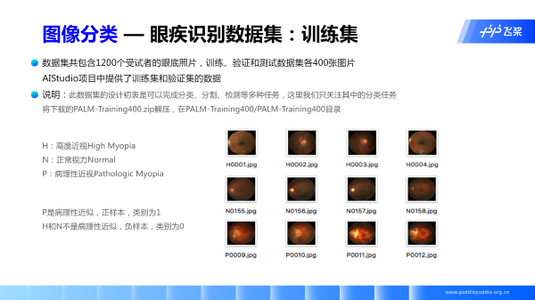

# 眼疾识别案例的`ResNet-vd`实现
本文通过paddle框架实现了`ResNet`​模型基础B版本和变体D版本，通过模型`API：version`进行切换版本。训练部分和验证部分都采用分批训练的方式，用来解决模型迭代过程中显存不足的问题。  

### 数据集介绍

如今近视已经成为困扰人们健康的一项全球性负担，在近视人群中，有超过35%的人患有重度近视。近视会拉长眼睛的光轴，也可能引起视网膜或者络网膜的病变。随着近视度数的不断加深，高度近视有可能引发病理性病变，这将会导致以下几种症状：视网膜或者络网膜发生退化、视盘区域萎缩、漆裂样纹损害、Fuchs斑等。因此，及早发现近视患者眼睛的病变并采取治疗，显得非常重要。

`iChallenge-PM`是百度大脑和中山大学中山眼科中心联合举办的`iChallenge`比赛中，提供的关于病理性近视（Pathologic Myopia，PM）的医疗类数据集，包含1200个受试者的眼底视网膜图片，训练、验证和测试数据集各400张，其中训练集名称第一个字符表示类别，验证集的类别信息储存在PALM-Validation-GT的PM_Label_and_Fovea_Location.xlsx文件中。（以下图片仅供参考）

<center class="half">
    
    
    
</center>


图1  数据集的的大致情况

### 数据集的导入和预处理

数据集在`aistudio`平台上可直接载入训练集，并且通过以下代码指令，我们进行解压到指定位置

```python
!unzip -oq /home/aistudio/data/data19469/valid_gt.zip
!unzip -oq /home/aistudio/data/data19469/training.zip
!unzip -oq /home/aistudio/data/data19469/validation.zip
if not os.path.isdir("train_data"):
    os.mkdir("train_data")
!unzip -oq /home/aistudio/PALM-Training400/PALM-Training400.zip -d /home/aistudio/train_data/
```

基于cv2，对数据集进行导入,由于导入图像数据的格式为[H,W,C]，因此需要基于cv2.resize对结构进行重组为[C,H,W]。并且对数据进行相应的标准化操作。

**标准化作用 ：**

1. 统一数据量纲
2. 平衡各特征的贡献
3. 加快了梯度下降求最优解的速度

```python
def transform_img(img):
    # 将图片尺寸缩放到 224x224
    img=cv2.resize(img,(224,224))
    # 读入的图像数据格式是[H,W,C]
    # 使用转置操作将其变成[C,H,W]
    img=np.transpose(img,(2,0,1))
    img.astype('float32')
    img=img/255.0
    img=img*2.0-1.0
    return img
```

通过自定义的data_loader和valid_loader导入训练集和验证集，并且在data_loader中打乱训练集。两者都预设batch_size选项设定每一个预设batch的大小。验证准确率和损失值由所有的batch的平均所得到。

```
data_loader(datadir,batch_size=10,mode='train')
valid_data_loader(datadir,annotiondir)
```

参数解释：

`datadir`：图片数据存在的文件夹路径

`annotiondir`：验证集标签文件路径

`output`：每个batch的图片数据，数据类型：float32，`numpy`保存，维度：[N,C,H,W]

### `ResNet`模型及其变体D的理论解析 

##### `ResNet`模型背景

2015 年，`ResNet` 横空出世，一举斩获 CVPR 2016 最佳论文奖，而且在 `Imagenet` 比赛的三个任务以及 COCO 比赛的检测和分割任务上都获得了第一名。

从经验来说，网络深度增加后，网络可以进行更加复杂的特征提取，因此可以取得更好的结果。但事实上并非如此，人们实验发现随着网络深度的增加，模型精度并不总是提升，并且这个问题显然不是由过拟合（overfitting）造成的，因为网络加深后不仅测试误差变高了，它的训练误差竟然也变高了。作者[何凯明](http://kaiminghe.com/)提出，这可能是因为更深的网络会伴随梯度消失/爆炸问题，从而阻碍网络的收敛。作者将这种加深网络深度但网络性能却下降的现象称为**退化问题**（degradation problem）。

##### `ResNet`的网络模型

`ResNet`网络是参考了VGG19网络，在其基础上进行了修改，并通过短路机制加入了残差单元。

变化主要体现在`ResNet`直接使用stride=2的卷积做下采样，并且用global average pool层替换了全连接层。`ResNet`的一个重要设计原则是：当feature map大小降低一半时，feature map的数量增加一倍，这保持了网络层的复杂度。以下为几种基本层数的`ResNet`版本的网络模型架构。


图2  `ResNet`的模型结构

整个`ResNet`不使用`dropout`，全部使用BN。此外，回到最初的这张细节图，我们不难发现一些规律和特点：

- 全图大致分为5个模块，其中2-5模块是残差单元构成的模块
- 受VGG的启发，卷积层主要是3×3卷积；

- **同一模块内图片的尺寸大小不变，不同模块之间相差大小减半，深度变为4倍**

- **第2个模块网络输出和输出图像尺寸相同，因此不需要下采样**
- **第3-5模块的下采样仅操作一次，因此仅需要在每个模块的第一个`block`进行`stride=2`的下采样**

- 网络以平均池化层和`softmax`的全连接层结束，实际上工程上一般用自适应全局平均池化 (Adaptive Global Average Pooling)；

### **重点知识解读**

##### `Bottleneck`结构和1*1卷积

自ResNet50起，就采用Bottleneck结构，主要是引入1x1卷积。

**1x1卷积作用：**

- 对通道数进行升维和降维（跨通道信息整合），实现了多个特征图的线性组合，同时保持了原有的特征图大小；

- 相比于其他尺寸的卷积核，可以极大地降低运算复杂度；

- 如果使用两个3x3卷积堆叠，只有一个`relu`，但使用1x1卷积就会有两个`relu`，引入了更多的非线性映射；


图3  残差单元结构和1x1卷积

（以上左图为`Basicblock`结构，右图为`Bottleneck`结构)
我们来计算一下1*1卷积的计算量优势：首先看上图右边的`bottleneck`结构，对于256维的输入特征，参数数目：
$$
1*1*56*64+3*3*64*64+1*1*64*256=69632
$$
如果同样的输入输出维度但不使用1x1卷积，而使用两个3x3卷积的话，参数数目:
$$
(3*3*256*256)*2=1179648
$$
简单计算可知，使用了1x1卷积的`bottleneck`将计算量简化为原有的5.9%。

##### `ResNet-vb`及`ResNet-vd`模型设计

基于以上的规律和特点，我们做出如下设计：

1. 为保证每个模块内部卷积前后的图像尺寸不变 ，将卷积**BN块的`padding`设计为`(kernel_size-1)//2`**，这就保证了`stride=1`图像尺寸不变，`stride=2`图像尺寸减半。

2. 在2-5模块的残差单元block卷积采用如下类似的结构，**注意stride的设置**。


图4  `ResNet`的残差单元结构

（以上左图为`ResNet-vb`，右图为`ResNet-vd`）

**注意：第2模块的stride=1，第3-5模块的stride=2实现下采样**

### 附录：`ResNet`模型及变体的paddle实现  

```
# ResNet中使用BatchNorm层，在卷积层的后面加上BatchNorm以提升数值稳定性
# 定义卷积BN块
class ConvBNLayer(nn.Layer):
    def __init__(self,
                 num_channels,
                 num_filters,
                 filter_size,
                 stride=1,
                 groups=1,
                 act='relu'):
        """
        num_channels,卷积层的输入通道数
        num_filters,卷积层的输出通道数
        stride,卷积层的步幅
        groups,分组卷积的组数，默认groups=1不使用分组卷积
        """
        super(ConvBNLayer,self).__init__()
        self._conv=nn.Conv2D(
            in_channels=num_channels,
            out_channels=num_filters,
            kernel_size=filter_size,
            stride=stride,
            padding=(filter_size-1)//2,# 确保下采样和尺寸不变
            groups=groups,
            bias_attr=False,
        )
        self._batch_norm=nn.BatchNorm2D(num_filters)
        self.act=act
    def forward(self,inputs):
        x=self._conv(inputs)
        x=self._batch_norm(x)
        if self.act=='leaky':
            x=nn.functional.leaky_relu(x=x,negative_slope=0.1)
        elif self.act=='relu':
            x=nn.functional.relu(x=x)
        return x

# 定义残差块
# 每个残差块会对输入图片做三次卷积，然后跟输入图片进行短接
# 如果残差块中第三次卷积输出特征图的形状和输入不一致，则对输入图片做1x1卷积，将其输出形状调整为一致
class BottleneckBlock(nn.Layer):
    def __init__(self,
                 num_channels,
                 num_filters,
                 stride=1,
                 shortcut=True,
                 version='B'
                 ):
        super(BottleneckBlock,self).__init__()
        # 创建第一个1x1卷积层
        self.conv1=ConvBNLayer(
            num_channels=num_channels,
            num_filters=num_filters,
            filter_size=1,
            act='relu',
        )
        # 创建第二个3x3卷积层
        self.conv2=ConvBNLayer(
            num_channels=num_filters,
            num_filters=num_filters,
            filter_size=3,
            stride=stride,
            act='relu'
        )
        # 创建第三个1x1层，但是输出通道数乘4
        self.conv3=ConvBNLayer(
            num_channels=num_filters,
            num_filters=num_filters*4,
            filter_size=1,
            act='relu'
        )
        # 如果conv3的输出跟此残差块的输入数据形状一致，则shortcut=True
        # 否则shortcut=False，添加1个1x1的卷积作用在输入数据上，使其形状变为和conv3一样 
        if not shortcut:
            if version=='B': # 通过version来控制所采用的残差单元的版本
                self.short=ConvBNLayer(
                    num_channels=num_channels,
                    num_filters=num_filters*4,
                    filter_size=1,
                    stride=stride
                )
            elif version=='D':
                self.short=nn.Sequential(
                    nn.AvgPool2D(kernel_size=stride,stride=stride),
                    ConvBNLayer(num_channels=num_channels,
                                num_filters=num_filters*4,
                                filter_size=1))      
            else:
                raise(f'bottleneck block version:{version} error, you can choice B or D')          
        self.shortcut=shortcut
        self._num_channels_out=num_filters*4
    def forward(self,inputs):
        x=self.conv1(inputs)
        x=self.conv2(x)
        x=self.conv3(x)
        # 如果shortcut=Ture，直接将inputs跟conv2的输出相加
        # 否则需要对inputs进行一次 卷积，将形状调整成跟conv2输出一致
        if self.shortcut:
            short=inputs
        else:
            short=self.short(inputs)
        y=paddle.add(x=short,y=x)
        return y

# 定义ResNet模型
class ResNet(nn.Layer):
    def __init__(self,layers=50,class_dim=10,version='B'):
        """
        layers,网络层数，可以可选项：50,101,152
        class_dim,分类标签的类别数
        """
        super(ResNet,self).__init__()
        self.version=version
        self.layers=layers
        supported_layers=[50,101,152]
        assert layers in supported_layers,\
        "supported layers are {} but input layer is {}".format(supported_layers,layers)
        # ResNet50包含的第2-5模块分别包括3,4,6,3个残差块
        if layers==50:
            depth=[3,4,6,3]
        # ResNet101包含的第2-5模块分别包括3,4,23,3个残差块
        if layers==101:
            depth=[3,4,23,3]
        # ResNet152包含的第2-5模块分别包括3,8,36,3个残差块
        if layers==152:
            depth=[3,8,36,3]
        # 第2-5模块所使用残差块的输出通道数
        num_filters=[64,128,256,512]

        # 第1个模块,64个7x7的卷积加上一个3x3最大化池化层，步长均为2
        self.conv=ConvBNLayer(
            num_channels=3,
            num_filters=64,
            filter_size=7,
            stride=2,
            act='relu')
        self.pool2d_max=nn.MaxPool2D(
            kernel_size=3,
            stride=2,
            padding=1)
        # 第2-5模块，使用各个残差块进行卷积操作
        self.bottleneck_block_list=[]
        num_channels=64
        for block in range(len(depth)):
            shortcut=False
            for i in range(depth[block]):
                bottleneck_block=self.add_sublayer(
                    'bb_%d_%d'%(block,i),
                    BottleneckBlock(
                        num_channels=num_channels,
                        num_filters=num_filters[block],
                        stride=2 if i==0 and block!=0 else 1,
                        shortcut=shortcut,
                        version=version))
                num_channels=bottleneck_block._num_channels_out
                self.bottleneck_block_list.append(bottleneck_block)
                shortcut=True

        # 在c5的输出特征图上使用全局池化
        self.pool2d_avg=nn.AdaptiveAvgPool2D(output_size=1)
        
        # stdv用来作为全连接层随机初始化参数的方差
        import math
        stdv=1.0/math.sqrt(2048*1.0)
        # 创建全连接层，输出大小为类别数目，经过残差网络的卷积核全局池化后，
        # 卷积特征的维度是[B,2048,1,1]，故最后一层全连接层的输入维度是2048
        self.out=nn.Linear(in_features=2048,out_features=class_dim,
        weight_attr=paddle.ParamAttr(
            initializer=paddle.nn.initializer.Uniform(-stdv,stdv)))
    
    def forward(self,inputs):
        x=self.conv(inputs)
        x=self.pool2d_max(x)
        for bottleneck_block in self.bottleneck_block_list:
            x=bottleneck_block(x)
        x=self.pool2d_avg(x)
        x=paddle.reshape(x,[x.shape[0],-1])
        x=self.out(x)
        return x
```

### 参考文献

> https://blog.csdn.net/sinat_17456165/article/details/106045728
>
> https://aistudio.baidu.com/aistudio/education/preview/1533758
>
> https://zhuanlan.zhihu.com/p/31852747/

 

