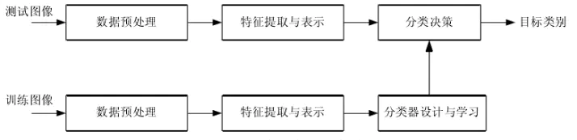

### 损失函数方法补充

##### Hinge函数特性

在机器学习中，**hinge loss**是一种损失函数，它通常用于"maximum-margin"的分类任务中，如支持向量机。数学表达式为：

![[公式]](images/1.svg)

其中 ![[公式]](https://www.zhihu.com/equation?tex=%5Chat%7By%7D) 表示预测输出，通常都是软结果（就是说输出不是0，1这种，可能是0.87。）， ![[公式]](https://www.zhihu.com/equation?tex=y) 表示正确的类别。

- 如果 ![[公式]](https://www.zhihu.com/equation?tex=%5Chat%7By%7Dy%3C1) ，则损失为： ![[公式]](https://www.zhihu.com/equation?tex=1-%5Chat%7By%7Dy)
- 如果 ![[公式]](https://www.zhihu.com/equation?tex=%5Chat%7By%7Dy%3E%3D1) ，则损失为：0

其函数图像如下，与0-1损失对比：


##### 优化

以支持向量机为例，其模型为： ![[公式]](https://www.zhihu.com/equation?tex=%5Chat%7By%7D%3Dw%5Ccdot+x) ，如果用hinge损失，其求导结果如下：

![[公式]](images\2.svg)

##### 变种

实际应用中，一方面很多时候我们的y的值域并不是[-1,1]，比如我们可能更希望y更接近于一个概率，即其值域最好是[0,1]。另一方面，很多时候我们希望训练的是两个样本之间的相似关系，而非样本的整体分类，所以很多时候我们会用下面的公式：

![[公式]](images\4.svg)

其中，y是正样本的得分，y’是负样本的得分，m是margin（自己选一个数）

即我们希望正样本分数越高越好，负样本分数越低越好，但二者得分之差最多到m就足够了，差距增大并不会有任何奖励。

比如，我们想训练词向量，我们希望经常同时出现的词，他们的向量内积越大越好；不经常同时出现的词，他们的向量内积越小越好。则我们的hinge loss function可以是：

![[公式]](images\5.svg)

其中，w是当前正在处理的词， ![[公式]](https://www.zhihu.com/equation?tex=w_%2B) *是w在文中前3个词和后3个词中的某一个词，* ![[公式]](https://www.zhihu.com/equation?tex=w_%E2%88%92) 是随机选的一个词。

### 损失函数python代码实现

```
def update_weights_Huber(m, b, X, Y, delta, learning_rate):
    m_deriv = 0
    b_deriv = 0
    N = len(X)
    for i in range(N):
        # 小值的二次导数，大值的线性导数
        if abs(Y[i] - m*X[i] - b) <= delta:
            m_deriv += -X[i] * (Y[i] - (m*X[i] + b))
            b_deriv += - (Y[i] - (m*X[i] + b))
        else:
            m_deriv += delta * X[i] * ((m*X[i] + b) - Y[i]) / abs((m*X[i] + b) - Y[i])
            b_deriv += delta * ((m*X[i] + b) - Y[i]) / abs((m*X[i] + b) - Y[i])
    #我们减去它，因为导数指向最陡的上升方向
    m -= (m_deriv / float(N)) * learning_rate
    b -= (b_deriv / float(N)) * learning_rate
    return m, b
```

### 池化方法补充

##### 随机池化(Stochastic Pooling)


Stochastic pooling是**一种简单有效的正则化CNN的方法，能够降低max pooling的过拟合现象，提高泛化能力**。对于pooling层的输入，根据输入的多项式分布随机选择一个值作为输出。训练阶段和测试阶段的操作略有不同。

**训练阶段：**

1）前向传播：先将池化窗口中的元素全部除以它们的和，得到概率矩阵；再按照概率随机选中的方格的值，作为该区域池化后的值。

2）反向传播：求导时，只需保留前向传播中已经被选中节点的位置的值，其它值都为0，类似max-pooling的反向传播。

**测试阶段：**

在测试时也使用Stochastic Pooling会对预测值引入噪音，降低性能。取而代之的是使用概率矩阵加权平均。比使用Average Pooling表现要好一些。在平均意义上，与Average Pooling近似，在局部意义上，服从Max Pooling准则。

### 数据增强方法修改及补充

 随机裁切（random crop）

   随机裁切几乎是所有深度学习框架训练都具有的数据增强方法，在很多有名的深度学习网络（VGG,AlexNet,GoogleNet,ResNet……）的训练中，对输入256*256的图像，通常会以224或227的窗口随机获得子图像作为训练，而在测试时则是以图像中心的子块（Patch）。最终使用则直接将图像resize到训练时用的crop size大小。实现也是比较简单，在红色区域内随机取点作为滑窗左上角顶点。

Python实现：


    import numpy.random as npr
    
    def randomCrop(img,size_h,size_w):
    	rows,cols=img.shape[:2]
     
    	left_h=npr.randint(0,rows-size_h)
     
    	left_w=npr.randint(0,cols-size_w)
     
    	crop_img=img[left_h:left_h+size_h,left_w:left_w+size_w]
     
        return crop_img
翻转（左右上下）

   左右翻转也叫做水平翻转或镜像（mirror）,将图像的左右部分以图像垂直中轴线为中心进行镜像对换。假设原图像高度为h,宽度为w,原图像某一像素点P(x0,y0), 经过水平镜像变换后为P(w-1-x0,y0),矩阵表示：


Python代码（左右镜像）：

```

#水平翻转
def  horizontalFlip(img):
    size = img.shape  # 获得图像的形状
    iLR = img.copy()  # 获得一个和原始图像相同的图像，注意这里要使用深度复制
    h = size[0]
    w = size[1]
    for i in range(h):  # 元素循环
        for j in range(w):
            iLR[i, w - 1 - j] = img[i, j]
    return iLR
 
#垂直翻转
def verticalFlip(img):
    size = img.shape  # 获得图像的形状
    iLR = img.copy()  # 获得一个和原始图像相同的图像，注意这里要使用深度复制
    h = size[0]
    w = size[1]
    for i in range(h):  # 元素循环
        for j in range(w):
            iLR[ h- 1 - i,j] = img[i, j]
    return iLR

```

### 图像分类方法综述

1.1 

图像分类是指根据一定的分类规则将图像自动分到一组预定义类别中的过程。

1.2 

图像分类方法的划分十分多样。根据图像语义内容的不同层次可以将图像分类划分为：

（1）对象分类 object categorization

（2）场景分类 scene classification

（3）事件分类 event classification

（4）情感分类 emotion classification

1.3

视觉一致的图像分类：主要依据是图像内容的视觉感知一致性（看起来一样，差不多）而不是功能一致性（用途差不多，一样）。

基于场景的图像分类：根据图像拍摄时所处的物理环境类别来对图像进行分类

对象分类和目标识别：对象分类是指判定一个图像中是否出现了某个对象类别的方法但他并不需要定为或者分割出图像中的对象；

对象识别或目标识别：通常指从新的图像中找出以前证件出现过的同一对象。

1.4 

图像分类的应用

网络图像检索

视频分析与检索

医学图像分类

医学图像数据挖掘

图像检测

遥感图像分类

1.5 图像分类的基本过程

基本操作是建立 图像内容的描述，然后利用机器学习方法学习图像类别，最后利用学习得到的模型对未知图像进行分类。



一般来说，图像分类性能主要与图像特征提取和分类方法密切相关。图像特征提取是图像分类的基础，提取的图像特征应能代表各种不同的图像属性；

分类方法是图像分类的核心，最终的分类准确性与分类方法密切相关。

