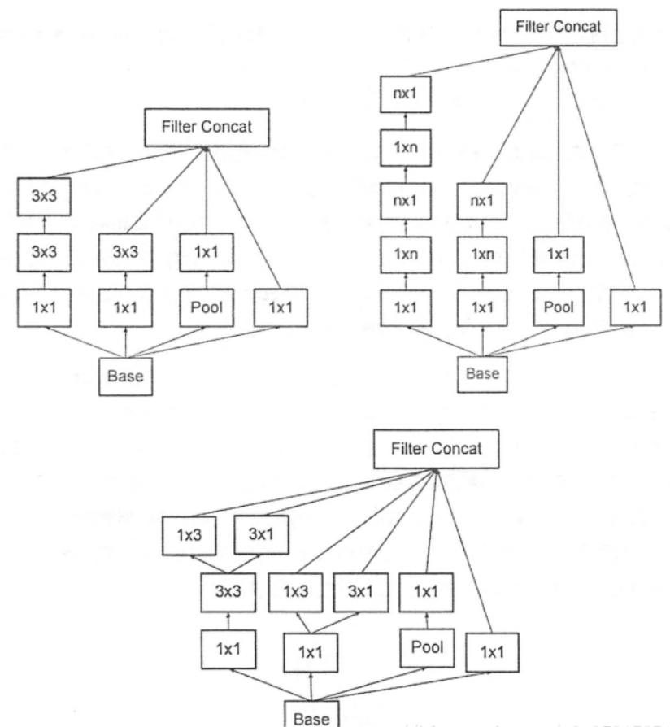
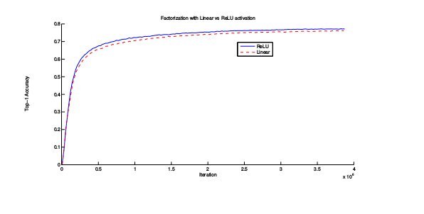
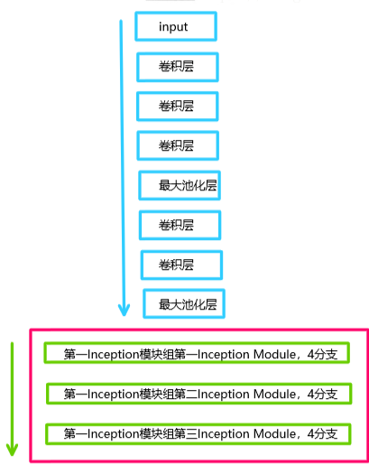
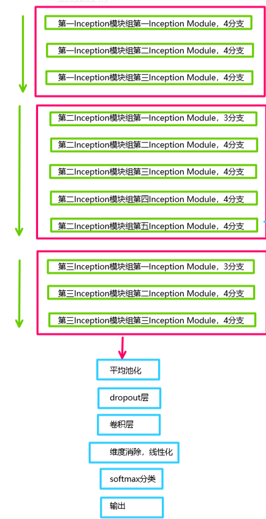

AlexNet在imagNet大赛上的成功使得深度学习开始被应用到各种任务。
2014年后，模型size的增大成为提高模型性能的主要研究方法（VGG、GoogLeNet）。尽管VGG取得了很好的性能，但它的计算量太大；GoogLeNet的Inception架构能够在strict constraints on memory and computational budget的情况下，取得很好的性能。另外GoogLeNet仅有5 million参数（1/12 AlexNet参数量）。VGG的参数量为AlexNet的3倍。
Inception的计算量比VGG少，但有更高性能。这使得能在大数据（inference时间要少）或移动环境（内存、计算力有限）的情景下使用Inception。
人脑神经元的连接是稀疏的，因此研究者认为大型神经网络的合理连接方式应该也是稀疏的。稀疏结构是非常适合神经网络的一种结构，尤其对非常大型，非常深的网络，可以减轻过拟合并减少计算量，例如卷积神经网络就是稀疏的连接，Inception Net的目标就是找到最优的稀疏结构单元（Inception model）。

Inception model的构建符合Hebbian原理， 简单介绍下Hebbian原理：神经反射活动的持续与重复会导致神经元稳定性的持久提升，当两个神经元A和B离的很近，并且A参与了B重复、持续的兴奋，那么某些代谢变化会导致A将作为能使B兴奋的细胞。总结一下即“一起发射的神经元会连接在一起”。在神经网络角度，即相关性高的节点应该被连接在一起。
在图片数据中，天然的就是临近区域的数据相关性高，因此相邻的像素点被卷积操作连接在一起。而我们可能有多个卷积核，在同一位置但在不同通道输出的卷积核的输出结果相关性很高。因此一个1×1的卷积就可以很自然的将这些相关性很高的、在同一个空间位置但是不同通道的特征连接在一起，这就是为什么1×1卷积这么频繁的被应用在Inception Net中。
1×1卷积所连接的的节点的相关性是很高的，而稍微大一些尺寸的卷积如3×3，5×5的相关性也很高，因此可以适当地使用一些以增加多样性。Inception model中一般有4个分支，包含不同尺寸地卷积和一个最大池化，增加了网络对不同尺寸的适应性。
下图为Inception V3中三种结构的Inception model。

设计Inception模块的思想有：
1.将大的卷积分解为更小的卷积。
GoogLeNet性能很大程度上来自于降维的广泛使用。例如，一个1x1卷积紧接着一个3x3卷积。在视觉任务中，我们希望临近的activations是高度相关的，所以，我们在aggregation之前降维。将大filter卷积分解为多个小filter卷积。这种分解能对参数进行解离。因此，训练速度会更快。
将5x5分解为两个3x3，分解前和分解后的感受野是一样的。两个3x3卷积的串联比一个5x5卷积的表达能力更强。另外，分解后多使用了一个激活函数，增加了非线性能力。 两个3x3卷积和一个5x5卷积的参数量的比为$\frac{9+9}{25}$ , 参数量和计算量减少了。
但分解大的卷积时也要注意两个问题： 1.分解会不会降低模型的表达能力； 2.如果分解，有没有必要在第一层或前层的卷积后使用激活函数。答案是，分解不会降低模型的表达能力，使用激活函数则会增强模型的非线性拟合能力，分解是有好处的。这就是上图中左上方的模块。

2.将大的卷积分解为空间不对称卷积
上一小节说明大filter的卷积层可以分解为一系列的3x3filter的卷积层。是否我们可以进一步分解为更小的filter的卷积层。事实上，通过卷积的非对称分解可以将3x3卷积分解为1x3和3x1卷积。在输入输出filters数目一定的时候，卷积的非对称分解可以将计算量减少33%。然而，如果将3x3卷积分解为两个2x2卷积只能减少11%的计算量。
理论上，我们可以用1xn和nx1卷积的串联来代替nxn卷积，计算量可以可以降低为1/n，进一步减少计算量。在实践中，n的范围为12到20。这就是右上方模块。
根据神经网络设计的一些经验准则，结合以上两点之后，我们就得出了正下方的InceptionV3模块。

我所使用的InceptionV3结构如下图所示：

网络还有辅助节点输出，但在这次任务中认为不需要，所以也不使用。

此外，这次实践还将上课过程中用到的ResNet50也用来训练，用于与InceptionV3的网络作对比。结果这两个网络性能相近，有的时候前者准确率高，有的时候后者准确率高。在训练过程中ResNet有时候性能会倒退，但InceptionV3没有，稳定性更强。二者最后都能达到90%以上的准确率。
