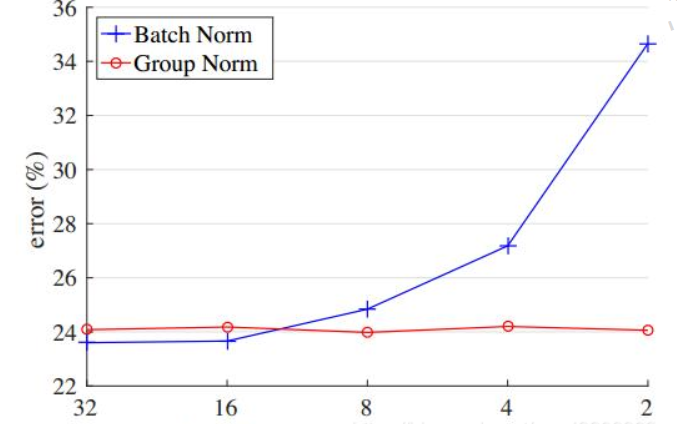
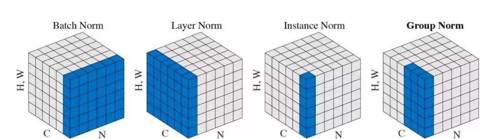
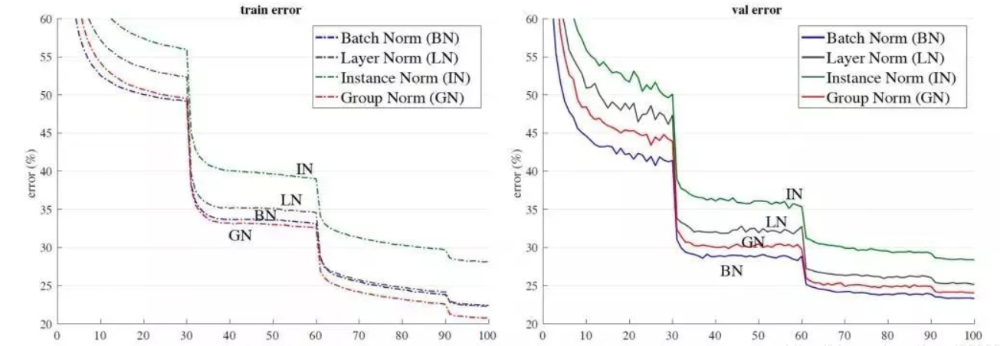
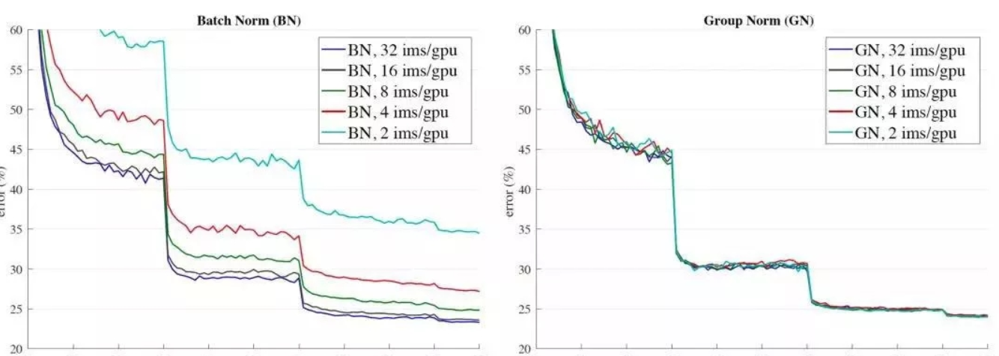

群组归一化：
Group Normalization（GN）是针对Batch Normalization（BN）在batch size较小时错误率较高而提出的改进算法，因为BN层的计算结果依赖当前batch的数据，当batch size较小时（比如2、4这样），该batch数据的均值和方差的代表性较差，因此对最后的结果影响也较大。
如下图所示，随着batch size越来越小，BN计算得出的统计信息的可靠性越来越差，这样就很容易导致最终结果错误率的上升，而在batch size较大时错误率还是有效能降低的。虽然在很多涉及神经网络的图像分类算法中GPU的显存是能容纳足够大的batch size，但在目标检测，分割以及视频相关的算法中，由于输入图像较大，维数很高等原因，batch size一值是会设置的比较小的。所以GN在这样一些batch size小的算法上的效果相比于BN应该是有改进的。

因此Group Normalization（GN）的思想并不复杂，简单讲就是要使归一化操作的计算不依赖batch size的大小，神经网络中的数据维度一般是$[N,C,H,W]$格式，N是batch size，H/W是feature的高/宽，C是channel。压缩H/W至一个维度，自然想到能否把注意力从batch转移至chanel。
GN的概念，引用原论文：
> GN divides the channels into groups and computes within each group the mean and variance for normalization. GN’s computation is independent of batch sizes, and its accuracy is stable in a wide range of batch sizes.

译为：GN将channel维分组并计算各组的均值和方差。GN的计算结果与batch size无关，并且对于大范围的batch size值结果能保持稳定。
原论文的理论部分以及实验验证部分都提到下图中的四种归一化方法，分别是Batch Norm(BN), Layer Norm(LN), Instance Norm(IN), Group Norm(GN). 这四种方式采用一样的公式计算均值，标准差，并且会对计算结果进行线性变换以便学习。它们的区别是计算所使用的区域不同。

对于BN，它对batch方向作归一化，相同通道的点才参与计算均值和标准差，也就是对每一个C, 沿着N, H, W三个方向计算均值和标准差。用，k表示像素点，S表示计算用到的像素点集合，则BN的S可以表式为：
$S_i = \left\{\left.k\right| k_C = i_C\right\}$
对于LN，它对channel方向作归一化，也就是同一feature map里的点才参与计算，算C, H, W三个方向的均值和标准差。同样可表示为$S_i = \left\{\left. k \right| k_N = i_N \right\}$
对于IN，它对每个channel， 每个feature map都作计算，算的是H, W方向的均值和标准差。表示为$S_i = \left\{\left. k \right| k_C=i_C, k_N=i_N\right\}$
对于GN，它在channel方向分组，每个组内作归一化，计算$(C//G), H, W$的均值，表示为$S_i = \left\{\left. k \right| k_N=i_N, \frac{k_C}{C/G} = \frac{i_C}{C/G}\right\}$，G为指定的通道数量。
实验验证：

上图为以ResNet50为model，batch size设置为32时上述方法的训练误差和测试误差。GN没有表现出很大优势，在训练误差上略优于BN，在测试误差上则更差。

上图是batch size大小对BN和GN的影响，可以看出GN基本不受batch size影响，鲁棒性比BN更强。
总结，GN是将channel方向分组，用分组后各组的像素数据进行均值和标准差计算的方法，它不同于BN，不依赖batch size，在效果不明显差于BN的情况下鲁棒性更强，并且在batch size小的情况下性能明显优于BN。
