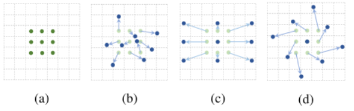
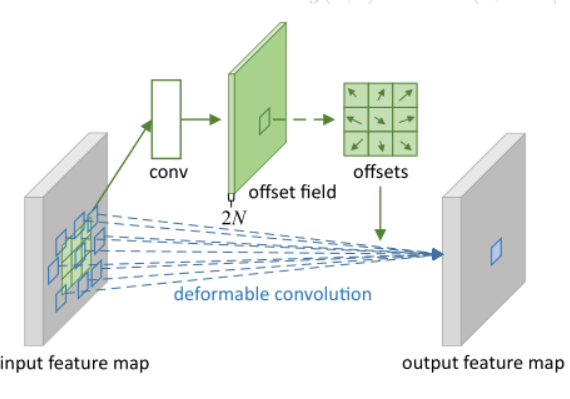
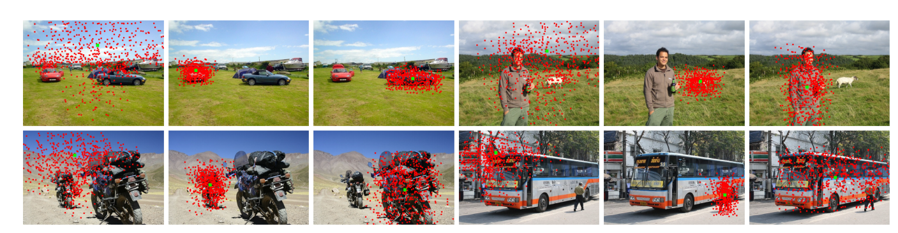

可变形卷积：
V1：
卷积神经网络由于卷积核几何结构和大小固定，导致其不能很好的建模存在几何形变的物体，提取到的特征只能是矩形框里的特征。而可变形卷积则可以用于提高CNN对有几何形变物体的建模能力，能更准确地提取到想要的特征。它的创新的思想概括为在任务中学习偏移量来改变采样点的空间位置。
从下面的图中，可以看出标准卷积和可变形卷积之间的区别。图（a）是一个常用的 3x3 的标准卷积所对应的采样点（绿色点）。图（b）是一个可变形卷积所对应的采样点（蓝色点），其中的箭头就是本文需要学习的偏移量，根据这些偏移量，就可以把标准卷积中对应的采样点（ 图(a)中绿色 ）移动到可变形卷积中的不规则采样点处（ 图(b)中蓝色 ）。图（c）和图（d）是图（b）的特殊情况，表明了可变形卷积囊括了长宽比、尺度变换和旋转变换。

在标准卷积中，对于输出特征图y的每一个点$y(p_0)$，它的计算方式如下：
$$y(p_0) = \sum_{p_n\in R} w(p_n) \cdot x(p_0+p_n)$$
其中$w(p_n)$为每一个采样点对应的权重。
可变形卷积V1的做法是，它在每一个采样点位置上都加上了一个可学习的偏置$\Delta p_n$，其表达式变化为：
$$y(p_0) = \sum_{p_n\in R} w(p_n) \cdot x(p_0+p_n+\Delta p_n)$$
当$\Delta p_n$是一个分数时，采用双线性插值计算$x(p_0+p_n+\Delta p_n)$的值，即：
$$x(p) = \sum_{q} G(q,p) \cdot x(q)$$
$$G(q,p) = g(q_x,p_x) \cdot g(q_y,p_y)$$
$$g(a,b) = max(0,1-|a-b|)$$
上式中p为分数$（p_0+p_n+\Delta p_n)$，q为x中所有是整数位置的点，实际上只用到了$（p_0+p_n+\Delta p_n)$周围的四个整数点，其余的点$g$值为0。可见$G(q,p)$被拆分成x和y维上线性插值的乘积。
可变形卷积的结构如下图所示，上面的支路通过卷积层学习偏移量的大小，其中offset field的channel数为2N，N是卷积核的大小。2N是因为feature map的每一个点需要N个$\Delta p_n$，而$\Delta p_n$是二维的。可变形卷积可以看成基于offset field做了插值，然后再进行卷积。

上图为可变形卷积的效果。可以看到，当绿色点出现在目标上时，红色点也集中在目标位置并且基本能够覆盖不同尺寸的目标，因此经过可变形卷积，我们可以更好地提取出目标物的特征。

V2：
V1版本存在一个问题，即可变形卷积的过程中可能引入了无用的上下文区域干扰了特征提取，显然这会降低算法的表现。
V2在V1的版本上，加了一个控制输入强度的标量：
$$y(p_0) = \sum_{k=1}^K w_k \cdot x(p_0+p_n) \cdot \Delta m_k$$
与V1的计算公式相比，V2只多了一个可学习的标量$\Delta m_k \in [0,1]$，网络结构也与V1相似，只不过offset filed通道数变成了3N。

通过实验我们也可以看出改进后的V2更能集中在物体的完整有效的区域中。

