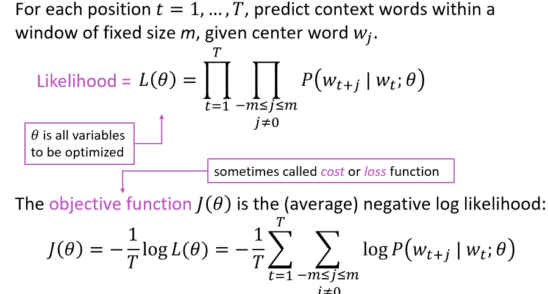
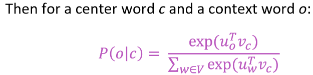
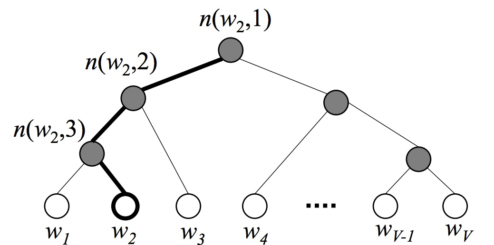

# Hierarchical Softmax优化策略

LSTM的优化函数如下：

其中：

但是，直接计算这个概率的话，分母所需要的计算量太大了，需要在整个数据集上计算。除了课上讲的负采样优化方法之外，我们还有Hierarchical Softmax方法。

Hierarchical Softmax是一种对输出层进行优化的策略，输出层从原始模型的利用softmax计算概率值改为了利用Huffman树计算概率值。一开始我们可以用以词表中的全部词作为节点，词频作为节点的权，构建Huffman树。对每个叶子节点（标签），从根节点（上一层的输出）到叶子节点有唯一一条路径。只有非叶子节点才有对应的向量，叶子节点的向量表示是优化的目标。Hierarchical Softmax正是利用这条路径来计算指定词的概率，而非用softmax来计算。 

它从两个方面优化了这个问题。其一，它把 N 分类问题变成 log(N)次二分类,利用哈夫曼树构造很多二分类(sigmoid)；( 使用原始的softmax计算,是N分类,N代表词典个数,所以softmax计算量非常大需要对N个分类下的各自输出值)；其二，层次化softmax不必求神经网络隐藏层中的权值矩阵, 而是改求哈弗曼树中每个节点的权值向量, 这样就减少了计算。

Hierarchical softmax的缺点就是:虽然我们使用huffman树代替传统的神经网络，可以提高模型训练的效率，但是如果我们训练样本中的中心词w是一个很生僻的词，那么就需要沿着huffman树往下走很多，因为越是高频的词，越是靠近根节点，越生僻的词里根节点就越远。

