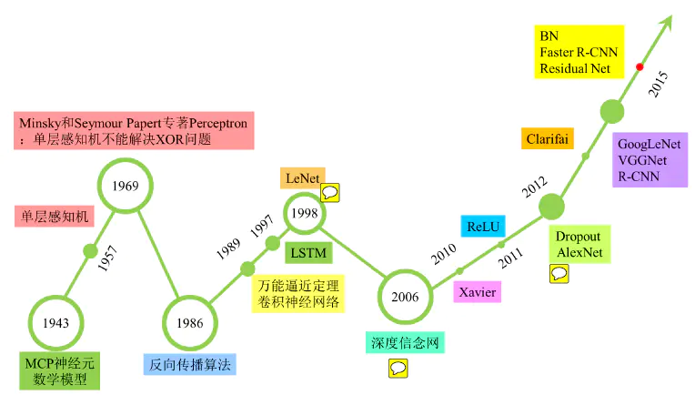

# 7.6作业

## 1. 深度学习发展历史
深度学习在从2006年崛起之前经历了两次低估，这两个低估也将神经网络的发展分为了三个不同的阶段。

 

图1 深度学习发展史

### 第一代神经网络（1958~1969）

最早的神经网络的思想起源于1943年的MCP人工神经元模型，当时是希望能够用计算机来模拟人的神经元反应的过程。

1958年，Rosenblatt发明的感知器（perceptron）算法第一次将MCP用于机器学习（分类）。该算法使用MCP模型对输入的多维数据进行二分类，且能够使用梯度下降法从训练样本中自动学习更新权值。1962年，该方法被证明能够收敛，理论与实践效果引起第一次神经网络的浪潮。

1969年，美国数学家及人工智能先驱Minsky在其著作中证明了感知器本质上是一种线性模型，只能处理线性分类问题，就连最简单的XOR问题都无法正确分类。这等于直接宣判了感知器的死刑，至此神经网络的研究也陷入了近20年的停滞。

### 第二代神经网络（1986~1998）

1986年，Hinton发明了适用于多层感知器（MLP）的BP算法，并采用Sigmoid进行非线性映射，有效解决了非线性分类和学习的问题，第一次打破非线性诅咒，该方法引起了神经网络的第二次热潮。

1989年，Robert Hecht-Nielsen证明了MLP的万能逼近定理，这极大的鼓舞了神经网络的研究人员。

1989年以后，由于没有特别突出的方法被提出，且NN一直缺少相应的严格的数学理论支持，神经网络的热潮渐渐冷淡下去。

1991年，BP算法被指出存在梯度消失问题，即在误差梯度后向传递的过程中，后层梯度以乘性方式叠加到前层，由于Sigmoid函数的饱和特性，后层梯度本来就小，误差梯度传到前层时几乎为0，因此无法对前层进行有效的学习，该发现对此时的NN发展雪上加霜。

同时在1986~2006年，统计学习方法见于突出的性能表现，引来了春天。

### 第三代神经网络（2006~至今）

**快速发展期（2006~2012）**

2006年，Hinton提出了深层网络训练中梯度消失问题的解决方案：无监督预训练对权值进行初始化+有监督训练微调。其主要思想是先通过自学习的方法学习到训练数据的结构（自动编码器），然后在该结构上进行有监督训练微调。但是由于没有特别有效的实验验证，该论文并没有引起重视。

2011年，ReLU激活函数被提出，该激活函数能够有效的抑制梯度消失问题。

2011年，微软首次将DL应用在语音识别上，取得了重大突破。

**爆发期（2012~至今）**

2012年，Hinton课题组为了证明深度学习的潜力，首次参加ImageNet图像识别比赛，其通过构建的CNN网络AlexNet一举夺得冠军，且碾压第二名（SVM方法）的分类性能。

2013,2014,2015年，通过ImageNet图像识别比赛，DL的网络结构，训练方法，GPU硬件的不断进步，促使其在其他领域也在不断的征服战场

2015年，Hinton，LeCun，Bengio论证了局部极值问题对于DL的影响，结果是Loss的局部极值问题对于深层网络来说影响可以忽略。该论断也消除了笼罩在神经网络上的局部极值问题的阴霾。

## 2. 人工智能、深度学习、机器学习有什么区别与联系

总的概括，人工智能企图了解智能的本质，并生产出一种新的能以人类智能相似的方式做出反应的智能机器，机器学习是一种实现人工智能的方法，深度学习是一种实现机器学习的技术，当下人工智能大爆炸的核心驱动。在图 2 中我们就用最简单的方法——同心圆，可视化地展现出它们三者的关系。

 

图2 人工智能、深度学习、机器学习

## 3. 神经元、单层感知机、多层感知机

### **3.1神经元**
受生物神经元细胞的启发，神经科学家Warren McCulloch和逻辑学家Walter Pitts基于神经元细胞的结构特性与传递信息的方式，提出了MCP模型，它是人工神经网络中的最基本结构，MCP模型结构如图 1 所示：

 

图3.1 MCP模型结构

从 图1 可见，给定 $n$ 个二值化（0或1）的输入数据 $x_i$ (1≤$i$≤$n$)与连接参数 $w_i$ (1≤$i$≤$n$)，MCP 神经元模型对输入数据线性加权求和，然后使用函数 $Φ()$ 将加权累加结果映射为 0 或 1 ，以完成两类分类的任务： $y=Φ(\sum_{i=1}^n w_ix_i)$

其中 $w_i$ 为预先设定的连接权重值（一般在 0 和 1 中取一个值或者 1 和 -1 中取一个值），用来表示其所对应输入数据对输出结果的影响（即权重）。$Φ()$ 将输入端数据与连接权重所得线性加权累加结果与预先设定阈值 $θ$ 进行比较，根据比较结果输出 1 或 0。

具体而言，如果线性加权累加结果（即 $\sum_{i=1}^n w_ix_i$）大于阈值 $θ$，则函数 $Φ()$ 的输出为1、否则为0。也就是说，如果线性加权累加结果大于阈值 $θ$，则神经元细胞处于兴奋状态，向后传递 1 的信息，否则该神经元细胞处于抑制状态而不向后传递信息。

从另外一个角度来看，对于任何输入数据 $x_i$ (1≤$i$≤$n$)，MCP 模型可得到 1 或 0 这样的输出结果，实现了将输入数据分类到 1 或 0 两个类别中，解决了二分类问题。

### **3.2单层感知机**
#### **单层感知机模型：**
MCP模型就是一个神经元结构，但是没有参数学习的过程，1957年Frank Rosenblatt提出了一种简单的人工神经网络——感知机，单层感知机相较于MCP引入了损失函数，并提出了学习的感念，结构如图 2 所示：

 

图3.2 单层感知机模型

具体单层感知机的模型可以简单表示为：

$$f(x)=sign(w∗x+b)$$

对于具有 n 个输入 $x_i$ 以及对应连接权重系数为 $w_j$ 的感知机，首先通过线性加权得到输入数据的累加结果 $z：z=w_1x_1+w_2x_2+...+b$。这里 $x_1,x_2,...,x_n$ 为感知机的输入，$w_1,w_2,...,w_n$为网络的权重系数，$b$ 为偏置项。然后将 $z$ 作为激活函数 $Φ(⋅)$ 的输入，这里激活函数 $Φ(⋅)$为 $sign$ 函数，其表达式为：

$$ sign(x)=\begin{cases}
+1 & x\geqslant0 \\
-1 & x<0
\end{cases}$$

$Φ(⋅)$会将 $z$ 与某一阈值（此例中，阈值为0）进行比较，如果大于等于该阈值则感知器输出为 1，否则输出为 −1。通过这样的操作，输入数据被分类为 1 或 −1 这两个不同类别。

#### **训练过程：**
给定一个 $n$ 维数据集，如果它可以被一个超平面完全分割，那么我们称这个数据集为线性可分数据集，否则，则为线性不可分的数据集。单层感知机只能处理线性可分数据集，其任务是寻找一个线性可分的超平面将所有的正类和负类划分到超平面两侧。单层感知机与 MCP 模型在连接权重设置上是不同的，即感知机中连接权重参数并不是预先设定好的，而是通过多次迭代训练而得到的。单层感知机通过构建损失函数来计算模型预测值与数据真实值间的误差，通过最小化代价函数来优化模型参数。

其具体的训练过程为：

定义数据集，变量和参数，其中给定一个$m∗n$大小的数据集，$x^0,x^1,...,x^m$ 为训练样本, $x^m_0,x^m_1,...,x^m_n$为第 $m$ 条训练样本，$d^m$ 为期望结果，$y^m$ 为实际结果，$η$ 为学习率，0<$η$<1；

对权重系数$w_j$进行初始化，初始值为随机值或全零值。同时，设置 $m=0$，读取第零条训练样本；

将训练样本输入到单层感知机中，根据模型公式，得到实际输出 $y$ ;

根据如下公式更新权重系数;
$$w^{m+1}=w^m+η[d^m−y^m]x^m$$
当满足收敛条件时，算法结束；若不满足收敛条件则输入下一条样本继续训练，即 $m=m+1$。通常收敛条件可为：

* 误差小于某个预先设定的较小值 $ϵ$ ;

* 迭代的权重系数间权值变化小于某个较小值；

* 迭代次数超过设定的最大迭代次数。

### **3.3多层感知机**
由于无法模拟诸如异或以及其他复杂函数的功能，使得单层感知机的应用较为单一，而多层感知机通过增加层数解决了非线性问题。

 

图3.3 多层感知机模型

如图 3 所示，多层感知机由输入层、输出层和至少一层的隐藏层构成。网络中各个隐藏层中神经元可接收相邻前序隐藏层中所有神经元传递而来的信息，经过加工处理后将信息输出给相邻后续隐藏层中所有神经元。

多层感知机可以模拟复杂非线性函数功能，所模拟函数的复杂性取决于网络隐藏层数目和各层中神经元数目，但是需要人为固定一层参数，只能训练其中一层。直到1986年Hinton提出了反向传播算法，使得训练多层网络成为可能。在GPU并行运算能力的大力发展下，网络的层数得以不断增加，新的网络模型也越来越多，感知机也逐渐退出了历史舞台。

## 4.什么是前向传播

前向传播过程，即网络如何根据输入$X$得到输出$Y$的。前向传播通过对一层的结点以及对应的连接权值进行加权和运算，结果加上一个偏置项，然后通过一个非线性函数（即激活函数），如ReLu，sigmoid等函数，得到的结果就是下一层结点的输出。从第一层（输入层）开始不断的通过这种方法一层层的运算，最后得到输出层结果。下面通过描绘图 4 来直观展示一下这个过程：

 

图4 前向传播网络结构

其对应的表达式如下：

$$a_1^{(2)} = f(W_{11}^{(1)}x_1 + W_{12}^{(1)}x_2 + W_{13}^{(1)}x_3 + b_1^{(1)}$$
$$a_2^{(2)} = f(W_{21}^{(1)}x_1 + W_{22}^{(1)}x_2 + W_{23}^{(1)}x_3 + b_2^{(1)}$$
$$a_3^{(2)} = f(W_{31}^{(1)}x_1 + W_{32}^{(1)}x_2 + W_{33}^{(1)}x_3 + b_3^{(1)}$$
$$h_{W,b}(x) = a_1^{(3)} = f(W_{11}^{(2)}a_1^{(2)} + W_{12}^{(2)}a_2^{(2)} + W_{13}^{(2)}a_3^{(2)} + b_1^{(2)}$$

## 5.什么是反向传播

反向传播算法，简称BP算法，适合于多层神经网络的一种学习算法，它建立在梯度下降法的基础上。

BP算法的学习过程由正向传播过程和反向传播过程组成，在正向传播过程中，输入信息通过输入层经隐含层，逐层处理并传向输出层。

如果在输出层得不到期望的输出值，则取输出与期望的误差的平方和作为目标函数，转入反向传播，逐层求出目标函数对各神经元权值的偏导数，构成目标函数对权值向量的梯量，作为修改权值的依据，网络的学习在权值修改过程中完成。误差达到所期望值时，网络学习结束。如图：

 

图5 BP反向传播

