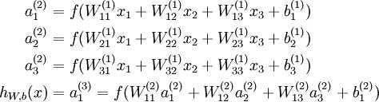

# 一、深度学习基础知识
#### ①深度学习发展历史。
 1943年
由神经科学家麦卡洛克(W.S.McCilloch) 和数学家皮兹（W.Pitts）在《数学生物物理学公告》上发表论文《神经活动中内在思想的逻辑演算》（A Logical Calculus of the Ideas Immanent in Nervous Activity）。建立了神经网络和数学模型，称为MCP模型。所谓MCP模型，其实是按照生物神经元的结构和工作原理构造出来的一个抽象和简化了的模型，也就诞生了所谓的“模拟大脑”，人工神经网络的大门由此开启。

麦卡洛克(W.S.McCilloch)

皮兹（W.Pitts）

MCP当时是希望能够用计算机来模拟人的神经元反应的过程，该模型将神经元简化为了三个过程：输入信号线性加权，求和，非线性激活（阈值法）。如下图所示

1958年
计算机科学家罗森布拉特（ Rosenblatt）提出了两层神经元组成的神经网络，称之为“感知器”(Perceptrons)。第一次将MCP用于机器学习（machine learning）分类(classification)。“感知器”算法算法使用MCP模型对输入的多维数据进行二分类，且能够使用梯度下降法从训练样本中自动学习更新权值。1962年,该方法被证明为能够收敛，理论与实践效果引起第一次神经网络的浪潮。

1969年
纵观科学发展史，无疑都是充满曲折的，深度学习也毫不例外。 1969年，美国数学家及人工智能先驱 Marvin Minsky 在其著作中证明了感知器本质上是一种线性模型（linear model），只能处理线性分类问题，就连最简单的XOR（亦或）问题都无法正确分类。这等于直接宣判了感知器的死刑，神经网络的研究也陷入了将近20年的停滞。

1986年
由神经网络之父 Geoffrey Hinton 在1986年发明了适用于多层感知器（MLP）的BP（Backpropagation）算法，并采用Sigmoid进行非线性映射，有效解决了非线性分类和学习的问题。该方法引起了神经网络的第二次热潮。

注：Sigmoid 函数是一个在生物学中常见的S型的函数，也称为S型生长曲线。在信息科学中，由于其单增以及反函数单增等性质，Sigmoid函数常被用作神经网络的阈值函数，将变量映射到0,1之间。

90年代时期
1991年BP算法被指出存在梯度消失问题，也就是说在误差梯度后项传递的过程中，后层梯度以乘性方式叠加到前层，由于Sigmoid函数的饱和特性，后层梯度本来就小，误差梯度传到前层时几乎为0，因此无法对前层进行有效的学习，该问题直接阻碍了深度学习的进一步发展。

此外90年代中期，支持向量机算法诞生（SVM算法）等各种浅层机器学习模型被提出，SVM也是一种有监督的学习模型，应用于模式识别，分类以及回归分析等。支持向量机以统计学为基础，和神经网络有明显的差异，支持向量机等算法的提出再次阻碍了深度学习的发展。

发展期 2006年 - 2012年
2006年，加拿大多伦多大学教授、机器学习领域泰斗、神经网络之父—— Geoffrey Hinton 和他的学生 Ruslan Salakhutdinov 在顶尖学术刊物《科学》上发表了一篇文章，该文章提出了深层网络训练中梯度消失问题的解决方案：无监督预训练对权值进行初始化+有监督训练微调。斯坦福大学、纽约大学、加拿大蒙特利尔大学等成为研究深度学习的重镇，至此开启了深度学习在学术界和工业界的浪潮。

Geoffrey Hinton

2011年，ReLU激活函数被提出，该激活函数能够有效的抑制梯度消失问题。2011年以来，微软首次将DL应用在语音识别上，取得了重大突破。微软研究院和Google的语音识别研究人员先后采用DNN技术降低语音识别错误率20％~30％，是语音识别领域十多年来最大的突破性进展。2012年，DNN技术在图像识别领域取得惊人的效果，在ImageNet评测上将错误率从26％降低到15％。在这一年，DNN还被应用于制药公司的DrugeActivity预测问题，并获得世界最好成绩。

爆发期 2012 - 2017
2012年，Hinton课题组为了证明深度学习的潜力，首次参加ImageNet图像识别比赛，其通过构建的CNN网络AlexNet一举夺得冠军，且碾压第二名（SVM方法）的分类性能。也正是由于该比赛，CNN吸引到了众多研究者的注意。

AlexNet的创新点在于:

(1)首次采用ReLU激活函数，极大增大收敛速度且从根本上解决了梯度消失问题。

(2)由于ReLU方法可以很好抑制梯度消失问题，AlexNet抛弃了“预训练+微调”的方法，完全采用有监督训练。也正因为如此，DL的主流学习方法也因此变为了纯粹的有监督学习。

(3)扩展了LeNet5结构，添加Dropout层减小过拟合，LRN层增强泛化能力/减小过拟合。

(4)第一次使用GPU加速模型计算。

2013、2014、2015、2016年，通过ImageNet图像识别比赛，DL的网络结构，训练方法，GPU硬件的不断进步，促使其在其他领域也在不断的征服战场。

2016年3月，由谷歌（Google）旗下DeepMind公司开发的AlphaGo(基于深度学习)与围棋世界冠军、职业九段棋手李世石进行围棋人机大战，以4比1的总比分获胜；2016年末2017年初，该程序在中国棋类网站上以“大师”（Master）为注册帐号与中日韩数十位围棋高手进行快棋对决，连续60局无一败绩；2017年5月，在中国乌镇围棋峰会上，它与排名世界第一的世界围棋冠军柯洁对战，以3比0的总比分获胜。围棋界公认阿尔法围棋的棋力已经超过人类职业围棋顶尖水平。

总结
深度学习目前还处于发展阶段，不管是理论方面还是实践方面都还有许多问题待解决，不过由于我们处在了一个“大数据”时代，以及计算资源的大大提升，新模型、新理论的验证周期会大大缩短。人工智能时代的开启必然会很大程度的改变这个世界，无论是从交通，医疗，购物，军事等方面，或许我们处于最好的年代，也或许我们处于最坏的年代，未来无法预知，那就抱着乐观的态度迎接这个第三次工业革命吧。

#### ②人工智能、机器学习、深度学习有什么区别和联系？
一、概念

1、人工智能

人工智能（Artificial intelligence）简称AI。人工智能是计算机科学的一个分支，它企图了解智能的本质，并生产出一种新的能以人类智能相似的方式做出反应的智能机器，是研究、开发用于模拟、延伸和扩展人的智能的理论、方法、技术及应用系统的一门新的技术科学。

人工智能目前分为弱人工智能和强人工智能和超人工智能。

1）弱人工智能：弱人工智能（ArtificialNarrow Intelligence /ANI),只专注于完成某个特定的任务，例如语音识别、图象识别和翻译等，是擅长于单个方面的人工智能。它们只是用于解决特定的具体类的任务问题而存在，大都是统计数据，以此从中归纳出模型。由于弱人工智能智能处理较为单一的问题，且发展程度并没有达到模拟人脑思维的程度，所以弱人工智能仍然属于“工具”的范畴，与传统的“产品”在本质上并无区别。

2)  强人工智能：强人工智能（Artificial Generallnteligence /AGI),属于人类级别的人工智能，在各方面都能和人类比肩，它能够进行思考、计划、解决问题、抽象思维、理解复杂理念、快速学习和从经验中学习等操作，并且和人类一样得心应手。

3）超人工智能：超人工智能（Artificial Superintelligence/ASI），在几乎所有领域都比最聪明的人类大脑都聪明许多，包括科学创新、通识和社交技能。在超人工智能阶段，人工智能已经跨过“奇点”，其计算和思维能力已经远超人脑。此时的人工智能已经不是人类可以理解和想象。人工智能将打破人脑受到的维度限制，其所观察和思考的内容，人脑已经无法理解，人工智能将形成一个新的社会。

目前我们仍处于弱人工智能阶段。
2、机器学习

机器学习（MachineLearning）简称ML。机器学习属于人工智能的一个分支，也是人工智能的和核心。机器学习理论主要是设计和分析一些让计算机可以自动”学习“的算法。

3、深度学习

深度学习（DeepLearning）简称DL。最初的深度学习是利用深度神经网络来解决特征表达的一种学习过程。深度神经网络本身并不是一个全新的概念，可大致理解为包含多个隐含层的神经网络结构。为了提高深层神经网络的训练效果，人们对神经元的连接方法和激活函数等方面做出相应的调整。深度学习是机器学习研究中的一个新的领域，其动机在于建立、模拟人脑进行分析学习的神经网络，它模仿人脑的机制来解释数据，如图象、声音、文本。

注意：你可能在接触深度学习的时候也听到过监督学习、非监督学习、半监督学习等概念，下面就顺便对这三个名词解析下：

1）监督学习：用一部分已知分类、有标记的样本来训练机器后，让它用学到的特征，对没有还分类、无标记的样本进行分类、贴标签。多用于分类。

2）非监督学习：所有的数据没有标记，类别未知，让它自己学习样本之间的相似性来进行分类。多用于聚类。

3）半监督学习：有两个样本集，一个有标记，一个没有标记。综合利用有类标的样本（ labeled sample）和没有类标的样本（ unlabeled sample），来生成合适的分类。

二、区别于联系

机器学习是一种实现人工智能的方法，深度学习是一种实现机器学习的技术。如下图（来源http://baijiahao.baidu.com/s?id=1588563162916669654&wfr=spider&for=pc）：

下面一张图能更加细分其关系：

注意：在上幅图中，我们可以看下机器学习下的深度学习和监督学习以及非监督学习，那它们之间是什么关系呢，其实就是分类方法不同而已，他们之间可以互相包含。打个比方：一个人按性别可以分为男人和女人，而按年龄来分可以分为老人和小孩子。所以在深度学习中我们可以用到监督学习和非监督学习，而监督学习中可以用到很基础的不含神经元的算法（KNN算法）也可以用到添加了多层神经元的深度学习算法。

三、应用场景

1)    人工智能的研究领域在不断的扩大，包括专家系统、机器学习、进化计算、模糊逻辑、计算机视觉、自然语言处理、推荐系统等。并且目前的科研工作都集中在弱人工智能这部分。

2)    机器学习直接来源于早期的人工智能领域，传统的算法包括决策树、聚类、贝叶斯分类、支持向量机、EM、Adaboost等等。从学习方法上来分，机器学习可以分为监督学习(如分类问题)、无监督学习(如聚类问题)、半监督学习、集成学习、深度学习和强化学习。传统的机器学习算法在指纹识别、人脸检测、特征物体检测等领域的应用基本达到了商业化的要求或特定场景的商业化水平。

3)    深度学习本来并不是一种独立的学习方法，其本身也会用到监督学习和无监督学习方法来训练深度神经网络，但由于近年来改领域发展迅猛，一些特有的学习手段相继被提出(如残差网络)，因此越来越多的人将其单独看作一种学习方法。主要应用在互联网、安防、金融、智能硬件、医疗、教育等行业，在人脸技术、图象识别、智能监控、文字识别、语义分析等领域。

#### ③神经元、单层感知机、多层感知机
 
 1   神经元

说神经网络，那么必须先看下生物神经网络的组成与行为方式。

人工神经元模拟了生物神经元的仿生工程。是模仿生物神经元组成的神经网络在接收刺激及信号传递等行为。具体可查看第二章第一节人工神经元构造。

我们可把神经元归纳为：

l  感觉神经元（传入神经元）：其树突的末端分布于身体的外周部，接收来自体内外的刺激，将兴奋传至脊髓和脑。

l  运动神经元（传出神经元）：其轴突大于肌肉和腺体。

l  联络神经元（中间神经元）：结余上述2种神经元之间，起着神经元之间技能联系的作用，多存在于脑和脊髓里。

2     单层感知机
单层感知机目标是将被感知数据集划分为两类的分离超平面，并计算出该超平面。单层感知机是二分类的线性分类模型，输入是被感知数据集的特征向量，输出时数据集的类别{+1,-1}。感知器的模型可以简单表示为：
                                                           f(x)=sign(w.x+b)

该函数称为单层感知机，其中w是网络的N维权重向量，b是网络的N维偏置向量, w.x是w和x的内积，w和b的N维向量取值要求在实数域。

sign函数是感知机的早期激活函数，后面又演化出一系列的激活函数。激活函数一般采用非线性激活函数，以增强网络的表达能力。常见的激活函数有：sign, sigmoid,tanh,ReLU等。

​为单层感知机与逻辑回归的差别就是感知机激活函数是sign，逻辑回归的激活函数是sigmoid。sign(x)将大于0的分为1，小于0的分为-1；sigmoid将大于0.5的分为1，小于0.5的分为0。因此sign又被称为单位阶跃函数，逻辑回归也被看作是一种概率估计。

3   多层感知机
多层感知机（MLP，Multilayer Perceptron）也叫人工神经网络（ANN，Artificial Neural Network），除了输入输出层，它中间可以有多个隐层，最简单的MLP只含一个隐层，即三层的结构，如下图：

从上图可以看到，多层感知机层与层之间是全连接的。多层感知机最底层是输入层，中间是隐藏层，最后是输出层。 

隐藏层的神经元怎么得来？首先它与输入层是全连接的，假设输入层用向量X表示，则隐藏层的输出就是 f (W1X+b1)，W1是权重（也叫连接系数），b1是偏置，函数f 可以是常用的sigmoid函数或者tanh函数。

最后就是输出层，输出层与隐藏层是什么关系？

其实隐藏层到输出层可以看成是一个多类别的逻辑回归，也即softmax回归，所以输出层的输出就是softmax(W2X1+b2)，X1表示隐藏层的输出f(W1X+b1)。

 MLP整个模型就是这样子的，上面说的这个三层的MLP用公式总结起来就是，函数G是softmax。

因此，MLP所有的参数就是各个层之间的连接权重以及偏置，包括W1、b1、W2、b2。对于一个具体的问题，怎么确定这些参数？求解最佳的参数是一个最优化问题，解决最优化问题，最简单的就是梯度下降法了（SGD）：首先随机初始化所有参数，然后迭代地训练，不断地计算梯度和更新参数，直到满足某个条件为止（比如误差足够小、迭代次数足够多时）。这个过程涉及到代价函数、规则化（Regularization）、学习速率（learning rate）、梯度计算等。

#### ④什么是前向传播？

如图所示，这里讲得已经很清楚了，前向传播的思想比较简单。
举个例子，假设上一层结点i,j,k,…等一些结点与本层的结点w有连接，那么结点w的值怎么算呢？就是通过上一层的i,j,k等结点以及对应的连接权值进行加权和运算，最终结果再加上一个偏置项（图中为了简单省略了），最后在通过一个非线性函数（即激活函数），如ReLu，sigmoid等函数，最后得到的结果就是本层结点w的输出。
最终不断的通过这种方法一层层的运算，得到输出层结果。

对于前向传播来说，不管维度多高，其过程都可以用如下公式表示：

其中，上标代表层数，星号表示卷积，b表示偏置项bias，σ \sigmaσ表示激活函数。

#### ⑤什么是反向传播？
BackPropagation算法是多层神经网络的训练中举足轻重的算法。简单的理解，它的确就是复合函数的链式法则，但其在实际运算中的意义比链式法则要大的多。要回答题主这个问题“如何直观的解释back propagation算法？” 需要先直观理解多层神经网络的训练。

机器学习可以看做是数理统计的一个应用，在数理统计中一个常见的任务就是拟合，也就是给定一些样本点，用合适的曲线揭示这些样本点随着自变量的变化关系.

深度学习同样也是为了这个目的，只不过此时，样本点不再限定为(x, y)点对，而可以是由向量、矩阵等等组成的广义点对(X,Y)。而此时，(X,Y)之间的关系也变得十分复杂，不太可能用一个简单函数表示。然而，人们发现可以用多层神经网络来表示这样的关系，而多层神经网络的本质就是一个多层复合的函数。借用网上找到的一幅图[1]，来直观描绘一下这种复合关系。

其对应的表达式如下：

上面式中的Wij就是相邻两层神经元之间的权值，它们就是深度学习需要学习的参数，也就相当于直线拟合y=k*x+b中的待求参数k和b。

和直线拟合一样，深度学习的训练也有一个目标函数，这个目标函数定义了什么样的参数才算一组“好参数”，不过在机器学习中，一般是采用成本函数（cost function），然后，训练目标就是通过调整每一个权值Wij来使得cost达到最小。cost函数也可以看成是由所有待求权值Wij为自变量的复合函数，而且基本上是非凸的，即含有许多局部最小值。但实际中发现，采用我们常用的梯度下降法就可以有效的求解最小化cost函数的问题。

梯度下降法需要给定一个初始点，并求出该点的梯度向量，然后以负梯度方向为搜索方向，以一定的步长进行搜索，从而确定下一个迭代点，再计算该新的梯度方向。