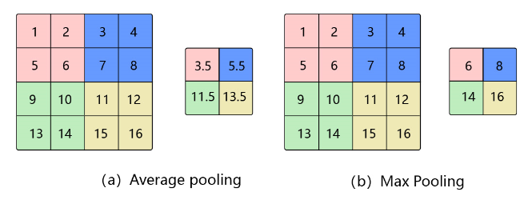
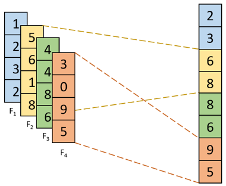

## 池化

在图像处理中，由于图像中存在较多冗余信息，可用某一区域子块的统计信息（如最大值或均值等）来刻画该区域中所有像素点呈现的空间分布模式，以替代区域子块中所有像素点取值，这就是卷积神经网络中池化(pooling)操作。

池化操作对卷积结果特征图进行约减，实现了下采样，同时保留了特征图中主要信息。由于池化之后特征图会变得更小，如果后面连接的是全连接层，能有效的减小神经元的个数，节省存储空间并提高计算效率。

池化通常主要有三种方法：平均池化、最大池化、K-max池化，其中平均池化和最大池化如 图1 所示，K-max池化如 图2 所示，随机池化如 图3 所示。同时还有随机池化、重叠池化、全局池化等方法。

### 平均池化&最大池化

- 平均池化： 计算区域子块所包含所有像素点的均值，将均值作为平均池化结果。如图1(a)，这里使用大小为2×2
的池化窗口，每次移动的步幅为2，对池化窗口覆盖区域内的像素取平均值，得到相应的输出特征图的像素值。池化窗口的大小也称为池化大小，用$k_h×k_w$表示。在卷积神经网络中用的比较多的是窗口大小为2×2
，步幅为2的池化。

- 最大池化： 从输入特征图的某个区域子块中选择值最大的像素点作为最大池化结果。如图1(b)，对池化窗口覆盖区域内的像素取最大值，得到输出特征图的像素值。当池化窗口在图片上滑动时，会得到整张输出特征图。

 

图1 平均池化与最大池化

### K-max池化，如下图所示

- K-max池化： 对输入特征图的区域子块中像素点取前K个最大值，常用于自然语言处理中的文本特征提取。如图2，从包含了4个取值的每一列中选取前2个最大值就得到了K最大池化结果。

 

图2 K-Max池化

### 随机池化(Stochastic Pooling)

随机池化是一种简单有效的正则化CNN的方法，能够降低max pooling的过拟合现象，提高泛化能力。对于pooling层的输入，根据输入的多项式分布随机选择一个值作为输出。

随机池化可以看作在一个池化窗口内对特征图数值进行归一化， 按照特征图归一化后的概率值大小随机采样选择，即元素值大的被选中的概率也大。

 

图3 随机池化

### 重叠池化(Overlapping Pooling)

重叠池化，即相邻池化窗口之间会有重叠区域。如果定义池化窗口的大小为sizeX，定义两个相邻池化窗口的水平位移 / 竖直位移为stride，此时sizeX>stride。

### 全局池化(Global Pooling)

Global Pooling就是池化窗口的大小 = 整张特征图的大小。这样，每个 W×H×C 的特征图输入就会被转化为 1×1×C 的输出，也等同于每个位置权重都为 1/(W×H) 的全连接层操作。