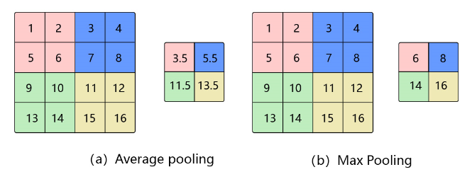
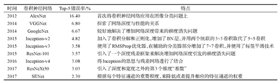

[toc]
##损失函数

&emsp;&emsp;在深度学习中，损失函数扮演着至关重要的角色。通过对最小化损失函数，使模型达到收敛状态，减少模型预测值的误差。因此，不同的损失函数，对模型的影响是重大的。在工作中经常用到的损失函数：
- 图像分类：交叉熵损失
- 目标检测：Focal loss，L1/L2损失函数，IOU Loss，GIOU，DIOU，CIOU
- 图像识别：Triplet Loss，Center Loss，Sphereface，Cosface，Arcface


##python代码实现
&emsp;&emsp;在这里只实现交叉熵损失函数和MSE损失函数。

###交叉熵损失函数

$$CrossEntropy = -\sum_{i=1}^np(x_i)\ln{(q(x_i))}$$

```python
import numpy as np


class CrossEntropy(object):
    def __init__(self):
        self.eps = np.finfo(float).eps

    def __str__(self):
        return 'CrossEntropy'

    def __call__(self, y, y_pred):
        return self.loss(y, y_pred)

    def loss(self, y, y_pred):
        loss = -np.sum(y * np.log(y_pred + self.eps), axis=-1)
        return loss

    def grad(self, y, y_pred):
        grad = y_pred - y
        return grad
```

###MSE损失函数

$$MSE=\frac{1}{n}\sum_{i=1}^{m}\omega_i(y_i-\widehat{y_i})^2$$

```python
import numpy as np


class MSE(object):
    def __str__(self):
        return 'MSE'

    def __call__(self, y, y_pred):
        return self.loss(y, y_pred)

    def loss(self, y, y_pred):
        return 0.5 * np.sum((y_pred - y) ** 2, axis=-1)

    def grad(self, y, y_pred):
        return y_pred - y
```

***
##池化

&emsp;&emsp;在图像处理中，由于图像中存在较多冗余信息，可用某一区域子块的统计信息（如最大值或均值等）来刻画该区域中所有像素点呈现的空间分布模式，以替代区域子块中所有像素点取值，这就是卷积神经网络中池化(pooling)操作。

&emsp;&emsp;池化操作对卷积结果特征图进行约减，实现了下采样，同时保留了特征图中主要信息。比如：当识别一张图像是否是人脸时，我们需要知道人脸左边有一只眼睛，右边也有一只眼睛，而不需要知道眼睛的精确位置，这时候通过池化某一片区域的像素点来得到总体统计特征会显得很有用。

###平均池化&最大池化

- 平均池化： 计算区域子块所包含所有像素点的均值，将均值作为平均池化结果。如**图1(a)**，这里使用大小为2×2
的池化窗口，每次移动的步幅为2，对池化窗口覆盖区域内的像素取平均值，得到相应的输出特征图的像素值。池化窗口的大小也称为池化大小，用$k_h×k_w$表示。在卷积神经网络中用的比较多的是窗口大小为2×2
，步幅为2的池化。

- 最大池化： 从输入特征图的某个区域子块中选择值最大的像素点作为最大池化结果。如**图1(b)**，对池化窗口覆盖区域内的像素取最大值，得到输出特征图的像素值。当池化窗口在图片上滑动时，会得到整张输出特征图。



###随机池化(Stochastic Pooling)

&emsp;&emsp;随机池化是一种简单有效的正则化CNN的方法，能够降低max pooling的过拟合现象，提高泛化能力。对于pooling层的输入，根据输入的多项式分布随机选择一个值作为输出。

&emsp;&emsp;随机池化可以看作在一个池化窗口内对特征图数值进行归一化， 按照特征图归一化后的概率值大小随机采样选择，即元素值大的被选中的概率也大。


###重叠池化(Overlapping Pooling)

&emsp;&emsp;重叠池化，即相邻池化窗口之间会有重叠区域。如果定义池化窗口的大小为sizeX，定义两个相邻池化窗口的水平位移 / 竖直位移为stride，此时sizeX>stride。

###全局池化(Global Pooling)

&emsp;&emsp;Global Pooling就是池化窗口的大小 = 整张特征图的大小。这样，每个 W×H×C 的特征图输入就会被转化为 1×1×C 的输出，也等同于每个位置权重都为 1/(W×H) 的全连接层操作。

***
##数据增强
&emsp;&emsp;数据增强也叫数据扩增，意思是在不实质性的增加数据的情况下，让有限的数据产生等价于更多数据的价值。

###有监督的数据增强
&emsp;&emsp;有监督数据增强，即采用预设的数据变换规则，在已有数据的基础上进行数据的扩增，包含单样本数据增强和多样本数据增强，其中单样本又包括几何操作类，颜色变换类。

####单样本数据增强
&emsp;&emsp;所谓单样本数据增强，即增强一个样本的时候，全部围绕着该样本本身进行操作，包括几何变换类，颜色变换类等。

1. 几何变换类
   几何变换类即对图像进行几何变换，包括**翻转，旋转，裁剪，变形，缩放**等各类操作。
2.  颜色变换类
   上面的几何变换类操作，没有改变图像本身的内容，它可能是选择了图像的一部分或者对像素进行了重分布。如果要改变图像本身的内容，就属于颜色变换类的数据增强了，常见的包括**噪声、模糊、颜色变换、擦除、填充**等等。

####多样本数据增强
&emsp;&emsp;不同于单样本数据增强，多样本数据增强方法利用多个样本来产生新的样本，下面介绍几种方法。

1. SMOTE
   SMOTE即Synthetic Minority Over-sampling Technique方法，它是通过人工合成新样本来处理样本不平衡问题，从而提升分类器性能。SMOTE方法是基于插值的方法，它可以为小样本类合成新的样本
2. SamplePairing
   SamplePairing方法的原理非常简单，从训练集中随机抽取两张图片分别经过基础数据增强操作(如随机翻转等)处理后经像素以取平均值的形式叠加合成一个新的样本，标签为原样本标签中的一种。这两张图片甚至不限制为同一类别，这种方法对于医学图像比较有效。
3.  mixup
    mixup是Facebook人工智能研究院和MIT在“Beyond Empirical Risk Minimization”中提出的基于邻域风险最小化原则的数据增强方法，它使用线性插值得到新样本数据。

###无监督的数据增强
无监督的数据增强方法包括两类：
- 通过模型学习数据的分布，随机生成与训练数据集分布一致的图片，代表方法GAN。
- 通过模型，学习出适合当前任务的数据增强方法，代表方法AutoAugment。

####GAN
&emsp;&emsp;GAN（generative adversarial networks）包含两个网络，一个是生成网络，一个是对抗网络，基本原理如下：
- G是一个生成图片的网络，它接收随机的噪声z，通过噪声生成图片，记做G(z) 。
- D是一个判别网络，判别一张图片是不是“真实的”，即是真实的图片，还是由G生成的图片。

####Autoaugmentation
&emsp;&emsp;AutoAugment是Google提出的自动选择最优数据增强方案的研究，这是无监督数据增强的重要研究方向。它的基本思路是使用增强学习从数据本身寻找最佳图像变换策略，对于不同的任务学习不同的增强方法，流程如下：

- 准备16个常用的数据增强操作。

- 从16个中选择5个操作，随机产生使用该操作的概率和相应的幅度，将其称为一个sub-policy，一共产生5个sub-polices。

- 对训练过程中每一个batch的图片，随机采用5个sub-polices操作中的一种。

- 通过模型在验证集上的泛化能力来反馈，使用的优化方法是增强学习方法。

- 经过80~100个epoch后网络开始学习到有效的sub-policies。

- 之后串接这5个sub-policies，然后再进行最后的训练。

***
#图像分类方法综述
##原理
&emsp;&emsp;图像分类就是给一幅图像说出它的类别。

&emsp;&emsp;图像分类的主要过程包括图像预处理、特征提取和分类器设计。图像预处理包括图像滤波，如中值滤波、均值滤波、高斯滤波以及图像归一化等操作，其主要作用是过滤图像中的一些无关信息，在简化数据的前提下最大限度地保留有用信息，增强特征提取的可靠性。特征提取是图像分类任务中最为关键的一部分，其将输入图像按照一定的规则变换生成另一种具有某些特性的特征表示，新的特征往往具有低维度、低冗余、低噪声、结构化等优点，从而降低了对分类器复杂度的要求，提高了模型性能。最后通过训练分类器对提取的特征进行分类，从而实现图像的分类。

&emsp;&emsp;传统的图像分类研究中，多数为基于图像特征的分类，即根据不同类别图像的差异，利用图像处理算法提取相应的经过定性或定量表达的特征，对这些特征进行数学统计分析或使用分类器输出分类结果。在特征提取方面，主要包括纹理、颜色、形状等底层视觉特征，尺度不变特征变换、局部二值模式、方向梯度直方图等局部不变性特征，这些人工设计特征缺乏良好的泛化性能，且依赖于设计者的先验知识和对分类任务的认知理解。目前，海量、高维的数据也使得人工设计特征的难度呈指数级增加。

&emsp;&emsp;在分类器方面，主要包括k NN(k-nearest neighbor,k最近邻）决策树、SVM(support vector machine，支持向量机）、人工神经网络等方法。这些分类器大大地提升了图像分类的效果，但对于处理庞大的图像数据、图像干扰严重等问题，其分类精度无法满足实际需求，故传统分类器不适合复杂图像的分类。

&emsp;&emsp;深度学习是机器学习的一种新兴算法，因其在图像特征学习方面具有显著效果而受到研究者们的广泛关注。相较于传统的图像分类方法，其不需要对目标图像进行人工特征描述和提取，而是通过神经网络自主地从训练样本中学习特征，提取出更高维、抽象的特征，并且这些特征与分类器关系紧密，很好地解决了人工提取特征和分类器选择的难题，是一种端到端的模型。

**传统方法**：图像预处理、特征提取和分类器设计，每一种都有多种方法。
**深度学习方法**：图像预处理和图像识别，其中图像识别中的骨干网络实现特征提取的功能，后面的softmax等实现图像分类

##常见网络
&emsp;&emsp;卷积神经网络的结构发展概述，主要包括：
- 早起探索：Hubel实验、LeNet、AlexNet、ZFNet、VGGNet
- 深度化：ResNet、DenseNet
- 模块化：GoogLeNet、Incepv3&Inception-ResNet、ResNetXt、Xteption
- 注意力：SENet、scSE、CBAM
- 高效化：SqueezeNet、MobileNet、ShuffleNet、GhostNet
- 自动化：NASNet、EfficientNet



