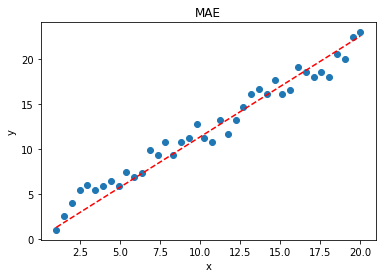

# 1 损失函数补充

**Huber Loss**

**其公式如下**


Huber Loss 是对二者的综合，包含了一个超参数 δ。δ 值的大小决定了 Huber Loss 对 MSE 和 MAE 的侧重性，当 |y−f(x)| ≤ δ 时，变为 MSE；当 |y−f(x)| > δ 时，则变成类似于 MAE，因此 Huber Loss 同时具备了 MSE 和 MAE 的优点，减小了对离群点的敏感度问题，实现了处处可导的功能。

下面是Huber Loss的损失函数的举例以及代码实现可视化：


```python
import numpy as np
import matplotlib.pyplot as plt
x = np.linspace(1, 20, 40)
y = x + [np.random.choice(4) for _ in range(40)]
X = np.vstack((np.ones_like(x),x))    # 引入常数项 1
m = X.shape[1]
# 参数初始化
W = np.zeros((1,2))
 
# 迭代训练 
num_iter = 20
lr = 0.01
delta = 2
J = []
for i in range(num_iter):
   y_pred = W.dot(X)
   loss = 1/m * np.sum(np.abs(y-y_pred))
   J.append(loss)
   mask = (y-y_pred).copy()
   mask[y-y_pred > delta] = delta
   mask[mask < -delta] = -delta
   W = W + lr * 1/m * mask.dot(X.T)
 
# 作图
y1 = W[0,0] + W[0,1]*1
y2 = W[0,0] + W[0,1]*20
plt.scatter(x, y)
plt.plot([1,20],[y1,y2],'r--')
plt.xlabel('x')
plt.ylabel('y')
plt.title('MAE')
plt.show()
```





# 2 池化方法

1.一般池化（General Pooling）

池化作用于图像中不重合的区域（这与卷积操作不同），过程如下图。


我们定义池化窗口的大小为sizeX，即下图中红色正方形的边长，定义两个相邻池化窗口的水平位移/竖直位移为stride。一般池化由于每一池化窗口都是不重复的，所以sizeX=stride。
最常见的池化操作为平均池化mean pooling和最大池化max pooling：

平均池化：计算图像区域的平均值作为该区域池化后的值。

最大池化：选图像区域的最大值作为该区域池化后的值。

2.重叠池化（OverlappingPooling）

重叠池化正如其名字所说的，相邻池化窗口之间会有重叠区域，此时sizeX>stride。

3. 空金字塔池化

空间金字塔池化可以把任何尺度的图像的卷积特征转化成相同维度，这不仅可以让CNN处理任意尺度的图像，还能避免cropping和warping操作，导致一些信息的丢失，具有非常重要的意义。

 

一般的CNN都需要输入图像的大小是固定的，这是因为全连接层的输入需要固定输入维度，但在卷积操作是没有对图像尺度有限制，所有作者提出了空间金字塔池化，先让图像进行卷积操作，然后转化成维度相同的特征输入到全连接层，这个可以把CNN扩展到任意大小的图像。


空间金字塔池化的思想来自于Spatial Pyramid Model，它一个pooling变成了多个scale的pooling。用不同大小池化窗口作用于卷积特征，我们可以得到1X1,2X2,4X4的池化结果，由于conv5中共有256个过滤器，所以得到1个256维的特征，4个256个特征，以及16个256维的特征，然后把这21个256维特征链接起来输入全连接层，通过这种方式把不同大小的图像转化成相同维度的特征。


对于不同的图像要得到相同大小的pooling结果，就需要根据图像的大小动态的计算池化窗口的大小和步长。假设conv5输出的大小为a*a，需要得到n*n大小的池化结果，可以让窗口大小sizeX为，步长为 。下图以conv5输出的大小为13*13为例。


疑问：如果conv5输出的大小为14*14，[pool1*1]的sizeX=stride=14，[pool2*2]的sizeX=stride=7，这些都没有问题，但是，[pool4*4]的sizeX=5，stride=4，最后一列和最后一行特征没有被池化操作计算在内。
 

SPP其实就是一种多个scale的pooling，可以获取图像中的多尺度信息；在CNN中加入SPP后，可以让CNN处理任意大小的输入，这让模型变得更加的flexible。

# 3数据增强方法修改及补充

1 翻转（Flip）

可以对图片进行水平和垂直翻转。一些框架不提供垂直翻转功能。但是，一个垂直反转的图片等同于图片的180度旋转，然后再执行水平翻转。下面是我们的图片翻转的例子。


**从左侧开始，原始图片，水平翻转的图片，垂直翻转的图片。**


```python
# NumPy.'img' = A single image.
flip_1 = np.fliplr(img)
# TensorFlow. 'x' = A placeholder for an image.
shape = [height, width, channels]
x = tf.placeholder(dtype = tf.float32, shape = shape)
flip_2 = tf.image.flip_up_down(x)
flip_3 = tf.image.flip_left_right(x)
flip_4 = tf.image.random_flip_up_down(x)
flip_5 = tf.image.random_flip_left_right(x)
```

2 旋转（Rotation)

一个关键性的问题是当旋转之后图像的维数可能并不能保持跟原来一样。如果你的图片是正方形的，那么以直角旋转将会保持图像大小。如果它是长方形，那么180度的旋转将会保持原来的大小。以更精细的角度旋转图像也会改变最终的图像尺寸。我们将在下一节中看到我们如何处理这个问题。以下是以直角旋转的方形图像的示例。


**当我们从左向右移动时，图像相对于前一个图像顺时针旋转90度。**


```python
# Placeholders: 'x' = A single image, 'y' = A batch of images
# 'k' denotes the number of 90 degree anticlockwise rotations
shape = [height, width, channels]
x = tf.placeholder(dtype = tf.float32, shape = shape)
rot_90 = tf.image.rot90(img, k=1)
rot_180 = tf.image.rot90(img, k=2)
# To rotate in any angle. In the example below, 'angles' is in radians
shape = [batch, height, width, 3]
y = tf.placeholder(dtype = tf.float32, shape = shape)
rot_tf_180 = tf.contrib.image.rotate(y, angles=3.1415)
# Scikit-Image. 'angle' = Degrees. 'img' = Input Image
# For details about 'mode', checkout the interpolation section below.
rot = skimage.transform.rotate(img, angle=45, mode='reflect')
```

3 缩放比例(Scale)

图像可以向外或向内缩放。向外缩放时，最终图像尺寸将大于原始图像尺寸。大多数图像框架从新图像中剪切出一个部分，其大小等于原始图像。我们将在下一节中处理向内缩放，因为它会缩小图像大小，迫使我们对超出边界的内容做出假设。以下是缩放的示例或图像。


**从左到右，原始图像，向外缩放10%，向外缩放20%**


```python
# Scikit Image. 'img' = Input Image, 'scale' = Scale factor
# For details about 'mode', checkout the interpolation section below.
scale_out = skimage.transform.rescale(img, scale=2.0, mode='constant')
scale_in = skimage.transform.rescale(img, scale=0.5, mode='constant')
# Don't forget to crop the images back to the original size (for 
# scale_out)
```

4 裁剪(Crop)

与缩放不同，我们只是从原始图像中随机抽样一个部分。然后，我们将此部分的大小调整为原始图像大小。这种方法通常称为随机裁剪。以下是随机裁剪的示例。仔细观察，你会发现此方法与缩放之间的区别。


**从左至右，原始图像，左上角裁剪的图像，右下角裁剪的图像。裁剪的部分被缩放为原始图像大小。**


```python
# TensorFlow. 'x' = A placeholder for an image.
original_size = [height, width, channels]
x = tf.placeholder(dtype = tf.float32, shape = original_size)
# Use the following commands to perform random crops
crop_size = [new_height, new_width, channels]
seed = np.random.randint(1234)
x = tf.random_crop(x, size = crop_size, seed = seed)
output = tf.images.resize_images(x, size = original_size)
```

# 4图像分类方法

1.图像分类介绍

什么是图像分类，核心是从给定的分类集合中给图像分配一个标签的任务。实际上，这意味着我们的任务是分析一个输入图像并返回一个将图像分类的标签。标签来自预定义的可能类别集。
示例：我们假定一个可能的类别集categories = {dog, cat, eagle}，之后我们提供一张图1给分类系统：


这里的目标是根据输入图像，从类别集中分配一个类别，这里为dog,我们的分类系统也可以根据概率给图像分配多个标签，如dog:95%，cat:4%，eagle:1%。

　　图像分类的任务就是给定一个图像，正确给出该图像所属的类别。对于超级强大的人类视觉系统来说，判别出一个图像的类别是件很容易的事，但是对于计算机来说，并不能像人眼那样一下获得图像的语义信息。

　　计算机能看到的只是一个个像素的数值，对于一个RGB图像来说，假设图像的尺寸是32*32，那么机器看到的就是一个形状为3*32*32的矩阵，或者更正式地称其为“张量”（“张量”简单来说就是高维的矩阵），那么机器的任务其实也就是寻找一个函数关系，这个函数关系能够将这些像素的数值映射到一个具体的类别（类别可以用某个数值表示）。

2.应用场景

图像分类更适用于图像中待分类的物体是单一的，如上图1中待分类物体是单一的，如果图像中包含多个目标物，如下图3，可以使用多标签分类或者目标检测算法。


3 传统图像分类算法

通常完整建立图像识别模型一般包括底层特征学习、特征编码、空间约束、分类器设计、模型融合等几个阶段，如图4所示。


　1). 底层特征提取: 通常从图像中按照固定步长、尺度提取大量局部特征描述。常用的局部特征包括SIFT(Scale-Invariant Feature Transform, 尺度不变特征转换) 、HOG(Histogram of Oriented Gradient, 方向梯度直方图) 、LBP(Local Bianray Pattern, 局部二值模式)等，一般也采用多种特征描述，防止丢失过多的有用信息。

　　2). 特征编码: 底层特征中包含了大量冗余与噪声，为了提高特征表达的鲁棒性，需要使用一种特征变换算法对底层特征进行编码，称作特征编码。常用的特征编码方法包括向量量化编码、稀疏编码、局部线性约束编码、Fisher向量编码等。

　　3). 空间特征约束: 特征编码之后一般会经过空间特征约束，也称作特征汇聚。特征汇聚是指在一个空间范围内，对每一维特征取最大值或者平均值，可以获得一定特征不变形的特征表达。金字塔特征匹配是一种常用的特征汇聚方法，这种方法提出将图像均匀分块，在分块内做特征汇聚。

　　4). 通过分类器分类: 经过前面步骤之后一张图像可以用一个固定维度的向量进行描述，接下来就是经过分类器对图像进行分类。通常使用的分类器包括SVM(Support Vector Machine, 支持向量机)、随机森林等。而使用核方法的SVM是最为广泛的分类器，在传统图像分类任务上性能很好。

　　这种传统的图像分类方法在PASCAL VOC竞赛中的图像分类算法中被广泛使用 。

**4、深度学习算法**
　　
  
   Alex Krizhevsky在2012年ILSVRC提出的CNN模型取得了历史性的突破，效果大幅度超越传统方法，获得了ILSVRC2012冠军，该模型被称作AlexNet。这也是首次将深度学习用于大规模图像分类中。

　　从AlexNet之后，涌现了一系列CNN模型，不断地在ImageNet上刷新成绩，如图5展示。随着模型变得越来越深以及精妙的结构设计，Top-5的错误率也越来越低，降到了3.5%附近。而在同样的ImageNet数据集上，人眼的辨识错误率大概在5.1%，也就是目前的深度学习模型的识别能力已经超过了人眼。


