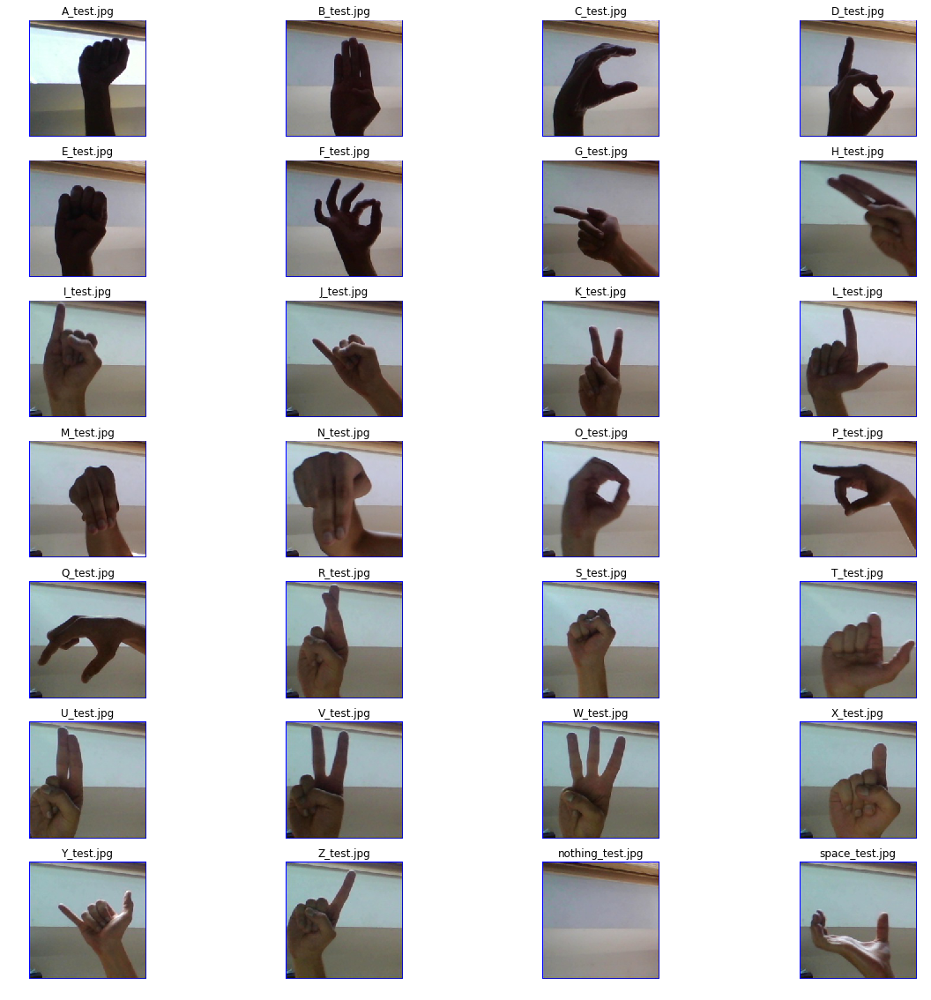
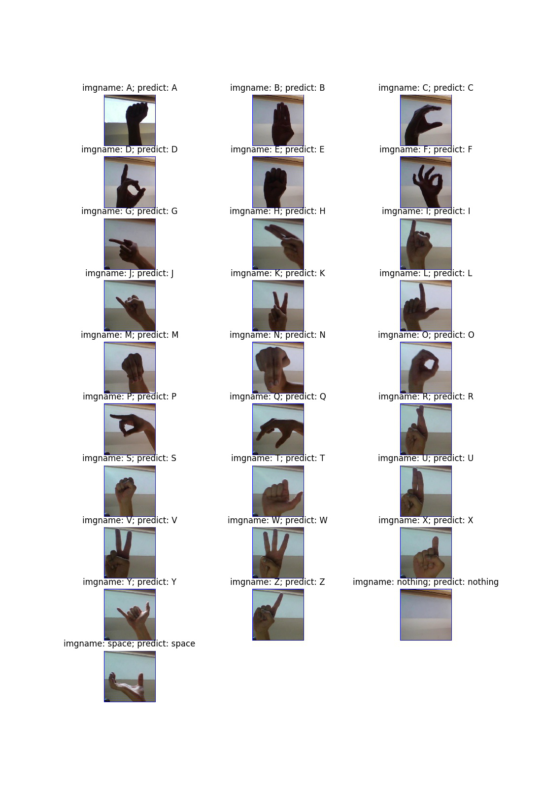

# **一、简要介绍**
&emsp;&emsp;图像分类，根据各自在图像信息中所反映的不同特征，把不同类别的目标区分开来的图像处理方法。它利用计算机对图像进行定量分析，把图像或图像中的每个像元或区域划归为若干个类别中的某一种，以代替人的视觉判读。

&emsp;&emsp;本示例简要介绍如何通过飞桨图像识别套件PaddleClas，在飞桨深度学习平台[AI Studio](https://aistudio.baidu.com/aistudio/index)上实现手语字母图像分类，项目连接：[【PaddleClas2.2】英文字母手语识别](https://aistudio.baidu.com/aistudio/projectdetail/2263110)，有关PaddleClas的介绍请见：[PaddleClas](https://github.com/PaddlePaddle/PaddleClas)。

&emsp;&emsp;在本示例中，使用ResNet50_vd作为骨干网络，开启预训练模型进行微调。

&emsp;&emsp;ResNet系列模型是在2015年提出的，一举在ILSVRC2015比赛中取得冠军，top5错误率为3.57%。该网络创新性的提出了残差结构，通过堆叠多个残差结构从而构建了ResNet网络。实验表明使用残差块可以有效地提升收敛速度和精度。斯坦福大学的Joyce Xu将ResNet称为「真正重新定义了我们看待神经网络的方式」的三大架构之一。由于ResNet卓越的性能，越来越多的来自学术界和工业界学者和工程师对其结构进行了改进，比较出名的有Wide-ResNet, ResNet-vc ,ResNet-vd, Res2Net等。

&emsp;&emsp;加深网络的深度是能让网络效果变的更好的重要因素，但随着网络的加深，梯度弥散问题会越来越严重，导致网络很难收敛，梯度弥散问题目前有很多的解决办法，包括网络初始标准化，数据标准化以及中间层的标准化（Batch Normalization）等。但除此之外，网络加深还会带来另外一个问题：随着网络加深，网络开始退化，出现训练集准确率下降的现象，如下图


&emsp;&emsp;为此，ResNet的作者引入了一种名为“残差学习”的思想：


&emsp;&emsp;残差学习的block一共包含两个分支：
* identity mapping，指的是上图右方曲线，代表自身映射；
* residual mapping，指的是另一条分支，称为残差映射。

&emsp;&emsp;针对不同深度的ResNet，作者提出了两种Residual Block：


&emsp;&emsp;下图为VGG-19，Plain-34(没有使用residual结构)和ResNet-34网络结构对比：


&emsp;&emsp;论文一共提出5种ResNet网络，网络参数统计表如下：


# **二、环境设置**

## 2.1 安装PaddleClas


```python
#安装PaddleClas
!git clone https://gitee.com/paddlepaddle/PaddleClas.git work/PaddleClas
```

## 2.2 更新前置


```python
#更新前置(如果时间过长，可以尝试把work/PaddleClas/requirements.txt中的opencv-python==4.4.0.46删去)
!pip install --upgrade -r work/PaddleClas/requirements.txt -i https://mirror.baidu.com/pypi/simple
```

## 2.3 导入模块


```python
#导入所需库
import os
import random
from PIL import Image
import matplotlib.pyplot as plt
```

# **三、数据集**

## 3.1 准备数据集

&emsp;&emsp;[美国手语字母图像数据集](https://www.kaggle.com/grassknoted/asl-alphabet)，训练数据集包含 87,000 张 200x200 像素的图像，有29个类，其中26个分别为字母A-Z，3个分别为SPACE、DELETE和NOTHING。

&emsp;&emsp;本数据集已由[bnmvv5](https://aistudio.baidu.com/aistudio/personalcenter/thirdview/71231)上传至AI Studio中：[ASL Alphabet：手语字母表](https://aistudio.baidu.com/aistudio/datasetdetail/99209)


```python
#解压数据集
!unzip -q data/data99209/ASL_Alphabet.zip -d data/
```

## 3.2 数据集概览


```python
imgtestroot = 'data/asl_alphabet_test/asl_alphabet_test'
imglist = os.listdir(imgtestroot)
imglist.sort()
plt.figure(figsize=(20,20))
for num, imgname in enumerate(imglist):
    imgpath = os.path.join(imgtestroot, imgname)
    img = Image.open(imgpath)
    plt.subplot(7,4,num+1)
    plt.imshow(img)
    plt.title(imgname)
    plt.axis('off')
```





## 3.3 标注文件生成

&emsp;&emsp;有关标注文件的格式请参照：[数据说明](https://github.com/PaddlePaddle/PaddleClas/blob/release/2.2/docs/zh_CN/tutorials/data.md)

&emsp;&emsp;本项目将数据集按照0.9 : 0.1的比例划分成训练集和验证集，划分前进行乱序操作

```
# 每一行采用"空格"分隔图像路径与标注
# 下面是Train.txt中的格式样例
M/M895.jpg 12
Z/Z382.jpg 25
Z/Z1340.jpg 25
E/E2814.jpg 4
...
```


```python
#生成数据集划分TXT(0.9 : 0.1)
os.makedirs('work/List')
AllClass = os.listdir("data/asl_alphabet_train/asl_alphabet_train")
AllClass.sort()
TrainLIst = []
EvalList = []
TrainTXT = open("work/List/Train.txt","w")
EvalTXT = open("work/List/Eval.txt","w")
IDMapTXT = open("work/List/IDMap.txt","w")
for Label, ABClass in enumerate(AllClass):
    #训练集
    for number in range(1,2901):
        TrainLIst.append(ABClass + '/' + ABClass + str(number) + '.jpg ' + str(Label))
    #验证集
    for number in range(2901,3001):
        EvalList.append(ABClass + '/' + ABClass + str(number) + '.jpg ' + str(Label))
    #类别标记
    IDMapTXT.write(str(Label) + ' ' + ABClass + '\n')
random.shuffle(TrainLIst)
random.shuffle(EvalList)
TrainTXT.write('\n'.join(TrainLIst))
EvalTXT.write('\n'.join(EvalList))
TrainTXT.close()
EvalTXT.close()
IDMapTXT.close()
```

# **四、模型配置**

有关配置文件请参考：[配置说明](https://github.com/PaddlePaddle/PaddleClas/blob/release/2.2/docs/zh_CN/tutorials/config_description.md)

&emsp;记得修改配置文件路径及内容，这里需要修改一下epochs，如果打开了预训练模型进行微调，只需要设置成2-3，如果不使用预训练模型，需要将epochs设置成100多轮

&emsp;此外learning_rate、batch_size和正则化系数请根据网络实际收敛速度自行进行调整，下面给出的是在预训练模型打开的情况下效果尚可的参数

&emsp;因为一共29类故将class_num设置成29

&emsp;image_root为之前标注文件中目录的根目录，在cls_label_path中引用标注文件

```
# global configs
Global:
  checkpoints: null
  pretrained_model: null
  output_dir: work/output/ #模型保存路径
  device: gpu
  save_interval: 1
  eval_during_train: True
  eval_interval: 1
  epochs: 3
  print_batch_step: 10
  use_visualdl: False
  # used for static mode and model export
  image_shape: [3, 200, 200] #图片输入大小
  save_inference_dir: work/inference

# model architecture
Arch:
  name: ResNet50_vd
  class_num: 29

# loss function config for traing/eval process
Loss:
  Train:
    - CELoss:
        weight: 1.0
        epsilon: 0.1
  Eval:
    - CELoss:
        weight: 1.0

Optimizer:
  name: Momentum
  momentum: 0.9
  lr:
    name: Cosine
    learning_rate: 0.01
    #last0.001
  regularizer:
    name: 'L2'
    coeff: 0.00001

# data loader for train and eval
DataLoader:
  Train:
    dataset:
      name: ImageNetDataset
      image_root: data/asl_alphabet_train/asl_alphabet_train
      cls_label_path: work/List/Train.txt
      transform_ops:
        - DecodeImage:
            to_rgb: True
            channel_first: False
        - RandFlipImage:
            flip_code: 1
        - NormalizeImage:
            scale: 1.0/255.0
            mean: [0.485, 0.456, 0.406]
            std: [0.229, 0.224, 0.225]
            order: ''
    sampler:
      name: DistributedBatchSampler
      batch_size: 128
      drop_last: False
      shuffle: True
    loader:
      num_workers: 0
      use_shared_memory: True
  Eval:
    dataset:
      name: ImageNetDataset
      image_root: data/asl_alphabet_train/asl_alphabet_train
      cls_label_path: work/List/Eval.txt
      transform_ops:
        - DecodeImage:
            to_rgb: True
            channel_first: False
        - RandFlipImage:
            flip_code: 1
        - NormalizeImage:
            scale: 1.0/255.0
            mean: [0.485, 0.456, 0.406]
            std: [0.229, 0.224, 0.225]
            order: ''
    sampler:
      name: DistributedBatchSampler
      batch_size: 128
      drop_last: False
      shuffle: False
    loader:
      num_workers: 0
      use_shared_memory: True

Infer:
  infer_imgs: data/asl_alphabet_test/asl_alphabet_test
  batch_size: 28
  transforms:
    - DecodeImage:
        to_rgb: True
        channel_first: False
    - NormalizeImage:
        scale: 1.0/255.0
        mean: [0.485, 0.456, 0.406]
        std: [0.229, 0.224, 0.225]
        order: ''
    - ToCHWImage:
  PostProcess:
    name: Topk
    topk: 1
    class_id_map_file: work/List/IDMap.txt

Metric:
  Train:
  Eval:
    - TopkAcc:
        topk: [1, 5]
```

# **五、模型训练**


```python
#开始训练
!export CUDA_VISIBLE_DEVICES=0
!python work/PaddleClas/tools/train.py \
    -o Arch.pretrained=True \
    -c work/Config/ABClass_ResNet50_vd.yaml
```


```python
#恢复训练
!python work/PaddleClas/tools/train.py \
    -c work/Config/ABClass_ResNet50_vd.yaml \
    -o Global.checkpoints="work/output/ResNet50_vd/latest"
```

# **六、模型评估**


```python
#模型评估
!python3 work/PaddleClas/tools/eval.py \
    -c work/Config/ABClass_ResNet50_vd.yaml \
    -o Global.pretrained_model=work/output/ResNet50_vd/best_model
```

    /home/aistudio/work/PaddleClas/ppcls/arch/backbone/model_zoo/vision_transformer.py:15: DeprecationWarning: Using or importing the ABCs from 'collections' instead of from 'collections.abc' is deprecated, and in 3.8 it will stop working
      from collections import Callable
    /opt/conda/envs/python35-paddle120-env/lib/python3.7/site-packages/matplotlib/__init__.py:107: DeprecationWarning: Using or importing the ABCs from 'collections' instead of from 'collections.abc' is deprecated, and in 3.8 it will stop working
      from collections import MutableMapping
    /opt/conda/envs/python35-paddle120-env/lib/python3.7/site-packages/matplotlib/rcsetup.py:20: DeprecationWarning: Using or importing the ABCs from 'collections' instead of from 'collections.abc' is deprecated, and in 3.8 it will stop working
      from collections import Iterable, Mapping
    /opt/conda/envs/python35-paddle120-env/lib/python3.7/site-packages/matplotlib/colors.py:53: DeprecationWarning: Using or importing the ABCs from 'collections' instead of from 'collections.abc' is deprecated, and in 3.8 it will stop working
      from collections import Sized
    [2021/10/01 13:16:40] root INFO:
    ===========================================================
    ==        PaddleClas is powered by PaddlePaddle !        ==
    ===========================================================
    ==                                                       ==
    ==   For more info please go to the following website.   ==
    ==                                                       ==
    ==       https://github.com/PaddlePaddle/PaddleClas      ==
    ===========================================================

    [2021/10/01 13:16:40] root INFO: Arch :
    [2021/10/01 13:16:40] root INFO:     class_num : 29
    [2021/10/01 13:16:40] root INFO:     name : ResNet50_vd
    [2021/10/01 13:16:40] root INFO: DataLoader :
    [2021/10/01 13:16:40] root INFO:     Eval :
    [2021/10/01 13:16:40] root INFO:         dataset :
    [2021/10/01 13:16:40] root INFO:             cls_label_path : work/List/Eval.txt
    [2021/10/01 13:16:40] root INFO:             image_root : data/asl_alphabet_train/asl_alphabet_train
    [2021/10/01 13:16:40] root INFO:             name : ImageNetDataset
    [2021/10/01 13:16:40] root INFO:             transform_ops :
    [2021/10/01 13:16:40] root INFO:                 DecodeImage :
    [2021/10/01 13:16:40] root INFO:                     channel_first : False
    [2021/10/01 13:16:40] root INFO:                     to_rgb : True
    [2021/10/01 13:16:40] root INFO:                 RandFlipImage :
    [2021/10/01 13:16:40] root INFO:                     flip_code : 1
    [2021/10/01 13:16:40] root INFO:                 NormalizeImage :
    [2021/10/01 13:16:40] root INFO:                     mean : [0.485, 0.456, 0.406]
    [2021/10/01 13:16:40] root INFO:                     order :
    [2021/10/01 13:16:40] root INFO:                     scale : 1.0/255.0
    [2021/10/01 13:16:40] root INFO:                     std : [0.229, 0.224, 0.225]
    [2021/10/01 13:16:40] root INFO:         loader :
    [2021/10/01 13:16:40] root INFO:             num_workers : 0
    [2021/10/01 13:16:40] root INFO:             use_shared_memory : True
    [2021/10/01 13:16:40] root INFO:         sampler :
    [2021/10/01 13:16:40] root INFO:             batch_size : 128
    [2021/10/01 13:16:40] root INFO:             drop_last : False
    [2021/10/01 13:16:40] root INFO:             name : DistributedBatchSampler
    [2021/10/01 13:16:40] root INFO:             shuffle : False
    [2021/10/01 13:16:40] root INFO:     Train :
    [2021/10/01 13:16:40] root INFO:         dataset :
    [2021/10/01 13:16:40] root INFO:             cls_label_path : work/List/Train.txt
    [2021/10/01 13:16:40] root INFO:             image_root : data/asl_alphabet_train/asl_alphabet_train
    [2021/10/01 13:16:40] root INFO:             name : ImageNetDataset
    [2021/10/01 13:16:40] root INFO:             transform_ops :
    [2021/10/01 13:16:40] root INFO:                 DecodeImage :
    [2021/10/01 13:16:40] root INFO:                     channel_first : False
    [2021/10/01 13:16:40] root INFO:                     to_rgb : True
    [2021/10/01 13:16:40] root INFO:                 RandFlipImage :
    [2021/10/01 13:16:40] root INFO:                     flip_code : 1
    [2021/10/01 13:16:40] root INFO:                 NormalizeImage :
    [2021/10/01 13:16:40] root INFO:                     mean : [0.485, 0.456, 0.406]
    [2021/10/01 13:16:40] root INFO:                     order :
    [2021/10/01 13:16:40] root INFO:                     scale : 1.0/255.0
    [2021/10/01 13:16:40] root INFO:                     std : [0.229, 0.224, 0.225]
    [2021/10/01 13:16:40] root INFO:         loader :
    [2021/10/01 13:16:40] root INFO:             num_workers : 0
    [2021/10/01 13:16:40] root INFO:             use_shared_memory : True
    [2021/10/01 13:16:40] root INFO:         sampler :
    [2021/10/01 13:16:40] root INFO:             batch_size : 128
    [2021/10/01 13:16:40] root INFO:             drop_last : False
    [2021/10/01 13:16:40] root INFO:             name : DistributedBatchSampler
    [2021/10/01 13:16:40] root INFO:             shuffle : True
    [2021/10/01 13:16:40] root INFO: Global :
    [2021/10/01 13:16:40] root INFO:     checkpoints : None
    [2021/10/01 13:16:40] root INFO:     device : gpu
    [2021/10/01 13:16:40] root INFO:     epochs : 200
    [2021/10/01 13:16:40] root INFO:     eval_during_train : True
    [2021/10/01 13:16:40] root INFO:     eval_interval : 1
    [2021/10/01 13:16:40] root INFO:     image_shape : [3, 200, 200]
    [2021/10/01 13:16:40] root INFO:     output_dir : work/output/
    [2021/10/01 13:16:40] root INFO:     pretrained_model : work/output/ResNet50_vd/best_model
    [2021/10/01 13:16:40] root INFO:     print_batch_step : 10
    [2021/10/01 13:16:40] root INFO:     save_inference_dir : work/inference
    [2021/10/01 13:16:40] root INFO:     save_interval : 1
    [2021/10/01 13:16:40] root INFO:     use_visualdl : False
    [2021/10/01 13:16:40] root INFO: Infer :
    [2021/10/01 13:16:40] root INFO:     PostProcess :
    [2021/10/01 13:16:40] root INFO:         class_id_map_file : work/List/IDMap.txt
    [2021/10/01 13:16:40] root INFO:         name : Topk
    [2021/10/01 13:16:40] root INFO:         topk : 1
    [2021/10/01 13:16:40] root INFO:     batch_size : 28
    [2021/10/01 13:16:40] root INFO:     infer_imgs : data/asl_alphabet_test/asl_alphabet_test
    [2021/10/01 13:16:40] root INFO:     transforms :
    [2021/10/01 13:16:40] root INFO:         DecodeImage :
    [2021/10/01 13:16:40] root INFO:             channel_first : False
    [2021/10/01 13:16:40] root INFO:             to_rgb : True
    [2021/10/01 13:16:40] root INFO:         NormalizeImage :
    [2021/10/01 13:16:40] root INFO:             mean : [0.485, 0.456, 0.406]
    [2021/10/01 13:16:40] root INFO:             order :
    [2021/10/01 13:16:40] root INFO:             scale : 1.0/255.0
    [2021/10/01 13:16:40] root INFO:             std : [0.229, 0.224, 0.225]
    [2021/10/01 13:16:40] root INFO:         ToCHWImage : None
    [2021/10/01 13:16:40] root INFO: Loss :
    [2021/10/01 13:16:40] root INFO:     Eval :
    [2021/10/01 13:16:40] root INFO:         CELoss :
    [2021/10/01 13:16:40] root INFO:             weight : 1.0
    [2021/10/01 13:16:40] root INFO:     Train :
    [2021/10/01 13:16:40] root INFO:         CELoss :
    [2021/10/01 13:16:40] root INFO:             epsilon : 0.1
    [2021/10/01 13:16:40] root INFO:             weight : 1.0
    [2021/10/01 13:16:40] root INFO: Metric :
    [2021/10/01 13:16:40] root INFO:     Eval :
    [2021/10/01 13:16:40] root INFO:         TopkAcc :
    [2021/10/01 13:16:40] root INFO:             topk : [1, 5]
    [2021/10/01 13:16:40] root INFO:     Train : None
    [2021/10/01 13:16:40] root INFO: Optimizer :
    [2021/10/01 13:16:40] root INFO:     lr :
    [2021/10/01 13:16:40] root INFO:         learning_rate : 0.01
    [2021/10/01 13:16:40] root INFO:         name : Cosine
    [2021/10/01 13:16:40] root INFO:     momentum : 0.9
    [2021/10/01 13:16:40] root INFO:     name : Momentum
    [2021/10/01 13:16:40] root INFO:     regularizer :
    [2021/10/01 13:16:40] root INFO:         coeff : 1e-05
    [2021/10/01 13:16:40] root INFO:         name : L2
    W1001 13:16:40.327559  4786 device_context.cc:404] Please NOTE: device: 0, GPU Compute Capability: 7.0, Driver API Version: 10.1, Runtime API Version: 10.1
    W1001 13:16:40.331833  4786 device_context.cc:422] device: 0, cuDNN Version: 7.6.
    [2021/10/01 13:16:45] root INFO: train with paddle 2.1.2 and device CUDAPlace(0)
    {'CELoss': {'weight': 1.0}}
    [2021/10/01 13:16:45] root INFO: [Eval][Epoch 0][Iter: 0/23]CELoss: 0.10967, loss: 0.10967, top1: 1.00000, top5: 1.00000, batch_cost: 0.60887s, reader_cost: 0.48905, ips: 210.22458 images/sec
    [2021/10/01 13:16:49] root INFO: [Eval][Epoch 0][Iter: 10/23]CELoss: 0.10959, loss: 0.10959, top1: 1.00000, top5: 1.00000, batch_cost: 0.34852s, reader_cost: 0.24066, ips: 367.27212 images/sec
    [2021/10/01 13:16:52] root INFO: [Eval][Epoch 0][Iter: 20/23]CELoss: 0.13111, loss: 0.13111, top1: 0.98438, top5: 1.00000, batch_cost: 0.34876s, reader_cost: 0.24073, ips: 367.01294 images/sec
    [2021/10/01 13:16:53] root INFO: [Eval][Epoch 0][Avg]CELoss: 0.11529, loss: 0.11529, top1: 0.99724, top5: 1.00000


# **七、模型预测**


```
# 把work/PaddleClas/ppcls/engine/trainer.py里第580行的print删掉并改成下面的样子,方便看结果
# 别忘了添加（import matplotlib.pyplot as plt和from PIL import Image）

plt.figure(figsize=(11,16))
for num, x in enumerate(result):
	print(x,end='\n')
	imgpath = x['file_name']
	label_names = x['label_names'][0]
	img = Image.open(imgpath)
	imgname = imgpath.replace('data/asl_alphabet_test/asl_alphabet_test/','')
	imgname = imgname.replace('_test.jpg','')
	title = 'imgname: ' + imgname  + '; predict: ' + label_names
	plt.subplot(10,3,num+1)
	plt.imshow(img)
	plt.title(title)
	plt.axis('off')
plt.savefig('work/output/testresults.jpg')
```


```python
#预测效果
!python work/PaddleClas/tools/infer.py \
    -c work/Config/ABClass_ResNet50_vd.yaml \
    -o Infer.infer_imgs=data/asl_alphabet_test/asl_alphabet_test \
    -o Global.pretrained_model=work/output/ResNet50_vd/best_model

img = Image.open('work/output/testresults.jpg')
img.show()
```

    /home/aistudio/work/PaddleClas/ppcls/arch/backbone/model_zoo/vision_transformer.py:15: DeprecationWarning: Using or importing the ABCs from 'collections' instead of from 'collections.abc' is deprecated, and in 3.8 it will stop working
      from collections import Callable
    /opt/conda/envs/python35-paddle120-env/lib/python3.7/site-packages/matplotlib/__init__.py:107: DeprecationWarning: Using or importing the ABCs from 'collections' instead of from 'collections.abc' is deprecated, and in 3.8 it will stop working
      from collections import MutableMapping
    /opt/conda/envs/python35-paddle120-env/lib/python3.7/site-packages/matplotlib/rcsetup.py:20: DeprecationWarning: Using or importing the ABCs from 'collections' instead of from 'collections.abc' is deprecated, and in 3.8 it will stop working
      from collections import Iterable, Mapping
    /opt/conda/envs/python35-paddle120-env/lib/python3.7/site-packages/matplotlib/colors.py:53: DeprecationWarning: Using or importing the ABCs from 'collections' instead of from 'collections.abc' is deprecated, and in 3.8 it will stop working
      from collections import Sized
    [2021/10/01 14:32:17] root INFO:
    ===========================================================
    ==        PaddleClas is powered by PaddlePaddle !        ==
    ===========================================================
    ==                                                       ==
    ==   For more info please go to the following website.   ==
    ==                                                       ==
    ==       https://github.com/PaddlePaddle/PaddleClas      ==
    ===========================================================

    [2021/10/01 14:32:17] root INFO: Arch :
    [2021/10/01 14:32:17] root INFO:     class_num : 29
    [2021/10/01 14:32:17] root INFO:     name : ResNet50_vd
    [2021/10/01 14:32:17] root INFO: DataLoader :
    [2021/10/01 14:32:17] root INFO:     Eval :
    [2021/10/01 14:32:17] root INFO:         dataset :
    [2021/10/01 14:32:17] root INFO:             cls_label_path : work/List/Eval.txt
    [2021/10/01 14:32:17] root INFO:             image_root : data/asl_alphabet_train/asl_alphabet_train
    [2021/10/01 14:32:17] root INFO:             name : ImageNetDataset
    [2021/10/01 14:32:17] root INFO:             transform_ops :
    [2021/10/01 14:32:17] root INFO:                 DecodeImage :
    [2021/10/01 14:32:17] root INFO:                     channel_first : False
    [2021/10/01 14:32:17] root INFO:                     to_rgb : True
    [2021/10/01 14:32:17] root INFO:                 RandFlipImage :
    [2021/10/01 14:32:17] root INFO:                     flip_code : 1
    [2021/10/01 14:32:17] root INFO:                 NormalizeImage :
    [2021/10/01 14:32:17] root INFO:                     mean : [0.485, 0.456, 0.406]
    [2021/10/01 14:32:17] root INFO:                     order :
    [2021/10/01 14:32:17] root INFO:                     scale : 1.0/255.0
    [2021/10/01 14:32:17] root INFO:                     std : [0.229, 0.224, 0.225]
    [2021/10/01 14:32:17] root INFO:         loader :
    [2021/10/01 14:32:17] root INFO:             num_workers : 0
    [2021/10/01 14:32:17] root INFO:             use_shared_memory : True
    [2021/10/01 14:32:17] root INFO:         sampler :
    [2021/10/01 14:32:17] root INFO:             batch_size : 128
    [2021/10/01 14:32:17] root INFO:             drop_last : False
    [2021/10/01 14:32:17] root INFO:             name : DistributedBatchSampler
    [2021/10/01 14:32:17] root INFO:             shuffle : False
    [2021/10/01 14:32:17] root INFO:     Train :
    [2021/10/01 14:32:17] root INFO:         dataset :
    [2021/10/01 14:32:17] root INFO:             cls_label_path : work/List/Train.txt
    [2021/10/01 14:32:17] root INFO:             image_root : data/asl_alphabet_train/asl_alphabet_train
    [2021/10/01 14:32:17] root INFO:             name : ImageNetDataset
    [2021/10/01 14:32:17] root INFO:             transform_ops :
    [2021/10/01 14:32:17] root INFO:                 DecodeImage :
    [2021/10/01 14:32:17] root INFO:                     channel_first : False
    [2021/10/01 14:32:17] root INFO:                     to_rgb : True
    [2021/10/01 14:32:17] root INFO:                 RandFlipImage :
    [2021/10/01 14:32:17] root INFO:                     flip_code : 1
    [2021/10/01 14:32:17] root INFO:                 NormalizeImage :
    [2021/10/01 14:32:17] root INFO:                     mean : [0.485, 0.456, 0.406]
    [2021/10/01 14:32:17] root INFO:                     order :
    [2021/10/01 14:32:17] root INFO:                     scale : 1.0/255.0
    [2021/10/01 14:32:17] root INFO:                     std : [0.229, 0.224, 0.225]
    [2021/10/01 14:32:17] root INFO:         loader :
    [2021/10/01 14:32:17] root INFO:             num_workers : 0
    [2021/10/01 14:32:17] root INFO:             use_shared_memory : True
    [2021/10/01 14:32:17] root INFO:         sampler :
    [2021/10/01 14:32:17] root INFO:             batch_size : 128
    [2021/10/01 14:32:17] root INFO:             drop_last : False
    [2021/10/01 14:32:17] root INFO:             name : DistributedBatchSampler
    [2021/10/01 14:32:17] root INFO:             shuffle : True
    [2021/10/01 14:32:17] root INFO: Global :
    [2021/10/01 14:32:17] root INFO:     checkpoints : None
    [2021/10/01 14:32:17] root INFO:     device : gpu
    [2021/10/01 14:32:17] root INFO:     epochs : 200
    [2021/10/01 14:32:17] root INFO:     eval_during_train : True
    [2021/10/01 14:32:17] root INFO:     eval_interval : 1
    [2021/10/01 14:32:17] root INFO:     image_shape : [3, 200, 200]
    [2021/10/01 14:32:17] root INFO:     output_dir : work/output/
    [2021/10/01 14:32:17] root INFO:     pretrained_model : work/output/ResNet50_vd/best_model
    [2021/10/01 14:32:17] root INFO:     print_batch_step : 10
    [2021/10/01 14:32:17] root INFO:     save_inference_dir : work/inference
    [2021/10/01 14:32:17] root INFO:     save_interval : 1
    [2021/10/01 14:32:17] root INFO:     use_visualdl : False
    [2021/10/01 14:32:17] root INFO: Infer :
    [2021/10/01 14:32:17] root INFO:     PostProcess :
    [2021/10/01 14:32:17] root INFO:         class_id_map_file : work/List/IDMap.txt
    [2021/10/01 14:32:17] root INFO:         name : Topk
    [2021/10/01 14:32:17] root INFO:         topk : 1
    [2021/10/01 14:32:17] root INFO:     batch_size : 28
    [2021/10/01 14:32:17] root INFO:     infer_imgs : data/asl_alphabet_test/asl_alphabet_test
    [2021/10/01 14:32:17] root INFO:     transforms :
    [2021/10/01 14:32:17] root INFO:         DecodeImage :
    [2021/10/01 14:32:17] root INFO:             channel_first : False
    [2021/10/01 14:32:17] root INFO:             to_rgb : True
    [2021/10/01 14:32:17] root INFO:         NormalizeImage :
    [2021/10/01 14:32:17] root INFO:             mean : [0.485, 0.456, 0.406]
    [2021/10/01 14:32:17] root INFO:             order :
    [2021/10/01 14:32:17] root INFO:             scale : 1.0/255.0
    [2021/10/01 14:32:17] root INFO:             std : [0.229, 0.224, 0.225]
    [2021/10/01 14:32:17] root INFO:         ToCHWImage : None
    [2021/10/01 14:32:17] root INFO: Loss :
    [2021/10/01 14:32:17] root INFO:     Eval :
    [2021/10/01 14:32:17] root INFO:         CELoss :
    [2021/10/01 14:32:17] root INFO:             weight : 1.0
    [2021/10/01 14:32:17] root INFO:     Train :
    [2021/10/01 14:32:17] root INFO:         CELoss :
    [2021/10/01 14:32:17] root INFO:             epsilon : 0.1
    [2021/10/01 14:32:17] root INFO:             weight : 1.0
    [2021/10/01 14:32:17] root INFO: Metric :
    [2021/10/01 14:32:17] root INFO:     Eval :
    [2021/10/01 14:32:17] root INFO:         TopkAcc :
    [2021/10/01 14:32:17] root INFO:             topk : [1, 5]
    [2021/10/01 14:32:17] root INFO:     Train : None
    [2021/10/01 14:32:17] root INFO: Optimizer :
    [2021/10/01 14:32:17] root INFO:     lr :
    [2021/10/01 14:32:17] root INFO:         learning_rate : 0.01
    [2021/10/01 14:32:17] root INFO:         name : Cosine
    [2021/10/01 14:32:17] root INFO:     momentum : 0.9
    [2021/10/01 14:32:17] root INFO:     name : Momentum
    [2021/10/01 14:32:17] root INFO:     regularizer :
    [2021/10/01 14:32:17] root INFO:         coeff : 1e-05
    [2021/10/01 14:32:17] root INFO:         name : L2
    W1001 14:32:17.844880 10298 device_context.cc:404] Please NOTE: device: 0, GPU Compute Capability: 7.0, Driver API Version: 10.1, Runtime API Version: 10.1
    W1001 14:32:17.849160 10298 device_context.cc:422] device: 0, cuDNN Version: 7.6.
    [2021/10/01 14:32:22] root INFO: train with paddle 2.1.2 and device CUDAPlace(0)
    /opt/conda/envs/python35-paddle120-env/lib/python3.7/site-packages/paddle/tensor/creation.py:125: DeprecationWarning: `np.object` is a deprecated alias for the builtin `object`. To silence this warning, use `object` by itself. Doing this will not modify any behavior and is safe.
    Deprecated in NumPy 1.20; for more details and guidance: https://numpy.org/devdocs/release/1.20.0-notes.html#deprecations
      if data.dtype == np.object:
    {'class_ids': [0], 'scores': [0.8845], 'file_name': 'data/asl_alphabet_test/asl_alphabet_test/A_test.jpg', 'label_names': ['A']}
    /opt/conda/envs/python35-paddle120-env/lib/python3.7/site-packages/matplotlib/cbook/__init__.py:2349: DeprecationWarning: Using or importing the ABCs from 'collections' instead of from 'collections.abc' is deprecated, and in 3.8 it will stop working
      if isinstance(obj, collections.Iterator):
    /opt/conda/envs/python35-paddle120-env/lib/python3.7/site-packages/matplotlib/cbook/__init__.py:2366: DeprecationWarning: Using or importing the ABCs from 'collections' instead of from 'collections.abc' is deprecated, and in 3.8 it will stop working
      return list(data) if isinstance(data, collections.MappingView) else data
    {'class_ids': [1], 'scores': [0.89221], 'file_name': 'data/asl_alphabet_test/asl_alphabet_test/B_test.jpg', 'label_names': ['B']}
    {'class_ids': [2], 'scores': [0.90011], 'file_name': 'data/asl_alphabet_test/asl_alphabet_test/C_test.jpg', 'label_names': ['C']}
    {'class_ids': [3], 'scores': [0.90496], 'file_name': 'data/asl_alphabet_test/asl_alphabet_test/D_test.jpg', 'label_names': ['D']}
    {'class_ids': [4], 'scores': [0.89183], 'file_name': 'data/asl_alphabet_test/asl_alphabet_test/E_test.jpg', 'label_names': ['E']}
    {'class_ids': [5], 'scores': [0.89325], 'file_name': 'data/asl_alphabet_test/asl_alphabet_test/F_test.jpg', 'label_names': ['F']}
    {'class_ids': [6], 'scores': [0.89952], 'file_name': 'data/asl_alphabet_test/asl_alphabet_test/G_test.jpg', 'label_names': ['G']}
    {'class_ids': [7], 'scores': [0.90223], 'file_name': 'data/asl_alphabet_test/asl_alphabet_test/H_test.jpg', 'label_names': ['H']}
    {'class_ids': [8], 'scores': [0.90036], 'file_name': 'data/asl_alphabet_test/asl_alphabet_test/I_test.jpg', 'label_names': ['I']}
    {'class_ids': [9], 'scores': [0.88778], 'file_name': 'data/asl_alphabet_test/asl_alphabet_test/J_test.jpg', 'label_names': ['J']}
    {'class_ids': [10], 'scores': [0.89786], 'file_name': 'data/asl_alphabet_test/asl_alphabet_test/K_test.jpg', 'label_names': ['K']}
    {'class_ids': [11], 'scores': [0.90049], 'file_name': 'data/asl_alphabet_test/asl_alphabet_test/L_test.jpg', 'label_names': ['L']}
    {'class_ids': [12], 'scores': [0.90034], 'file_name': 'data/asl_alphabet_test/asl_alphabet_test/M_test.jpg', 'label_names': ['M']}
    {'class_ids': [13], 'scores': [0.90773], 'file_name': 'data/asl_alphabet_test/asl_alphabet_test/N_test.jpg', 'label_names': ['N']}
    {'class_ids': [14], 'scores': [0.90272], 'file_name': 'data/asl_alphabet_test/asl_alphabet_test/O_test.jpg', 'label_names': ['O']}
    {'class_ids': [15], 'scores': [0.89565], 'file_name': 'data/asl_alphabet_test/asl_alphabet_test/P_test.jpg', 'label_names': ['P']}
    {'class_ids': [16], 'scores': [0.92907], 'file_name': 'data/asl_alphabet_test/asl_alphabet_test/Q_test.jpg', 'label_names': ['Q']}
    {'class_ids': [17], 'scores': [0.9], 'file_name': 'data/asl_alphabet_test/asl_alphabet_test/R_test.jpg', 'label_names': ['R']}
    {'class_ids': [18], 'scores': [0.88346], 'file_name': 'data/asl_alphabet_test/asl_alphabet_test/S_test.jpg', 'label_names': ['S']}
    {'class_ids': [19], 'scores': [0.92621], 'file_name': 'data/asl_alphabet_test/asl_alphabet_test/T_test.jpg', 'label_names': ['T']}
    {'class_ids': [20], 'scores': [0.90095], 'file_name': 'data/asl_alphabet_test/asl_alphabet_test/U_test.jpg', 'label_names': ['U']}
    {'class_ids': [21], 'scores': [0.88883], 'file_name': 'data/asl_alphabet_test/asl_alphabet_test/V_test.jpg', 'label_names': ['V']}
    {'class_ids': [22], 'scores': [0.8957], 'file_name': 'data/asl_alphabet_test/asl_alphabet_test/W_test.jpg', 'label_names': ['W']}
    {'class_ids': [23], 'scores': [0.88814], 'file_name': 'data/asl_alphabet_test/asl_alphabet_test/X_test.jpg', 'label_names': ['X']}
    {'class_ids': [24], 'scores': [0.90919], 'file_name': 'data/asl_alphabet_test/asl_alphabet_test/Y_test.jpg', 'label_names': ['Y']}
    {'class_ids': [25], 'scores': [0.90121], 'file_name': 'data/asl_alphabet_test/asl_alphabet_test/Z_test.jpg', 'label_names': ['Z']}
    {'class_ids': [27], 'scores': [0.88753], 'file_name': 'data/asl_alphabet_test/asl_alphabet_test/nothing_test.jpg', 'label_names': ['nothing']}
    {'class_ids': [28], 'scores': [0.89806], 'file_name': 'data/asl_alphabet_test/asl_alphabet_test/space_test.jpg', 'label_names': ['space']}



