# **一、简要介绍**
&emsp;&emsp;图像分类，根据各自在图像信息中所反映的不同特征，把不同类别的目标区分开来的图像处理方法。它利用计算机对图像进行定量分析，把图像或图像中的每个像元或区域划归为若干个类别中的某一种，以代替人的视觉判读。
 
 &emsp;&emsp;本示例简要介绍如何通过飞桨图像识别套件PaddleClas，在飞桨深度学习平台[AI Studio](https://aistudio.baidu.com/aistudio/index)上实现手语字母图像分类，有关PaddleClas的介绍请见：[PaddleClas](https://github.com/PaddlePaddle/PaddleClas)。
 
  

# **二、环境设置**

## 2.1 安装PaddleClas


```python
#安装PaddleClas
!git clone https://gitee.com/paddlepaddle/PaddleClas.git work/PaddleClas
```

## 2.2 更新前置


```python
#更新前置(如果时间过长，可以尝试把work/PaddleClas/requirements.txt中的opencv-python==4.4.0.46删去)
!pip install --upgrade -r work/PaddleClas/requirements.txt -i https://mirror.baidu.com/pypi/simple
```

## 2.3 导入模块


```python
#导入所需库
import os
import random
from PIL import Image
import matplotlib.pyplot as plt
```

# **三、数据集**

## 3.1 准备数据集

&emsp;&emsp;[美国手语字母图像数据集](https://www.kaggle.com/grassknoted/asl-alphabet)，训练数据集包含 87,000 张 200x200 像素的图像，有29个类，其中26个分别为字母A-Z，3个分别为SPACE、DELETE和NOTHING。

&emsp;&emsp;本数据集已由[bnmvv5](https://aistudio.baidu.com/aistudio/personalcenter/thirdview/71231)上传至AI Studio中：[ASL Alphabet：手语字母表](https://aistudio.baidu.com/aistudio/datasetdetail/99209)


```python
#解压数据集
!unzip -q data/data99209/ASL_Alphabet.zip -d data/
```

## 3.2 数据集概览


```python
#测试集展示
imgtestroot = 'data/asl_alphabet_test/asl_alphabet_test'
imglist = os.listdir(imgtestroot)
imglist.sort()
plt.figure()
for num, imgname in enumerate(imglist):
    imgpath = os.path.join(imgtestroot, imgname)
    img = Image.open(imgpath)
    plt.figure()
    plt.imshow(img)
    plt.title(imgname)
    plt.axis('off')
```


    <Figure size 432x288 with 0 Axes>


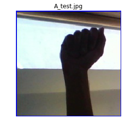


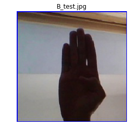


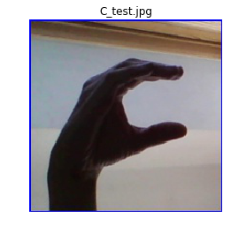


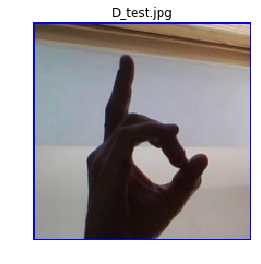


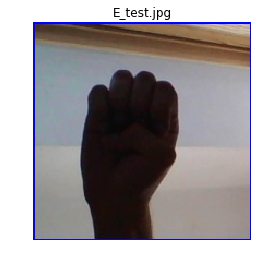


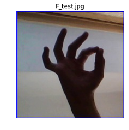


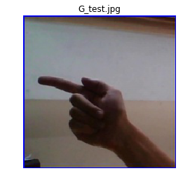


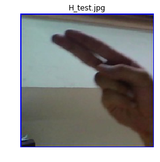


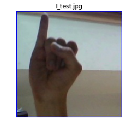


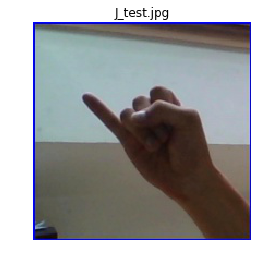


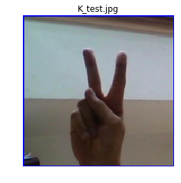


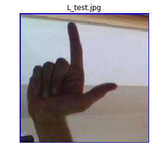


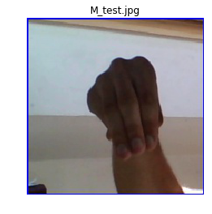


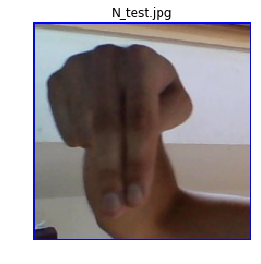


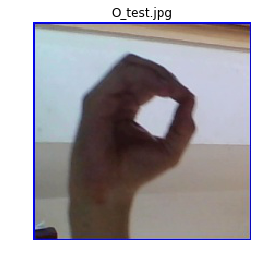


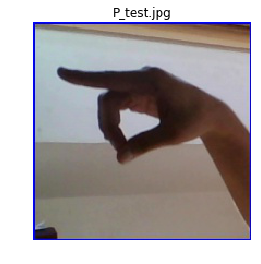


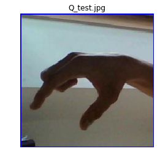


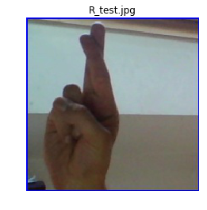


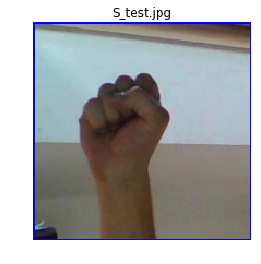


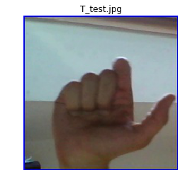


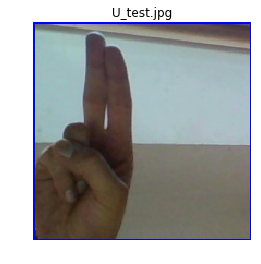


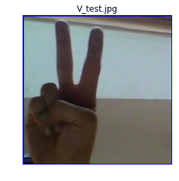


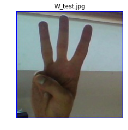


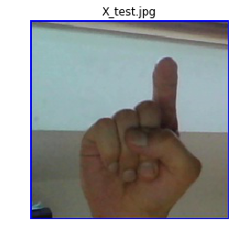


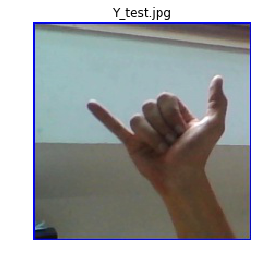


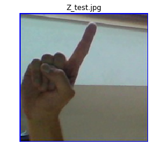


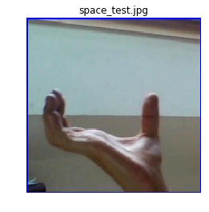


## 3.3 标注文件生成

&emsp;&emsp;有关标注文件的格式请参照：[数据说明](https://github.com/PaddlePaddle/PaddleClas/blob/release/2.2/docs/zh_CN/tutorials/data.md)


```python
#生成数据集划分TXT(0.9 : 0.1)
os.makedirs('work/List')
AllClass = os.listdir("data/asl_alphabet_train/asl_alphabet_train")
AllClass.sort()
TrainLIst = []
EvalList = []
TrainTXT = open("work/List/Train.txt","w")
EvalTXT = open("work/List/Eval.txt","w")
IDMapTXT = open("work/List/IDMap.txt","w")
for Label, ABClass in enumerate(AllClass):
    #训练集
    for number in range(1,2901):
        TrainLIst.append(ABClass + '/' + ABClass + str(number) + '.jpg ' + str(Label))
    #验证集
    for number in range(2901,3001):
        EvalList.append(ABClass + '/' + ABClass + str(number) + '.jpg ' + str(Label))
    #类别标记
    IDMapTXT.write(str(Label) + ' ' + ABClass + '\n')
random.shuffle(TrainLIst)
random.shuffle(EvalList)
TrainTXT.write('\n'.join(TrainLIst))
EvalTXT.write('\n'.join(EvalList))
TrainTXT.close()
EvalTXT.close()
IDMapTXT.close()
```

# **四、模型配置**

有关配置文件请参考：[配置说明](https://github.com/PaddlePaddle/PaddleClas/blob/release/2.2/docs/zh_CN/tutorials/config_description.md)

&emsp;记得修改配置文件路径及内容

```
# global configs
Global:
  checkpoints: null
  pretrained_model: null
  output_dir: work/output/
  device: gpu
  save_interval: 1
  eval_during_train: True
  eval_interval: 1
  epochs: 200
  print_batch_step: 10
  use_visualdl: True
  # used for static mode and model export
  image_shape: [3, 200, 200]
  save_inference_dir: work/inference

# model architecture
Arch:
  name: ResNet50_vd
  class_num: 29
 
# loss function config for traing/eval process
Loss:
  Train:
    - CELoss:
        weight: 1.0
        epsilon: 0.1
  Eval:
    - CELoss:
        weight: 1.0

Optimizer:
  name: Momentum
  momentum: 0.9
  lr:
    name: Cosine
    learning_rate: 0.0007
    #last0.001
  regularizer:
    name: 'L2'
    coeff: 0.001
    #lastcoeff0.00007 
    #nextcoeff0.0001

# data loader for train and eval
DataLoader:
  Train:
    dataset:
      name: ImageNetDataset
      image_root: data/asl_alphabet_train/asl_alphabet_train
      cls_label_path: work/List/Train.txt
      transform_ops:
        - DecodeImage:
            to_rgb: True
            channel_first: False
        - RandFlipImage:
            flip_code: 1
        - NormalizeImage:
            scale: 1.0/255.0
            mean: [0.485, 0.456, 0.406]
            std: [0.229, 0.224, 0.225]
            order: ''
    sampler:
      name: DistributedBatchSampler
      batch_size: 128
      drop_last: False
      shuffle: True
    loader:
      num_workers: 0
      use_shared_memory: True
  Eval:
    dataset: 
      name: ImageNetDataset
      image_root: data/asl_alphabet_train/asl_alphabet_train
      cls_label_path: work/List/Eval.txt
      transform_ops:
        - DecodeImage:
            to_rgb: True
            channel_first: False
        - RandFlipImage:
            flip_code: 1
        - NormalizeImage:
            scale: 1.0/255.0
            mean: [0.485, 0.456, 0.406]
            std: [0.229, 0.224, 0.225]
            order: ''
    sampler:
      name: DistributedBatchSampler
      batch_size: 128
      drop_last: False
      shuffle: False
    loader:
      num_workers: 0
      use_shared_memory: True

Infer:
  infer_imgs: data/asl_alphabet_test/asl_alphabet_test
  batch_size: 28
  transforms:
    - DecodeImage:
        to_rgb: True
        channel_first: False
    - NormalizeImage:
        scale: 1.0/255.0
        mean: [0.485, 0.456, 0.406]
        std: [0.229, 0.224, 0.225]
        order: ''
    - ToCHWImage:
  PostProcess:
    name: Topk
    topk: 1
    class_id_map_file: work/List/IDMap.txt

Metric:
  Train:
  Eval:
    - TopkAcc:
        topk: [1, 5]

```

# **五、模型训练**


```python
#开始训练
!export CUDA_VISIBLE_DEVICES=0
!python work/PaddleClas/tools/train.py \
    -c work/Config/ABClass_ResNet50_vd.yaml
```


```python
#恢复训练
!python work/PaddleClas/tools/train.py \
    -c work/Config/ABClass_ResNet50_vd.yaml \
    -o Global.checkpoints="work/output/ResNet50_vd/latest"
```

# **六、模型预测**


```
#如果觉得预测结果挤在一起太难看就把work/PaddleClas/ppcls/engine/trainer.py里第580行的print删掉并改成下面的样子
for x in result:
    print(x,end='\n')
```


```python
#预测效果
!python work/PaddleClas/tools/infer.py \
    -c work/Config/ABClass_ResNet50_vd.yaml \
    -o Infer.infer_imgs=data/asl_alphabet_test/asl_alphabet_test \
    -o Global.pretrained_model=work/output/ResNet50_vd/best_model
```
