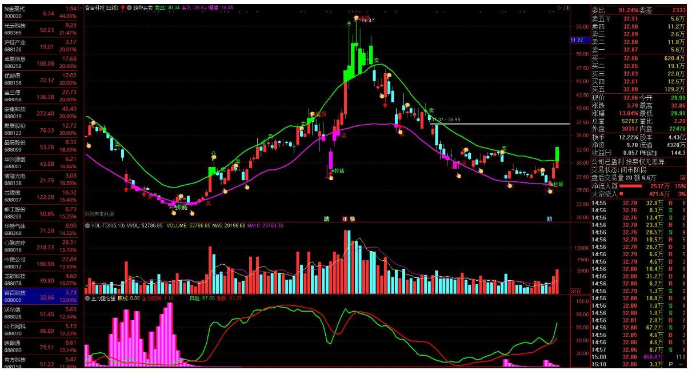
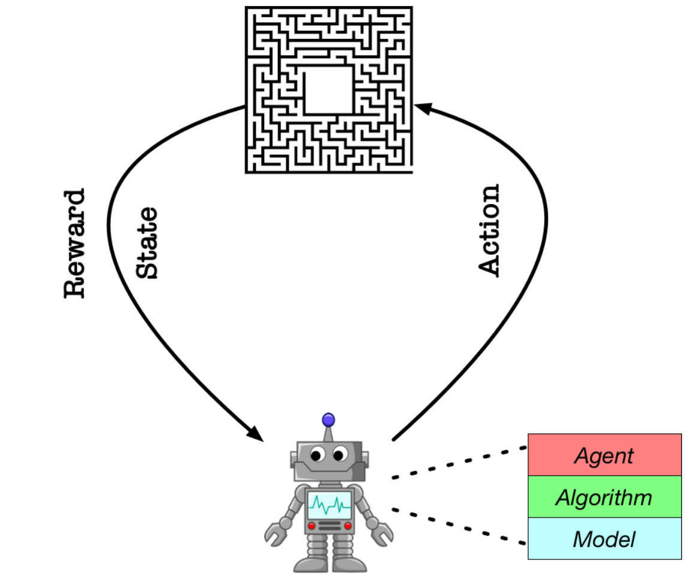
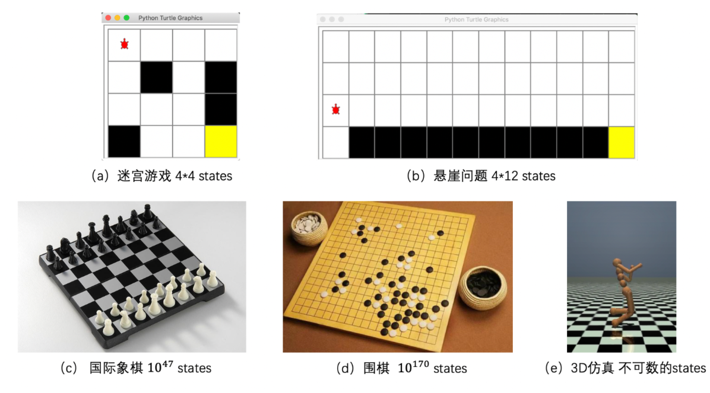
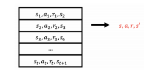
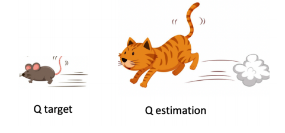
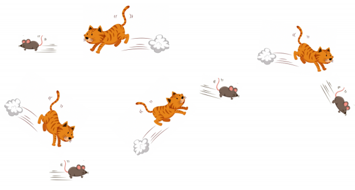
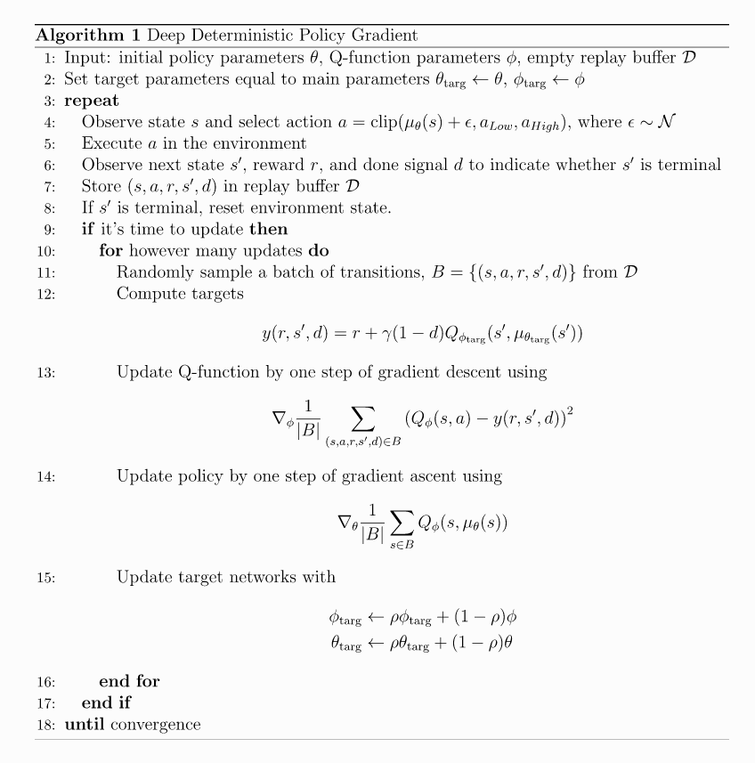
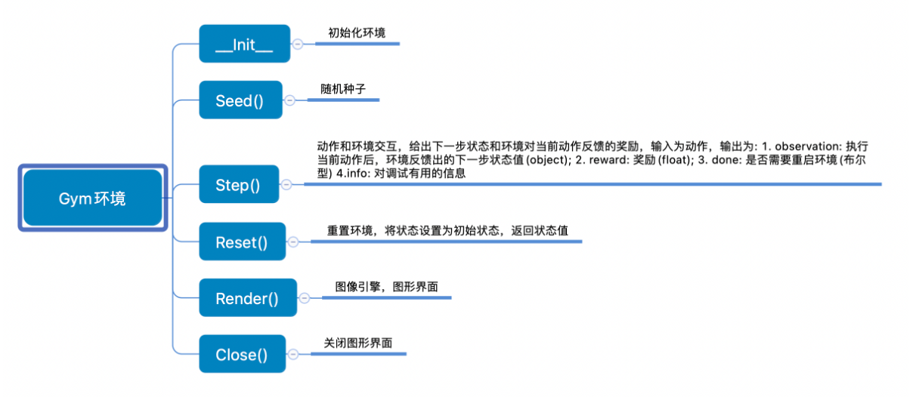
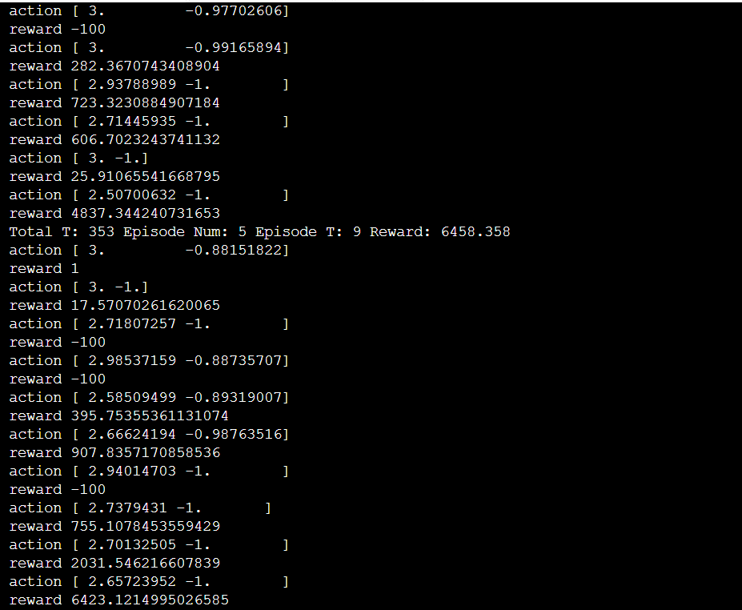
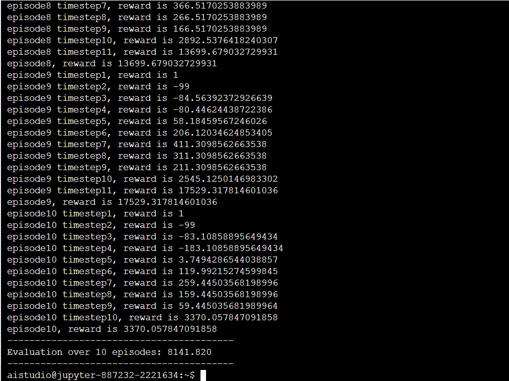

数据集aistudio链接：

https://aistudio.baidu.com/aistudio/datasetdetail/102715

项目aistudio链接：

https://aistudio.baidu.com/aistudio/projectdetail/2221634

# 使用DDPG算法应用于股票交易

本项目基于DDPG算法应用于股票交易场景，其包含五个模块，读者可根据需要依次或选择性阅读。

1. 项目介绍
2. 项目理论解读
3. 项目详细实现
4. 项目结果
5. 项目总结

## 1.项目介绍


### 1.1项目目的

1. 理解并掌握强化学习的基础要素，包括[智能体](https://paddlepedia.readthedocs.io/en/latest/tutorials/reinforcement_learning/basic_information.html)、[环境](https://paddlepedia.readthedocs.io/en/latest/tutorials/reinforcement_learning/basic_information.html)、[状态](https://paddlepedia.readthedocs.io/en/latest/tutorials/reinforcement_learning/basic_information.html)、[动作](https://paddlepedia.readthedocs.io/en/latest/tutorials/reinforcement_learning/basic_information.html)、[策略](https://paddlepedia.readthedocs.io/en/latest/tutorials/reinforcement_learning/basic_information.html)和[奖励](https://paddlepedia.readthedocs.io/en/latest/tutorials/reinforcement_learning/basic_information.html)；
2. 理解DDPG算法，包括该算法解决了DQN的哪些不足，DDPG的创新点及算法的具体内容；
3. 熟悉经典强化学习算法的设计原理，以及构建流程；
4. 熟悉飞桨框架，并通过飞桨框架实现深度强化学习中的一个经典算法——DDPG算法。


### 1.2项目内容

股票交易是一个经典的时序决策问题，其指的是在每个交易时间点通过分析历史图表，从而做出对应决策（如：买入、卖出、观望等），以达到长期的最大收益。该问题如图1所示。



<center>图1 股票交易问题</center>

因此，该问题可以被建模为一个强化学习问题。在此场景下，人即为智能体，股票市场为环境，人通过对股票做出决策，即与环境交互后，会获得股票当前的状态。在此项目中，股票状态包含19个属性变量，包含所采用第三方股票数据包`baostock`的一些股票属性和基于此计算得到的一些属性变量，分别为：

| 属性名            | 含义                                        |
| ----------------- | ------------------------------------------- |
| open              | 当天开盘价格                                |
| high              | 最高价格                                    |
| low               | 最低价格                                    |
| close             | 收盘价格                                    |
| volume            | 成交量                                      |
| amount            | 成交额                                      |
| adjustflag        | 赋权状态（1：后复权，2：前复权，3：不复权） |
| tradestatus       | 交易状态（1：正常交易，0：停牌）            |
| pctChg            | 涨跌幅（百分比）                            |
| peTTM             | 滚动市盈率                                  |
| pbMRQ             | 市净率                                      |
| psTTM             | 滚动市销率                                  |
| balance           | 当前拥有的金钱                              |
| max_net_worth     | 最大资产净值                                |
| shares_held       | 持有的手数                                  |
| cost_basis        | 即时买入价格                                |
| total_shares_sold | 总共抛出的手数                              |
| total_sales_value | 总共抛出的价值                              |

`NOTE`：上述属性值均会经过归一化处理，因此在此项目中，状态为一个长度为19的一维向量，其中每一个值的值域均为$[0,1]$。


人根据当前的状态，依据现有的策略，执行相应的动作，在此项目中，可执行的动作为以下三种：

| 值区间    | 动作     |
| --------- | -------- |
| $(-3,-1)$ | 卖出股票 |
| $(-1,1)$  | 观望     |
| $(1,3)$   | 买入股票 |

为了定量买入/卖出的股票数量，此项目加入了另一个值`amount`，表示买入/卖出的股票的比例。因此，此场景下的动作空间为一个长度为2的一维向量，其中第一个值表示动作种类，值域为$[-3,3]$；第二个值表示买入/卖出的股票的比例，值域为$[0,1]$。


在该项目中，若触发以下三种情况任意一种，则一轮实验终止（我们称一个序幕（episode）为一轮实验）：

1. 历史最大资产净值大于等于最大金钱乘以最大预测的收益比，即：

$$
\mathbb{max\_net\_worth\ge{initial\_account\_balance\times{max\_predict\_rate}}}
$$

2. 状态转移到数据集中的最后一天
3. 当前的资产净值小于等于0，即：

$$
\mathbb{net\_worth\le0}
$$


该项目中的奖励信号reward设计基于相对初始收益比来度量，具体地：

1. 计算出当前状态状态$s$采取动作$a$的资产净值`net_worth`，其由两部分构成：当前资产和当前持有股票的价值，即：

$$
\mathbb{net\_worth=balance+num\_shares\_held\times{current\_price}}
$$

2. 计算出相对收益比：

$$
\mathbb{profit\_percent=\frac{net\_worth-initial\_account\_balance}{initial\_account\_balance}}
$$

3. 奖励设计：若相对收益比大于等于0，则奖励信号取相对收益比的1000倍与1之间的较大值；反之，则此轮决策交互的奖励为-100。即有：

$$
\mathbb{reward=}
\begin{cases}
\max(1,\mathbb{\frac{profit\_percent}{0.001}}),\quad{if\ }\mathbb{profit\_percent\ge0}\\
-100,\quad\quad\quad\quad\quad\quad\quad{others}
\end{cases}
$$


该项目中的股票环境将继承gym库的环境实现，提供`reset(),step()`等训练接口。人每次根据环境状态执行上述三种动作中的一种，并根据股票市场交易规则计算奖励信号，DDPG算法同DQN算法一样，会将每一条经验，即$s_t,a_t,r_t,s_{t+1},\mathbb{done}$存储在经验池中，在随机抽取一批数据，送进神经网络中学习。同时，区别于DQN算法的$\varepsilon-greedy$算法选取离散动作，DDPG引入了动作网络actor来得到连续的动作信号。我们将通过这个实验来更好地理解DDPG算法。


### 1.3项目环境

本项目支持在实训平台或本地环境操作，建议您使用实训平台。

- 实训平台：如果您选择在实训平台上操作，无需安装实验环境。实训平台集成了项目必须的相关环境，代码可在线运行，同时还提供了免费算力，即使实践复杂模型也无算力之忧。
- 本地环境：如果您选择在本地环境上操作，需要安装Python3.7、飞桨开源框架2.0等实验必须的环境，具体要求及实现代码请参见[《本地环境安装说明》](https://aistudio.baidu.com/aistudio/projectdetail/1881465)。

您可通过如下代码导入项目环境。

```python
# 导入项目环境
import random
import numpy as np
import gym
from gym import spaces
import argparse
import os
import copy
import baostock as bs

import paddle
import pandas as pd
import paddle.nn as nn
import paddle.optimizer as optim
import paddle.nn.functional as F
```


### 1.4实验设计

强化学习的基本原理在于智能体与其所处环境的交互并从中进行学习。在DQN算法中，智能体会在与所处环境`environment`进行交互后，获得一个环境提供的状态 $s_t$`state`(也可以说是获得环境提供的观测值`observation`)，接收状态后，智能体会利用`actor`网络计算出当前状态应采取的动作$a_t$`action`，同时智能体会根据`critic`网络预测出在该状态下行动$a_t$对应的Q值，当行动反馈给环境后，环境会给出对应的奖励$r_t$`reward`、新的状态$s_{t+1}$，以及是否触发终止条件`done`。每一次交互完成，DDPG算法都会将$s_t,a_t,r_t,s_{t+1},\mathbb{done}$作为一条经验储存在经验池中，每次会从经验池中抽取一定量的经验作为输入数据训练神经网络。



<center>图2 本项目中应用的强化学习框架结构</center>

**Model：** Model用来定义前向 (Forward) 网络，通常是一个策略网络 (Policy Network) 或者一个值函数网络 (Value Function)，输入是当前环境状态。在本实验中，我们将在Model结构中构建一个值函数网络和一个策略网络，用于获得在当前环境状态下的action以及对应的Q值。

**Algorithm：** Algorithm定义了具体的算法来更新前向网络 (Model)，也就是通过定义损失函数来更新 Model。和算法相关的计算都可定义在Algorithm中。

**Agent：** Agent负责算法与环境的交互，在交互过程中把生成的数据提供给Algorithm来更新模型。

## 2.项目理论解读

在本项目开始前，大家需要对DQN算法有所了解。

### 2.1 DQN网络的由来

DQN算法使用神经网络来拟合Q函数，以应对高维的、连续的状态空间。常见的强化学习环境的状态数量如图3所示。



<center>图3 不同强化学习环境下的状态数量</center>

同时，由于采用了神经网络来拟合Q函数，会导致一些问题出现。

1. 由于强化学习的数据为带有时序关系的数据，因此并不是独立同分布的。为了解决在神经网络梯度更新时，数据样本间的关联性导致的梯度不准的问题，DQN算法采用了**经验回放**机制。
2. 由于参数化了Q函数，因此在q_target中包含了正在优化的网络参数，这样计算出来的梯度也是不准的，我们称为半梯度。针对这个问题，DQN算法采用了**固定目标**机制。

**经验回放机制：**

为了减小样本数据之间的相关性，DQN构造了一个存储转移关系的缓冲容器$D$，即:
$$
D=\{<s_1,a_1,r_1,s_{2}>,<s_2,a_2,r_2,s_{3}>,\cdots,<s_n,r_n,a_n,s_{n+1}>\}
$$
每一个元组$<s_t,a_t,r_t,s_{t+1}>$表示一次智能体与环境的交互，从而形成转移关系。其示意如图4所示：



<center>图4 经验存储容器</center>

执行经验重放算法的框架为：

1. 采样

从容器中随机采取数据样本：
$$
(s,a,r,s')\quad\sim\quad{D}
$$

2. 利用采集到批量数据计算TD-target

$$
\rm{TD\_{target}}=r+\gamma\max_{a'}\hat{Q}(s',a',\omega)
$$

3. 使用随机梯度下降来更新网络权值

$$
\Delta{\omega}={\alpha(\rm{TD\_target}-\hat{Q}(s,a,\omega))}\nabla_\omega\hat{Q}(s,a,\omega)
$$

**固定目标机制：**

由于TD-target中含有正在优化的参数$\omega$，因此带来了不确定性，会导致训练结果不稳定。为了训练的时候更稳定，需要固定在TD-target中的参数。

因此，考虑一个新的网络，其参数为$\omega^-$，表示这个网络参数的更新来自于当前的评估网络，但是更新速度较慢。那么基于此，可以得到带固定目标的算法框架为：

1. 采样

从容器中随机采取数据样本：
$$
(s,a,r,s')\quad\sim\quad{D}
$$

2. 利用采集到批量数据和目标网络来计算TD-target

$$
\rm{TD\_{target}}=r+\gamma\max_{a'}\hat{Q}(s',a',\textcolor{red}{\omega^-})
$$

3. 使用随机梯度下降来更新当前的评价网络权值

$$
\begin{align}
\Delta{\omega}&={\alpha(\rm{TD\_target}-\hat{Q}(s,a,\omega))}\nabla_\omega\hat{Q}(s,a,\omega) \\
&={\alpha(r+\gamma\max_{a'}\hat{Q}(s',a',\textcolor{red}{\omega^-})-\hat{Q}(s,a,\omega))}\nabla_\omega\hat{Q}(s,a,\omega)
\end{align}
$$

4. 训练一定步数后，更新目标网络的参数$\omega^-$

$$
\omega^-=\omega\quad\rm{if\ {n\_step\ \%\ update\_frequency}==0}
$$

简要说明算法有效性的示意图如下：

使用猫（estimation）追老鼠（target）来表征两个网络



<center>图5 猫鼠和网络示意图</center>

如图6所示，可以看到在固定之前，猫和老鼠参数一样，在状态空间内，猫很难追上老鼠



<center>图6 参数一样时的状态空间</center>

而固定后，可以看作猫比老鼠跑得快，因此更容易追上老鼠。


### 2.2 DDPG算法

DDPG算法提出的背景是：如何拓展DQN到拥有连续动作空间的环境。因此DDPG算法可以视作DQN算法在连续状态空间的实现版本，其增加了一个策略网络`actor`来拟合输出动作信号。其与DQN的对比如下：
$$
\begin{align}
\mathbf{DQN}&:a^*=\arg\max_{a} Q^*(s,a)\\
\mathbf{DDPG}&:a^*=\arg\max_{a} Q^*(s,a)\approx{Q}_{\phi}(s,\mu_{\theta}(s))
\end{align}
$$
其中，$\mu_{\theta}(s)$即为`actor`网络，其基于当前的状态$s$作为输入，并给出输出动作$a$；而$Q_{\phi}$即为`critic`网络，其基于当前的状态$s$和动作$a$作为输入，并输出Q值。

因此，DDPG算法拥有如下的目标函数：
$$
\begin{align}
\mathbf{Q-target}&:{y(r,s',d)=r+\gamma(1-d)Q_{\phi_{targ}}(s',\mu_{\theta_{targ}}(s'))}\\
\mathbf{Q-functioon}&:\min{E_{s,r,s',d\sim{D}}[Q_{\phi}(s,a)-y(r,s',d)]}\\
\mathbf{policy}&：\max_\theta{E_{s\sim{D}}[Q_{\phi}(s)]}
\end{align}
$$
其价值网络（参数为$\phi$）的目标仍为最小化时序差分误差；同时其策略网络（参数为$\theta$）的目标为最大化价值网络。

与DQN思想类似，为了使训练过程更稳定，也引入了**经验回放**和**目标网络**机制，因此，DDPG算法中共含有**4**个神经网络。

## 3.项目详细实现

DDPG应用于股票交易项目流程包含如下6个步骤：

1. **环境构建**：继承`gym.env`，构建股票交易环境`StockEnv`；
2. **容器构建**：设计带有存储数据和随机采样的容器`buffer`；
3. **模型构建**：设计`model`，定义具体的算法，其中包括设计前向网络，指定损失函数及优化器；
4. **训练配置**：定义超参数，加载实验环境，实例化模型；
5. **模型训练**：执行多轮训练，不断调整参数，以达到较好的效果；
6. **模型评估**：对训练好的模型进行评估测试，观察reward；
7. **模型保存**：将模型保存到指定位置，以便后续推理或继续训练使用；

8. **模型测试**：在测试集数据中测试模型的表现。

### 3.1 环境构建

继承`gym.env`，并重写相应的接口即可，如`__init__(),reset(),step()`等，详细代码见`StockEnv.py`。此处仅列出这三个接口的写法：

```python
# 默认的一些数据，用于归一化属性值
MAX_ACCOUNT_BALANCE = 214748        # 组大的账户财产
MAX_NUM_SHARES = 214748             # 最大的手数
MAX_SHARE_PRICE = 5000              # 最大的单手价格
MAX_VOLUME = 1000e6                 # 最大的成交量
MAX_AMOUNT = 3e5                    # 最大的成交额
MAX_OPEN_POSITIONS = 5              # 最大的持仓头寸
MAX_STEPS = 500                     # 最大的交互次数
MAX_DAY_CHANGE = 1                  # 最大的日期改变
max_loss =-50000                    # 最大的损失
max_predict_rate = 4                # 最大的预测率
INITIAL_ACCOUNT_BALANCE = 10000     # 初始的金钱


class StockTradingEnv(gym.Env):
    """A stock trading environment for OpenAI gym"""
    metadata = {'render.modes': ['human']}

    def __init__(self, df):
        super(StockTradingEnv, self).__init__()

        self.df = df
        self.reward_range = (0, MAX_ACCOUNT_BALANCE)

        # 动作的可能情况：买入x%, 卖出x%, 观望
        self.action_space = spaces.Box(
            low=np.array([-3, 0]), high=np.array([3, 1]), dtype=np.float32)

        # 环境状态的维度
        self.observation_space = spaces.Box(
            low=0, high=1, shape=(19,), dtype=np.float32)

    
    def seed(self, seed):
        random.seed(seed)
        np.random.seed(seed)

    
    # 处理状态
    def _next_observation(self):
        # 有些股票数据缺失一些数据，处理一下
        d10 = self.df.loc[self.current_step, 'peTTM'] / 1e4
        d11 = self.df.loc[self.current_step, 'pbMRQ'] / 100
        d12 = self.df.loc[self.current_step, 'psTTM'] / 100
        if np.isnan(d10):       # 某些数据是0.00000000e+00，如果是nan会报错
            d10 = d11 = d12 = 0.00000000e+00
        obs = np.array([
            self.df.loc[self.current_step, 'open'] / MAX_SHARE_PRICE,
            self.df.loc[self.current_step, 'high'] / MAX_SHARE_PRICE,
            self.df.loc[self.current_step, 'low'] / MAX_SHARE_PRICE,
            self.df.loc[self.current_step, 'close'] / MAX_SHARE_PRICE,
            self.df.loc[self.current_step, 'volume'] / MAX_VOLUME,
            self.df.loc[self.current_step, 'amount'] / MAX_AMOUNT,
            self.df.loc[self.current_step, 'adjustflag'] / 10,
            self.df.loc[self.current_step, 'tradestatus'] / 1,
            self.df.loc[self.current_step, 'pctChg'] / 100,
            d10,
            d11,
            d12,
            self.df.loc[self.current_step, 'pctChg'] / 1e3,
            self.balance / MAX_ACCOUNT_BALANCE,
            self.max_net_worth / MAX_ACCOUNT_BALANCE,
            self.shares_held / MAX_NUM_SHARES,
            self.cost_basis / MAX_SHARE_PRICE,
            self.total_shares_sold / MAX_NUM_SHARES,
            self.total_sales_value / (MAX_NUM_SHARES * MAX_SHARE_PRICE),
        ])
        return obs


    # 执行当前动作，并计算出当前的数据（如：资产等）
    def _take_action(self, action):
        # 随机设置当前的价格，其范围上界为当前时间点的价格
        current_price = random.uniform(
            self.df.loc[self.current_step, "open"], self.df.loc[self.current_step, "close"])
        action_type = action[0]
        amount = action[1]
        if action_type > 1:     # 买入amount%
            total_possible = int(self.balance / current_price)
            shares_bought = int(total_possible * amount)
            prev_cost = self.cost_basis * self.shares_held
            additional_cost = shares_bought * current_price

            self.balance -= additional_cost
            self.cost_basis = (
                prev_cost + additional_cost) / (self.shares_held + shares_bought)
            self.shares_held += shares_bought

        elif action_type < -1:  # 卖出amount%
            shares_sold = int(self.shares_held * amount)
            self.balance += shares_sold * current_price
            self.shares_held -= shares_sold
            self.total_shares_sold += shares_sold
            self.total_sales_value += shares_sold * current_price

        # 计算出执行动作后的资产净值
        self.net_worth = self.balance + self.shares_held * current_price

        if self.net_worth > self.max_net_worth:
            self.max_net_worth = self.net_worth

        if self.shares_held == 0:
            self.cost_basis = 0


    # 与环境交互
    def step(self, action):
        # 在环境内执行动作
        self._take_action(action)
        done = False

        # 判断是否终止
        self.current_step += 1
        if self.max_net_worth >= INITIAL_ACCOUNT_BALANCE * max_predict_rate:
            done = True
        if self.current_step > len(self.df.loc[:, 'open'].values) - 1:
            self.current_step = 0  # loop training

            done = True

        delay_modifier = (self.current_step / MAX_STEPS)

        # 计算相对收益比，并据此来计算奖励
        profit = self.net_worth - INITIAL_ACCOUNT_BALANCE
        profit_percent = profit / INITIAL_ACCOUNT_BALANCE
        if profit_percent>=0:
            reward = max(1,profit_percent/0.001)
        else:
            reward = -100

        if self.net_worth <= 0 :
            done = True

        obs = self._next_observation()

        return obs, reward, done, {}


    # 重置环境
    def reset(self, new_df=None):
        # 重置环境的变量为初始值
        self.balance = INITIAL_ACCOUNT_BALANCE
        self.net_worth = INITIAL_ACCOUNT_BALANCE
        self.max_net_worth = INITIAL_ACCOUNT_BALANCE
        self.shares_held = 0
        self.cost_basis = 0
        self.total_shares_sold = 0
        self.total_sales_value = 0
        self.count = 0
        self.interval = 5

        # 传入环境数据集
        if new_df:
            self.df = new_df

        self.current_step = 0

        return self._next_observation()
    '''
    其他代码
    '''
```

在`__init__()`中，我们传入一个数据集（Dataframe形式的表格文件），并以此作为股票环境，同时需要根据之前的设定，重写当前股票环境的状态空间和动作空间。

在`step()`中，我们根据当前的动作，返回执行该动作后的下一动作，奖励信号，是否结束episode信号，以及帮助信息。

在`reset()`中，我们重新设定股票环境，并初始化状态。

**`NOTE:`**我们的训练环境是基于某股票1990-2020年的数据，测试环境是基于该股票2021.01-2021.07的数据。


### 3.2容器构建

在此项目中，采用`numpy.array`作为容器，并提供添加数据`add()`和随机采样`sample`两个接口，详细代码如下：

```python
import numpy as np
import paddle


# 缓存容器：内容为{obs, act, obs_, reward, done}五元组
class ReplayBuffer(object):
    def __init__(self, state_dim, action_dim, max_size=int(1e4)):
        self.max_size = max_size
        self.cur = 0
        self.size = 0

        self.states = np.zeros((max_size, state_dim))
        self.actions = np.zeros((max_size, action_dim))
        self.next_states = np.zeros((max_size, state_dim))
        self.rewards = np.zeros((max_size, 1))
        self.dones = np.zeros((max_size, 1))

        self.device = paddle.get_device()

    
    # 存入数据
    def add(self, state, action, next_state, reward, done):
        self.states[self.cur] = state
        self.actions[self.cur] = action
        self.next_states[self.cur] = next_state
        self.rewards[self.cur] = reward
        self.dones[self.cur] = done

        # 指针移动
        self.cur = (self.cur + 1) % self.max_size
        self.size = min(self.size + 1, self.max_size)

    
    # 采样
    def sample(self, batch):
        ids = np.random.randint(0, self.size, size=batch)

        # 返回paddle张量
        return (
            paddle.to_tensor(self.states[ids], dtype='float32', place=self.device),
            paddle.to_tensor(self.actions[ids], dtype='float32', place=self.device),
            paddle.to_tensor(self.next_states[ids], dtype='float32', place=self.device),
            paddle.to_tensor(self.rewards[ids], dtype='float32', place=self.device),
            paddle.to_tensor(self.dones[ids], dtype='float32', place=self.device)
        )
```

在`add()`中，我们将数据存储在当前数组下标处，并将下标指针加一，当数据超过容器最大容量时，滚动覆盖最开始的数据。

在`sample()`中，我们根据参数`batch`的大小，随机采样`batch`组数据，并将数据转成`paddle.tensor`格式，方便神经网络的训练。


### 3.3模型构建

DDPG的算法流程所示：


<center>图7 DDPG算法流程</center>

1. 基于当前输入状态$s_t$，将其输入至`actor_target`网络得到当前动作$a_t$，然后将$s_t,a_t$一起输入至`critic_target`网络得到$Q_{targ}$的值，基于这个$Q_{targ}$和将从容器中采样得到的数据计算的$Q$函数对`critic`网络做梯度回传，权重更新；
2. 将当前状态$s_t$，以及送入`actor`生成的$a_t$一起送入`critic`网络得到$Q$函数，利用改Q函数的值对`actor`网络做梯度回传，权重更新。

DDPG算法的伪代码如下：



**实际代码编写：**

全部代码见`model.py`，此处仅列出关键代码：

```python
import paddle
import paddle.nn as nn
import paddle.optimizer as optim
import paddle.nn.functional as F
import copy

# 是否使用GPU
device = paddle.get_device()


# 动作网络：输出连续的动作信号
class Actor(nn.Layer):
    def __init__(self, state_dim, action_dim, max_action):
        super(Actor, self).__init__()

        self.l1 = nn.Linear(state_dim, 400)
        self.l2 = nn.Linear(400, 300)
        self.l3 = nn.Linear(300, action_dim)

        self.max_action = max_action


    def forward(self, state):
        a = F.relu(self.l1(state))
        a = F.relu(self.l2(a))
        # 输出层激活函数采用tanh，将输出映射至[-1,1]
        return F.tanh(self.l3(a))


# 值函数网络：评价一个动作的价值
class Critic(nn.Layer):
    def __init__(self, state_dim, action_dim):
        super(Critic, self).__init__()
        
        self.l1 = nn.Linear(state_dim + action_dim, 400)
        self.l2 = nn.Linear(400, 300)
        self.l3 = nn.Linear(300, 1)

    def forward(self, state, action):
        q = F.relu(self.l1(paddle.concat([state, action], 1)))
        q = F.relu(self.l2(q))
        return self.l3(q)


# DDPG算法模型    
class DDPGModel(object):
    def __init__(self, state_dim, action_dim, max_action, gamma = 0.99, tau = 0.001):
        # 动作网络与目标动作网络
        self.actor = Actor(state_dim, action_dim, max_action)
        self.actor_target = copy.deepcopy(self.actor)
        self.actor_optimizer = optim.Adam(parameters=self.actor.parameters(), learning_rate=1e-4)

        # 值函数网络与目标值函数网络
        self.critic = Critic(state_dim, action_dim)
        self.critic_target = copy.deepcopy(self.critic)
        self.critic_optimizer = optim.Adam(parameters=self.critic.parameters(), weight_decay=1e-2)

        self.gamma = gamma
        self.tau = tau


    # 根据当前状态，选择动作：过一个动作网络得到动作
    def select_action(self, state):
        state = paddle.to_tensor(state.reshape(1, -1), dtype='float32', place=device)
        return self.actor(state).numpy().flatten()

    
    # 训练函数
    def train(self, replay_buffer, batch=64):
        # 从缓存容器中采样
        state, action, next_state, reward, done = replay_buffer.sample(batch)

        # 计算目标网络q值
        q_target = self.critic_target(next_state, self.actor_target(next_state))
        q_target = reward + ((1- done) * self.gamma * q_target).detach()

        # 计算当前网络q值
        q_eval = self.critic(state, action)

        # 计算值网络的损失函数
        critic_loss = F.mse_loss(q_eval, q_target)
        # print(critic_loss)

        # 梯度回传，优化网络参数
        self.critic_optimizer.clear_grad()
        critic_loss.backward()
        self.critic_optimizer.step()

        # 计算动作网络的损失函数
        actor_loss = -self.critic(state, self.actor(state)).mean()
        # print(actor_loss)

        # 梯度回传，优化网络参数
        self.actor_optimizer.clear_grad()
        actor_loss.backward()
        self.actor_optimizer.step()

        # 更新目标网络参数
        for param, target_param in zip(self.critic.parameters(), self.critic_target.parameters()):
            target_param.set_value(target_param * (1.0 - self.tau) + param * self.tau)
        for param, target_param in zip(self.actor.parameters(), self.actor_target.parameters()):
            target_param.set_value(target_param * (1.0 - self.tau) + param * self.tau)
```

网络`actor`以状态作为输入。网络输出层采用`tanh`函数作为激活函数，因此是一个关于动作信号的连续值。

网络`critic`以状态和动作作为输入，输出为单值Q函数。

在DDPGModel中，定义了4个网络，其主要函数接口为`train()`，在此，即实现了上述的算法过程，读者可以参考流程图解释和伪代码，亦可参考代码中的注释。


### 3.4训练配置

训练配置的具体流程为：

1. 设置超参数；
2. 实例化股票交易环境（StockEnv）；
3. 实例化DDPG模型
4. 实例化容器（ReplayBuffer）模型

详细代码见`train.py`，此处仅给出关键代码。

```python
import numpy as np
import paddle
import argparse
import os
from visualdl import LogWriter


import model
import ReplayBuffer
import StockEnv
import pandas as pd


# 获得数据
df = pd.read_csv('data/data102715/train.csv')
# df = df.sort_values('date')


# 评估模型
def eval_policy(policy, df, seed, eval_episodes=10):
    # 创建评估环境，并设置随机种子
    eval_env = StockEnv.StockTradingEnv(df)
    eval_env.seed(seed + 100)

    avg_reward = 0.
    for _ in range(eval_episodes):
        # 初始化环境
        state, done = eval_env.reset(), False
        
        # 与环境交互
        while not done:
            action = policy.select_action(state)
            # TODO: step with env
            action[0] *= 3
            state, reward, done, _ = eval_env.step(action)
            avg_reward += reward
    
    # 计算平均奖励
    avg_reward /= eval_episodes

    print('-----------------------------------------')
    print(f'Evaluation over {eval_episodes} episodes: {avg_reward:.3f}')
    print('-----------------------------------------')

    return avg_reward


# 默认的超参数
default_seed = 123          # 随机种子
default_batch = 64          # 批量大小
default_gamma = 0.95        # 折扣因子
default_tau = 0.005         # 当前网络参数比例，用于更新目标网络
default_timesteps = 2e5     # 训练步数
default_expl_noise = 0.1    # 高斯噪声
default_eval_freq = 6e3     # 评估模型的频率

# 参数语法解析器
parser = argparse.ArgumentParser()
parser.add_argument("--seed", default=default_seed, type=int)
parser.add_argument("--batch_size", default=default_batch, type=int)
parser.add_argument("--gamma", default=default_gamma)
parser.add_argument("--tau", default=default_tau)
parser.add_argument("--expl_noise", default=default_expl_noise)
parser.add_argument("--eval_freq", default=default_eval_freq, type=int)
parser.add_argument("--timesteps", default=default_timesteps, type=int)
parser.add_argument("--save_model", action="store_true")
parser.add_argument("--load_model", default="")
args = parser.parse_args()

file_name = f'DDPG_Stock_{args.seed}'
writer = LogWriter('./log/train')

if __name__ == '__main__':
    # 路径设置
    if not os.path.exists("./results"):
	    os.makedirs('./results')

    if args.save_model and not os.path.exists("./models"):
        os.makedirs('./models')

    # 根据数据集设置环境
    env = StockEnv.StockTradingEnv(df)

    # 设置随机种子
    env.seed(args.seed)
    paddle.seed(args.seed)
    np.random.seed(args.seed)

    # T得到环境的参数信息（如：状态和动作的维度）
    state_dim = env.observation_space.shape[0]
    action_dim = env.action_space.shape[0]
    max_action = float(env.action_space.high[1])
    print(state_dim, action_dim, max_action)

    kwarg = {
        'state_dim': state_dim,
        'action_dim': action_dim,
        "max_action": max_action,
        'gamma': args.gamma,
        'tau': args.tau
    }

    # 设置模型：DDPG算法
    policy = model.DDPGModel(**kwarg)

    if args.load_model != "":
        policy_file = file_name if args.load_model == "default" else args.load_model
        policy.load(f'./models/{policy_file}')
    
    # 设置缓存容器
    replay_buffer = ReplayBuffer.ReplayBuffer(state_dim, action_dim)
```


### 3.5模型训练

在本项目中，我们使用自制的继承自`gym.env`的环境。`gym`是强化学习中的经典环境库，用于研究和开发强化学习相关算法的仿真平台。其具体的API如图8所示。



<center>图8 gym环境</center>

模型训练的具体步骤如下：

1. 初始化环境；
2. 在未触发终止条件的情况下：
    1. 根据当前状态，输入至DDPG模型`select_action()`函数，获得一个动作；
    2. 动作与环境交互，并给出交互后新的环境状态，针对当前action的reward和是否触发终止条件done；
    3. 将`state, action, reward, next_state, done`作为一条经验，存入经验池中；
    4. 如果经验池中存储的经验数量超过`batch_size`且该step为训练step，则：从经验池中随机选取一个`batch_size`的经验，作为数据输入训练模型；
3. 触发终止条件，一个episode结束，获得整个episode的total_reward。

详细代码见`train.py`，此处只给出关键代码。

```python
# 初始化环境
    state, done = env.reset(), False
    episode_reward = 0
    episode_timesteps = 0
    episode_num = 0

    # 与环境交互
    for t in range(int(args.timesteps)):

        episode_timesteps += 1

        # 根据状态得到动作
        action = (
            policy.select_action(np.array(state))
            + np.random.normal(0, max_action * args.expl_noise, size=action_dim)
        ).clip(-max_action, max_action)
        action[0] *= 3
        print('action', action)

        # 在环境中执行动作
        next_state, reward, done, _ = env.step(action)
        print('reward', reward)
        writer.add_scalar(tag='reward', step=t, value=reward)

        # 将交互数据存入容器
        replay_buffer.add(state, action, next_state, reward, done)

        # 状态更新
        state = next_state
        episode_reward += reward

        # 算法训练
        policy.train(replay_buffer, args.batch_size)

        # 该轮交互结束
        if done:
            # 打印信息，重置状态
            print(f'Total T: {t+1} Episode Num: {episode_num+1} Episode T: {episode_timesteps} Reward: {episode_reward:.3f}')
            # Reset environment
            writer.add_scalar(tag='episode_reward', step=episode_num, value= episode_reward)
            state, done = env.reset(), False
            episode_reward = 0
            episode_timesteps = 0
            episode_num += 1
```


### 3.6模型估计

模型评估的具体步骤为：

1. 初始化环境

2. 在未触发终止条件的情况下：

    1. 根据当前状态，代入DDPG的`select_action`得到动作action，作为预测的动作；

    2. 动作和环境交互，给出交互后新的环境状态，针对当前action的reward和是否触发终止条件done；
    3. 触发终止条件，一个episode结束，获得整个episode的total_reward.

3. 十个episode结束，获得total_reward的平均值。

详细代码见`train.py`，此处只给出关键代码。

```python
# 评估模型
def eval_policy(policy, df, seed, eval_episodes=10):
    # 创建评估环境，并设置随机种子
    eval_env = StockEnv.StockTradingEnv(df)
    eval_env.seed(seed + 100)

    avg_reward = 0.
    for _ in range(eval_episodes):
        # 初始化环境
        state, done = eval_env.reset(), False
        
        # 与环境交互
        while not done:
            action = policy.select_action(state)
            # TODO: step with env
            action[0] *= 3
            state, reward, done, _ = eval_env.step(action)
            avg_reward += reward
    
    # 计算平均奖励
    avg_reward /= eval_episodes

    print('-----------------------------------------')
    print(f'Evaluation over {eval_episodes} episodes: {avg_reward:.3f}')
    print('-----------------------------------------')

    return avg_reward
```


### 3.7模型保存

使用`paddle`的`save()`即可保存模型参数：

```python
# 保存模型参数
def save(self, filename):
    paddle.save(self.critic.state_dict(), filename + '_critic')
    paddle.save(self.critic_optimizer.state_dict(), filename + '_critic_optimizer')

    paddle.save(self.actor.state_dict(), filename + '_actor')
    paddle.save(self.actor_optimizer.state_dict(), filename + '_actor_optimizer')
```


### 3.8模型测试

首先，使用`paddle`的`load()`装载模型：

```python
# 导入模型参数
def load(self, filename):
    self.critic.set_state_dict(paddle.load(filename + '_critic'))
    self.critic_optimizer.set_state_dict(paddle.load(filename + '_critic_optimizer'))
    self.critic_target = copy.deepcopy(self.critic)

    self.actor.set_state_dict(paddle.load(filename + '_actor'))
    self.actor_optimizer.set_state_dict(paddle.load(filename + '_actor_optimizer'))
    self.actor_target = copy.deepcopy(self.actor)
```

然后，定义测试集环境：

```python
df = pd.read_csv('data/data102715/test.csv')

env = StockEnv.StockTradingEnv(df)
```

最后，估计模型在测试环境的表现即可，详细代码见`test.py`。


## 4. 项目结果


### 4.1训练

```bash
python train.py --save_model
```




### 4.2测试

```bash
python test.py
```



可以看到，每个评测环境都能在10步左右被成功求解，算法能够抓住关键时间点做出决策，且奖励也是递增变化。

## 5.项目总结

本项目为大家详细介绍了如何建模股票环境环境，并用强化学习算法求解。其中也详细解释强化学习的基础要素（如：环境、状态、动作、奖励等）在本项目中的对应关系。同时，也为大家清晰的讲解了DDPG算法的由来、解决了什么痛点、创新点是什么，以及最主要的，DDPG算法的具体流程与案例应用。