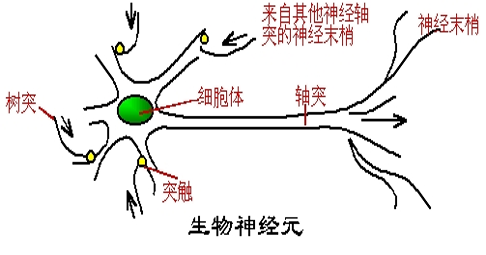
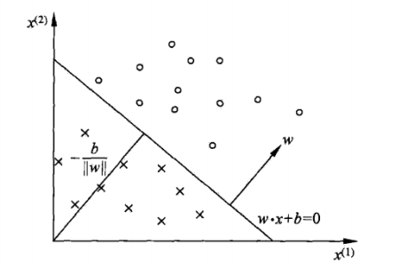
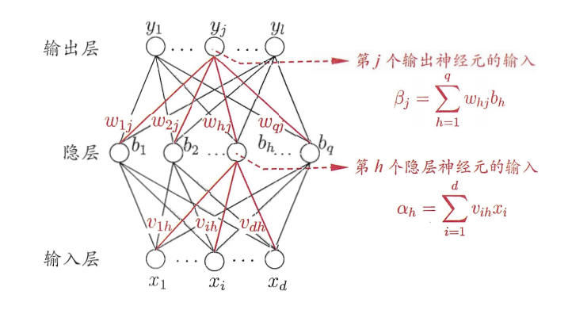
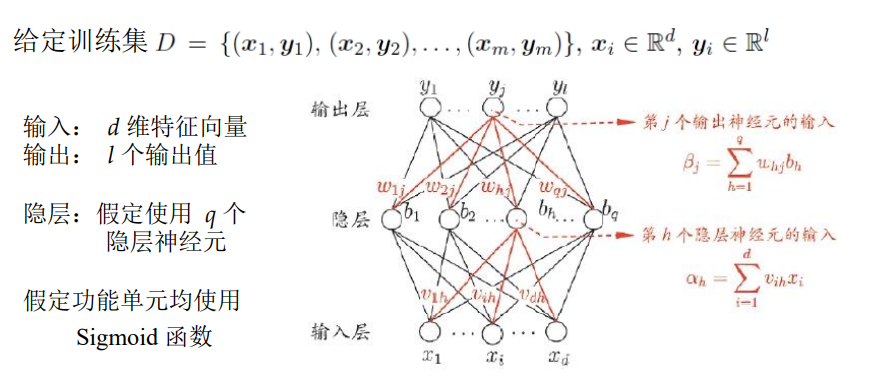
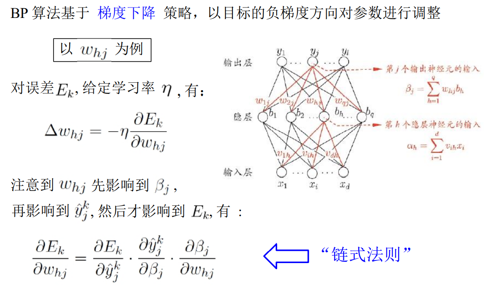

# 深度学习发展历史

人工智能连接主义学派的学者认为，人工智能可以通过仿生人类的大脑的结构来实现，智能活动是由大量简单的单元通过复杂链接后并行运行的结果，这便是深度学习和神经网络的科学基础。

深度学习的结构基础是深层神经网络，而神经网络是在感知机的基础上发展而来。1957年，罗森·布拉特基于神经感知科学背景设计出了第一个计算机神经网络——感知机，来模拟人脑的运作方式。

多层感知机是感知机模型的扩展。1983年，J. J. Hopefield利用神经网络求解“流动推销员问题”这个著名的NP难题取得重大进展，使得神经网络重新受到人们的关注。在1985-1986年，神经网络研究人员（鲁梅尔哈特，辛顿，威廉姆斯-赫，尼尔森）相继提出了使用BP算法训练的多参数线性规划（MLP）的理念，这成为了后来深度学习的基石。

过去由于多层网络训练困难，通常都是只有一层隐含层的浅层模型，而20世纪以来PC显卡的出现为多层网络的训练带来了可能。

神经网络研究领域领军者Hinton在2006年提出了神经网络Deep Learning算法，使神经网络的能力大大提高，向支持向量机发出挑战。Hinton和他的学生Salakhutdinov在顶尖学术刊物《Scince》上发表了一篇文章，指出多隐层的人工神经网络具有优异的特征学习能力，学习得到的特征对数据有更本质的刻划，从而有利于可视化或分类；而深度神经网络在训练上的难度，可以通过“逐层初始化”（ layer-wise pre-training）来有效克服。这开启了深度学习在学术界和工业界的浪潮。

深度学习可以让那些拥有多个处理层的计算模型来学习具有多层次抽象的数据的表示。BP算法能够指导机器如何从前一层获取误差而改变本层的内部参数，这些内部参数可以用于计算表示。深度学习在许多方面都带来了显著的改善，包括最先进的语音识别、视觉对象识别、对象检测和许多其它领域，例如药物发现和基因组学等。深度学习也能够发现大数据中的复杂结构。深度学习中的深度卷积网络在处理图像、视频、语音和音频方面带来了突破，而递归网络在处理序列数据，比如文本和语音方面都表现出了优异的一面。

 

# 人工智能，机器学习和深度学习

从包含概念和知识体系上上，人工智能包含机器学习，机器学习包括深度学习。从出现时间看，人工智能的概念提出已久，机器学习的兴起则在计算机出现后，深度学习是近20年来随着算力设备进步和深度神经网络模型出现的。从关系上看，人工智能是机器学习锚定的目标，而机器学习是实现人工智能的方法，深度学习是机器学习的一个分支，也是人工智能连接主义学派的观点方法。

# 神经元，单层感知机和多层感知机

神经元是人神经系统的基本结构和功能单元，其由细胞体，轴突，树突等组成，细胞体负责处理信息，轴突负责向其它神经元传递携带信息的神经冲动，树突则负责接收来自其它神经元的神经冲动。

    
 

感知机是为以人类神经元为基础产生的模型，模型上，感知机是二类分类线性分类模型，其输入为实例的特征向量，输出为实例的类别，取+1和-1二值，感知机对应于输入空间（特征空间）中将实例划分为正负两类的分离超平面 。

    
 

感知机模型

感知机提出3年后，维德罗首次使用Delta学习规则（即最小二乘法）用于感知器的训练步骤，创造了一个良好的线性分类器。

多层感知机（人工神经网络）由一层层单层感知机组成。其由一系列简单单元相互密集连接构成，其中每一个单元有一定数量的实值输入(可能是其他单元的输出)，并产生单一的实数值输出(可能成为其他很多单元的输入)。算法的重点是构造阈值逻辑单元，一个值逻辑单元是一个对象 ，它可以输入一组加权系数的量，对它们进行求和，如果这个和达到或者超过了某个阈值， 就输出一个量。

多层感知机提供了一种普遍而且实用的方法，来从样例中学习值为实数、离散或向量的函数，它对于训练数据中的拟合效果很好，在各个学科领域都能得到有效应用。

    
 

多层感知机

# 前向传播

神经网络中前向传播指的是：数据从输入层开始，依次经过隐藏层最终到达输出层的过程。数据每经过一层传播，其节点输出的值所代表的信息层次就越高阶和概括。每个节点输出的值是通过与其相连的前一层中所有节点输出置的加权求和经过激活函数处理的结果。

前向传播的示意图如下：

    
 

前向传播

# 反向传播

反向传播算法即BP算法，它基于梯度下降的策略，以目标的负梯度方向对网络参数进行调整，以达到降低目标损失的目的。求导使用链式法则求导。

反向传播的示意图如下：

    
 

反向传播

