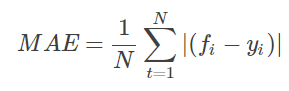
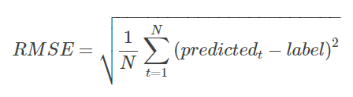
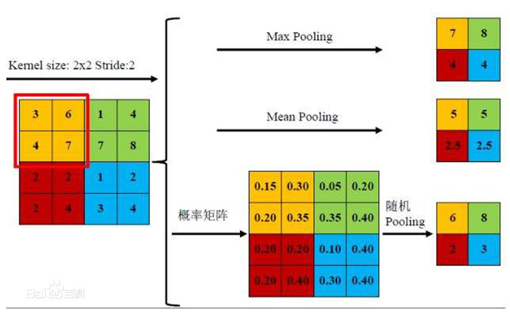
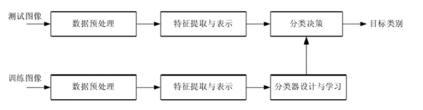

# 损失函数补充

平均绝对值误差(Mean Absolute Error)

<div  align="center">    
 
</div>

```python
import numpy as np

def MAE(y_true, y_pred): 
    return np.mean(np.abs((y_pred - y_true))

```

根均方误差(Root Mean Square Error)

<div  align="center">    
 
</div>

```python
import numpy as np

def RMSE(y_true, y_pred):
    return np.sqrt(((predictions - targets) ** 2).mean())

```

# 池化方法补充

## 随机池化(Stochastic Pooling)

Stochastic pooling是一种简单有效的正则化CNN的方法，能够降低max pooling的过拟合现象，提高泛化能力。对于pooling层的输入，根据输入的多项式分布随机选择一个值作为输出。训练阶段和测试阶段的操作略有不同。

训练阶段：

1）前向传播：先将池化窗口中的元素全部除以它们的和，得到概率矩阵；再按照概率随机选中的方格的值，作为该区域池化后的值。

2）反向传播：求导时，只需保留前向传播中已经被选中节点的位置的值，其它值都为0，类似max-pooling的反向传播。

测试阶段：

在测试时也使用Stochastic Pooling会对预测值引入噪音，降低性能。取而代之的是使用概率矩阵加权平均。比使用Average Pooling表现要好一些。在平均意义上，与Average Pooling近似，在局部意义上，服从Max Pooling准则

<div  align="center">    
 
</div>

## 重叠池化(Overlapping Pooling)

重叠池化，即相邻池化窗口之间会有重叠区域。如果定义池化窗口的大小为sizeX，定义两个相邻池化窗口的水平位移 / 竖直位移为stride，此时sizeX>stride。

Alexnet中提出和使用，不仅可以提升预测精度，同时一定程度上可以减缓过拟合。相比于正常池化（步长s=2，窗口x=2），重叠池化(步长s=2，窗口x=3) 可以减少top-1, top-5的错误率分别为0.4% 和0.3%。

## 全局池化(Global Pooling)

Global Pooling就是池化窗口的大小 = 整张特征图的大小。这样，每个 W×H×C 的特征图输入就会被转化为 1×1×C 的输出，也等同于每个位置权重都为 1/(W×H) 的全连接层操作。

# 数据增强方法补充

## 噪声增强
一般对图像加入高斯噪声可以使得图像变得模糊，从而模拟模糊情况

## 无监督图像增强
使用训练好的生成式对抗网络GAN生成逼真的样本来增加样本数据

# 图像分类方法综述
1.1 

图像分类是指根据一定的分类规则将图像自动分到一组预定义类别中的过程。

1.2 

图像分类方法的划分十分多样。根据图像语义内容的不同层次可以将图像分类划分为：

（1）对象分类 object categorization

（2）场景分类 scene classification

（3）事件分类 event classification

（4）情感分类 emotion classification

1.3

视觉一致的图像分类：主要依据是图像内容的视觉感知一致性（看起来一样，差不多）而不是功能一致性（用途差不多，一样）。

基于场景的图像分类：根据图像拍摄时所处的物理环境类别来对图像进行分类

对象分类和目标识别：对象分类是指判定一个图像中是否出现了某个对象类别的方法但他并不需要定为或者分割出图像中的对象；

对象识别或目标识别：通常指从新的图像中找出以前证件出现过的同一对象。

1.4  

图像分类的应用：

网络图像检索

视频分析与检索

医学图像分类

医学图像数据挖掘

图像检测

遥感图像分类

1.5 图像分类的基本过程

基本操作是建立图像内容的描述，然后利用机器学习方法学习图像类别，最后利用学习得到的模型对未知图像进行分类。

<div  align="center">    
 
</div>

一般来说，图像分类性能主要与图像特征提取和分类方法密切相关。图像特征提取是图像分类的基础，提取的图像特征应能代表各种不同的图像属性；

传统的方法一般包括底层特征学习、特征编码、空间约束、分类器设计、模型融合等几个阶段。而深度学习模型CNN等的出现将上述阶段融为一体，实现端到端图像分类并显示出了惊人的准确率。