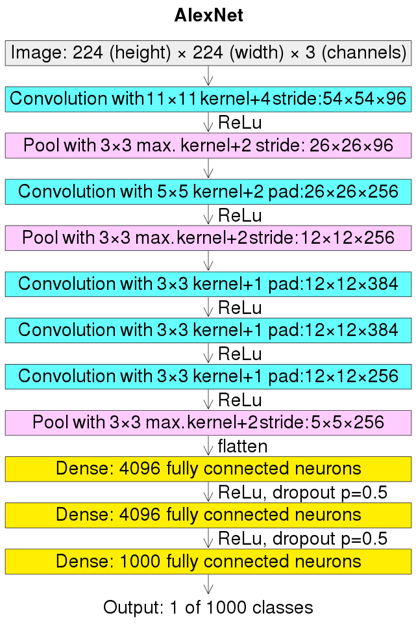

# 深度学习发展历史

---

- 1943年，神经科学家和心理学家麦卡洛克（W.S.McClilloch）和数学逻辑学家皮兹（W.Pitts）在《数学生物物理学公告》发表论文《神经活动中内在思想的逻辑演算》<a href='https://link.springer.com/article/10.1007/BF02478259'>[A Logical Calculus of the Ideas Immanent in Nervous Activity]</a>。建立了神经网络和数学模型，称为MCP模型（McClilloch-Pitts model）。希望能够用计算机来模拟生物的神经元结构与其反应的过程，该模型将神经元简化为了三个过程：输入信号线性加权，求和，非线性激活（阈值法）。

- 1957年，计算机科学家罗森布拉特（Frank Rosenblatt）提出了两层神经元组成的神经网络，称之为“感知器”(Perceptrons)。第一次将MCP用于机器学习分类。“感知器”算法算法使用MCP模型对输入的多维数据进行二分类，且能够使用梯度下降法从训练样本中自动学习更新权值。1962年，该方法被证明为能够收敛，理论与实践效果引起**第一次神经网络的浪潮**。

- 1960年，Henry J. Kelley 在论文《最优飞行路径的梯度理论》<a href='https://www.gwern.net/docs/statistics/decision/1960-kelley.pdf'> [Gradient Theory of Optimal Flight Paths]</a> 中提出了反向传播（BackPropagation, BP），但是还仅仅应用有控制理论中。

- 1969年，美国数学家及人工智能先驱 Marvin Minsky 证明了感知器本质上是一种线性模型，只能处理线性分类问题，最简单的亦或问题都无法正确分类。神经网络的研究陷入了将近20年的停滞。

---

- 1986年，神经网络之父 Geoffrey Hinton 在发明了适用于多层感知器（Multi-Layer Perceptron）的BP算法，并采用Sigmoid函数进行**非线性映射** ，有效解决了非线性分类和学习的问题。该方法引起了**神经网络的第二次热潮**。

$sigmoid(x) = \frac{1}{1+e^{-x}}$

- 1989年，Hornik, Kurt等人在<a href='http://cognitivemedium.com/magic_paper/assets/Hornik.pdf'>Multilayer Feedforward Networks are Universal Approximators</a>中论证了万能逼近定理（Universal Approximation Theorems）,即对于任何闭区间内的一个连续函数f，都可以用含有一个隐含层的BP网络来逼近该定理的发现极大的鼓舞了神经网络的研究人员。

- 同年，Yann LeCun提出了卷积神经网络结构的LeNet。卷积神经网络结构一种前馈神经网络，其人工神经元可以响应覆盖范围内的部分周围细胞，在大规模图像处理中表现良好。

- 1991年，由于BP存在**梯度消失问题**，即在误差梯度后向传递的过程中，后层梯度以乘性方式叠加到前层，由于Sigmoid函数的饱和特性，后层梯度本来就小，误差梯度传到前层时几乎为0，因此无法对前层进行有效的学习。

- 1997年，Sepp Hochreiter和Jürgen Schmidhuber提出了长短期记忆（Long Short-Term Memory, lstm）。由于其独特的设计结构，LSTM适合于处理和预测时间序列中间隔和延迟非常长的重要事件。尽管该模型在序列建模上的特性非常突出，但由于正处于人工智能的下坡期，也没有引起足够的重视。

- 2006年，Geoffrey Hinton 与其学生Ruslan Salakhutdinov提出了深层网络训练中梯度消失问题的解决方案：**无监督预训练对权值进行初始化+有监督训练微调。**

- 2012年，AlexNet参加了ImageNet大规模视觉识别挑战赛。该网络实现了15.3%的top-5错误率，比亚军支持向量机（Support Vector Machine, SVM）低10.8个百分点以上。原始论文的主要结果是模型的深度对其高性能至关重要，这在计算上很昂贵，但由于在训练期间使用了图形处理单元 (GPU)，因此变得可行。由于采用了ReLU函数，极大增大了收敛速度，很好抑制了梯度消失问题。AlexNet采用了监督训练，添加了Drop Out层，减少了过拟合，且采用了GPU增加训练速度。

- 2013年及之后，ImageNet图像识别比赛中，深度学习的网络结构、训练方法以及GPU硬件的不断进步使其在其余领域不断提高表现。

- 2016年，谷歌DeepMind公司开发的AlphaGo以4:1大胜职业九段棋手李世石。2017年5月，中国乌镇围棋峰会上，AlphaGo的升级版与排名世界第一的世界围棋冠军柯洁对战，以3比0的总比分获胜。围棋界公认阿尔法围棋的棋力已经超过人类职业围棋顶尖水平。

# 人工智能、机器学习、深度学习有什么区别和联系？

- 人工智能：“人工智能”一词出现在1956年的达特茅斯会议上，当时人工智能先驱的梦想是建造具有人类智能体的软硬件系统，该系统具有人类的智能特征，而这里所说的人工智能为“通用人工智能”。人工智能是研究、开发用于模拟、延伸和扩展人的智能的理论、方法、技术及应用系统的一门技术科学。“人工智能”是“一门技术科学”，它研究与开发的对象是“理论、技术及应用系统”，研究的目的是为了“模拟、延伸和扩展人的智能”。通常将人工智能分为人工智能和强弱人工智能。前者让机器具备观察和感知的能力，可以做到一定程度的理解和推理，而后者能让机器获得自适应能力，解决一些之前没有遇到过的问题

- 机器学习：机器学习是用算法解析数据，不断学习，对世界中发生的事做出判断和预测的一项技术。研究人员不会亲手编写软件、确定特殊指令集、然后让程序完成特殊任务；相反，研究人员会用大量数据和算法“训练”机器，让机器学会如何执行任务。这里有三个重要的信息：1、“机器学习”是“模拟、延伸和扩展人的智能”的一条路径，所以是人工智能的一个子集；2、“机器学习”是要基于大量数据的，也就是说它的“智能”是用大量数据喂出来的；3、正是因为要处理海量数据，所以大数据技术尤为重要；“机器学习”只是大数据技术上的一个应用。常用的10大机器学习算法有：决策树、随机森林、逻辑回归、SVM、朴素贝叶斯、K最近邻算法、K均值算法、Adaboost算法、神经网络、马尔科夫。

- 深度学习：深度学习是用于建立、模拟人脑进行分析学习的神经网络，并模仿人脑的机制来解释数据的一种机器学习技术。它的基本特点，是试图模仿大脑的神经元之间传递，处理信息的模式。最显著的应用是计算机视觉和自然语言处理（Natural Language Process，NLP）领域。显然，“深度学习”是与机器学习中的“神经网络”是强相关，“神经网络”也是其主要的算法和手段；可以将“深度学习”称之为“改良版的神经网络”算法。其主要的思想就是模拟人的神经元，每个神经元接受到信息，处理完后传递给与之相邻的所有神经元即可。

# 神经元、单层感知机、多层感知机

- 神经元：神经网络中最基本的单元。在生物神经网络中，每个神经元与其它神经元相连，当其受刺激兴奋是，会向相连的神经元发送化学物质，从而改变这些神经元内的电位；如果其神经元的电位超过了一个阈值，那么它就会被激活，向其它神经元发送化学物质。

  如前文所述，1943年，McCulloch和Pitts将上述情况抽象为简单的“M-P神经元模型”，其接受n个神经元的输入信号，通过带权重的连接进行传递，神经元接受到的总输入值将与神经元的阈值进行比较，然后通过**激活函数**产生神经元的输出。常见的激活函数有：Sigmoid，ReLU，LeakyReLU等。

- 单层感知机：单层感知机由一个线性组合器和一个二值阈值元件组成。输入向量的各个分量先与权值相乘，然后在线性组合器中进行叠加，得到一个标量结果，其输出是线性组合结果经过一个二值阈值函数。二值阈值元件通常是一个上升函数，典型功能是非负数映射为1，负数映射为0或负一。

$y = f(\sum_{i=1}^N \omega_{i}x_{i} + b)$

- 多层感知机：多层感知器（Multilayer Perceptron，MLP）是一种前向结构的人工神经网络，映射一组输入向量到一组输出向量。MLP可以被看作是一个有向图，由多个的节点层所组成，每一层都全连接到下一层。除了输入节点，每个节点都是一个带有非线性激活函数的神经元（或称处理单元）。多层感知器遵循人类神经系统原理，学习并进行数据预测。它首先学习，然后使用权重存储数据，并使用算法来调整权重并减少训练过程中的偏差，即实际值和预测值之间的误差。主要优势在于其快速解决复杂问题的能力。多层感知的基本结构由三层组成：第一输入层，中间隐藏层和最后输出层，输入元素和权重的乘积被馈给具有神经元偏差的求和结点,主要优势在于其快速解决复杂问题的能力。MLP是感知器的推广，克服了感知器不能对线性不可分数据进行识别的弱点。

# 什么是前向传播（包含图文实例）

前向传播通过上一层的节点$x$及其对应的连接权值$\omega$进行加权和运算，再加上一个偏置项，最后再通过激活函数得到输出。前向传播的过程可以用该公式表示：

$y=\delta(\sum \omega * x + b)$

# 什么是反向传播（包含图文实例）

反向传播算法（Backpropagation，BP）是一种广泛用于训练前馈神经网络的算法。反向传播的泛化存在于其他人工神经网络 (ANN) 和一般函数中。这些类别的算法都统称为“反向传播”。

在拟合神经网络时，反向传播计算损失函数相对于单个输入输出示例的网络权重的梯度，这与针对每个权重单独计算梯度的简单直接计算不同。这种效率使得使用梯度方法训练多层网络、更新权重以最小化损失成为可能；通常使用梯度下降或随机梯度下降等变体。反向传播算法的工作原理是通过链式法则计算损失函数相对于每个权重的梯度，一次计算一层梯度，从最后一层开始向后迭代，避免链式法则中中间项的冗余计算。

**链式法则** 用于计算复合函数的导数，BP是一种计算链式法则的算法。假设$y=f(x)$，$z=f(g(x))$，则$\frac{dz}{dx}=\frac{dz}{dy}\frac{dy}{dx}$

当使用最常见的均方误差作为损失函数时，$Loss = \frac{1}{2m}\sum(\hat{y}-y)^2$，$y=\delta(\omega x + b)$

则 $\frac{d}{dx}Loss = \delta'(\hat{y}-y)\omega$，$\frac{d}{d\omega}Loss = \delta'(\hat{y}-y)x$

$\omega\leftarrow \omega - \eta \frac{\partial L}{\partial\omega}$
