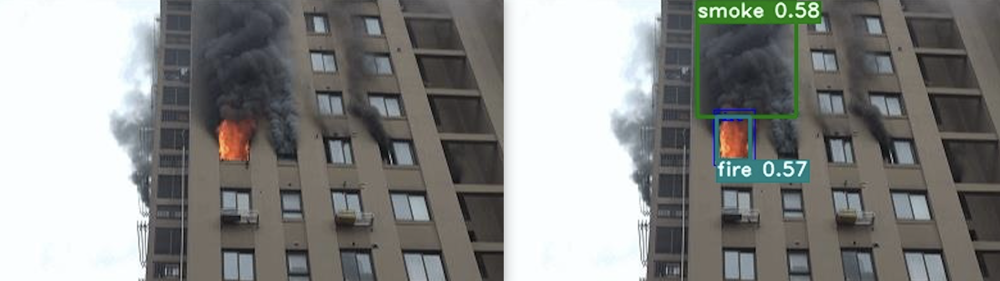
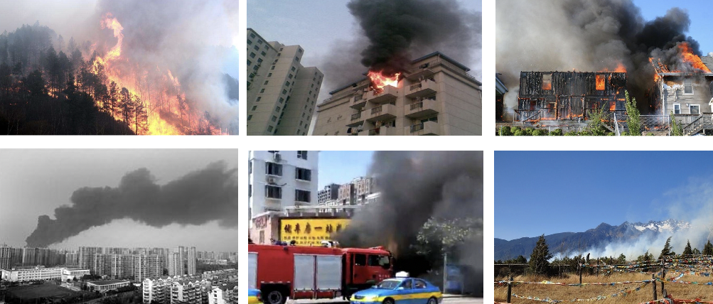
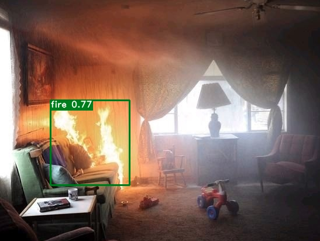

# 火灾烟雾检测

## 内容

* [项目说明](#项目说明)
* [环境要求](#环境要求)
* [下载PaddleX源码](#下载PaddleX源码)
* [数据准备](#数据准备)
* [模型选择](#模型选择)
* [模型训练](#模型训练)
* [模型优化](#模型优化)
* [模型评估](#模型评估)
* [模型预测](#模型预测)
* [模型导出](#模型导出)
* [模型部署](#模型部署)

<a name="项目说明"></a>

## 1 项目说明

本案例基于PaddleX实现对烟雾和火灾的检测，主要针对城市和森林应用场景，希望通过梳理优化模型精度和性能的思路能帮助用户更高效地解决实际火灾和烟雾检测应用中的问题。开放烟雾和火灾数据和预训练模型，并提供服务器Serving和Jetson NX边缘侧芯片的部署指南。



计算机视觉中的烟雾和火灾检测在住宅、加油站、公路、森林等室内外场景自动标注疑似烟雾、火灾，实现实时自动烟火检测，具有重要意义。

<a name="环境要求"></a>

## 2 环境要求

* PaddlePaddle >= 2.1.0
* Python >= 3.5
* PaddleX >= 2.0.0

安装的相关问题参考[PaddleX安装](https://paddlex.readthedocs.io/zh_CN/release-1.3/install.html#pip)

<a name="下载PaddleX源码"></a>

## 3 下载PaddleX源码

```
git clone https://github.com/PaddlePaddle/PaddleX -b develop
cd PaddleX
git checkout develop
```

<a name="数据准备"></a>

## 4 数据准备

---

本案例使用数据集包含互联网下载图片和已公开数据，共有6675张图片，分别检测烟雾和火灾，示例图片如图所示：



数据集图片格式是VOC数据格式，VOC数据是每个图像文件对应一个同名的xml文件，xml文件内包含对应图片的基本信息，比如文件名、来源、图像尺寸以及图像中包含的物体区域信息和类别信息等。

xml文件中包含以下字段：

- filename，表示图像名称。

- size，表示图像尺寸。包括：图像宽度、图像高度、图像深度。

  ```
  <size>
      <width>500</width>
      <height>375</height>
      <depth>3</depth>
  </size>
  ```

- object字段，表示每个物体。包括:

  |     标签     |                             说明                             |
  | :----------: | :----------------------------------------------------------: |
  |     name     |                         物体类别名称                         |
  |     pose     |              关于目标物体姿态描述（非必须字段）              |
  |  truncated   | 如果物体的遮挡超过15-20％并且位于边界框之外，请标记为`truncated`（非必须字段） |
  |  difficult   |        难以识别的物体标记为`difficult`（非必须字段）         |
  | bndbox子标签 |       (xmin,ymin) 左上角坐标，(xmax,ymax) 右下角坐标，       |

使用PaddleX 命令即可将这6675张图片按9:1比例随机切分，切分后包含6008张图片的训练集和667张图片的验证集。包含以下文件夹和文件：`images`,`annotations`,`labels.txt`, `train_list.txt`和 `val_list.txt`，分别图片、xml标注文件、存储类别信息、训练样本列表、验证样本列表。训练样本列表和验证样本列表的每一行格式为：`图片路径 对应的xml路径`，例如`images/fire_00348.jpg annotations/fire_00348.xml`。

最终数据集文件组织结构为：

```
 ├── dataset
	├── annotations
  │   ├── fire_000001.xml
  │   ├── fire_000002.xml
  │   ├── fire_000003.xml
  │   |   ...
  ├── images
  │   ├── fire_000001.jpg
  │   ├── fire_000003.jpg
  │   ├── fire_000003.jpg
  │   |   ...
  ├── label_list.txt
  ├── train.txt
  └── valid.txt
```

<a name="模型选择"></a>

## 5 模型选择

PaddleX提供了5种目标检测模型：FasterRCNN、YOLOV3、PPYOVO、PPYOLOv2和PPYOLOTiny。

* [Faster RCNN](https://arxiv.org/pdf/1506.01497.pdf)：Ross B. Girshick在2016年提出了新的FasterRCNN，需要先产生候选区域，再对RoI做分类和位置坐标的预测，这类算法被称为两阶段目标检测算法。在结构上，Faster RCNN已经将特征抽取(feature extraction)，proposal提取，bounding box regression(rect refine)，classification都整合在了一个网络中，使得综合性能有较大提高，在检测速度方面尤为明显。
* [YOLOv3](https://pjreddie.com/media/files/papers/YOLOv3.pdf)：Joseph Redmon等人在2015年提出YOLO（You Only Look Once，YOLO）算法，通常也被称为YOLOv1；2016年，他们对算法进行改进，又提出YOLOv2版本；2018年发展出YOLOV3版本。YOLOv3使用单个网络结构，在产生候选区域的同时即可预测出物体类别和位置，这类算法被称为单阶段目标检测算法。另外，YOLOv3算法产生的预测框数目比Faster R-CNN少很多。Faster R-CNN中每个真实框可能对应多个标签为正的候选区域，而YOLOv3里面每个真实框只对应一个正的候选区域。这些特性使得YOLOv3算法具有更快的速度，能到达实时响应的水平。
* [PP-YOLO](https://arxiv.org/abs/2007.12099)：PPYOLO是[PaddleDetection]()优化和改进的YOLOv3的模型，其精度(COCO数据集mAP)和推理速度均优于[YOLOv4](https://arxiv.org/abs/2004.10934)模型。PP-YOLO在[COCO](http://cocodataset.org/) test-dev2017数据集上精度达到45.9%，在单卡V100上FP32推理速度为72.9 FPS, V100上开启TensorRT下FP16推理速度为155.6 FPS。PP-YOLO从如下方面优化和提升YOLOv3模型的精度和速度：
  - 更优的骨干网络: ResNet50vd-DCN
  - 更大的训练batch size: 8 GPUs，每GPU batch_size=24，对应调整学习率和迭代轮数
  - [Drop Block](https://arxiv.org/abs/1810.12890)
  - [Exponential Moving Average](https://www.investopedia.com/terms/e/ema.asp)
  - [IoU Loss](https://arxiv.org/pdf/1902.09630.pdf)
  - [Grid Sensitive](https://arxiv.org/abs/2004.10934)
  - [Matrix NMS](https://arxiv.org/pdf/2003.10152.pdf)
  - [CoordConv](https://arxiv.org/abs/1807.03247)
  - [Spatial Pyramid Pooling](https://arxiv.org/abs/1406.4729)
  - 更优的预训练模型

* [PPYOLOv2](https://arxiv.org/abs/2104.10419)：相较20年发布的PP-YOLO，PPYOLOv2版本在COCO 2017 test-dev上的精度提升了3.6个百分点，由45.9%提升到了49.5%；在640*640的输入尺寸下，FPS达到68.9FPS。 PP-YOLOv2在同等速度下，精度超越YOLOv5，主要改进点：
  * Path Aggregation Network
  * Mish Activation Function
  * Larger Input Size
  * IoU Aware Branch
* PPYOLOTiny：在当前移动互联网、物联网、车联网等行业迅猛发展的背景下，边缘设备上直接部署目标检测的需求越来越旺盛。生产线上往往需要在极低硬件成本的硬件例如树莓派、FPGA、K210 等芯片上部署目标检测算法。而我们常用的手机 App，也很难直接在终端采用超过 6M 的深度学习算法。如何在尽量不损失精度的前提下，获得体积更小、运算速度更快的算法呢？得益于 PaddleSlim 飞桨模型压缩工具的能力，体积仅为 1.3M 的 PP-YOLO Tiny 诞生了！PP-YOLO Tiny 沿用了 PP-YOLO 系列模型的 spp，iou loss, drop block, mixup, sync bn 等优化方法，并进一步采用了针对移动端的优化策略：
  * 更适用于移动端的骨干网络：MobileNetV3
  * 更适用移动端的检测头（head）：深度可分离卷积
  * 去除对模型体积、速度有显著影响的优化策略：iou aware、matrix NMS等
  * 使用更小的输入尺寸
  * 召回率优化
  * 更大的batch size
  * 量化后压缩

根据部署场景，这里我们选择了双阶段的Faster RCNN算法进行火灾和烟雾检测。

<a name="模型训练"></a>

## 6 模型训练

PaddleX提供了单卡/多卡训练模型，满足用户多种训练需求

* GPU单卡训练

```
export CUDA_VISIBLE_DEVICES=0 #windows和Mac下不需要执行该命令
python train.py
```

* GPU多卡训练，例如使用2张卡时执行：

```
export CUDA_VISIBLE_DEVICES=0,1 #windows和Mac下不需要执行该命令
python -m paddle.distributed.launch --gpus 0,1 train.py
```

<a name="模型优化"></a>

## 7 模型优化

### 7.1 精度优化

本小节侧重展示在模型迭代过程中优化精度的思路，在本案例中，有些优化策略获得了精度收益，而有些没有。在其他质检场景中，可根据实际情况尝试这些优化策略，具体请参考[模型优化文档](./accuracy_improvement_frcnn.md)

采用PaddleX在Tesla V100上测试模型的推理时间（输入数据拷贝至GPU的时间、计算时间、数据拷贝至CPU的时间），推理时间如下表所示：（**20次推理取平均耗时**）

由于参与推理的图片较大，因此预处理时间在**Resize处**会消耗较多的时间。

| 模型                              | 推理时间（FPS） | Recall | Error Rate |
| --------------------------------- | --------------- | ------ | ---------- |
| PPYOLOV2+ResNet50_vd_dcn+SPP=True | 22              | 96.3   | 11.1       |
| PPYOLO+ResNet50_vd_dcn            | 20              | 90.0   | 8.81       |
| YOLOV3+DarkNet53+img_size(640)    | 21              | 88.4   | 6.01       |
| FasterRCNN+ResNet50               | 17              | 96.7   | 8.1        |
| FasterRCNN+ResNet50+DCN           | 17              | 94.5   | 7.6        |

注意:

- **608**的图像大小，一般使用默认的anchors进行训练和推理即可。

**优化进展说明**：

- 1.通过选择更好的检测架构可以提高检测的Recall值——即**Neck，Head部分的优化**可以提高Recall，但是Error Rate也有了一定的增长。<**YOLOV3 到 PPYOLOV2**>
- 2.两阶段算法相较于单阶段算法在检测精度上更加准确，Recall和Error Rate都有了显著提升，但是推理时间也会相应增加。<**PPYOLOv2到FasterRCNN**>
- 3.通过FasterRCNN的两个实验可以看到，**加入可变形卷积DCN后，Error Rate可以得到微小的改善，但是Recall下降明显**。因此综合考虑后采用不添加DCN的模型。

通过以上的简单优化方式，获取了两个较好的模型结果：【前者模型**速度更快**】

| 模型                              | 推理时间（FPS） | Recall | Error Rate |
| --------------------------------- | --------------- | ------ | ---------- |
| PPYOLOV2+ResNet50_vd_dcn+SPP=True | 22              | 96.3   | 11.1       |
| FasterRCNN                        | 17              | 96.7   | 8.1        |

<a name="模型评估"></a>

## 8 模型评估

模型迭代完成后，计算不同置信度阈值下图片级召回率和图片级误检率，找到符合要求的召回率和误检率，对应的置信度阈值用于后续模型预测阶段。

```
python eval.py
```

【名词解释】

* 图片级别的召回率：只要在有目标的图片上检测出目标（不论框的个数），该图片被认为召回。批量有目标图片中被召回图片所占的比例，即为图片级别的召回率。
* 图片级别的误检率：只要在无目标的图片上检测出目标（不论框的个数），该图片被认为误检。批量无目标图片中被误检图片所占的比例，即为图片级别的误检率。

<a name="模型预测"></a>

## 9 模型预测

加载训练好的模型，置信度阈值设置为0.5，对验证集或测试集图片进行预测：

```
python predict.py
```

可视化预测结果示例如下：



<a name="模型导出"></a>

## 10 模型导出

在模型训练过程中保存的模型文件是包含前向预测和反向传播的过程，在实际的工业部署则不需要反向传播，因此需要将模型进行导成部署需要的模型格式。 执行下面命令，即可导出模型

```
paddlex --export_inference --model_dir=./output/deeplabv3p_r50vd/best_model/ --save_dir=./inference_model
```

预测模型会导出到`inference_model/`目录下，包括`model.pdmodel`、`model.pdiparams`、`model.pdiparams.info`、`model.yml`和`pipeline.yml`五个文件，分别表示模型的网络结构、模型权重、模型权重名称、模型的配置文件（包括数据预处理参数等）和可用于[PaddleX Manufacture SDK](https://github.com/PaddlePaddle/PaddleX/tree/release/2.0.0/deploy/cpp/docs/manufacture_sdk)的流程配置文件。

* 更多关于模型导出的文档，请参考[模型导出文档](https://github.com/PaddlePaddle/PaddleX/blob/release/2.0.0/docs/apis/export_model.md)

<a name="模型部署"></a>

## 11 模型部署

