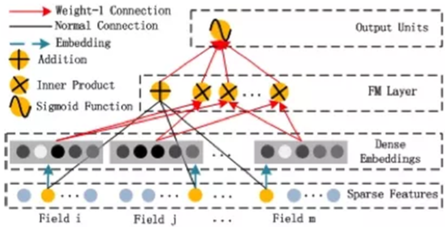
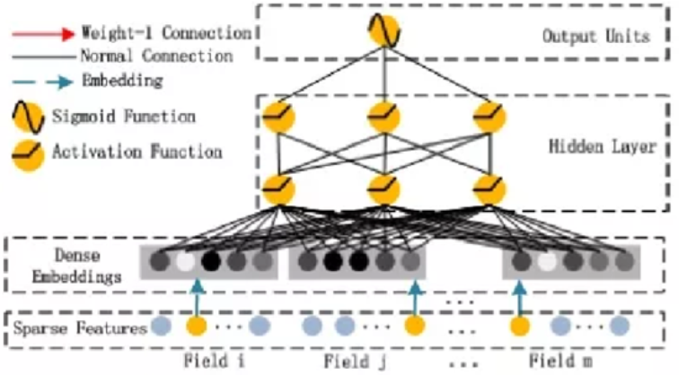

# DeepFM原理介绍

CTR（Click-Through-Rate）为点击率，CTR预估可以很好地体现一件商品或者广告的商业价值和前景。点击率预估模型预判用户对一条广告点击的概率，对每次广告的点击情况做出预测，是广告技术的核心算法之一。逻谛斯克回归对大规模稀疏特征有着很好的学习能力，在点击率预估任务发展的早期一统天下。近年来，DNN 模型由于其强大的学习能力逐渐接过点击率预估任务的大旗。

下面简单介绍DeepFM模型的原理。

DeepFM原理

DeepFM（FM Component + Deep Component）包含两部分：因子分解机（FM）部分与神经网络（DNN）部分，FM部分负责低阶特征的提取（包括一阶和二阶，虽然FM也可以实现高于二阶的特征提取，但是由于计算复杂度的限制，一般只计算到二阶），DNN部分负责高阶特征的提取。

DeepFM的预测公式如下：
$$
\hat{y}=sigmod(y_{FM}+y_{DNN})
$$

## 1.FM部分

DeepFM的FM部分网络架构如下图所示：

FM部分是因子分解机。FM部分的输出由两部分构成：（1）一个Addition Unit；（2）多个内积单元。FM部分的公式如下：
$$
y_FM = <w,x>+\sum^d_{j_1=1}\sum^d_{j_2=j_1+1}<V_i,V_j>x_{j_1}*x_{j_2}
$$
这里的d是输入one-hot之后的维度，一般称之为feature_size。

Addition Unit 反映的是1阶的特征。内积单元反映的是2阶的组合特征对于预测结果的影响。

FM Component总结：

1. FM 模块实现了对于1 阶和2阶组合特征的建模。

2. 没有使用预训练

3. 没有人工特征工程

4. embedding 矩阵的大小是：特征数量 * 嵌入维度。然后用一个 index 表示选择了哪个特征。

需要训练的有两部分：

1. input_vector和Addition Unit相连的全连接层，也就是1阶的Embedding矩阵。
2. Sparse Feature到Dense Embedding的Embedding矩阵，中间也是全连接的，要训练的是中间的权重矩阵，这个权重矩阵也就是隐向量V。

## 2.DNN部分

DeepFM的Deep Component架构图如下：

Deep Component 是用来学习高阶组合特征的。网络里面黑色的线是全连接层，参数需要神经网络去学习。

由于CTR或推荐系统的数据one-hot之后特别稀疏，如果直接放入到DNN中，参数非常多，我们没有这么多的数据去训练这样一个网络。所以增加了一个 Embedding层，用于降低纬度。

Embedding层具有两个特点：（1）尽管输入的长度不同，但是映射后长度都是相同的.embedding_size也就是k，这是我们根据经验预先设置的值；（2）embedding 层的参数其实是全连接的 Weights，是通过神经网络自己学习到的。

## 3.DeepFM的优势

随着DNN在图像、语音、NLP等领域取得突破，人们渐渐意识到DNN在特征表示上的天然优势。相继提出了使用CNN或RNN来做CTR预估的模型。但是，CNN模型的缺点是：偏向于学习相邻特征的组合特征。RNN模型的缺点是：比较适用于有序列 (时序) 关系的数据。

FNN的提出，应该算是一次非常不错的尝试：先使用预先训练好的FM，得到隐向量，然后作为DNN的输入来训练模型。缺点在于：受限于FM预训练的效果。

随后提出了PNN，PNN为了捕获高阶组合特征，在embedding layer和first hidden layer之间增加了一个product layer。根据 product layer 使用内积、外积、混合分别衍生出IPNN, OPNN, PNN*三种类型。

无论是FNN还是PNN，他们都有一个绕不过去的缺点：对于低阶的组合特征，学习到的比较少。低阶特征对于CTR也是非常重要的。

Google意识到了这个问题，为了同时学习低阶和高阶组合特征，提出了Wide&Deep模 型。它混合了一个线性模型（Wide part）和Deep模型(Deep part)。这两部分模型需要不同的输入，而Wide part部分的输入，依旧依赖人工特征工程。

但是，这些模型普遍都存在两个问题：

1. 偏向于提取低阶或者高阶的组合特征。不能同时提取这两种类型的特征。

2. 需要专业的领域知识来做特征工程。

DeepFM 在 Wide&Deep 的基础上进行改进，成功解决了这两个问题，并做了一些改进， 其优势/优点如下：

1. 不需要预训练FM得到隐向量。
2. 不需要人工特征工程。
3. 能同时学习低阶和高阶的组合特征。
4. FM模块和Deep模块共享 Feature Embedding部分，可以更快的训练，以及更精确的训练学习。

## 4.代码实践

在了解DeepFM算法的原理后，我们通过编写代码对其DNN部分进行了实践。

数据集包含80条数据样本，其中包含39维特征。标签为0和1，表示该条样本是否被点击。最终算法在训练20个epoch的情况下，可以获取接近80%的正确率。