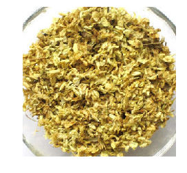

数据集aistudio链接：
<https://aistudio.baidu.com/aistudio/datasetdetail/105575>
项目aistudio链接：
<https://aistudio.baidu.com/aistudio/projectdetail/2310126>
# **中草药识别**
# **一、案例背景**

本实践案例是图像分类问题，图像分类是根据图像的语义信息对不同类别图像进行区分，是计算机视觉的核心，是物体检测、图像分割、物体跟踪、行为分析、人脸识别等其他高层次视觉任务的基础。图像分类在许多领域都有着广泛的应用，如：安防领域的人脸识别和智能视频分析等，交通领域的交通场景识别，互联网领域基于内容的图像检索和相册自动归类，医学领域的图像识别等。


今天我们带大家利用飞桨框架搭建VGG网络，实现中草药识别，让大家亲自感受图像分类的魅力。
<br/>
**本实践旨在通过中草药识别来让大家对图像分类问题有一个初步了解，同时理解和掌握如何使用飞桨2.0搭建一个经典的卷积神经网络。**
<br/>
本案例整体结构如下所示：


# **二、数据集介绍**

本案例数据集```data/data105575/Chinese Medicine.zip```来源于互联网，分为5个类别共902张图片，其中百合180张图片，枸杞185张图片，金银花180张图片，槐花167张图片，党参190张图片

数据集图片如下所示：


**请勿将本数据集用于商务用途。**

# **三、数据集预处理**
本案例主要分以下几个步骤进行数据预处理：

（1）解压原始数据集

（2）按照比例划分训练集与验证集

（3）乱序，生成数据列表

（4）定义数据读取器，转换图片

首先我们引入本案例需要的所有模块


```python
# 引入需要的模块
import os
import zipfile
import random
import json
import paddle
import sys
import numpy as np
from PIL import Image
import matplotlib.pyplot as plt
from paddle.io import Dataset
random.seed(200)
```

接下来我们正式开始数据集的预处理，第一步我们使用zipfile模块来解压原始数据集，将src_path路径下的zip包解压至target_path目录下


```python
def unzip_data(src_path,target_path):
    if(not os.path.isdir(target_path + "Chinese Medicine")):     
        z = zipfile.ZipFile(src_path, 'r')
        z.extractall(path=target_path)
        z.close()
```

第二步我们按照7:1的比例划分训练集与验证集，之后打乱数据集的顺序并生成数据列表


```python
def get_data_list(target_path,train_list_path,eval_list_path):
    '''
    生成数据列表
    '''
    #存放所有类别的信息
    class_detail = []
    #获取所有类别保存的文件夹名称
    data_list_path=target_path+"Chinese Medicine/"
    class_dirs = os.listdir(data_list_path)  
    #总的图像数量
    all_class_images = 0
    #存放类别标签
    class_label=0
    #存放类别数目
    class_dim = 0
    #存储要写进eval.txt和train.txt中的内容
    trainer_list=[]
    eval_list=[]
    #读取每个类别，['baihe', 'gouqi','jinyinhua','huaihua','dangshen']
    for class_dir in class_dirs:
        if class_dir != ".DS_Store":
            class_dim += 1
            #每个类别的信息
            class_detail_list = {}
            eval_sum = 0
            trainer_sum = 0
            #统计每个类别有多少张图片
            class_sum = 0
            #获取类别路径 
            path = data_list_path  + class_dir
            # 获取所有图片
            img_paths = os.listdir(path)
            for img_path in img_paths:                                  # 遍历文件夹下的每个图片
                name_path = path + '/' + img_path                       # 每张图片的路径
                if class_sum % 8 == 0:                                  # 每8张图片取一个做验证数据
                    eval_sum += 1                                       # test_sum为测试数据的数目
                    eval_list.append(name_path + "\t%d" % class_label + "\n")
                else:
                    trainer_sum += 1 
                    trainer_list.append(name_path + "\t%d" % class_label + "\n")#trainer_sum测试数据的数目
                class_sum += 1                                          #每类图片的数目
                all_class_images += 1                                   #所有类图片的数目
             
            # 说明的json文件的class_detail数据
            class_detail_list['class_name'] = class_dir             #类别名称
            class_detail_list['class_label'] = class_label          #类别标签
            class_detail_list['class_eval_images'] = eval_sum       #该类数据的测试集数目
            class_detail_list['class_trainer_images'] = trainer_sum #该类数据的训练集数目
            class_detail.append(class_detail_list)  
            #初始化标签列表
            train_parameters['label_dict'][str(class_label)] = class_dir
            class_label += 1 
            
    #初始化分类数
    train_parameters['class_dim'] = class_dim
  
    #乱序  
    random.shuffle(eval_list)
    with open(eval_list_path, 'a') as f:
        for eval_image in eval_list:
            f.write(eval_image) 
            
    random.shuffle(trainer_list)
    with open(train_list_path, 'a') as f2:
        for train_image in trainer_list:
            f2.write(train_image) 

    # 说明的json文件信息
    readjson = {}
    readjson['all_class_name'] = data_list_path                  #文件父目录
    readjson['all_class_images'] = all_class_images
    readjson['class_detail'] = class_detail
    jsons = json.dumps(readjson, sort_keys=True, indent=4, separators=(',', ': '))
    with open(train_parameters['readme_path'],'w') as f:
        f.write(jsons)
    print ('生成数据列表完成！')
```

当然，我们目前只是定义了以上两个函数，要想完成上述两个步骤，我们需要初始化数据集存取存放路径，调用上述解压数据集函数与生成数据列表函数完成读入数据之前的准备工作


```python
train_parameters = {
    "src_path":"/home/aistudio/data/data105575/Chinese Medicine.zip",    #原始数据集路径
    "target_path":"/home/aistudio/data/",                     #要解压的路径
    "train_list_path": "/home/aistudio/data/train.txt",       #train.txt路径
    "eval_list_path": "/home/aistudio/data/eval.txt",         #eval.txt路径
    "label_dict":{},                                          #标签字典
    "readme_path": "/home/aistudio/data/readme.json",         #readme.json路径
    "class_dim": -1,                                          #分类数
}
src_path=train_parameters['src_path']
target_path=train_parameters['target_path']
train_list_path=train_parameters['train_list_path']
eval_list_path=train_parameters['eval_list_path']

# 调用解压函数解压数据集
unzip_data(src_path,target_path)


# 划分训练集与验证集，乱序，生成数据列表
#每次生成数据列表前，首先清空train.txt和eval.txt
with open(train_list_path, 'w') as f: 
    f.seek(0)
    f.truncate() 
with open(eval_list_path, 'w') as f: 
    f.seek(0)
    f.truncate() 
#生成数据列表   
get_data_list(target_path,train_list_path,eval_list_path)
```

数据预处理的最后一步是定义数据读取器并将图片转为RGB格式，数据维度由(H, W, C)转为(C, H, W)，图片大小resize为224 * 224用于训练


```python
# 定义数据读取器
class dataset(Dataset):
    def __init__(self, data_path, mode='train'):
        """
        数据读取器
        :param data_path: 数据集所在路径
        :param mode: train or eval
        """
        super().__init__()
        self.data_path = data_path
        self.img_paths = []
        self.labels = []

        if mode == 'train':
            with open(os.path.join(self.data_path, "train.txt"), "r", encoding="utf-8") as f:
                self.info = f.readlines()
            for img_info in self.info:
                img_path, label = img_info.strip().split('\t')
                self.img_paths.append(img_path)
                self.labels.append(int(label))

        else:
            with open(os.path.join(self.data_path, "eval.txt"), "r", encoding="utf-8") as f:
                self.info = f.readlines()
            for img_info in self.info:
                img_path, label = img_info.strip().split('\t')
                self.img_paths.append(img_path)
                self.labels.append(int(label))


    def __getitem__(self, index):
        """
        获取一组数据
        :param index: 文件索引号
        :return:
        """
        # 第一步打开图像文件并获取label值
        img_path = self.img_paths[index]
        img = Image.open(img_path)
        if img.mode != 'RGB':
            img = img.convert('RGB') 
        img = img.resize((224, 224), Image.BILINEAR)
        #img = rand_flip_image(img)
        img = np.array(img).astype('float32')
        img = img.transpose((2, 0, 1)) / 255
        label = self.labels[index]
        label = np.array([label], dtype="int64")
        return img, label

    def print_sample(self, index: int = 0):
        print("文件名", self.img_paths[index], "\t标签值", self.labels[index])

    def __len__(self):
        return len(self.img_paths)
```

同样我们需要调用上面定义的数据读取器来读入训练数据和评估数据，这里我们使用paddle.io.DataLoader模块实现数据加载，并且指定训练集批大小batch_size为32，乱序读入；验证集批大小为8，不打乱顺序。对于训练集批大小的选择，我们会在后续的模型优化章节为大家详细解读。


```python
#训练数据加载
train_dataset = dataset('/home/aistudio/data',mode='train')
train_loader = paddle.io.DataLoader(train_dataset, batch_size=32, shuffle=True)
#评估数据加载
eval_dataset = dataset('/home/aistudio/data',mode='eval')
eval_loader = paddle.io.DataLoader(eval_dataset, batch_size = 8, shuffle=False)
```

# **四、模型介绍**

本案例中我们使用VGG网络进行图像分类，首先我们来了解一下VGG模型。
VGG是当前最流行的CNN模型之一，2014年由Simonyan和Zisserman发表在ICLR 2015会议上的论文《Very Deep Convolutional Networks For Large-scale Image Recognition》提出，其命名来源于论文作者所在的实验室Visual Geometry Group。VGG通过使用一系列大小为3x3的小尺寸卷积核和池化层构造深度卷积神经网络，并取得了较好的效果，在大型分类数据集ILSVRC上，VGG模型仅有6.8% 的top-5 test error 。VGG模型因为结构简单、应用性极强而广受研究者欢迎，尤其是它的网络结构设计方法，为构建深度神经网络提供了方向。

下图是VGG-16的网络结构示意图，有13层卷积和3层全连接层。VGG网络的设计严格使用3×3的卷积层和池化层来提取特征，并在网络的最后面使用三层全连接层，将最后一层全连接层的输出作为分类的预测。 在VGG中每层卷积将使用ReLU作为激活函数，在全连接层之后添加dropout来抑制过拟合。使用小的卷积核能够有效地减少参数的个数，使得训练和测试变得更加有效。比如使用两层3×3卷积层，可以得到感受野为5的特征图，而比使用5×5的卷积层需要更少的参数。由于卷积核比较小，可以堆叠更多的卷积层，加深网络的深度，这对于图像分类任务来说是有利的。VGG模型的成功证明了增加网络的深度，可以更好的学习图像中的特征模式。


# **五、模型实现**
现在我们对VGG网络有了一个初步的了解，那么接下来我们一起来用Paddle的基础api实现一下网络代码吧！
<br/>
<br/>

由上述结构图可知，我们可以把VGG的每组卷积+池化的操作提炼成一个模块，我们将连续的卷积数设为一个参数groups，将groups个卷积层加reLU层与模块最后的Maxpool层进行拼接


```python
# 定义卷积池化网络
class ConvPool(paddle.nn.Layer):
    '''卷积+池化'''
    def __init__(self,
                 num_channels,
                 num_filters, 
                 filter_size,
                 pool_size,
                 pool_stride,
                 groups,
                 conv_stride=1, 
                 conv_padding=1,
                 ):
        super(ConvPool, self).__init__()  

        # groups代表卷积层的数量
        for i in range(groups):
            self.add_sublayer(   #添加子层实例
                'bb_%d' % i,
                paddle.nn.Conv2D(         # layer
                in_channels=num_channels, #通道数
                out_channels=num_filters,   #卷积核个数
                kernel_size=filter_size,   #卷积核大小
                stride=conv_stride,        #步长
                padding = conv_padding,    #padding
                )
            )
            self.add_sublayer(
                'relu%d' % i,
                paddle.nn.ReLU()
            )
            num_channels = num_filters
            

        self.add_sublayer(
            'Maxpool',
            paddle.nn.MaxPool2D(
            kernel_size=pool_size,           #池化核大小
            stride=pool_stride               #池化步长
            )
        )

    def forward(self, inputs):
        x = inputs
        for prefix, sub_layer in self.named_children():
            # print(prefix,sub_layer)
            x = sub_layer(x)
        return x
        
```

接下来我们根据上述模块构建VGG网络，VGG网络由groups分别为2，2，3，3，3的5个ConvPool模块还有三个全连接层组成，全连接层之间使用dropout层防止过拟合。


```python
# VGG网络
class VGGNet(paddle.nn.Layer):
    def __init__(self):
        super(VGGNet, self).__init__()       
        # 5个卷积池化操作
        self.convpool01 = ConvPool(
            3, 64, 3, 2, 2, 2)  #3:通道数，64：卷积核个数，3:卷积核大小，2:池化核大小，2:池化步长，2:连续卷积个数
        self.convpool02 = ConvPool(
            64, 128, 3, 2, 2, 2)
        self.convpool03 = ConvPool(
            128, 256, 3, 2, 2, 3) 
        self.convpool04 = ConvPool(
            256, 512, 3, 2, 2, 3)
        self.convpool05 = ConvPool(
            512, 512, 3, 2, 2, 3)       
        self.pool_5_shape = 512 * 7* 7
        # 三个全连接层
        self.fc01 = paddle.nn.Linear(self.pool_5_shape, 4096)
        self.drop1 = paddle.nn.Dropout(p=0.5)
        self.fc02 = paddle.nn.Linear(4096, 4096)
        self.drop2 = paddle.nn.Dropout(p=0.5)
        self.fc03 = paddle.nn.Linear(4096, train_parameters['class_dim'])

    def forward(self, inputs, label=None):
        # print('input_shape:', inputs.shape) #[8, 3, 224, 224]
        """前向计算"""
        out = self.convpool01(inputs)
        # print('convpool01_shape:', out.shape)           #[8, 64, 112, 112]
        out = self.convpool02(out)
        # print('convpool02_shape:', out.shape)           #[8, 128, 56, 56]
        out = self.convpool03(out)
        # print('convpool03_shape:', out.shape)           #[8, 256, 28, 28]
        out = self.convpool04(out)
        # print('convpool04_shape:', out.shape)           #[8, 512, 14, 14]
        out = self.convpool05(out)
        # print('convpool05_shape:', out.shape)           #[8, 512, 7, 7]         

        out = paddle.reshape(out, shape=[-1, 512*7*7])
        out = self.fc01(out)
        out = self.drop1(out)
        out = self.fc02(out)
        out = self.drop2(out)
        out = self.fc03(out)
        
        if label is not None:
            acc = paddle.metric.accuracy(input=out, label=label)
            return out, acc
        else:
            return out
            
```

# **六、模型训练** 
本案例中，我们使用Adam优化器，Adam优化器由Kingma和Lei Ba两位学者在2014年12月提出。对梯度的一阶矩估计（First Moment Estimation，即梯度的均值）和二阶矩估计（Second Moment Estimation，即梯度的未中心化的方差）进行综合考虑，计算出更新步长。具有实现简单，计算高效，对内存需求少，参数的更新不受梯度的伸缩变换影响， 超参数具有很好的解释性，且通常无需调整或仅需很少的微调等优点。我们将学习率设置为0.0001，训练35个epochs。

为了更直观的看到训练过程中的loss和acc变化趋势，我们首先写一下用于画出折线图的函数


```python
# 折线图，用于观察训练过程中loss和acc的走势
def draw_process(title,color,iters,data,label):
    plt.title(title, fontsize=24)
    plt.xlabel("iter", fontsize=20)
    plt.ylabel(label, fontsize=20)
    plt.plot(iters, data,color=color,label=label) 
    plt.legend()
    plt.grid()
    plt.show()
```

接下来我们更新一下train_parameters，，在之前的基础上加入训练模型需要的参数，包括
- 输入图片的shape
- 训练轮数
- 训练时输出日志的迭代间隔
- 训练时保存模型参数的迭代间隔
- 优化函数的学习率
- 保存的路径


```python
# 参数配置，要保留之前数据集准备阶段配置的参数，所以使用update更新字典
train_parameters.update({
    "input_size": [3, 224, 224],                              #输入图片的shape
    "num_epochs": 35,                                         #训练轮数
    "skip_steps": 10,                                         #训练时输出日志的间隔
    "save_steps": 100,                                         #训练时保存模型参数的间隔
    "learning_strategy": {                                    #优化函数相关的配置
        "lr": 0.0001                                          #超参数学习率
    },
    "checkpoints": "/home/aistudio/work/checkpoints"          #保存的路径
})
```

现在我们开始训练模型，训练步骤如下：
- 模型实例化
- 配置loss函数
- 配置参数优化器
- 开始训练，每经过skip_step打印一次日志，每经过save_step保存一次模型
- 训练完成后画出loss和acc变化图


```python
model = VGGNet()
model.train()
# 配置loss函数
cross_entropy = paddle.nn.CrossEntropyLoss()
# 配置参数优化器
optimizer = paddle.optimizer.Adam(learning_rate=train_parameters['learning_strategy']['lr'],
                                  parameters=model.parameters()) 

steps = 0
Iters, total_loss, total_acc = [], [], []

for epo in range(train_parameters['num_epochs']):
    for _, data in enumerate(train_loader()):
        steps += 1
        x_data = data[0]
        y_data = data[1]
        predicts, acc = model(x_data, y_data)
        loss = cross_entropy(predicts, y_data)
        loss.backward()
        optimizer.step()
        optimizer.clear_grad()
        if steps % train_parameters["skip_steps"] == 0:
            Iters.append(steps)
            total_loss.append(loss.numpy()[0])
            total_acc.append(acc.numpy()[0])
            #打印中间过程
            print('epo: {}, step: {}, loss is: {}, acc is: {}'\
                  .format(epo, steps, loss.numpy(), acc.numpy()))
        #保存模型参数
        if steps % train_parameters["save_steps"] == 0:
            save_path = train_parameters["checkpoints"]+"/"+"save_dir_" + str(steps) + '.pdparams'
            print('save model to: ' + save_path)
            paddle.save(model.state_dict(),save_path)
paddle.save(model.state_dict(),train_parameters["checkpoints"]+"/"+"save_dir_final.pdparams")
draw_process("trainning loss","red",Iters,total_loss,"trainning loss")
draw_process("trainning acc","green",Iters,total_acc,"trainning acc")
```

# **七、模型优化**
**改变batch_size优化模型**

batch_size指的是一次训练所选取的样本数。

在网络训练过程中，batch_size过大或者过小都会影响训练的性能和速度，batch_size过小，花费时间多，同时梯度震荡严重，不利于收敛；batch_size过大，不同batch的梯度方向没有任何变化，容易陷入局部极小值。

例如，在本案例中，我们直接使用神经网络通常设置的```batch_size=16```，训练35个epochs之后模型在验证集上的准确率为： 0.825

在合理范围内，增大batch_size会提高显存的利用率，提高大矩阵乘法的并行化效率，减少每个epoch需要训练的迭代次数。在一定范围内，batch size越大，其确定的下降方向越准，引起训练时准确率震荡越小。  

在本案例中，我们设置```batch_size=32```，同样训练35个epochs，模型在验证集上的准确率为： 0.842

当然，过大的batch_size同样会降低模型性能。

在本案例中，我们设置`batch_size=48`，训练35个epochs之后模型在验证集上的准确率为： 0.817

从以上的实验结果对比中，我们可以清楚的了解到，在模型优化的过程中，找到合适的batch_size是很重要的。

# **八、模型评估**

我们使用验证集来评估训练过程保存的最后一个模型，首先加载模型参数，之后遍历验证集进行预测并输出平均准确率


```python
# 模型评估
# 加载训练过程保存的最后一个模型
model__state_dict = paddle.load('work/checkpoints/save_dir_final.pdparams')
model_eval = VGGNet()
model_eval.set_state_dict(model__state_dict) 
model_eval.eval()
accs = []
# 开始评估
for _, data in enumerate(eval_loader()):
    x_data = data[0]
    y_data = data[1]
    predicts = model_eval(x_data)
    acc = paddle.metric.accuracy(predicts, y_data)
    accs.append(acc.numpy()[0])
print('模型在验证集上的准确率为：',np.mean(accs))
```

# **九、模型预测**
采用与训练过程类似的解压数据集操作来解压测试集，以及采用同样的图片转换方式对测试集图片进行预处理


```python
def unzip_infer_data(src_path,target_path):
    '''
    解压预测数据集
    '''
    if(not os.path.isdir(target_path + "Chinese Medicine Infer")):     
        z = zipfile.ZipFile(src_path, 'r')
        z.extractall(path=target_path)
        z.close()


def load_image(img_path):
    '''
    预测图片预处理
    '''
    img = Image.open(img_path) 
    if img.mode != 'RGB': 
        img = img.convert('RGB') 
    img = img.resize((224, 224), Image.BILINEAR)
    img = np.array(img).astype('float32') 
    img = img.transpose((2, 0, 1)) / 255 # HWC to CHW 及归一化
    return img


infer_src_path = '/home/aistudio/data/data105575/Chinese Medicine Infer.zip'
infer_dst_path = '/home/aistudio/data/'
unzip_infer_data(infer_src_path,infer_dst_path)

label_dic = train_parameters['label_dict']
```

我们使用训练过程保存的最后一个模型预测测试集中的图片，首先加载模型，预测并输出每张图片的预测值


```python
import time
# 加载训练过程保存的最后一个模型
model__state_dict = paddle.load('work/checkpoints/save_dir_final.pdparams')
model_predict = VGGNet()
model_predict.set_state_dict(model__state_dict) 
model_predict.eval()
infer_imgs_path = os.listdir(infer_dst_path+"Chinese Medicine Infer")
# print(infer_imgs_path)

# 预测所有图片
for infer_img_path in infer_imgs_path:
    infer_img = load_image(infer_dst_path+"Chinese Medicine Infer/"+infer_img_path)
    infer_img = infer_img[np.newaxis,:, : ,:]  #reshape(-1,3,224,224)
    infer_img = paddle.to_tensor(infer_img)
    result = model_predict(infer_img)
    lab = np.argmax(result.numpy())
    print("样本: {},被预测为:{}".format(infer_img_path,label_dic[str(lab)]))
    img = Image.open(infer_dst_path+"Chinese Medicine Infer/"+infer_img_path)
    plt.imshow(img)
    plt.axis('off')
    plt.show()
    sys.stdout.flush()
    time.sleep(0.5)
```

    样本: huaihua01.jpg,被预测为:huaihua




    样本: gouqi02.jpg,被预测为:gouqi


    样本: baihe02.jpg,被预测为:baihe


    样本: dangshen02.jpg,被预测为:dangshen


    样本: jinyinhua01.jpg,被预测为:jinyinhua


    样本: jinyinhua02.jpg,被预测为:jinyinhua


    样本: huaihua02.jpg,被预测为:huaihua


    样本: gouqi01.jpg,被预测为:gouqi


    样本: dangshen01.jpg,被预测为:dangshen


    样本: baihe01.jpg,被预测为:baihe


# **十、模型部署**
模型基于飞桨框架实现，具体部署过程可以参考[飞桨官方文档的推理部署教程](https://www.paddlepaddle.org.cn/documentation/docs/zh/guides/05_inference_deployment/index_cn.html)
