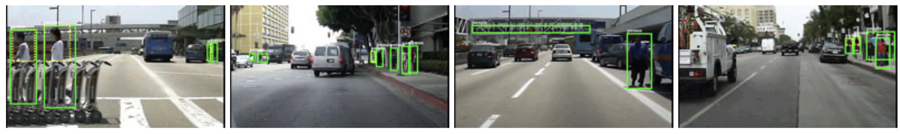
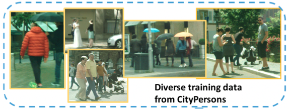
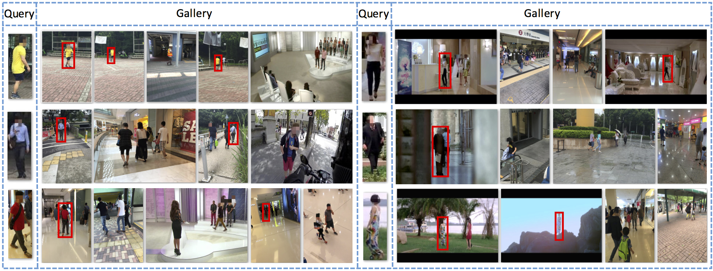
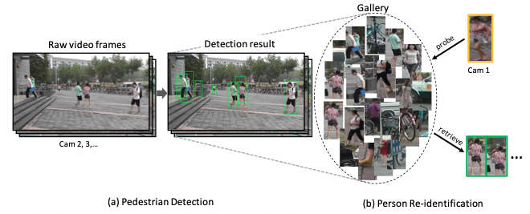
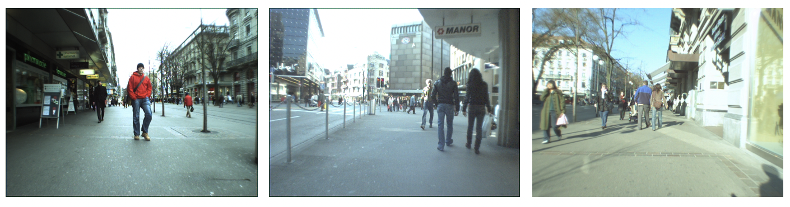
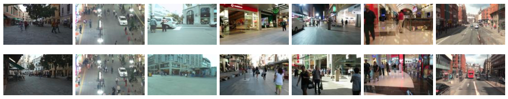

# 数据集介绍

**Caltech Pedestrian**

Caltech Pedestrain 数据集由加州理工提供、由固定在在城市环境中常规行驶的车辆上的摄像头采集得到。数据集包含约10小时的 640x480 30Hz 视频，其中标注了约250,000帧（约137分钟的片段）中的350,000个边界框和2300个行人。更多信息可参考：[Caltech Pedestrain Detection Benchmark](http://www.vision.caltech.edu/Image_Datasets/CaltechPedestrians/) 

**CityPersons**

CityPersons 数据集是基于CityScapes数据集在行人检测领域专门建立的数据集，它选取了CityScapes 中5000张精标图片，并对其中的行人进行边界框标注。其中训练集包含2975张图片，验证集包含500张，测试集包含1575张。图片中行人的平均数量为7人，标注提供全身标注和可视区域标注。更多信息可参考：[CityPersons](https://github.com/cvgroup-njust/CityPersons)

**CUHK-SYSU**

CUHK-SYSU 是一个大规模的人员搜索基准数据集，包含18184张图像和8432个行人，以及99,809个标注好的边界框。根据图像来源，数据集可分为在街道场景下采集和影视剧中采集两部分。在街道场景下，图像通过手持摄像机采集，包含数百个场景，并尝试尽可能的包含不同的视角、光线、分辨率、遮挡和背景等。另一部分数据集采集自影视剧，因为它们可以提供更加多样化的场景和更具挑战性的视角。

该数据集为行人检测和人员重识别提供注释。每个查询人会出现在至少两个图像中，并且每个图像可包含多个查询人和更多的其他人员。数据集被划分为训练集和测试集。训练集包含11206张图片和5532个查询人，测试集包含6978张图片和2900个查询人。更多信息可参考：[End-to-End Deep Learning for Person Search](http://www.ee.cuhk.edu.hk/~xgwang/PS/dataset.html)

**PRW**

PRW (Person Re-identification in the Wild) 是一个人员重识别数据集。该数据集采集于清华大学，通过六个摄像机，采集共10小时的视频。数据集被分为训练、验证和测试集。训练集包含5134帧和482个ID，验证集共570帧和482个ID，测试集则包含6112帧和450个ID。每帧中出现的所有行人都会被标注边界框，同时分配一个ID。更多信息可参考：[PRW](https://github.com/liangzheng06/PRW-baseline)

**ETHZ**

ETHZ 数据集由一对车载的AVT Marlins F033C摄像头拍摄采集，分辨率为 640x480，帧率为13-14 fps。数据集给出原始图像、标定信息和行人标注信息。更多信息可参考：[ETHZ](https://data.vision.ee.ethz.ch/cvl/aess/dataset/)

**MOT16**

MOT16数据集是在2016年提出的用于衡量多目标跟踪检测和跟踪方法标准的数据集，专门用于行人跟踪。其主要标注目标为移动或静止的行人与行进中的车辆。MOT16基于MOT15添加了更细化的标注和更多的边界框，它拥有更加丰富的画面、不同拍摄视角及不同的天气情况。MOT16数据集共有14个视频，其中7个为带有标注的训练集，7个为测试集。它因为提供了标注好的检测结果，因此可以免去目标检测部分，更加关注在目标跟踪部分。更多信息可参考：[MOT16](https://motchallenge.net/data/MOT16/)

**MOT17**

MOT17与MOT16数据集相同，但标注更为准确。更多信息可参考：[MOT17](https://motchallenge.net/data/MOT17/)

## 

