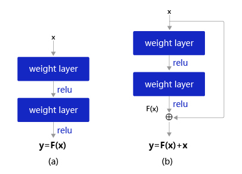
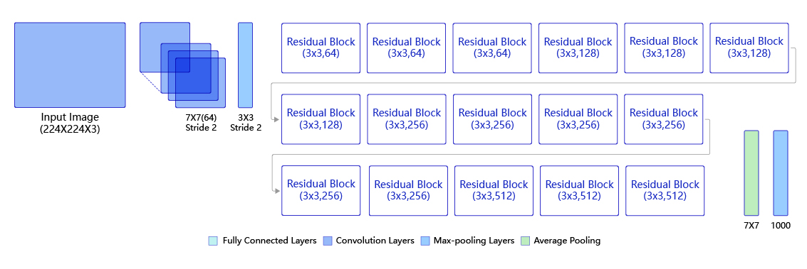

# ResNet50模型介绍
ResNet模型源于以下观察：

对神经网络模型添加新的层，充分训练后的模型是否只可能更有效地降低训练误差？理论上，原模型解的空间只是新模型解的空间的子空间。也就是说，如果我们能将新添加的层训练成恒等映射**f(x)=x**，新模型和原模型将同样有效。由于新模型可能得出更优的解来拟合训练数据集，因此添加层似乎更容易降低训练误差。然而在实践中，添加过多的层后训练误差往往不降反升。即使利用批量归一化带来的数值稳定性使训练深层模型更加容易，该问题仍然存在。

针对上述问题，何恺明等人提出了**残差网络（ResNet）**。它在2015年的ImageNet图像识别挑战赛夺魁，并深刻影响了后来的深度神经网络的设计。

我们聚焦于神经网络局部。设输入为**x**。假设我们希望学出的理想映射为f(x)。图a需要直接拟合出该映射**f(x)**，而图b需要拟合出有关恒等映射的残差映射**f(x)−x**。残差映射在实际中往往更容易优化。以恒等映射作为我们希望学出的理想映射f(x),只需将图b加权运算的权重和偏差参数学成0，那么**f(x)** 即为恒等映射。实际中，当理想映射 **f(x)** 极接近于恒等映射时，残差映射也易于捕捉恒等映射的细微波动。图b也是ResNet的基础块，即**残差块（Residual Block）** 或 **瓶颈结构（BottleNeck）**。在残差块中，输入可通过跨层的数据线路更快地向前传播。

    
 

ResNet沿用了VGG全3×3卷积层的设计。残差块里首先有2个有相同输出通道数的3×3卷积层。每个卷积层后接一个批量归一化层和ReLU激活函数。然后我们将输入跳过这两个卷积运算后直接加在最后的ReLU激活函数前。这样的设计要求两个卷积层的输出与输入形状一样，从而可以相加。如果想改变通道数，就需要引入一个额外的1×1卷积层来将输入变换成需要的形状后再做相加运算。

    
 

ResNet家族有ResNet18, ResNet34, ResNet50, ResNet101, ResNet152等，都由残差块这一基本结构堆叠而成。

ResNet50的结构如下，因其一共包含49层卷积和1层全连接，所以被称为ResNet50。

    
 

实验对ResNet模型进行微调以应用于眼疾识别任务，经过残差网络的卷积和全局池化后，卷积特征的维度是[Batch_size,2048,1,1]，故最后一层全连接的输入维度是2048，输出维度为分类数目2。
