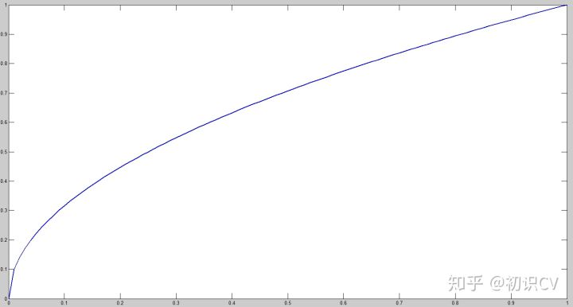

## YOLO模型对比

### YOLO v1

#### 实现方法

- 将一幅图像分成SxS个网格(grid cell)，如果某个object的中心 落在这个网格中，则这个网格就负责预测这个object。
  

- 每个网络需要预测B个BBox的位置信息和confidence（置信度）信息，一个BBox对应着四个位置信息和一个confidence信息。confidence代表了所预测的box中含有object的置信度和这个box预测的有多准两重信息：
  其中如果有object落在一个grid cell里，第一项取1，否则取0。 第二项是预测的bounding box和实际的groundtruth之间的IoU值。

  

- 每个bounding box要预测(x, y, w, h)和confidence共5个值，每个网格还要预测一个类别信息，记为C类。则SxS个网格，每个网格要预测B个bounding box还要预测C个categories。输出就是S x S x (5*B+C)的一个tensor。（注意：class信息是针对每个网格的，confidence信息是针对每个bounding box的。）

- 举例说明: 在PASCAL VOC中，图像输入为448x448，取S=7，B=2，一共有20个类别(C=20)。则输出就是7x7x30的一个tensor。整个网络结构如下图所示：
  

- 在test的时候，每个网格预测的class信息和bounding box预测的confidence信息相乘，就得到每个bounding box的class-specific confidence score:
  
  等式左边第一项就是每个网格预测的类别信息，第二三项就是每个bounding box预测的confidence。这个乘积即encode了预测的box属于某一类的概率，也有该box准确度的信息。

- 得到每个box的class-specific confidence score以后，设置阈值，滤掉得分低的boxes，对保留的boxes进行NMS处理，就得到最终的检测结果。

简单的概括就是：

(1) 给个一个输入图像，首先将图像划分成7*7的网格

(2) 对于每个网格，我们都预测2个边框（包括每个边框是目标的置信度以及每个边框区域在多个类别上的概率）

(3) 根据上一步可以预测出7*7*2个目标窗口，然后根据阈值去除可能性比较低的目标窗口，最后NMS去除冗余窗口即可

#### 损失函数

在实现中，最主要的就是怎么设计损失函数，让这个三个方面得到很好的平衡。作者简单粗暴的全部采用了sum-squared error loss来做这件事。

这种做法存在以下几个问题：

- 第一，8维的localization error和20维的classification error同等重要显然是不合理的；
- 第二，如果一个网格中没有object（一幅图中这种网格很多），那么就会将这些网格中的box的confidence push到0，相比于较少的有object的网格，这种做法是overpowering的，这会导致网络不稳定甚至发散。

解决办法：

- 更重视8维的坐标预测，给这些损失前面赋予更大的loss weight。
- 对没有object的box的confidence loss，赋予小的loss weight。
- 有object的box的confidence loss和类别的loss的loss weight正常取1。

对不同大小的box预测中，相比于大box预测偏一点，小box预测偏一点肯定更不能被忍受的。而sum-square error loss中对同样的偏移loss是一样。

为了缓和这个问题，作者用了一个比较取巧的办法，就是将box的width和height取平方根代替原本的height和width。这个参考下面的图很容易理解，小box的横轴值较小，发生偏移时，反应到y轴上相比大box要大。（也是个近似逼近方式）

一个网格预测多个box，希望的是每个box predictor专门负责预测某个object。具体做法就是看当前预测的box与ground truth box中哪个IoU大，就负责哪个。这种做法称作box predictor的specialization。

最后整个的损失函数如下所示：

这个损失函数中：

- 只有当某个网格中有object的时候才对classification error进行惩罚。
- 只有当某个box predictor对某个ground truth box负责的时候，才会对box的coordinate error进行惩罚，而对哪个ground truth box负责就看其预测值和ground truth box的IoU是不是在那个cell的所有box中最大。

其他细节，例如使用激活函数使用leak RELU，模型用ImageNet预训练等等

#### 优点

- 快速，pipline简单.
- 背景误检率低。
- 通用性强。YOLO对于艺术类作品中的物体检测同样适用。它对非自然图像物体的检测率远远高于DPM和RCNN系列检测方法。

#### 缺点

- 由于输出层为全连接层，因此在检测时，YOLO训练模型只支持与训练图像相同的输入分辨率。
- 虽然每个格子可以预测B个bounding box，但是最终只选择只选择IOU最高的bounding box作为物体检测输出，即每个格子最多只预测出一个物体。当物体占画面比例较小，如图像中包含畜群或鸟群时，每个格子包含多个物体，但却只能检测出其中一个。这是YOLO方法的一个缺陷。
- YOLO loss函数中，大物体IOU误差和小物体IOU误差对网络训练中loss贡献值接近（虽然采用求平方根方式，但没有根本解决问题）。因此，对于小物体，小的IOU误差也会对网络优化过程造成很大的影响，从而降低了物体检测的定位准确性。

### YOLO v2

YOLOv2相对v1版本，在继续保持处理速度的基础上，从预测更准确（Better），速度更快（Faster），识别对象更多（Stronger）这三个方面进行了改进。其中识别更多对象也就是扩展到能够检测9000种不同对象，称之为YOLO9000。

#### 联合训练算法

文章提出了一种新的训练方法–联合训练算法，这种算法可以把这两种的数据集混合到一起。使用一种分层的观点对物体进行分类，用巨量的分类数据集数据来扩充检测数据集，从而把两种不同的数据集混合起来。

联合训练算法的基本思路就是：同时在检测数据集和分类数据集上训练物体检测器（Object Detectors ），用检测数据集的数据学习物体的准确位置，用分类数据集的数据来增加分类的类别量、提升健壮性。

YOLO9000就是使用联合训练算法训练出来的，他拥有9000类的分类信息，这些分类信息学习自ImageNet分类数据集，而物体位置检测则学习自COCO检测数据集。

#### 引入anchor box

相比较于一代yolo，一代yolo直接回归坐标，难度很大，引入anchor box，有了基准坐标，相对来说，预测难度降低；
但注意与faster R_CNN的区别，因为faster R_CNN是在feature map上，拿着anchor box进行滑动窗口的，实际就相当于一个框一个框的进行分类和回归，所以自然很容易检测到所有目标，但是yolo的类别和坐标都由回归产生，难度比faster-R-CNN要大：
（1）先验框的设置很重要。所以利用k-means来聚类，得到先验框的数量和大小（k=5），这样先验框更可靠
（2）直接预测相对于anchor box的偏移量，导致模型不稳定。所以不再预测偏移，而是预测相对于网格左上角的坐标
（3）如下，tx，ty，tw，th为网络预测值，所以在测试时，需要进一步计算获得预测边框，将相对于网格左上角坐标（tx，ty）转化为相对于图片左上角的坐标，宽度和高度需要依据anchor box的尺寸pw和ph来计算求得，具体公式如下，计算得到bx，by，bw，bh之后，在对他们进行过NMS。

（3）引入anchor box之后，每一个anchor box都需要进行单独的类别预测（一代中每个cell只预测一个类别），例如数据集类别为80类，那么每个anchor box需要预测一个85维的向量，如果每个cell有5个anchor box，网格为19×19，网络预测输出为：
19×19×5×85.。。

### YOLOv3

YOLO v3的模型比之前的模型复杂了不少，可以通过改变模型结构的大小来权衡速度与精度。

速度对比如下：

简而言之，YOLOv3 的先验检测（Prior detection）系统将分类器或定位器重新用于执行检测任务。他们将模型应用于图像的多个位置和尺度。而那些评分较高的区域就可以视为检测结果。此外，相对于其它目标检测方法，我们使用了完全不同的方法。我们将一个单神经网络应用于整张图像，该网络将图像划分为不同的区域，因而预测每一块区域的边界框和概率，这些边界框会通过预测的概率加权。我们的模型相比于基于分类器的系统有一些优势。它在测试时会查看整个图像，所以它的预测利用了图像中的全局信息。与需要数千张单一目标图像的 R-CNN 不同，它通过单一网络评估进行预测。这令 YOLOv3 非常快，一般它比 R-CNN 快 1000 倍、比 Fast R-CNN 快 100 倍。

#### 改进之处

- 多尺度预测 （引入FPN）。
- 更好的基础分类网络（darknet-53, 类似于ResNet引入残差结构）。
- 分类器不在使用Softmax，分类损失采用binary cross-entropy loss（二分类交叉损失熵）

YOLOv3不使用Softmax对每个框进行分类，主要考虑因素有两个：

1. Softmax使得每个框分配一个类别（score最大的一个），而对于`Open Images`这种数据集，目标可能有重叠的类别标签，因此Softmax不适用于多标签分类。
2. Softmax可被独立的多个logistic分类器替代，且准确率不会下降。

分类损失采用binary cross-entropy loss。

#### 多尺度预测

每种尺度预测3个box, anchor的设计方式仍然使用聚类,得到9个聚类中心,将其按照大小均分给3个尺度.

- 尺度1: 在基础网络之后添加一些卷积层再输出box信息.
- 尺度2: 从尺度1中的倒数第二层的卷积层上采样(x2)再与最后一个16x16大小的特征图相加,再次通过多个卷积后输出box信息.相比尺度1变大两倍.
- 尺度3: 与尺度2类似,使用了32x32大小的特征图.

参见网络结构定义文件[yolov3.cfg](https://link.zhihu.com/?target=https%3A//github.com/pjreddie/darknet/blob/master/cfg/yolov3.cfg)

基础网络 Darknet-53

##### darknet-53

仿ResNet, 与ResNet-101或ResNet-152准确率接近,但速度更快.对比如下:

##### 主干架构的性能对比

检测结构如下

YOLOv3在mAP@0.5及小目标APs上具有不错的结果,但随着IOU的增大,性能下降,说明YOLOv3不能很好地与ground truth切合.

#### 边框预测

图 2：带有维度先验和定位预测的边界框。我们边界框的宽和高以作为离聚类中心的位移，并使用 Sigmoid 函数预测边界框相对于滤波器应用位置的中心坐标。

仍采用之前的logis，其中cx,cy是网格的坐标偏移量,pw,ph是预设的anchor box的边长.最终得到的边框坐标值是b*,而网络学习目标是t*，用sigmod函数、指数转换。

### YOLOv4

YOLOv4 在COCO上，可达43.5％ AP，速度高达 65 FPS！

1. 提出了一种高效而强大的目标检测模型。它使每个人都可以使用1080 Ti或2080 Ti GPU 训练超快速和准确的目标检测器（牛逼！）。

2. 在检测器训练期间，验证了SOTA的Bag-of Freebies 和Bag-of-Specials方法的影响。

3. 改进了SOTA的方法，使它们更有效，更适合单GPU训练，包括CBN [89]，PAN [49]，SAM [85]等。文章将目前主流的目标检测器框架进行拆分：input、backbone、neck 和 head.

具体如下图所示：

- 对于GPU，作者在卷积层中使用：CSPResNeXt50 / CSPDarknet53
- 对于VPU，作者使用分组卷积，但避免使用（SE）块-具体来说，它包括以下模型：EfficientNet-lite / MixNet / GhostNet / MobileNetV3

作者的目标是在输入网络分辨率，卷积层数，参数数量和层输出（filters）的数量之间找到最佳平衡。

总结一下YOLOv4框架：

- Backbone：CSPDarknet53
- Neck：SPP，PAN
- Head：YOLOv3

YOLOv4 = CSPDarknet53+SPP+PAN+YOLOv3

其中YOLOv4用到相当多的技巧：

- 用于backbone的BoF：CutMix和Mosaic数据增强，DropBlock正则化，Class label smoothing
- 用于backbone的BoS：Mish激活函数，CSP，MiWRC
- 用于检测器的BoF：CIoU-loss，CmBN，DropBlock正则化，Mosaic数据增强，Self-Adversarial 训练，消除网格敏感性，对单个ground-truth使用多个anchor，Cosine annealing scheduler，最佳超参数，Random training shapes
- 用于检测器的Bos：Mish激活函数，SPP，SAM，PAN，DIoU-NMS

看看YOLOv4部分组件：

感受一下YOLOv4实验的充分性（调参的艺术）:

感受一下性能炸裂的YOLOv4实验结果:

### YOLOv5

#### 网络结构

#### 算法性能测试

Yolov5s网络最小，速度最少，AP精度也最低。但如果检测的以大目标为主，追求速度，倒也是个不错的选择。

其他的三种网络，在此基础上，不断加深加宽网络，AP精度也不断提升，但速度的消耗也在不断增加。

目前使用下来，yolov5s的模型十几M大小，速度很快，线上生产效果可观，嵌入式设备可以使用。