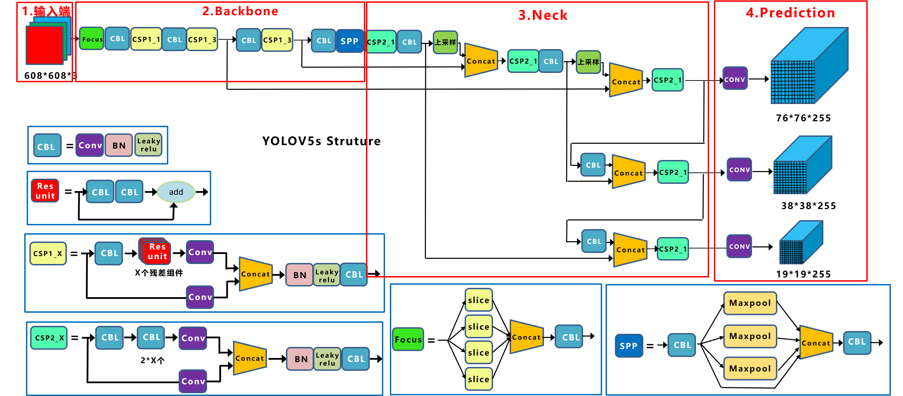
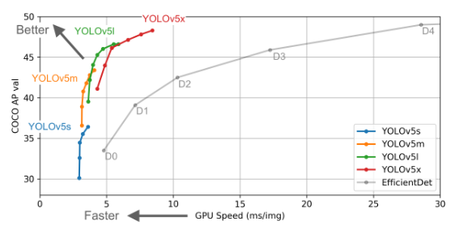
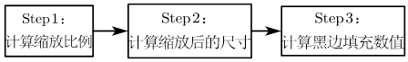
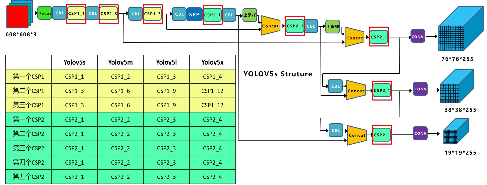

### 1.网络模型

​		Yolo，是单词组“You only look once”的首字母缩写，是一种将图像划分为网格系统，网格内的每个单元格负责检测自身内部对象的检测算法。 由于其速度与准确性，Yolo是最著名的物体检测算法之一。

​		在Yolov5的官方代码中，给出的目标检测网络中一共有4个版本，分别为：Yolov5s、Yolov5m、Yolov5l、Yolov5x。整体的网络结构图如下，分为输入端、Backbone、Neck、Prediction四个部分：



​		由上图知，输入端包括Mosaic数据增强、自适应锚框计算、自适应图片缩放等操作；Backbone指在不同图像细粒度上聚合并形成图像特征的卷积神经网络，包括Focus结构，CSP结构；Neck指一系列混合和组合图像特征的网络层，并将图像特征传递到预测层，包括FPN+PAN结构；Prediction指对图像特征进行预测，生成边界框和预测类别。

​		Yolov5s网络是Yolov5系列中深度最小，特征图的宽度最小的网络。后面的3种都是在此基础上不断加深，不断加宽。Yolov5s网络最小，速度最少，AP精度也最低；其他的三种网络，在此基础上，不断加深加宽网络，AP精度也不断提升，但速度的消耗也在不断增加。原作者的算法性能测试图如下：



​		由上图知，与EfficientDet0相比，YOLOv5s不仅可以获得更高的AP指标，而且可以获得更快的推理速度；与EfficientDet4相比，YOLOv5x不仅能够获得更高的AP指标，其推理速度是它的1/5左右。

### 2.各模块详细介绍

#### 2.1 输入端

​		Yolov5的输入端采用了和Yolov4一样的Mosaic数据增强的方式。其中，随机缩放、随机裁剪、随机排布的方式进行拼接，对于小目标的检测效果相对不错。

​		在Yolo算法中，针对不同的数据集，都会有初始设定长宽的锚框。在网络训练中，网络在初始锚框的基础上输出预测框，进而和真实框进行比对，计算两者差距，再反向更新，迭代网络参数。

​		在Yolov3、Yolov4中，训练不同的数据集时，计算初始锚框的值是通过单独的程序运行的。但Yolov5中将此功能嵌入到代码中，每次训练时，自适应的计算不同训练集中的最佳锚框值；如果觉得计算的锚框效果不是很好，也可以在代码中将自动计算锚框功能关闭。

```
parser.add arqument('--noautoanchor',action='store true',help='disable autoanchor check')
```

​		此外，在常用的目标检测算法中，不同的图片长宽都不相同。因此，常用的方式是将原始图片统一缩放到一个标准尺寸，再送入检测网络中。Yolov5中对此进行了改进，对原始图像自适应的添加最少的黑边，这也是Yolov5的推理速度能够很快提升的一个原因。步骤如下：



#### 2.2 Backbone&Neck

​		关于Focus结构，在Yolov3和Yolov4中并没有Focus结构这个结构，其中比较关键是切片操作。以Yolov5s的结构为例，原始608×608×3的图像输入Focus结构，采用切片操作，先变成304×304×12的特征图，再经过一次32个卷积核的卷积操作，最终变成304×304×32的特征图；注意的是：Yolov5s的Focus结构最后使用了32个卷积核，而其他三种结构使用的数量有所增加。

​		关于CSP结构，Yolov4中只有主干网络使用了CSP结构；而Yolov5中设计了两种CSP结构，以Yolov5s网络为例，CSP1_X结构应用于Backbone主干网络，另一种CSP2_X结构则应用于Neck中。

​		关于Neck，目前Yolov5的Neck和Yolov4中一样，都采用FPN+PAN的结构。不同之处在于，Yolov4的Neck结构中采用的都是普通的卷积操作。而Yolov5的Neck结构中，采用借鉴CSPnet设计的CSP2结构，加强网络特征融合的能力。

#### 2.3 输出端

​		Yolov5中采用GIOU_Loss做Bounding box的损失函数。
$$
G I o U=I o U-\frac{\left|A_{c}-U\right|}{\left|A_{c}\right|}
$$
​		上面公式表示：先计算两个框的最小闭包区域面积，即同时包含预测框和真实框的最小框的面积，再计算出IoU，然后计算闭包区域中不属于两个框的区域占闭包区域的比重，最后用IoU减去这个比重，得到GIoU。此外，在目标检测的后处理过程中，很多目标框的筛选通常需要nms操作。因为CIOU_Loss中包含影响因子v，涉及groudtruth的信息，而测试推理时，是没有groundtruth的。所以Yolov4在DIOU_Loss的基础上采用DIOU_nms的方式，而Yolov5中采用加权nms的方式。

### 3.四种网络结构

#### 3.1 深度

​		关于深度，控制四种网络结构的核心代码是yolo.py中的代码，存在两个变量：n和gd。

```
n = max(round(n * gd), 1) if n > 1 else n # depth gain
```

​		四种网络结构中每个CSP结构的深度都不同。以Yolov5s为例，第一个CSP1中使用了1个残差组件，因此是CSP1_1；而在Yolov5m中，则增加了网络的深度，在第一个CSP1中，使用了2个残差组件，因此是CSP1_2；在Yolov5l中同样的位置，则使用了3个残差组件；在Yolov5x中，使用了4个残差组件。其余第二个CSP1和第三个CSP1也是同样的原理。Yolov5中，网络的不断加深，也在不断增加网络特征提取和特征融合的能力。



#### 3.2 宽度

​		关于宽度，控制宽度的核心代码是yolo.py文件里面的这一行：

```
c2 = make_divisible(c2 * gw, 8) if c2 != no else c2
```

​		四种Yolov5结构在不同阶段的卷积核的数量都是不一样的，因此也直接影响卷积后特征图的第三维度，即厚度。以Yolov5s结构为例，第一个Focus结构中，最后卷积操作时，卷积核的数量是32个，因此经过Focus结构，特征图的大小变成304×304×32；而Yolov5m的Focus结构中的卷积操作使用了48个卷积核，因此Focus结构后的特征图变成304×304×48。Yolov5l，Yolov5x也是同样的原理。卷积核的数量越多，特征图的厚度，即宽度越宽，网络提取特征的学习能力也越强。

### 4.总结

​		yolov5是一种单阶段目标检测模型，其在yolov4的基础上进行改进，一方面权重文件非常小，另一方面，其处理速度与精度都得到了极大的性能提升，具体包括：输入端的Mosaic数据增强、自适应锚框计算、自适应图片缩放操作；基准端的Focus结构与CSP结构；Neck端的SPP与FPN+PAN结构；输出端的损失函数GIOU_Loss以及预测框筛选的DIOU_nms等等。此外，Yolov5中的各种改进思路也可以应用到其它的目标检测算法中，根据不同的项目需求，取长补短，发挥不同网络的优势。

### 5.参考

[深入浅出Yolo系列之Yolov5核心基础知识完整讲解]: https://zhuanlan.zhihu.com/p/172121380
[YOLOv5算法详解]: https://blog.csdn.net/WZZ18191171661/article/details/113789486


