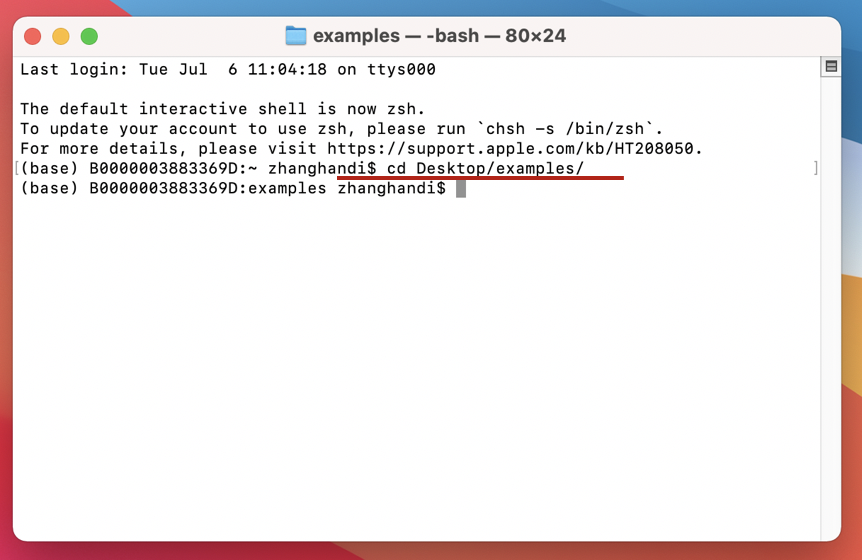
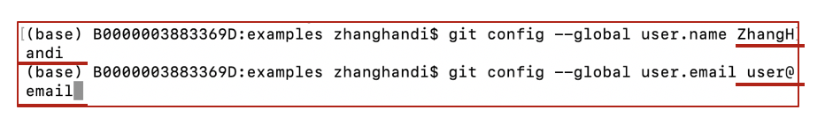
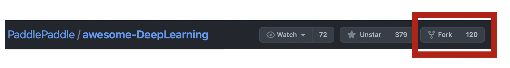
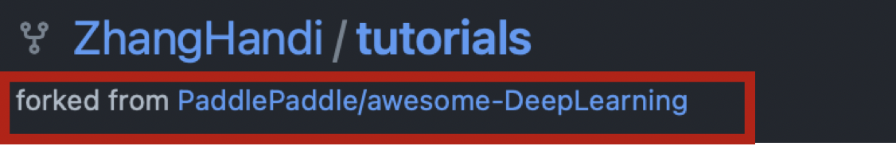
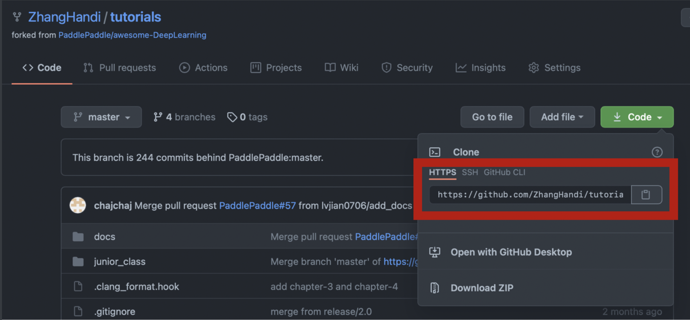
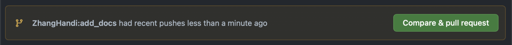
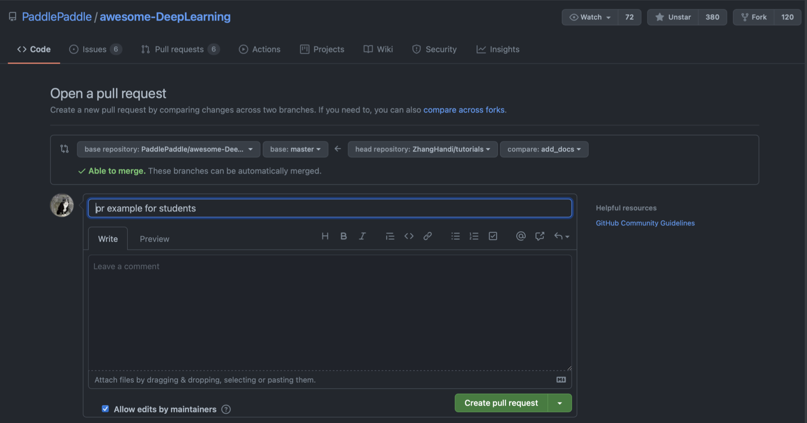
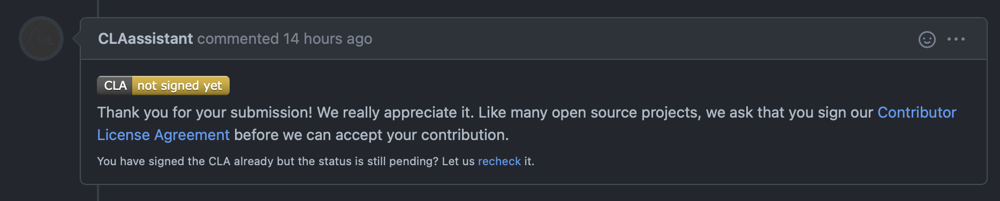
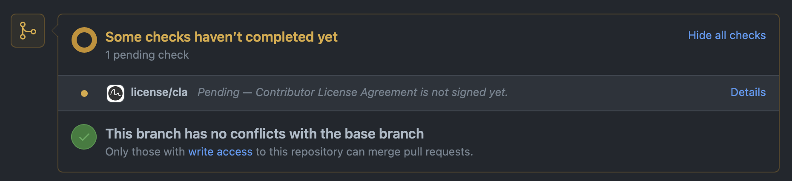
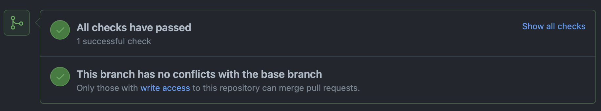

# awesome-DeepLearning pull request 教程

1. 打开【终端】，进入想要存放repo文件的目录下

   比如这里想存放在 Desktop/examples/目录下

   

2. 配置git

   配置用户名：git config --global user.name username

   配置邮箱：git config --global user.email user@email

   **username 和 user@email 需要替换成自己github账号的用户名和邮箱**

   

3. 将awesome-DeepLearning fork到自己的github仓库中

   

   

   大家fork出来得到的目录应该是username/awesome-DeepLearning，这里显示/tutorials是一个名称更换问题，不用在意。

4. 在本地克隆 fork 项目

   > git clone https://github.com/ZhangHandi/tutorials.git

   **后面这个地址需要用自己github仓库下awesome-DeepLearning的地址进行替换**

   

5. cd 到克隆的项目

   > cd awesome-DeepLearning/

6. 添加上游地址

   > git remote add upstream https://github.com/PaddlePaddle/awesome-DeepLearning.git

   **这个地址不用更换**

7. 获取上游代码

   > git fetch upstream

8. 切换到上游的 upstream/master 分支

   > git checkout upstream/master

9. 在上游分支 upstream/master 的基础上新建 my_branch 分支

   > git checkout -b my_branch

   **my_branch这个分支命名可以替换**

10. 修改要修改的部分，比如将文件放到awesome-DeepLearning中的examples文件夹下，进行作业提交

11. 添加修改的文件，对修改的文件进行代码规范，pre-commit 会自动调整代码格式，执行一次即可，后续commit不用再执行

    > git add .
    >
    > pip install pre-commit
    >
    > pre-commit install

12. 提交修改

    > git commit -m ' '

    **' ' 中可以添加针对修改的评论，突出实现的功能要点。pre-commit 对代码进行修改后，需要再次执行git add . 和 git commit 步骤**

13. push 到远程分支

    > git push origin my_branch

14. 最后在自己的github上的pull request模块提交pr

    push 后打开自己github仓库下的awesome-DeepLearning，会看到 **compare & pull request** 的按钮，点击，跳转到下面的页面，点击 **create pull request** 提交pr。

    

    

15. 提交pr后，点击签署CLA协议，未签署协议会显示“Some checks haven't completed yet”，确认“all checks have passed”，及为成功提交pr。

    

    

    
