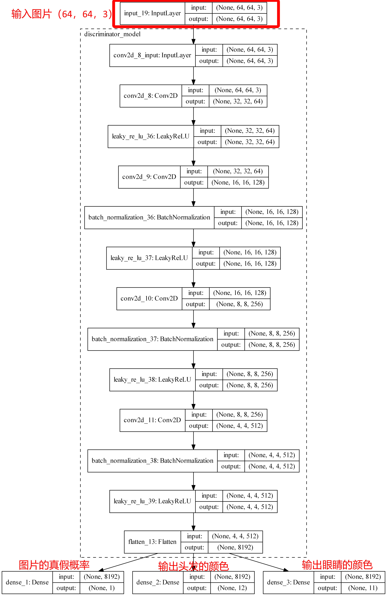

## 1、原理概述

### 1.1、GAN网络概要

GAN网络全称**generative adversarial network**，翻译为生成式对抗网络，是一种机器学习方法。在GAN网络中，有两个模型——生成模型（ generative model G）和判别模型（discriminative model D）。

我们以生成图片为例子：

- G就是一个生成图片的网络，它接受一个随机的噪声z，然后通过这个噪声生成图片，生成的数据记做G(z)。
- D是一个判别网络，判别一张图片是不是“真实的”（是否是捏造的）。它的输入参数是x，x代表一张图片，输出D(x)代表x为真实图片的概率，如果为1，就代表绝逼是真实的图片，而输出为0，就代表不可能是真实的图片。

在训练的过程中，**生成网络G**的目标就是生成假的图片去骗过**判别网络D**，而**判别网络D**的目标就是能够分辨出某一张图片是不是由G生成的。这就变成了一个博弈的过程。同时G和D的能力也在训练的过程中逐渐提高。在最理想的情况下， 则就是D(G(z))=0.5D(G(z))=0.5。

一个**生成器**学习创造看起来真实的图像，而**判别器**学习区分真假图像。训练过程中，**生成器**在生成逼真图像方面逐渐变强，而**判别器**在辨别这些图像的能力上逐渐变强。当**判别器**不再能够区分真实图片和伪造图片时，训练过程达到平衡。

因此，在训练的过程中，我们会对判别器和生成器进行学习。

### 1.2、判别器的学习

首先我们初始化生成器 G，然后输入一组随机向量，生成器会根据输入的向量产生一些图片，我们把这些图片标注成 0（假图片）。同时把已有训练集中真实的图片标注成 1（真图片）。两者同时丢进判别器 D 中，以此来训练判别器 D。使得当输入是真图片的时候，判别器给高分（分数接近于1），而输入假图片的时候，判别器给低分（接近于 0 ）。


如果我们有标记为1的真实图片和标注为0的假的图片，我们就可以很轻易的对D进行训练。

### 1.3、生成器的学习

对于生成器，我们的目的是使得其能够生成真实的图片，我们是希望生成的图片能够骗过D。那么如何通过判别器来产生所谓的y？我们可以这样做：

我们通过随机向量（噪声数据）经由生成网络产生一组假图片，我们将这些假图片都标记为 1（也就是说，人为的把假的图片当作真实的），然后将这些假图片输入到判别器中，判别器在对这些图片进行判别的时候，会发现这些图片是假的图片，然后给出低分，这样就产生了误差（因为标记的为1，但是判别器给了低分）。

因此，在训练生成器的时候，这个网络是串接的。而在训练生成器的时候，一个很重要的操作就是保持判别器网络的参数不发生改变，只是把误差一直方向传播，传到生成网络那块后更新生成网络的参数，这样就完成了生成网络的训练了。


在完成生成器的训练之后，我们又可以产生新的假的图片去对判别器进行训练。我们把这个过程称作为**单独交替训练**。同时要定义一个迭代次数，交替迭代到一定次数后停止即可。

### 1.4、算法流程

算法流程图如下所示


### 1.5、CGAN网络变化

相比较于普通的GAN网络，CGAN在网络结构上发生了一些改变，与GAN网络相比，在`Input layer`添加了一个Y的标签，其代表图片的属性标签——在动漫头像数据集中，标签可以表示为头发的颜色，或者眼睛的颜色，当然为其他的属性特征也是可以的。

在G网络中，Generator可以根据给的z 和 y 生成相对应的图片，而D网络可以根据给的x（比如说图片）和 Y 进行评判。下图便是一个CGAN网络的简单示意图。


## 2、代码实现

### 2.1、数据集准备及加载

首先，我们需要数据集，里面既需要包括动漫头像的图片，也需要有每一张图片所对应的标签数据。这里我们使用实训要求中提供的[图片数据集和标签数据集](https://aistudio.baidu.com/aistudio/datasetdetail/82357)。

在tags.csvs 中，数据形式如下图所示，每一行代表的是相对应图片的标签数据。第一个数据为**ID**，同时也是图片的**文件名字**，后面的数据即为图片的**特征数据**。


以上便将这次所需要的数据集介绍完了，下面将简单的介绍一下数据集的加载。

首先我们先进行加载数据集，一共需要加载两个数据集，一个是图片数据集合，一个是标签数据集合。在标签数据集中，我们需要的是`眼睛的颜色`和`头发的颜色`。加载数据集，我们提取出csv中的hair和eye的颜色并得到相对应的id，然后将其保存到numpy数组中。

接下来我们就是根据id数据去读取出相对应的图片了，其中，所有的图片均为RGB图片，并且图片的保存位置为`/faces`

最后将图片进行归一化处理：

```python
images_data = (images_data / 127.5) - 1
```

我们还需要将必须的库导入：

```python
from keras.layers import Input, Dense, Reshape, Flatten, Dropout, multiply, Activation
from keras.layers import BatchNormalization, Activation, Embedding, ZeroPadding2D
from keras.layers import Conv2D, Conv2DTranspose, Dropout, UpSampling2D, MaxPooling2D,Concatenate
from keras.layers.advanced_activations import LeakyReLU
from keras.models import Sequential, Model, load_model
from keras.optimizers import SGD, Adam, RMSprop
from keras.utils import to_categorical,plot_model
import matplotlib.pyplot as plt
import matplotlib.gridspec as gridspec
```

### 2.2、构建Generator

关于G网络的模型图如下所示，而代码便是按照如下的模型图来构建网络模型：

- Input：头发的颜色，眼睛的颜色，100维的高斯噪声。
- Output：RGB图片。


构建模型图的代码具体见`build_generator_model`方法：

### 2.3、构建Discriminator

这里我们的discriminator的网络结构上文中的cgan网络结构稍有不同。在前文中，我们是在Discriminator的输入端的输入是**图片**和**标签**，而在这里，我们的Discriminator的输入仅仅是图片，输出才是label 和 真假概率。


网络结构如下所示：



然后根据上述的网络结构来构建discriminator，具体代码见`build_discriminator_model(hair_num_class, eye_num_class)`方法。

### 2.4、构建CGAN网络

cgan网络的输入是generator的输入，cgan的输出是discriminator的输出，网络模型图如下所示：


模型图看起来很复杂，但是实际上代码却很简单，针对于GAN网络，我们只需要将GAN网络中的D网络进行冻结（将trainable变成`False`）即可。具体代码见`build_ACGAN`方法。

然后调用方法构建GAN网络即可：

```python
gan = build_ACGAN()
```

然后我们定义一些方法，有：

- 产生噪声：`gen_noise`
- G网络产生图片，并将生成的图片进行保存:`generate_images`
- 从数据集中随机获取动漫头像和标签数据:`sample_from_dataset`

关于这些代码具体的说明，可以看一下注释。

### 2.5、进行训练

然后定义训练方法， 在训练的过程中，我们一般来说会将`1`，`0`进行smooth，让它们在一定的范围内波动。同时我们在训练D网络的过程中，我们会这样做：

1. 真实的图片，真实的标签进行训练 —— 训练判别器对真实图片的判别能力
2. G网络产生的图片，虚假的标签进行训练 —— 训练判别器对fake 图片的判别能力

在训练G网路的时候我们会这样做：

1. 产生噪声，虚假的标签（代码随机生成头发的颜色和眼睛的颜色），然后输入到GAN网络中
2. 而针对于GAN网络的输出，我们将其定义为`[1（认为其为真实图片）],[输入端的标签]`。GAN网络的输出认为是1（实际上是虚假的图片），这样就能够产生一个loss，从而通过反向传播来更新G网络的权值（在这一个步骤中，D网络的权值并不会进行更新。）

一般来说，训练1w轮就可以得到一个比较好的结果了。

```python
train(1000000,64,100,len(HAIRS),len(EYES))
```

### 2.6、结果演示


## 参考资料

[生成对抗网络GAN原理 学习笔记](http://jiaqianlee.com/2018/05/20/GAN/)

[生成对抗网络——原理解释和数学推导](https://alberthg.github.io/2018/05/05/introduction-gan/)

[bilibili——【机器学习】白板推导系列(三十一) ～ 生成对抗网络(GAN)](https://www.bilibili.com/video/BV1eE411g7xc?from=search&seid=16741251905988062798)

[Anime-Face-ACGAN](https://github.com/CryoliteZ/Anime-Face-ACGAN)

[GAN — CGAN & InfoGAN (using labels to improve GAN)](https://medium.com/@jonathan_hui/gan-cgan-infogan-using-labels-to-improve-gan-8ba4de5f9c3d)

