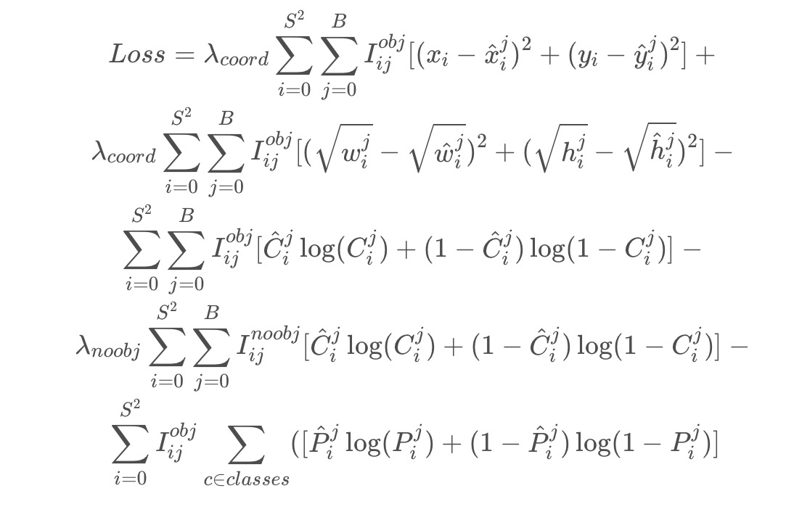
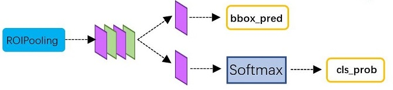
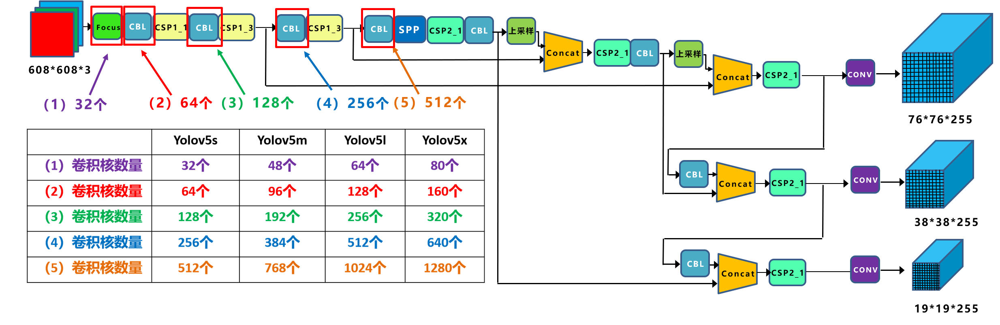
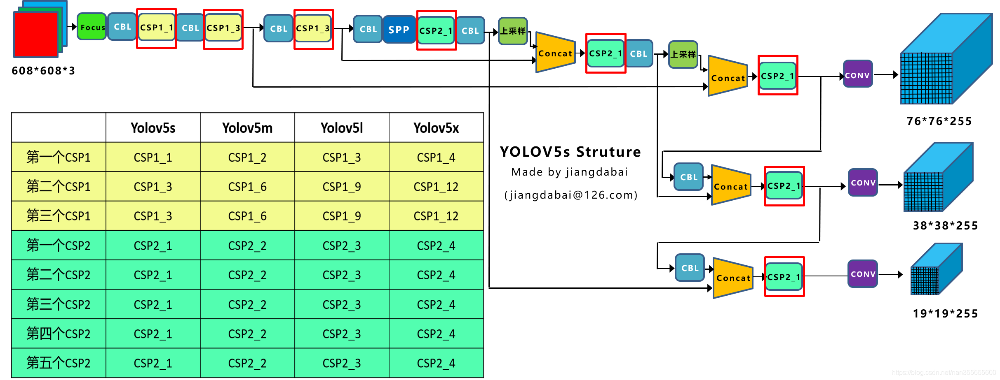
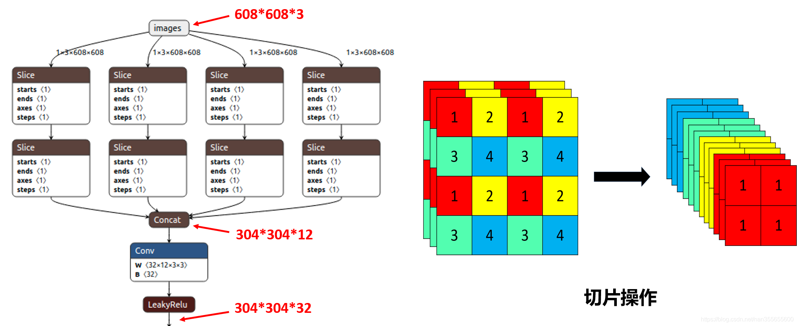
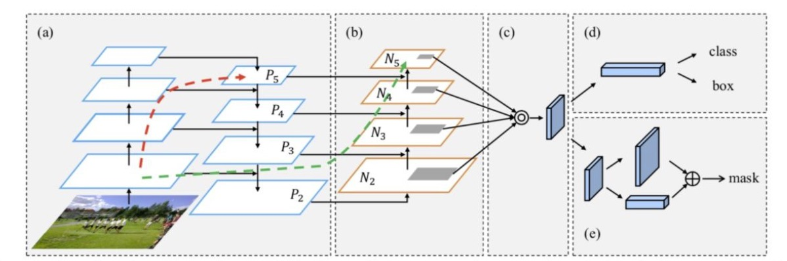
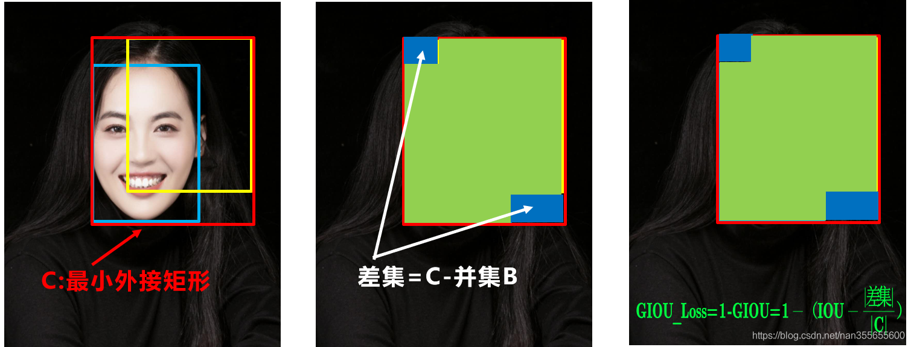

[toc]

## 样本不均衡解决方法
### OHEM(在线困难样本挖掘)
针对训练过程中的困难样本自动选择，其核心思想是**根据输入样本的损失进行筛选，筛选出困难样本（即对分类和检测影响较大的样本）**，然后将筛选得到的这些样本应用在随机梯度下降中训练。

在实际操作中是将原来的一个ROI Network扩充为两个ROI Network，这两个ROI Network共享参数。其中前面一个ROI Network只有前向操作，主要用于计算损失；后面一个ROI Network包括前向和后向操作，以hard example作为输入，计算损失并回传梯度。该算法在目标检测框架中被大量使用，如Fast RCNN。

该算法的优点：
- 对于数据的类别不平衡问题不需要采用设置正负样本比例的方式来解决，这种在线选择方式针对性更强；
- 随着数据集的增大，算法的提升更加明显；

该算法的缺点：
- 只保留loss较高的样本，完全忽略简单的样本，这本质上是改变了训练时的输入分布（仅包含困难样本），这会导致模型在学习的时候失去对简单样本的判别能力。
  
### S-OHEM(基于loss分布采样的在线困难样本挖掘)
S-OHEM根据loss的分布抽样训练样本，它将预设loss的四个分段： 给定一个batch，先生成输入batch中所有图像的候选RoI，再将这些RoI送入到Read only RoI网络得到RoIs的损失，然后将每个RoI根据损失（这里损失是一个组合，具体公式为 ， 随着训练阶段变化而变化；之所以采用这个公式是因为在训练初期阶段，分类损失占主导作用；在训练后期阶段，边框回归损失函数占主导作用）划分到上面四个分段中，然后针对每个分段，通过排序筛选困难样本．再将经过筛选的RoIs送入反向传播，用于更新网络参数。

该算法的优点：
- 相比原生OHEM，S-OHEM考虑了基于不同损失函数的分布来抽样选择困难样本，避免了仅使用高损失的样本来更新模型参数。

该算法的缺点：
- 因为不同阶段，分类损失和定位损失的贡献不同，所以选择损失中的两个参数 需要根据不同训练阶段进行改变，当应用与不同数据集时，参数的选取也是不一样的．即引入了额外的超参数。

### A-Fast-RCNN（基于对抗生成网络的方式来生成困难样本）
A-Fast-RCNN的方法是通过GAN的方式在特征空间产生具有部分遮挡和形变（主要考虑旋转特性）的困难样本，而这部分样本数据很难出现在实际训练数据集中。通过生成的方式来教网络什么是“遮挡”和“变形”，区别于传统的直接生成样本图片的方法，这些变换都是基于特征图的：
1. 通过添加遮挡mask来实现特征的部分遮挡；
2. 通过操作特征响应图来实现特征的部分变形。设计两个对抗网络 ASDN 和 ASTN，分别对应于样本的遮挡和样本的变形，并将这两种变形相融合(ASDN的输出作为ASTN的输入)，使得检测器在训练的时候可以更加鲁棒。

该算法的优点：
- 与OHEM相比，区别在于文本的方法是构建不存在的Hard Poistive样本，而OHEM是挖掘现有样本中的Hard样本。

该算法的缺点：
- 从改善效果上来讲，A-Fast-RCNN的方法的效果并不比 OHEM 好太多，也许是仿造的数据和真实性还存在差距，此外GAN网络也比较难训练。

***

## YOLOv1～YOLOv5
### YOLOv1 开山之作
YOLO 的核心思想是把目标检测转变成一个回归问题，利用整张图作为网络的输入，仅仅经过一个神经网络，得到bounding box（边界框） 的位置及其所属的类别。

#### 网络结构

YOLOv1是一种传统的one-stage的卷积神经网络：
- 网络输入：448×448×3的彩色图片。
- 中间层：由若干卷积层和最大池化层组成，用于提取图片的抽象特征。
- 全连接层：由两个全连接层组成，用来预测目标的位置和类别概率值。
- 网络输出：7×7×30的预测结果。

### YOLOv2 更快更准
2017年，作者 Joseph Redmon 和 Ali Farhadi 在 YOLOv1 的基础上，进行了大量改进，提出了YOLOv2。**重点解决YOLOv1召回率和定位精度方面的不足。**

YOLOv2 是一个先进的目标检测算法，比其它的检测器检测速度更快。除此之外，该网络可以适应多种尺寸的图片输入，并且能在检测精度和速度之间进行很好的权衡。

相比于YOLOv1是利用全连接层直接预测Bounding Box的坐标，YOLOv2借鉴了Faster R-CNN的思想，引入Anchor机制。利用K-means聚类的方法在训练集中聚类计算出更好的Anchor模板，大大提高了算法的召回率。同时结合图像细粒度特征，将浅层特征与深层特征相连，有助于对小尺寸目标的检测。

#### 网络结构
YOLOv2 采用 Darknet-19 作为特征提取网络。

改进后的YOLOv2: Darknet-19，总结如下：

- 与VGG相似，使用了很多3×3卷积核；并且每一次池化后，下一层的卷积核的通道数 = 池化输出的通道 × 2。
- 在每一层卷积后，都增加了批量标准化（Batch Normalization）进行预处理。
- 采用了降维的思想，把1×1的卷积置于3×3之间，用来压缩特征。
- 在网络最后的输出增加了一个global average pooling层。
- 整体上采用了19个卷积层，5个池化层。

#### 改进方法
- Batch Normalization
- 引入 Anchor Box 机制
- Convolution With Anchor Boxes
- 聚类方法选择Anchors
- Fine-Grained Features

### YOLOv3 巅峰之作
2018年，作者 Redmon 又在 YOLOv2 的基础上做了一些改进。特征提取部分采用darknet-53网络结构代替原来的darknet-19，利用特征金字塔网络结构实现了多尺度检测，分类方法使用逻辑回归代替了softmax，在兼顾实时性的同时保证了目标检测的准确性。

#### 网络结构
相比于 YOLOv2 的 骨干网络，YOLOv3 进行了较大的改进。借助残差网络的思想，YOLOv3 将原来的 darknet-19 改进为darknet-53。

#### 改进之处
YOLOv3最大的改进之处还在于网络结构的改进，由于上面已经讲过。因此下面主要对其它改进方面进行介绍：
- 多尺度预测
为了能够预测多尺度的目标，YOLOv3 选择了三种不同shape的Anchors，同时每种Anchors具有三种不同的尺度，一共9种不同大小的Anchors。

- 损失函数

对比YOLOv1中的损失函数很容易知道：位置损失部分并没有改变，仍然采用的是sum-square error的损失计算方法。但是置信度损失和类别预测均由原来的sum-square error改为了交叉熵的损失计算方法。对于类别以及置信度的预测，使用交叉熵的效果应该更好。

- 多标签分类
YOLOv3在类别预测方面将YOLOv2的单标签分类改进为多标签分类，在网络结构中将YOLOv2中用于分类的softmax层修改为逻辑分类器。

### YOLOv4 
YOLOv4在传统的YOLO基础上，加入了这些实用的技巧，实现了检测速度和精度的最佳权衡。实验表明，在Tesla V100上，对MS COCO数据集的实时检测速度达到65 FPS，精度达到43.5%AP。

YOLOv4的独到之处在于：

- 是一个高效而强大的目标检测网咯。它使我们每个人都可以使用 GTX 1080Ti 或 2080Ti 的GPU来训练一个超快速和精确的目标检测器。
- 在论文中，验证了大量先进的技巧对目标检测性能的影响。
- 对当前先进的目标检测方法进行了改进，使之更有效，并且更适合在单GPU上训练；这些改进包括CBN、PAN、SAM等。

#### 网络结构
**YOLOv4 = CSPDarknet53（主干） + SPP附加模块（颈） + PANet路径聚合（颈） + YOLOv3（头部）**

### YOLOv5
相比于YOLOv4，YOLOv5在原理性方法没有太多改进，但是在速度与模型大小上比YOLOv4有较大提升，可以认为是通过模型裁剪后的工程化应用（即推理速度和准确率增加、模型尺寸减小）。

#### 改进之处
##### Auto Learning Bounding Box Anchors-自适应锚定框
YOLOv3中的锚框是预先利用kmeans定义好的，YOLOv4沿用了YOLOv3；YOLOv5锚定框是基于训练数据自动学习的。

##### Activation Function
YOLOv5的作者使用了 Leaky ReLU 和 Sigmoid 激活函数。YOLOv5中中间/隐藏层使用了 Leaky ReLU 激活函数，最后的检测层使用了 Sigmoid 形激活函数。而YOLOv4使用Mish激活函数。

##### Optimization Function
YOLOv5提供了两个优化函数Adam和SGD（默认），并都预设了与之匹配的训练超参数。YOLOv4使用SGD。

***

## Faster—RCNN
Faster—RCNN是何凯明等人在2015年提出目标检测算法，该算法在2015年的ILSVRV和COCO竞赛中获得多项第一。该算法在Fast—RCNN基础上提出了RPN候选框生成算法，使得目标检测速度大大提高。

### 算法步骤
1. 输入测试图像；
2. 将整张图片输入CNN，进行特征提取；
3. 用RPN先生成一堆Anchor box，对其进行裁剪过滤后通过softmax判断anchors属于前景(foreground)或者后景(background)，即是物体or不是物体，所以这是一个二分类；同时，另一分支bounding box regression修正anchor box，形成较精确的proposal（注：这里的较精确是相对于后面全连接层的再一次box regression而言）
4. 把建议窗口映射到CNN的最后一层卷积feature map上；
5. 通过RoI pooling层使每个RoI生成固定尺寸的feature map；
6. 利用Softmax Loss(探测分类概率) 和Smooth L1 Loss(探测边框回归)对分类概率和边框回归(Bounding box regression)联合训练.

### 基本结构

Faster RCNN其实可以分为4个主要内容：
- Conv layers。作为一种CNN网络目标检测方法，Faster RCNN首先使用一组基础的conv+relu+pooling层提取image的feature maps。该feature maps被共享用于后续RPN层和全连接层。
- Region Proposal Networks。RPN网络用于生成region proposals。该层通过softmax判断anchors属于foreground或者background，再利用bounding box regression修正anchors获得精确的proposals。
- Roi Pooling。该层收集输入的feature maps和proposals，综合这些信息后提取proposal feature maps，送入后续全连接层判定目标类别。
- Classification。利用proposal feature maps计算proposal的类别，同时再次bounding box regression获得检测框最终的精确位置。
  

#### Conv layers

Conv layers包含了conv，pooling，relu三种层。如上图，Conv layers部分共有13个conv层，13个relu层，4个pooling层。这里有一个非常容易被忽略但是又无比重要的信息，在Conv layers中：
- 所有的conv层都是：kernel_size=3，pad=1
- 所有的pooling层都是：kernel_size=2，stride=2

#### Region Proposal Networks(RPN)
Faster RCNN则抛弃了传统的滑动窗口和SS方法，直接使用RPN生成检测框，这也是Faster RCNN的巨大优势，能极大提升检测框的生成速度。

#### RoI pooling
RoI Pooling层则负责收集proposal，并计算出proposal feature maps，送入后续网络。从图3中可以看到Rol pooling层有2个输入：
- 原始的feature maps
- RPN输出的proposal boxes（大小各不相同）
  
#### Classification

进Classification部分利用已经获得的proposal feature maps，通过full connect层与softmax计算每个proposal具体属于那个类别（如人，车，电视等），输出cls_prob概率向量；同时再次利用bounding box regression获得每个proposal的位置偏移量bbox_pred，用于回归更加精确的目标检测框。

### Faster-RCNN的训练
Faster CNN的训练，是在已经训练好的model（如VGG_CNN_M_1024，VGG，ZF）的基础上继续进行训练。实际中训练过程分为6个步骤：
1. 在已经训练好的model上，训练RPN网络；
2. 利用步骤1中训练好的RPN网络，收集proposals；
3. 第一次训练Fast RCNN网络；
4. 第二训练RPN网络；
5. 再次利用步骤4中训练好的RPN网络，收集proposals；
6. 第二次训练Fast RCNN网络。

训练过程类似于一种“迭代”的过程，且循环了2次。

***
## YOLOv5
YOLOv5有YOLOv5s、YOLOv5m、YOLOv5l、YOLOv5x四个模型。

### YOLOv5网络结构图

上图为YOLOv5的网络结构图，可以看出，还是分为输入端、Backbone、Neck、Prediction四个部分。

#### 不同网络的宽度

V5x: 367MB，V5l: 192MB，V5m: 84MB，V5s: 27MB，YOLOV4: 245 MB

四种YOLOv5结构在不同阶段的卷积核的数量都是不一样的，因此直接影响卷积后特征图的第三维度
YOLOv5s第一个Focus结构中：最后卷积操作时，卷积核的数量是32个，特征图的大小变成304×304×32。
而YOLOv5m：卷积操作使用了48个卷积核，特征图变成304×304×48。…后面卷积下采样操作也是同样的原理

#### 不同网络的深度

四种网络结构中每个CSP结构的深度都是不同的.CSP1结构主要应用于Backbone中：
- YOLOv5s的CSP1：使用了1个残差组件，CSP1_1。
- YOLOv5m：使用了2个残差组件，CSP1_2。
- YOLOv5l，使用了3个残差组件，
- YOLOv5x，使用了4个残差组件。

### 输入端
#### Mosaic数据增强
Mosaic数据增强采用4张图片，随机缩放、随机裁剪、随机排布的方式进行拼接。

#### 自适应锚框计算
在Yolov3、Yolov4中，训练不同的数据集时，计算初始锚框的值是通过单独的程序运行的。

但Yolov5中将此功能嵌入到代码中，每次训练时，自适应的计算不同训练集中的最佳锚框值。

当然，如果觉得计算的锚框效果不是很好，也可以在代码中将自动计算锚框功能关闭。

####  自适应图片缩放
在项目实际使用时，很多图片的长宽比不同，因此缩放填充后，两端的黑边大小都不同，而如果填充的比较多，则存在信息冗余，影响推理速度。

因此在Yolov5的代码中datasets.py的letterbox函数中进行了修改，对原始图像自适应的添加最少的黑边。通过这种简单的改进，推理速度得到了37%的提升，可以说效果很明显。

### Backbone
#### Focus结构
Focus模块在v5中是图片进入backbone前，对图片进行切片操作，具体操作是在一张图片中每隔一个像素拿到一个值，类似于邻近下采样，这样就拿到了四张图片，四张图片互补，长的差不多，但是没有信息丢失，这样一来，将W、H信息就集中到了通道空间，输入通道扩充了4倍，即拼接起来的图片相对于原先的RGB三通道模式变成了12个通道，最后将得到的新图片再经过卷积操作，最终得到了没有信息丢失情况下的二倍下采样特征图。

Focus的作用无非是使图片在下采样的过程中，不带来信息丢失的情况下，将W、H的信息集中到通道上，再使用3 × 3的卷积对其进行特征提取，使得特征提取得更加的充分。虽然增加了一点点的计算量，但是为后续的特征提取保留了更完整的图片下采样信息。

#### CSP结构

CSPNet和PRN都是一个思想，将feature map拆成两个部分，一部分进行卷积操作，另一部分和上一部分卷积操作的结果进行concate。

要点
1. 分类问题中，使用CSPNet可以降低计算量，但是准确率提升很小
2. 在目标检测问题中，使用CSPNet作为Backbone带来的提升比较大，可以有效增强CNN的学习能力，同时也降低了计算量。

### NECK
Yolov5的Neck结构中，采用借鉴CSPNet设计的CSP2结构，加强网络特征融合的能力。

#### FPN

FPN主要是针对图像中目标多尺度的问题。拿到各层不同尺度的a_conv，对顶层conv做上采样，得到不同尺度的b_conv，根据尺度对应大小，将a_conv与b_conv相加，也就是融合当前尺度和以前尺度的特征。

FPN对低分辨率、高语义信息的高层特征和高分辨率、低语义信息的低层特征进行自上而下的侧边连接，使得所有尺度下的特征都有丰富的语义信息。

#### PAN
它是基于FPN做的改进，相比较FPN，提高了模型的定位能力。 比起FPN，多了一个自底向上的过程，因为模型定位的网络不需要太深，所以这样做便提高了定位
能力。具体做法，见图，(a)是FPN的做法，(a)+(b)便是PAN的做法

### 输出端

#### Bounding box 损失函数
Yolov5中采用其中的GIOU_Loss做Bounding box的损失函数。

#### NMS 非极大值抑制
在目标检测的后处理过程中，针对很多目标框的筛选，通常需要nms操作。Yolov4在DIOU_Loss的基础上采用DIOU_nms的方式，而Yolov5中仍然采用加权nms的方式。
