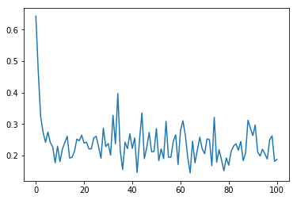

# CBOW的原理
## CBOW的算法实现
CBOW模型根据某个中心词前后A个连续的词，来计算该中心词出现的概率，即用上下文预测目标词。模型结构简易示意图如下：

CBOW是一个具有3层结构的神经网络，分别是：

- Input Layer（输入层）：接收one-hot张量$V∈R^{1×vocab\_ size}$作为网络的输入，里面存储着当前句子中上下文单词的one-hot表示。
- Hidden Layer（隐藏层）：将张量$V$乘以一个word embedding张量$W_1 ∈ R^{vocab\_ size × embed\_ size}$，并把结果作为隐藏层的输出，得到一个形状为$R^{1×embed\_size}$的张量，里面存储着当前句子上下文的词向量。
- Output Layer（输出层）：将隐藏层的结果乘以另一个word embedding张量$W_2∈R^{embed\_ size×vocab\_ size}$，得到一个形状为$R^{1×vocab\_size}$的张量。这个张量经过softmax变换后，就得到了使用当前上下文对中心的预测结果。根据这个softmax的结果，我们就可以去训练词向量模型。

在实际操作中，使用一个滑动窗口（一般情况下，长度是奇数），从左到右开始扫描当前句子。每个扫描出来的片段被当成一个小句子，每个小句子中间的词被认为是中心词，其余的词被认为是这个中心词的上下文。

## CBOW的理想实现

使用神经网络实现CBOW中，模型接收的输入应该有2个不同的tensor：

- 代表当前上下文的tensor：假设我们称之为context_words $V$，一般来说，这个tensor是一个形状为[batch_size, vocab_size]的one-hot tensor，表示在一个mini-batch中，每组上下文中每一个单词的ID。

- 代表目标词的tensor：假设我们称之为target_words $T$，一般来说，这个tensor是一个形状为[batch_size, 1]的整型tensor，这个tensor中的每个元素是一个[0, vocab_size-1]的值，代表目标词的ID。

在理想情况下，我们可以这样实现CBOW：把上下文中的每一个单词，依次作为输入，把当前句子中的中心词作为标签，构建神经网络进行学习，实现上下文预测中心词。具体过程如下：
1. 声明一个形状为[vocab_size, embedding_size]的张量，作为需要学习的词向量，记为$W_0$。对于给定的输入$V$，即某一个上下文的单词，使用向量乘法，将$V$乘以$W_0$，这样就得到了一个形状为[batch_size, embedding_size]的张量，记为$H=V*W_0$。这个张量$H$就可以看成是经过词向量查表后的结果。
2. 声明另外一个需要学习的参数$W_1$，这个参数的形状为[embedding_size, vocab_size]。将上一步得到的$H$去乘以$W_1$，得到一个新的tensor $O=H*W_1$，此时的$O$是一个形状为[batch_size, vocab_size]的tensor，表示当前这个mini-batch中的每一组上下文中的每一个单词预测出的目标词的概率。
3. 使用softmax函数对mini-batch中每个中心词的预测结果做归一化，即可完成网络构建。

## CBOW的实际实现
在实际中，为避免过于庞大的计算量，我们通常采用负采样的方法，来避免查询整个此表，从而将多分类问题转换为二分类问题。

在实现的过程中，通常会让模型接收3个tensor输入：

- 代表上下文单词的tensor：假设我们称之为context_words $V$，一般来说，这个tensor是一个形状为[batch_size, vocab_size]的one-hot tensor，表示在一个mini-batch中每个中心词具体的ID。

- 代表目标词的tensor：假设我们称之为target_words $T$，一般来说，这个tensor同样是一个形状为[batch_size, vocab_size]的one-hot tensor，表示在一个mini-batch中每个目标词具体的ID。

- 代表目标词标签的tensor：假设我们称之为labels $L$，一般来说，这个tensor是一个形状为[batch_size, 1]的tensor，每个元素不是0就是1（0：负样本，1：正样本）。

模型训练过程如下：
1. 首先遍历上下文，得到上下文中的一个单词，用$V$（上下文）去查询$W_0$，用$T$（目标词）去查询$W_1$，分别得到两个形状为[batch_size, embedding_size]的tensor，记为$H_1$和$H_2$。
2. 点乘这两个tensor，最终得到一个形状为[batch_size]的tensor  $O = [O_i = \sum_j H_0[i,j] * H_1[i,j]]_{i=1}^{batch\_size}$。
3. 使用随即负采样得到一些负样本（0），同时以目标词作为正样本（1），输入值标签信息label。
4. 使用sigmoid函数作用在$O$上，将上述点乘的结果归一化为一个0-1的概率值，作为预测概率，根据标签信息label训练这个模型即可。
