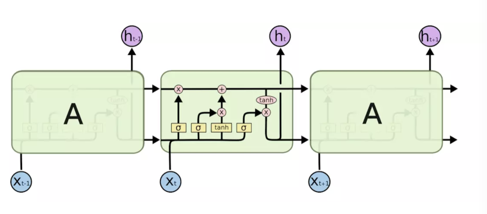
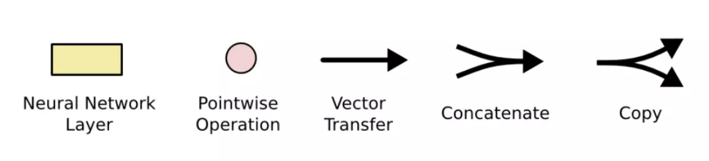
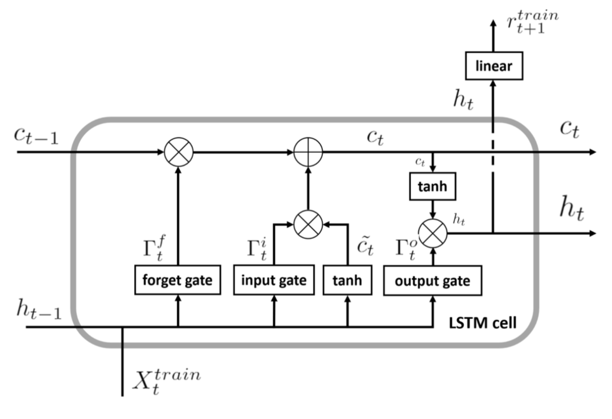
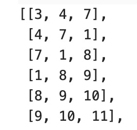
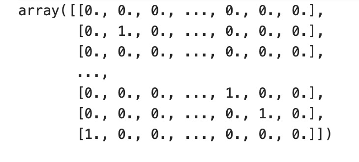

# LSTM算法

LSTM(Long short-term memory,长短期记忆)是一种特殊的RNN，主要是为了解决长序列训练过程中的梯度消失问题。

LSTM是有4个全连接层进行计算的，LSTM的内部结构如下图所示。 

其中符号含义如下：

接下来看一下内部的具体内容：

LSTM的核心是细胞状态——最上层的横穿整个细胞的水平线，它通过门来控制信息的增加或者删除。
STM共有三个门，分别是遗忘门，输入门和输出门。
* 遗忘门：遗忘门决定丢弃哪些信息，输入是上一个神经元细胞的计算结果$h_{t-1}$以及当前的输入向量$x_t$,二者联接并通过遗忘门后($sigmoid$会决定哪些信息留下，哪些信息丢弃)，会生成一个0-1向量$Γ^f_t$(维度与上一个神经元细胞的输出向量$C_{t-1}$相同)，$Γ^f_t$与$C_{t-1}$进行点乘操作后，就会获取上一个神经元细胞经过计算后保留的信息。
* 输入门：表示要保存的信息或者待更新的信息，如上图所示是$h_{t-1}$与$x_t$的连接向量，经过$sigmoid$层后得到的结果$Γ^i_t$，这就是输入门的输出结果了。
* 输出门：输出门决定当前神经原细胞输出的隐向量$h_t，h_t$与$C_t$不同，ht要稍微复杂一点，它是$C_t$进过tanh计算后与输出门的计算结果进行点乘操作后的结果，用公式描述是：$ht = \tanh(c_t) · Γ^o_t$

# 算法实现
## 数据
此次使用的数据是如下所示的一段文字。

Next Word Prediction is also called Language Modeling. It is the task of predicting what word comes next. It is one of the fundamental tasks of NLP and has many applications. You might be using it daily when you write texts or emails without realizing it.

## 数据预处理

将所有的字母都转为小写，并根据单词出现的频数赋予其id。出现次数越多的单词id越小，出现次数越少的单词的id越大。

然后将将语料库中的单词装换为对应的id，并按固定的单词长度选取数据，获得数据集。将前两个数字作为输入，第三位数字作为标签。

最后对标签进行独热编码。

