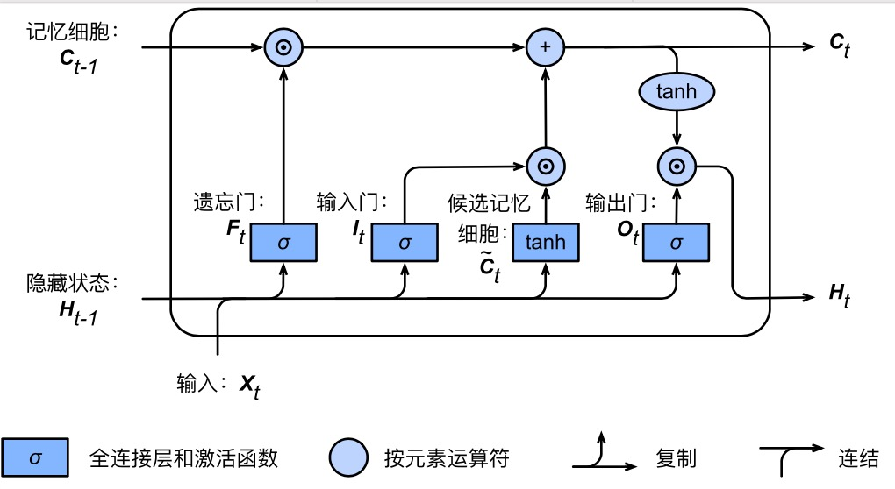
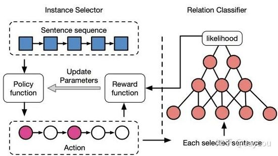
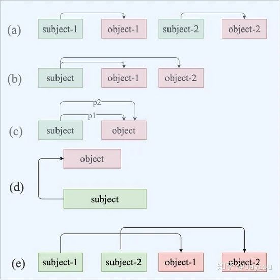
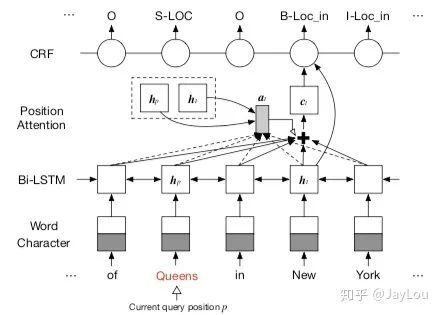

# Hierarchical Softmax

## 基本原理
- 根据标签（label）和频率建立霍夫曼树；（label出现的频率越高，Huffman树的路径越短）
- Huffman树中每一叶子结点代表一个label；

## 层次之间的映射
将输入层中的词和词组构成特征向量，再将特征向量通过线性变换映射到隐藏层，隐藏层通过求解最大似然函数，然后根据每个类别的权重和模型参数构建Huffman树，将Huffman树作为输出。

## 模型的训练
在模型的训练过程中，通过Huffman编码，构造了一颗庞大的Huffman树，同时会给非叶子结点赋予向量。我们要计算的是目标词$w$的概率，这个概率的具体含义，是指从root结点开始随机走，走到目标词$w$的概率。因此在途中路过非叶子结点（包括root）时，需要分别知道往左走和往右走的概率。例如到达非叶子节点n的时候往左边走和往右边走的概率分别是：

- $p(n,left)=\sigma(\theta_n^T·h)$
- $p(n,right)=1-\sigma(\theta_n^T·h)=\sigma(-\theta_n^T·h)$

目标词为$w$的概率可以表示为：

$$p(w)=\prod_{j=1}^{L(w)-1}\sigma(sign(w,j) ·\theta_{n(w,j)}^Th)$$

其中$\theta_{n(w,j)}$是非叶子结点$n(w,j)$的向量表示（即输出变量），$h$是隐藏层的输出值，从输入词的向量中计算得来；$sign(x,j)$是一个特殊函数定义：

$$sign(x,j)=\begin{cases} 1& \text{若n(w,j+1)是n(w,j)的左孩子}\\-1& \text{若n(w,j+1)是n(w,j)的右孩子} \end{cases}$$

此外，所有词的概率和为1，即：

$$\sum_{i=1}^{n}p(w_i)=1$$

## 参数更新

$$θ^{(new)}_j=θ^{(old)}_j–\eta (\sigma (\theta_j^Th)−t_j)h,\text{其中，j=1,2,…,L(w)−1}$$

# LSTM实现NLP

## LSTM
长短期记忆（Long short-term memory, LSTM）是一种特殊的RNN，主要是为了解决长序列训练过程中的梯度消失和梯度爆炸问题。简单来说，就是相比普通的RNN，LSTM能够在更长的序列中有更好的表现。

## 1. 序列到类别——文本分类

 输入为序列，输出为类别，如文本分类中，输入数据为单词的序列，输出数据为文本的类别。

 输入样本$x_1,x_2,...,x_T$ ，输出为y={1,2,3,4....C}  将x按照不同时刻输入到循环神经网络中，得到不同时刻的隐状态$h_t$ ， 可以将$h_T$看作整个序列的最终表示，然后再输入给分类器进行分类。

 除了将最后时刻的状态作为整个序列的表示之后，我们还可以对所有序列的状态进行平均，利用这个平均的状态作为整个序列的表示。

 

 ## 2. 同步的序列到序列——词性标注

 每一个时刻都有输入和输出，且其长度相同。如在词性标注中，每一个单词都需要标注其对应的词性标签。

 输入样本$x_1,x_2,...,x_T$​ ，输出为序列$y_1,y_2,...,y_T$​​， 输入样本按不同时刻输入到循环神经网络中，并得到不同时刻的隐状态，每个时刻的都代表了当前时刻$x_t$信息和前一时刻隐状态的历史信息。

 然后再输入给分类器，得到序列 $y_t$​​。对真实标签 $y$​​ 和预测的 $\hat{y}$​​ 进行交叉熵损失的计算，得到损失函数，再进行梯度下降更新参数和梯度。

 ## 3. 异步的序列到序列——机器翻译

 又称为 编码器-解码器，输入和输出不需要有严格的对应关系，也不需要有一致的长度。 如在机器翻译中，输入源语言序列，输出为目标语言序列，其长度不一定等长。

 一般通过先编码后解码的过程来进行，先将输入序列$x_1,x_2,...,x_T$ 按不同时刻输入到编码器中得到其编码，然后再使用另外一个循环神经网络（解码器）进行解码得到输出 $\hat{y}_1$,  再将 $\hat{y}_1$​ 和传递下来的隐状态作为下一个时刻的输入， 采用自回归模型，每个时刻的输入都是上一时刻的预测结果。

 