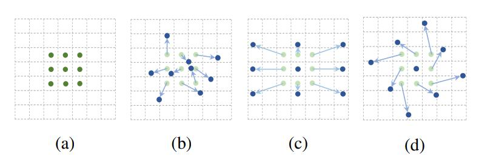
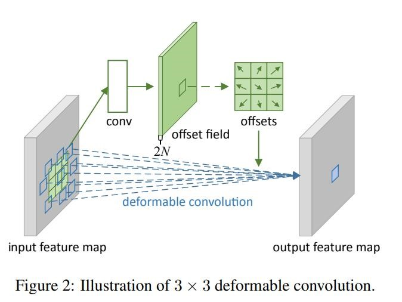
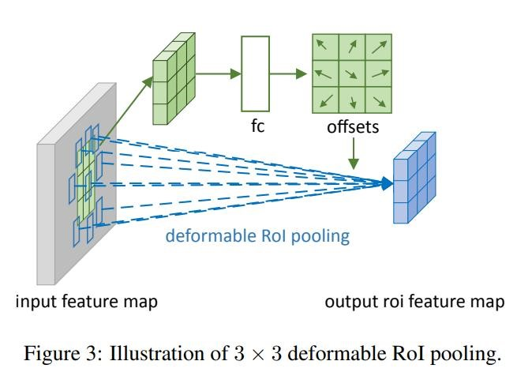
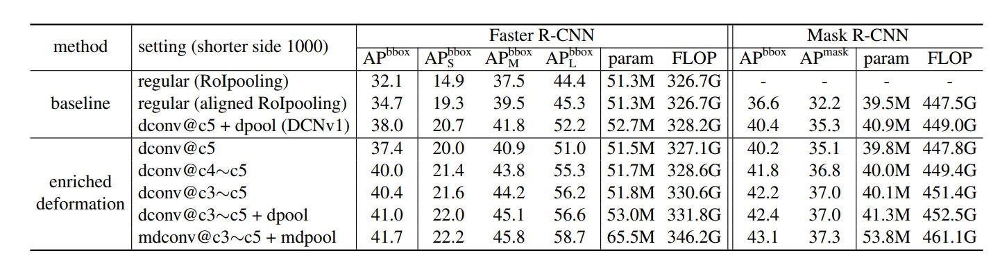
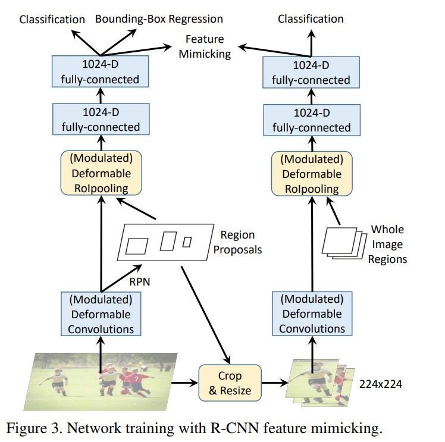

一、可变形卷积简介

由于构造卷积神经网络 (CNN)
所用的模块中几何结构是固定的，其几何变换建模的能力本质上是有限的。在我们的工作中，我们引入了两种新的模块来提高卷积神经网络
(CNN) 对变换的建模能力，即可变形卷积 (deformable convolution)
和可变形兴趣区域池化 (deformable ROI
pooling)。它们都是基于在模块中对空间采样的位置信息作进一步位移调整的想法，该位移可在目标任务中学习得到，并不需要额外的监督信号。新的模块可以很方便在现有的卷积神经网络
(CNN)
中取代它们的一般版本，并能很容易进行标准反向传播端到端的训练，从而得到可变形卷积网络
(deformable convolutional
network)。大量的实验验证了我们的方法在目标检测和语义分割这些复杂视觉任务上的有效性。

可变形卷积是指卷积核在每一个元素上额外增加了一个参数方向参数，这样卷积核就能在训练过程中扩展到很大的范围。这是一种对传统方块卷积的改进核，本质是一种抽样改进。

二、DCN V1

CNNs对大型，未知形状变换的建模存在固有的缺陷，这种缺陷来源于CNNs模块固有的几何结构：卷积单元对输入特征图的固定位置进行采样；池化层以固定的比例进行池化；即使是ROI
pooling也是将ROI分割到固定的bin中去。这些特性是有影响的，例如，在同一层Conv中，所有的激活单元的感受野是一样的，但由于不同位置可能对应着不同尺度或变形的物体，因此对尺度或者感受野大小进行自适应是进行精确定位所需要的。为了解决或者减轻这个问题，本文提出了两种新的模块，可变形卷积（deformable
conv）和可变形感兴趣区域池化（deformable ROI
Pooling）,来提高对形变的建模能力。这两个模块都是基于一个平行网络学习offset（偏移），使得卷积核在input
feature
map的采样点发生偏移，集中于我们感兴趣的区域或者目标。通过研究发现，标准卷积中的规则格点采样是导致网络难以适应几何形变的“罪魁祸首”，为了削弱这个限制，对卷积核中每个采样点的位置都增加了一个偏移变量，可以实现在当前位置附近随意采样而不局限于之前的规则格点。如下图所示，是常见的采样点和可变形卷积采样的对比

（a）是常见的3x3卷积核的采样方式，（b）是采样可变形卷积，加上偏移量之后的采样点的变化，其中（c）(d)是可变形卷积的特殊形式

(a) 所示的正常卷积规律的采样 9 个点（绿点），(b)©(d)
为可变形卷积，在正常的采样坐标上加上一个位移量（蓝色箭头），其中 ©(d) 作为 (b)
的特殊情况，展示了可变形卷积可以作为尺度变换，比例变换和旋转变换等特殊情况。

我们先看普通的卷积，以3x3卷积为例对于每个输出y(p0)，都要从x上采样9个位置，这9个位置都在中心位置x(p0)向四周扩散，(-1,-1)代表x(p0)的左上角，(1,1)代表x(p0)的右下角。

所以传统的卷积输出就是（其中P_nPn​就是网格中的n个点）：

正如我们上面阐述的可变形卷积，他就是在传统的卷积操作上加入了一个偏移量，正是这个偏移量才让卷积变形为不规则的卷积，这里要注意这个偏移量可以是小数，所以下面的式子的特征值需要通过*双线性插值*的方法来计算。：

那这个偏移量如何算呢？我们来看：  

对于输入的一张feature
map，假设原来的卷积操作是3×3的，那么为了学习偏移量offset，我们定义另外一个3×3的卷积层（图中上面的那层），输出的维度其实就是原来feature
map大小，channel数等于2N（分别表示x,y方向的偏移）。下面的可变形卷积可以看作先基于上面那部分生成的offset做了一个插值操作，然后再执行普通的卷积。

可变形池化

理解了可变形卷积之后，Deformable
RoIPooling（可变形池化）就比较好理解了。原始的RoIPooling在操作过程中是将RoI划分为k×k个子区域。*而可变形池化的偏移量其实就是子区域的偏移*。同理每一个子区域都有一个偏移，偏移量对应子区域有k×k个。与可变形卷积不同的是，可变形池化的偏移量是通过全连接层得到的。因为和可变形卷积类似，这里就不多讲了。

三、DCN v2

背景

DCN
v1听起来不错，但其实也有问题：我们的可变形卷积有可能*引入了无用的上下文（区域）来干扰我们的特征提取*，这显然会降低算法的表现。虽然DCN
v1更能覆盖整个物体，但是同时也会引入一些无关的背景，这造成了干扰，所以有三个解决方法：

（1）*More Deformable Conv Layers（使用更多的可变形卷积）*。

（2）*Modulated Deformable
Modules（在DCNv1基础（添加offset）上添加每个采样点的权重）*

（3）*R-CNN Feature Mimicking（模拟R-CNN的feature）。*

使用更多的可变形卷积

在DCN v1中只在conv 5中使用了三个可变形卷积，在DCN
v2中把conv3到conv5都换成了可变形卷积，提高算法对几何形变的建模能力。  

在DCNv1基础（添加offset）上添加每个采样点的权重

我们知道在DCN v1中的卷积是添加了一个

为了解决引入了一些无关区域的问题，在DCN
v2中我们不只添加每一个采样点的偏移，还添加了一个权重系数​，来区分我们引入的区域是否为我们感兴趣的区域，假如这个采样点的区域我们不感兴趣，则把权重学习为0即可：

*总的来说，DCN v1中引入的offset是要寻找有效信息的区域位置，DCN
v2中引入权重系数是要给找到的这个位置赋予权重，这两方面保证了有效信息的准确提取*。

R-CNN Feature Mimicking

把R-CNN和Faster RCNN的classification
score结合起来可以提升performance，说明R-CNN学到的focus在物体上的feature可以解决无关上下文的问题。但是增加额外的R-CNN会使inference速度变慢很多。DCNV2里的解决方法是*把R-CNN当做teacher
network，让DCN
V2的ROIPooling之后的feature去模拟R-CNN的feature*，类似知识蒸馏的做法，下面会具体展开：

左边的网络为主网络（Faster
RCNN），右边的网络为子网络（RCNN）。实现上大致是用主网络训练过程中得到的RoI去裁剪原图，然后将裁剪到的图resize到224×224大小作为子网络的输入，这部分最后提取的特征和主网络输出的1024维特征作为feature
mimicking
loss的输入，用来约束这2个特征的差异（通过一个余弦相似度计算，如下图所示），同时子网络通过一个分类损失进行监督学习，因为并不需要回归坐标，所以没有回归损失。在inference阶段仅有主网络部分，因此这个操作不会在inference阶段增加计算成本。

再用直白一点的话说，*因为RCNN这个子网络的输入就是RoI在原输入图像上裁剪出来的图像，因此不存在RoI以外区域信息的干扰，这就使得RCNN这个网络训练得到的分类结果更加可靠，以此通过一个损失函数监督主网络Faster
RCNN的分类支路训练就能够使网络提取到更多RoI内部特征，而不是自己引入的外部特征。*

总的loss由三部分组成：mimic loss + R-CNN classification loss + Faster-RCNN loss.