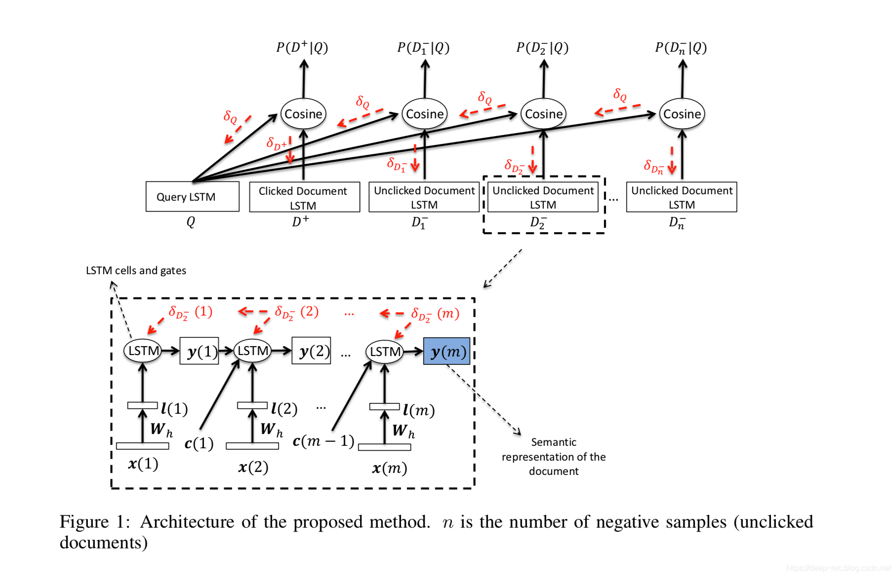
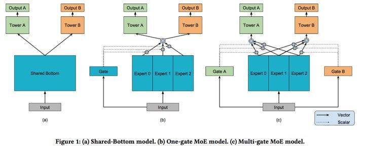
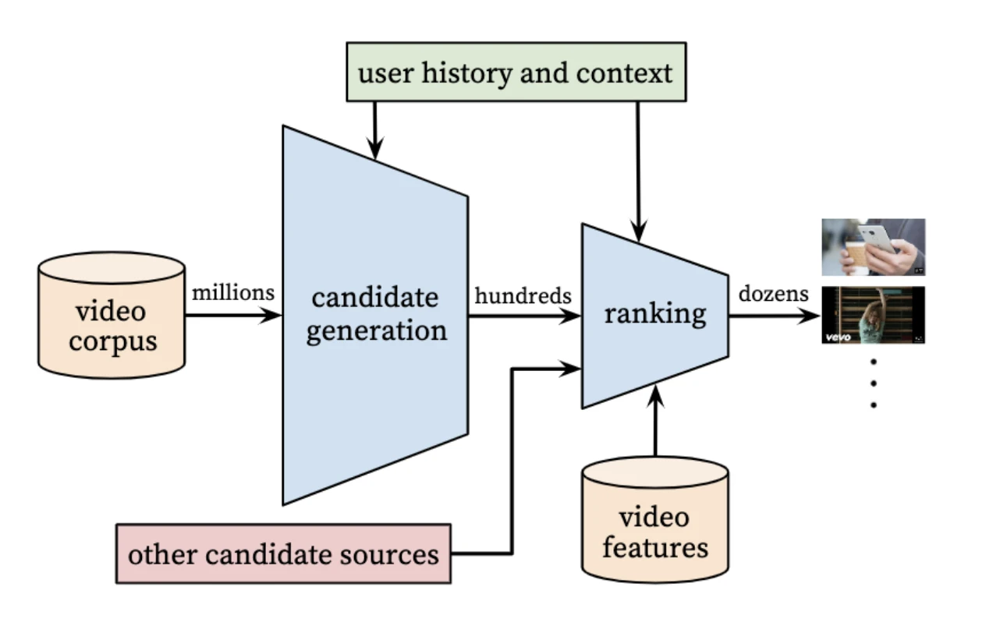
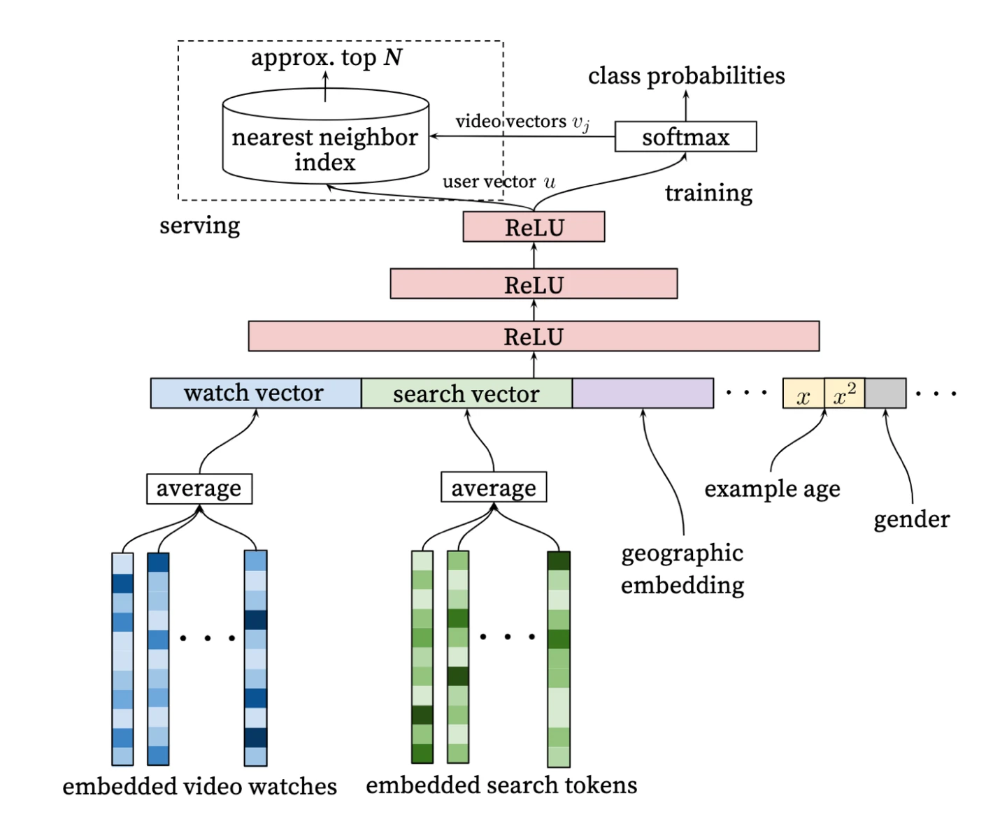
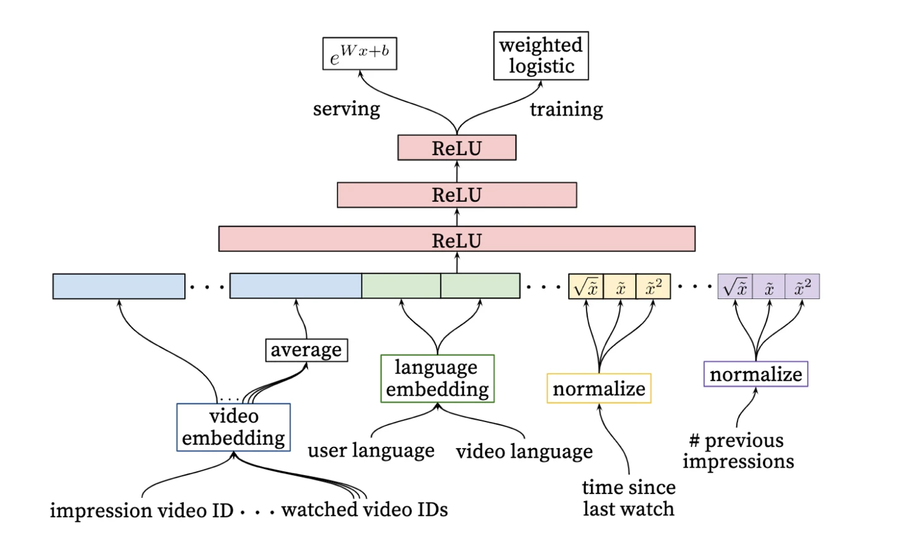
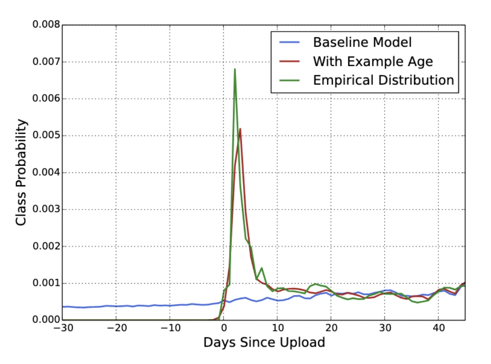

# 0. DSSM简介

DSSM是Deep Structured Semantic Model的缩写，基于深度网络的语义模型，由微软研究院在2013年发表，其其核心思想是基于搜索引擎的曝光点击行为数据，利用多层DNN网络把query及文档Doc Embeding成同一纬度的语义空间中，通过最大化约束query和doc两个语义向量的余弦举例，从而训练学习得到隐层相似度语义模型，从而实现了检索召回。

# 1. CNN-DSSM

## 1. CNN-DSSM架构

$Query$ 代表用户输入，将句子映射到一个向量空间, $document$ 是数据库中的文档

- word-n-gram层：是对输入做了一个获取上下文信息的窗口，图中是word-trigram，取连续的3个单词。
- Letter-trigram：是把上层的三个单词通过3个字母的形式映射到3w维，然后把3个单词连接起来成9w维的空间。
- Convolutional layer：是通过Letter-trigram层乘上卷积矩阵获得，是普通的卷积操作。
- Max-pooling：是把卷积结果经过池化操作。
- Semantic layer：是语义层，是池化层经过全连接得到的。

获得128维的语义后就可以计算文本之间的相似度了，计算相似度的过程和DNN-DSSM的过程是一样的。可见CNN-DSSM和DNN-DSSM基本流程差不多，用卷积和池化的操作代替了DNN的操作。

## 2. CNN-DSSM结构评价

CNN-DSSM 通过卷积层提取了滑动窗口下的上下文信息，又通过池化层提取了全局的上下文信息，上下文信息得到较为有效的保留。

但是，由于CNN-DSSM 卷积核大小的限制，无法捕获该上下文信息，对于间隔较远的信息，难以有效保留。

## 3. 总结

CNN-DSSM的结构可分为数据预处理（把文本向量化），在经过深度神经网络，压缩矩阵，最后拿压缩后的矩阵进行相似度计算。

# 2. LSTM-DSSM

LSTM-DSSM通过采用LSTM进行编码的方式，同样将文本编码为一段向量，LSTM需要对文本长度进行预先的处理，对于query的长尾词处理非常的友好。

LSTM-DSSM里其实就是将DSSM的全连接改成LSTM，此处案例基于海量的搜索点击数据，分别计算搜索的query的LSTM语义向量和点击以及未点击的document的LSTM语义向量，基于LSTM训练的语义向量进行相似度度量，后续的操作与DSSM模型一致。

# 3. MMoE

## 1. 概念

多任务模型通过学习不同任务的联系和差异，可提高每个任务的学习效率和质量。多任务学习的的框架广泛采用shared-bottom的结构，不同任务间共用底部的隐层。这种结构本质上可以减少过拟合的风险，但是效果上可能受到任务差异和数据分布带来的影响。也有一些其他结构，比如两个任务的参数不共用，但是通过对不同任务的参数增加L2范数的限制；也有一些对每个任务分别学习一套隐层然后学习所有隐层的组合。和shared-bottom结构相比，这些模型对增加了针对任务的特定参数，在任务差异会影响公共参数的情况下对最终效果有提升。缺点就是模型增加了参数量所以需要更大的数据量来训练模型，而且模型更复杂并不利于在真实生产环境中实际部署使用。

因此，提出了一个Multi-gate Mixture-of-Experts(MMoE)的多任务学习结构。MMoE模型刻画了任务相关性，基于共享表示来学习特定任务的函数，避免了明显增加参数的缺点。

## 2. 模型

Mixture-of-Experts可看做基于多个独立模型的集成方法。

提出的模型Multi-gate Mixture-of-Experts目的就是相对于shared-bottom结构不明显增加模型参数的要求下捕捉任务的不同。其核心思想是将shared-bottom网络中的函数f替换成MoE层

## 3. 总结

模型的可训练性，就是模型对于超参数和初始化是否足够鲁棒。作者在人工合成数据集上进行了实验，观察不同随机种子和模型初始化方法对loss的影响。第一，Shared-Bottom models的效果方差要明显大于基于MoE的方法，说明Shared-Bottom模型有很多偏差的局部最小点；第二，如果任务相关度非常高，则OMoE和MMoE的效果近似，但是如果任务相关度很低，则OMoE的效果相对于MMoE明显下降，说明MMoE中的multi-gate的结构对于任务差异带来的冲突有一定的缓解作用。

# 4. Share Bottom多任务学习

- Shared-Bottom Multi-task Model

如上图所示，shared-bottom网络（表示为函数f）位于底部，多个任务共用这一层。往上，K个子任务分别对应一个tower network，每个子任务的输出。

# 5. YouTube深度学习视频推荐系统

## 1. YouTube推荐系统简介

作为全球最大的视频分享网站，YouTube 平台中几乎所有的视频都来自 User-Generated Content，这样的内容产生模式有两个特点：

- 商业模式不同。Netflix 等流媒体的大部分内容都是采购或自制的电影、剧集等内容，YouTube 内容的头部效应没有那么明显。

- YouTube 的视频基数巨大，用户较难发现喜欢的内容。

此类特点使推荐模型的作用相比其他流媒体重要得多。且YouTube的利润来源主要来自视频广告，而曝光机会与用户观看时长成正比，因此 YouTube 推荐模型正是其商业模式的基础。

基于YouTube的商业模式和内容特点，其推荐团队构建了两个深度学习网络分别考虑召回率和准确率的要求，并构建了以用户观看时长为优化目标的排序模型，最大化用户观看时长并进而产生更多的广告曝光机会。

## 2. 推荐系统架构

由于视频用户基数巨大，要求推荐系统能够在海量数据规模下进行个性化推荐，又因在线延迟原因，不宜用复杂网络直接对所有海量候选集进行排序，所以 YouTube 采用两级深度学习模型完成整个推荐过程 。

第一级用候选集生成模型（Candidate Generation Model）完成候选视频的快速筛选，在这一步，候选视频集合由百万量级降至几百量级。这相当于经典推荐系统架构中的召回层。

第二级用排序模型（Ranking Model）完成几百个候选视频的精排。相当于经典推荐系统架构中的排序层。

## 3. 候选集生成模型

自底而上地看这个网络，底层的输入是用户历史观看视频的 Embedding 向量和搜索词的 Embedding 向量。

为了生成视频 Embedding 和搜索词 Embedding，YouTube 采用的方法是利用用户的观看序列和搜索序列，采用 word2vec 方法对视频和搜索词做Embedding，再作为候选集生成模型的输入，这个过程是预训练的，不与主模型一起进行端到端训练的。

当然，除了进行 Embedding 预训练，还可以直接在深度学习网络中增加 Embedding 层，与上层的 DNN 一起进行端到端训练，这样做理论上会让模型更逼近优化目标，但由于 Embedding 层的参数数量往往非常大，会成倍增加模型的训练开销，拖慢模型的更新速度。

除了视频和搜索词 Embedding 向量，特征向量中还包括用户的属性特征 Embedding、年龄、性别等。然后把所有特征连接起来，输入上层的 ReLU 神经网络进行训练。

三层神经网络过后，使用 softmax 函数作为输出层。看到 softmax 数就应知道该模型是一个多分类模型。YouTube 是把选择候选视频集这个问题看作用户推荐 next watch（下一次观看视频）的问题，模型的最终输出是一个在所有候选视频上的概率分布，显然这是一个多分类问题，所以这里用 softmax 作为最终的输出层。

总的来讲，YouTube 推荐系统的候选集生成模型是一个标准的利用 Embedding 预训练特征的深度神经网络模型。

## 4. 候选集生成模型独特的线上服务方法

在候选集生成网络的线上服务过程中，YouTube 并没有直接采用训练时的模型进行预测，而是采用了一种最近邻搜索的方法，这是一个经典的工程和理论做权衡的结果。

具体来讲，在模型服务过程中，如果对每次推荐请求都端到端地运行一遍候选集生成网络的推断过程，那么由于网络结构比较复杂，参数数量特别是输出层的参数数量非常巨大，整个推断过程的开销会很大。因此，在通过“候选集生成模型”得到用户和视频的 Embedding 后，通过 Embedding 最近邻搜索的方法进行模型服务的效率会高很多。这样甚至不用把模型推断的逻辑搬上服务器，只需将用户 Embedding 和视频 Embedding 存到 Redis 等内存数据库或者服务器内存中就好。如果采用局部敏感哈希等最近邻搜索的方法，甚至可以把模型服务的计算复杂度降至常数级别。这对百万量级规模的候选集生成过程的效率提升是巨大的。

如果继续深挖，还能得到非常有意思的信息。架构图中从 softmax 向模型服务模块画了个箭头，代示视频 Embedding 向量的生成。这里的视频 Embedding 是如何生成的呢？由于最后的输出层是 softmax，该 softmax 层的参数本质上是一个 mxn 维的矩阵，其中 m 指的是最后一层 ReLU 层的维度 m，n 指的是分类的总数，也就是 YouTube 所有视频的总数 n。那么视频 Embedding 就是这个 mxn 维矩阵的各列向量。这样的 Embedding 生成方法其实和 Word2vec 中词向量的生成方法相同。

除此之外，用户向量的生成就非常好理解了，因为输入的特征向量全部都是用户相关的特征，所以在使用某用户 u 的特征向量作为模型输入时，最后一层 ReLU 层的输出向量可以当作该用户 u 的 Embedding 向量。在模型训练完成后，逐个输入所有用户的特征向量到模型中，就可以得到所有用户的 Embedding 向量，之后导入线上 Embedding 数据库。在预测某用户的视频候选集时，先得到该用户的 Embedding 向量，再在视频 Embedding 向量空间中利用局部敏感哈希等方法搜索该用户 Embedding 向量的 Top K 近邻，就可以快速得到 k 个候选视频集合。

## 5. 排序模型

通过候选集生成模型，得到几百个候选视频集合，然后利用排序模型进行精排序，YouTube 推荐系统的排序模型如图所示。

第一眼看上去，可能会认为排序模型的网络结构与候选集生成模型没有太大区别，在模型结构上确实是这样的，这里需要重点关注模型的输入层和输出层，即排序模型的特征工程和优化目标。

相比候选集生成模型需要对几百万候选集进行粗筛，排序模型只需对几百个候选视频进行排序，因此可以引入更多特征进行精排。具体一点，输入层从左至右的特征依次是：

- 当前候选视频的 Embedding（impression video ID embedding）。

- 用户观看过的最后 N 个视频 Embedding 的平均值（watched video IDs average embedding）。

- 用户语言的 Embedding 和当前候选视频语言的 Embedding（language embedding）。

- 该用户自上次观看同频道视频的时间（time since last watch）。

- 该视频已经被曝光给该用户的次数（#previous impressions）。

上面 5 个特征中，前 3 个的含义是直观的，这里重点介绍第 4 个和第 5 个。因为这两个特征很好地引入了 YouTube 对用户行为的观察。

需要注意的是，排序模型不仅针对第 4 个和第 5 个特征引入了原特征值，还进行了平方和开方的处理。作为新的特征输入模型，这一操作引入了特征的非线性，提升了模型对特征的表达能力。

经过三层 ReLU 网络之后，排序模型的输出层与候选集生成模型又有所不同。候选集生成模型选择 softmax 作为其输出层，而排序模型选择 weighted logistic regression（加权逻辑回归）作为模型输出层。与此同时，模型服务阶段的输出层选择的是 e^(Wx+b)函数。YouTube 为什么分别在训练和服务阶段选择了不同的输出层函数呢？

从 YouTube 的商业模式出发，增加用户观看时长才是其推荐系统最主要的优化目标，所以在训练排序模型时，每次曝光期望观看时长（expected watch time per impression）应该作为更合理的优化目标。因此，为了能直接预估观看时长，YouTube 将正样本的观看时长作为其样本权重，用加权逻辑回归进行训练，就可以让模型学到用户观看时长的信息。

假设一件事情发生的概率是 p，这里引入一个新的概念——Odds（机会比），它指一件事情发生和不发生的比值。

对逻辑回归来说，一件事情发生的概率 p 由 sigmoid 函数得到，如（公式 1）所示：

$p = sigmoid(\theta^Tx)=\frac{1}{1+e^{-(Wx+b)}}$

定义Odds为：$Odds=\frac{p}{1-p}=e^{Wx+b}$

显而易见，YouTube 正是把变量 Odds 当作了模型服务过程中的输出。

这里需要结合加权逻辑回归的原理进行进一步说明。由于加权逻辑回归引入了正样本权重的信息，在 YouTube 场景下，正样本 i 的观看时长 Ti 就是其样本权重，因此正样本发生的概率变成原来的 Ti 倍（这里也是做了一个近似，实际上需要通过贝叶斯公式来解释），那么正样本 i 的 Odds 变成所示：

$Odds(i) = \frac{T_{i}p}{1-T_{i}p}$

视频推荐场景中，用户打开一个视频的概率 p 往往很小，因此：

$Odds(i) = \frac{T_{i}p}{1-T_{i}} \thickapprox T_{i}p = E(T_{i})$ = 期望观看时长

可以看出，变量 Odds 本质上的物理意义就是每次曝光期望观看时长，这正是排序模型希望优化的目标。因此，利用加权逻辑回归进行模型训练，利用 $e^{Wx+b}$进行模型服务是最符合优化目标的技术实现。

## 6. 训练和测试样本的处理

事实上，为了能够提高模型的训练效率和预测准确率，YouTube 采取了诸多处理训练样本的工程措施，主要有以下 3 点经验：

- 候选集生成模型把推荐问题转换成多分类问题，在预测下一次观看（next watch）的场景下，每一个备选视频都会是一个分类，因此总共的分类有数百万之巨，使用 softmax 对其进行训练无疑是低效。

YouTube 采用了 Word2vec 中常用的负采样训练方法减少了每次预测的分类数量，从而加快了整个模型的收敛速度，具体的方法在 4.1 节已经有所介绍。此外，YouTube 也尝试了 Word2vec 另一种常用的训练方法 hierarchical softmax（分层 softmax），但并没有取得很好的效果，因此在实践中选择了更为简便的负采样方法。

- 在对训练集的预处理过程中，YouTube 没有采用原始的用户日志，而是对每个用户提取等数量的训练样本，这是为什么呢？

YouTube 这样做的目的是减少高度活跃用户对模型损失的过度影响，使模型过于偏向活跃用户的行为模式，而忽略数量更广大的长尾用户的体验。

- 在处理测试集的时候，YouTube 为什么不采用经典的随机留一法（random holdout），而是一定要以用户最近一次观看的行为作为测试集呢？

只留最后一次观看行为做测试集主要是为了避免引入未来信息（future information），产生与事实不符的数据穿越问题。

可以看出，YouTube 对于训练集和测试集的处理过程也是基于对业务数据的观察理解的，这是非常好的工程经验。

## 7. 如何处理用户对新视频的偏好

对 UGC 平台来说，用户对新内容的偏好很明显。对绝大多数内容来说，刚上线的那段时间是其流量高峰，然后快速衰减，之后趋于平稳。YouTube 的内容当然也不例外，因此，能否处理好用户对新视频的偏好直接影响了预测的准确率。

为了拟合用户对新内容的偏好，YouTube 推荐系统引入了 Example Age 这个特征，该特征的定义是训练样本产生的时刻距离当前时刻的时间。例如，24 小时前产生的训练样本，Example Age 的特征值就是 24。在做模型服务的时候，不管候选视频是哪个，可以直接将这个特征值设成 0，甚至是一个很小的负值，因为这次的训练样本将在不久的未来产生这次推荐结果的时候实际生成。

YouTube 选择这样一个时间特征来反映内容新鲜程度的逻辑并不容易理解，该特征起到了时间戳的作用，当该特征在深度神经网络中与其他特征做交叉时，保存了其他特征随时间变化的权重，也就让最终的预测包含了时间趋势的信息。

YouTube 通过试验验证了 Example Age 特征的重要性，图 4 中蓝色曲线是引入 Example Age 前的模型预估值，可以看出与时间没有显著关系，而引入 Example Age 后的模型预估十分接近经验分布。

常“新鲜程度”这一特征会定义为视频距离上传时间的天数（ Days since Upload），比如虽然是 24 小时前产生的样本，但样本的视频已经上传了 90 小时，该特征值就应是 90。那么在做线上预估时，这个特征的值就不会是 0，而是当前时间与每个视频上传时间的间隔。这无疑是一种保存时间信息的方法，但 YouTube 显然没有采用这种方法，该方法效果不好的原因是这种做法会导致 Example Age 的分布过于分散，在训练过程中会包含刚上传的视频，也会包含上传已经 1 年，甚至 5 年的视频，这会导致 Example Age 无法集中描述近期的变化趋势。当然，推荐同时实现这两种做法，并通过效果评估得出最终的结论。

[论文原文链接](https://static.googleusercontent.com/media/research.google.com/zh-CN//pubs/archive/45530.pdf)
