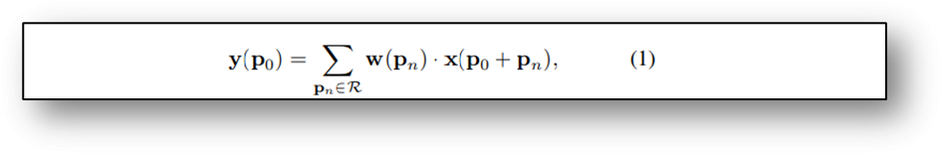

# 可变形卷积

可变形卷积是指卷积核在每个元素上**额外增加了一个参数方向参数**，这样卷积核能在训练过程中扩展到很大范围。

如下图所示：
- (a)为标准的传统卷积核，尺寸为3x3
- (b)在图(a)的基础上给每个卷积核的参数增加了一方向向量，使得卷积核可以变为任意形状。
- (c)和(d)为可变形卷积的特殊形式。

卷积核的目的是为了提取输入物的特征，传统的卷积核通常为固定尺寸、固定大小（例如3x3，5x5，7x7.）。这样使得模型对于未知的变化适应性差，泛化能力不强。

卷积单元对输入的特征图在固定的位置进行采样，池化层不断减小着特征图的尺寸。

传统卷积结构定义如下，输出特征图的每个点，与卷积核中心点对应，pn是p0在卷积核范围内的每个偏移量

可变形卷积在其基础上为每个点引入偏移量，该偏移量由输入特征图与另一个卷积生成，通常为小数。

由于加入偏移量后的位置非整数，并不对应feature map上实际存在的像素点，因此需要使用插值来得到偏移后的像素值，通常可采用双线性插值，用公式表示如下：

# 可变形卷积v2

可变形卷积有可能**引入无用的背景信息**来干扰我们的特征提取，明显降低了算法的表现，作者也做了对比：

因此作者提出了三个解决方法：

- 使用更多的可变形卷积

- 添加每个采样点的权重

为了解决引入了一些无关区域的问题，DCN v2中不只添加每一个采样点的偏移，还添加了一个权重系数$\delta m k$，来区分引入区域是否为ROI，假如这个采样点的区域不感兴趣，则把权重学习为0即可：

- 模拟R-CNN的Feature Mimicking

通过试验结果可以看到，DCN v2 更能集中在物体的完整有效的区域：

